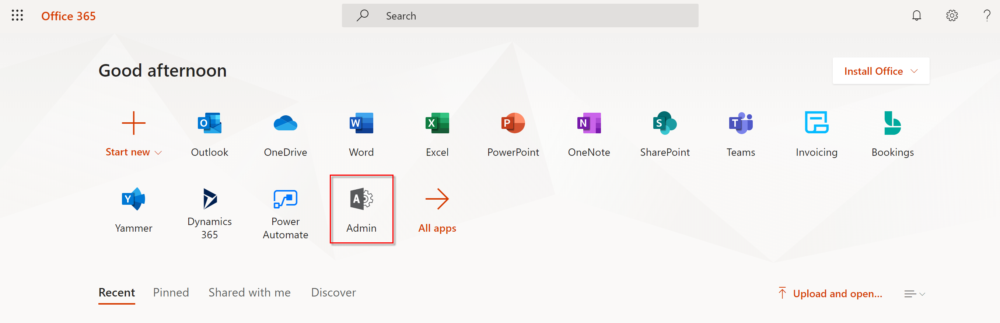
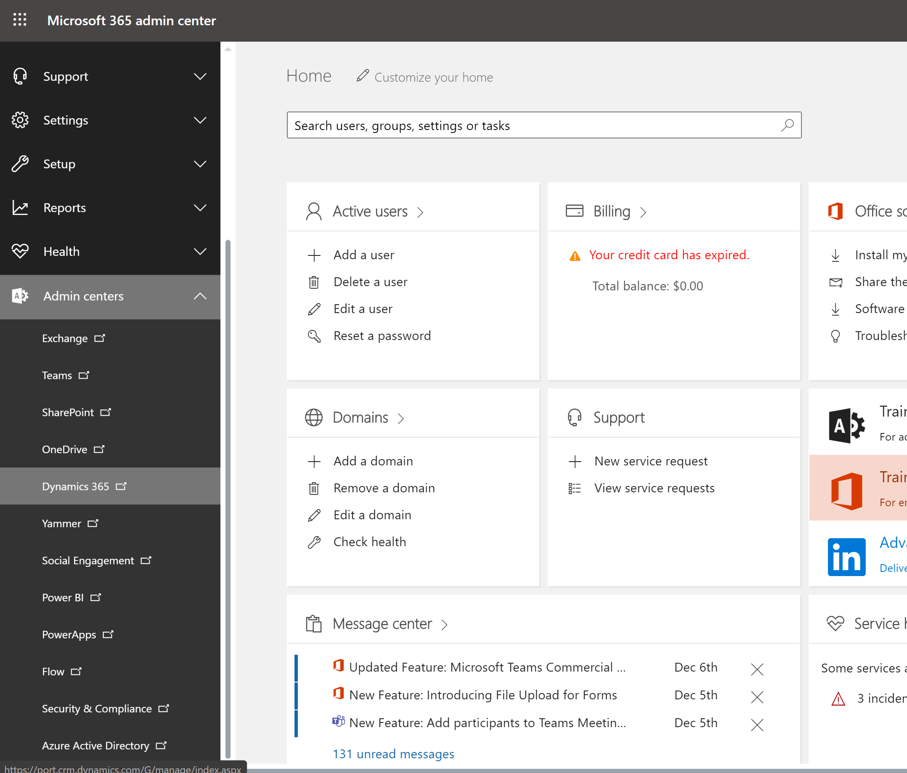
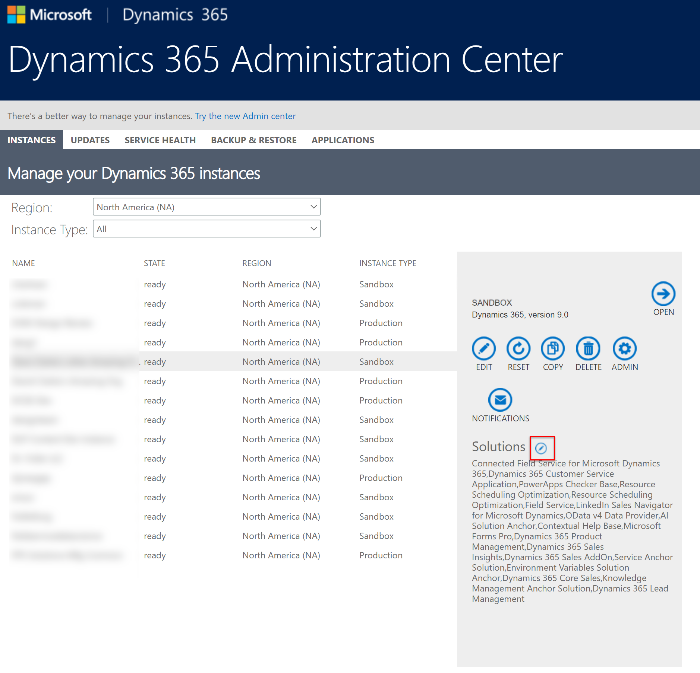
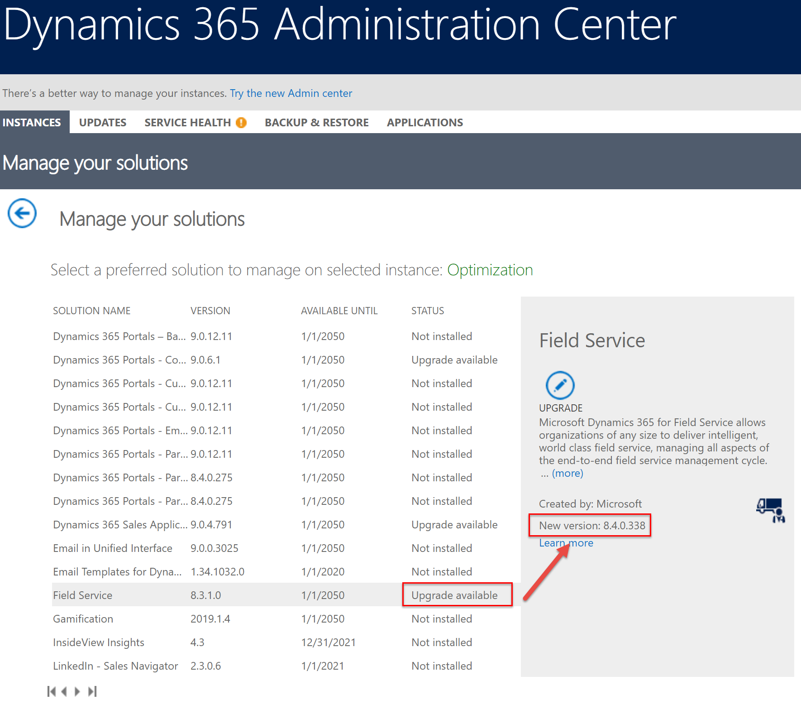
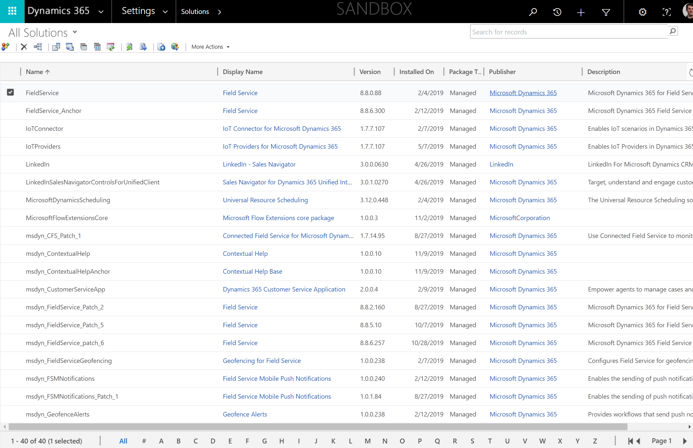
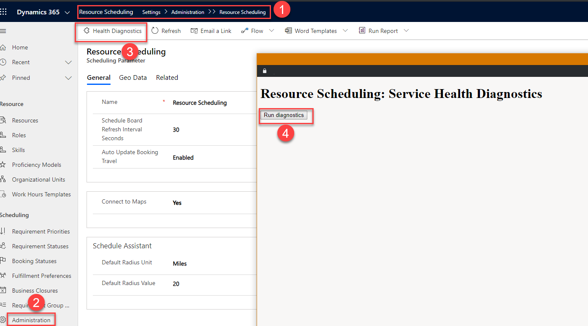
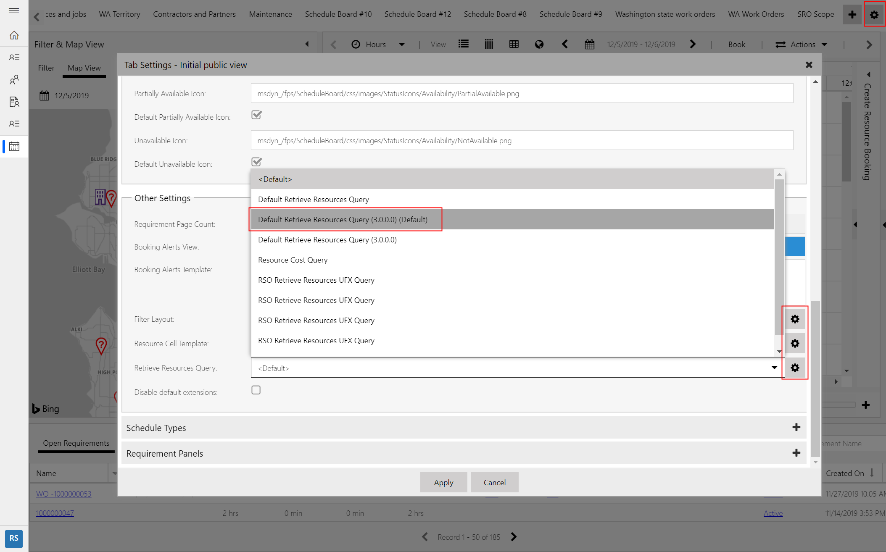
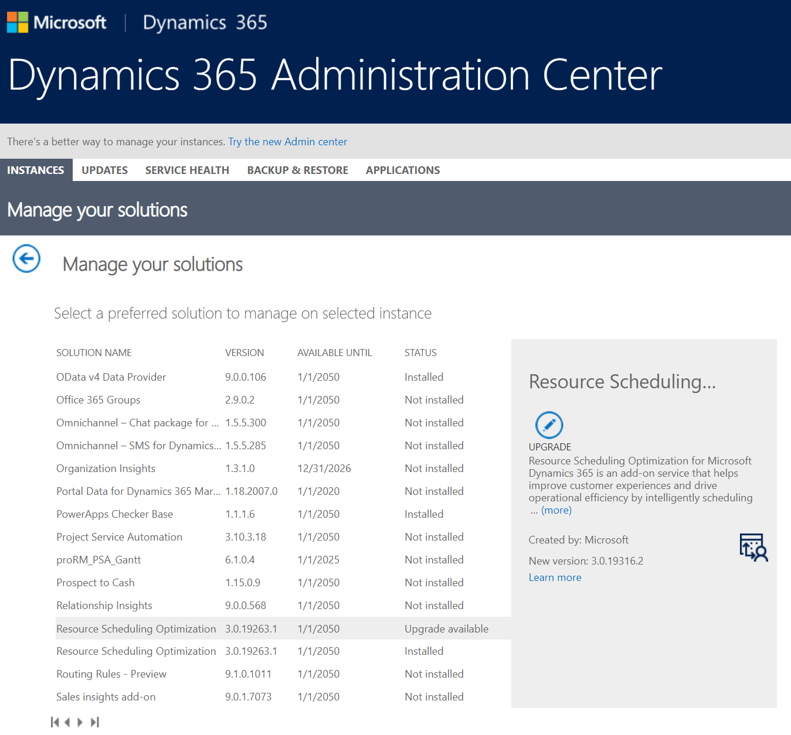
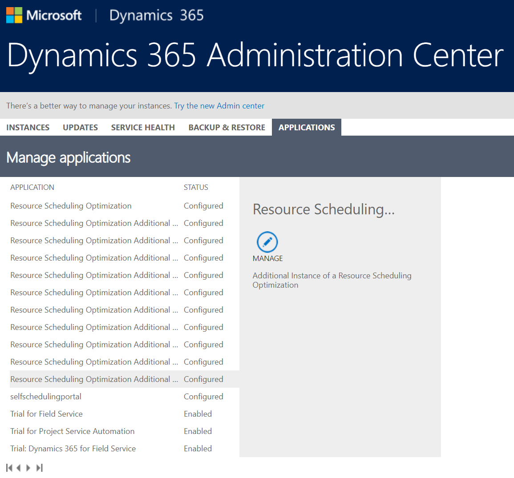
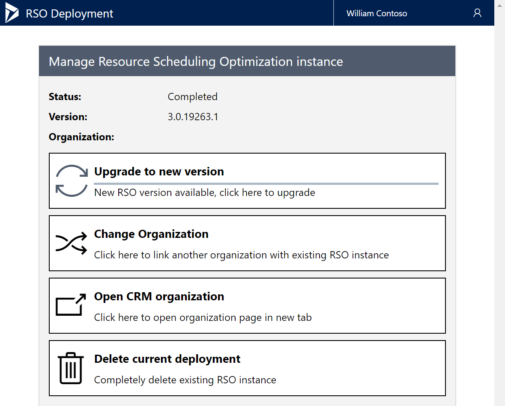

# Upgrade Field Service

Microsoft releases updates to the Dynamics 365 Field Service app and related solutions to add new capabilities, enhance the performance and usability of existing features, and fix bugs. In this article we will provide details on upgrading Field Service including the related mobile app and Resource Scheduling solutions.

## Field Service

### When are Field Service updates released?
Multiple Field Service updates are released every year.

**Minor updates** are released each month and include minor new features, enhancements, and bug fixes.

**Major updates** are released twice each year: April and October; and include major new features, as well as minor new features, enhancements, and bug fixes.

Though it is rare, occasionally a critical "hot fix" will be released outside of the monthly minor updates or the bi-yearly major updates.

The details of upcoming major and minor releases are listed in the [upcoming release plans](https://docs.microsoft.com/dynamics365/release-plans/) once they are committed. As an example, April 2020 release plans will include major and minor updates from November 2019 through April 2020; and October 2020 release plans will include major and minor updates from May 2020 through October 2020.

### How do I upgrade my environment?

As of Field Service version **8.8.6+**, the Field Service app will be updated automatically as part of the Dynamics 365 platform [One version](https://cloudblogs.microsoft.com/dynamics365/bdm/2018/07/06/modernizing-the-way-we-update-dynamics-365/) initiative.

Before your organization updates to 8.8.6+ or later, you can manually apply updates by going to the Microsoft 365 (Office 365) Admin Center.

Log in to [https://login.microsoftonline.com](https://login.microsoftonline.com) with administrator credentials. 

Go to Admin

> [!div class="mx-imgBorder"]
> 

Then go to the Dynamics 365 Admin center

> [!div class="mx-imgBorder"]
> 

Select and highlight the environment that has the Field Service app you want to upgrade.

> [!div class="mx-imgBorder"]
> 

In the list of solutions, find and select the Field Service app. It will indicate if an upgrade is available. Then select the **Upgrade** icon.

> [!div class="mx-imgBorder"]
> 

In addition, once your organization begins receiving automatic updates with version **8.8.6+**, you can manually upgrade the app in the seven days between the update release and when the automatic update applies. This is done via the admin center process above.

> [!Note]
> All new Dynamics 365 Field Service trial environments are given the latest generally available solution when a trial is created via [https://trials.dynamics.com](https://trials.dynamics.com).

### What gets updated?

When the Field Service app is upgraded, the Field Service solution is upgraded and multiple other solutions can be upgraded as well such as Universal Resource Scheduling (also called "Resource Scheduling"), Geofencing for Field Service, Field Service Mobile Push Notifications, and more.

> [!div class="mx-imgBorder"]
> 

To understand what version of the Field Service solution is in your environment, look at the version of the solution named **FieldService_anchor**. 

### Best practices

1. Before upgrading your production instance of Field Service, make a copy of the production instance and upgrade the copy first. Then test your business processes to understand consequences and upgrade the actual production instance after.
2. Upgrading from Field Service version 7.x to 8.x is considered a major upgrade because its upgrading to the [Unified Client Interface (UCI)](https://docs.microsoft.com/en-us/power-platform/admin/about-unified-interface). See the [Field Service UCI Upgrage Playbook](https://aka.ms/fsuciupgrade) for more details and best practices. 
3. If your organization is using Project Service Automation along with Field Service, it is recommended to upgrade both at the same time or soon after each other due to shared functionality.
4. Editing out-of-the-box web resources is unsupported and can cause functional issues after upgrading. You can use [Solution Health Hub](./troubleshoot-field-service-solution-health.md) to understand if web resources have been edited.

## Mobile

The Field Service mobile experience is updated independently of the Field Service app but on a similar cadence, meaning minor and major updates throughout the year. 

Upgrading the mobile experience for technicians requires three steps:

1. Upgrading the Field Service Mobile app
2. Upgrading the mobile configuration tool (Woodford) solution
3. Upgrading the mobile project template.

### Upgrading the Field Service Mobile app

Technicians use the Field Service Mobile app on their phones, tablets, and Windows 10 devices. 

When a new version of the mobile app is released, the app will need to be udpated on each user's device. This can be done manually, automatically, or via Microsoft Intune.

> [!div class="mx-imgBorder"]
> 

As an example, 

### Upgrading the mobile configuration tool (Woodford) solution

### Upgrading the mobile project template.

Installing Field Service Mobile from the Windows Store can allow for automatic upgrades of new versions.

[Upgrade mobile project](mobile-upgrade-project.md)

update mobile app FIeld Service Mobile 

## Resource Scheduling

Resource scheduling is updated in the same cadence as Field Service

URS is updated when FS, PSA, or CS are updated not indeodndently 

FS updates will update URS, 

Step 1:

Before upgrade we would suggest customers to make sure they dont customize any internal only web resources/java script files, so that they dont get skipped during the upgrade 

Easy way to check this is by running the Resource Scheduling Service Health Diagnostics tool and make sure there are no flags when they assess their upgrade readiness 

Here is where users can find this tool 
they should remove the customizations out of the web resource and then run the upgrade. Not all customizede web resources will be flagged by this tool, only the ones that could have the critical impac 

> [!div class="mx-imgBorder"]
> 

Step 2:

UFX queries

> [!div class="mx-imgBorder"]
> 

## Resource scheduling Optimization

Go to admin center > Instances tab > solution

Select Upgrade to new version to apply a new update if one is available.

> [!div class="mx-imgBorder"]
> 

> [!div class="mx-imgBorder"]
> 

> [!div class="mx-imgBorder"]
> 

## Configuration considerations

## Additional Notes
- 7.x end of life
delete anchor and retry maybe? talk to jorn
- push notifications require woodford to be installed to install or update
   Make sure Woodford 11.1 or higher.
    2)   Delete the Field Service Anchor from CRM
    3)   Trigger FS Upgrade 8.8.0.88 again from Admin Center
    4) This will skip most of the installed solutions and will install msdyn_FSMNotification and msdyn_GeoFenceAlerts (since Woodford solution requirement has met)

### Common issues
- Field Service upgrade failure/DB out of sync and resolution steps that the customer can try on their own.
- Solution installation failed / Update Installation Failed
- Field Service database version is out of sync
-  upgrade did not complete, 
if auto update fails, there is retry

### See also
[Field Service version history](version-history.md)

[Install Field Service (web + mobile)](install-field-service.md)

[Important Notes for Field Service and Project Service Automation after upgrade of Dynamics 365 Organizations to version 9.0](https://community.dynamics.com/365/b/365teamblog/posts/important-notes-for-field-service-and-project-service-automation-after-upgrade-of-dynamics-365-organizations-to-version-9-0)

[Announcing end-of-life for Field Service (online) legacy versions by February, 2020](https://cloudblogs.microsoft.com/dynamics365/it/2019/05/17/announcing-end-of-life-for-field-service-online-legacy-versions-by-february-2020/)