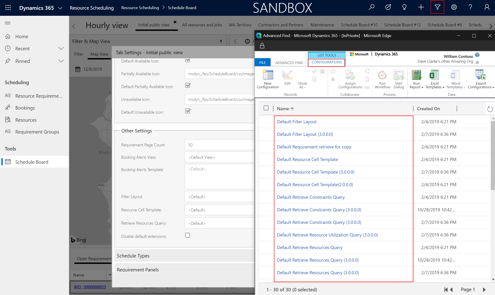

# Upgrade Field Service

Microsoft releases updates to the Dynamics 365 Field Service app and related solutions to add new capabilities, enhance the performance and usability of existing features, and fix bugs. In this article we will provide details on upgrading Field Service including the related mobile app and Resource Scheduling solutions.

## Field Service

### When are Field Service updates released?
Multiple Field Service updates are released every year.

**Minor updates** are released each month and include minor new features, enhancements, and bug fixes.

**Major updates** are released twice each year: April and October; and include major new features, as well as minor new features, enhancements, and bug fixes.

Though it is rare, occasionally a critical "hot fix" will be released outside of the monthly minor updates or the bi-yearly major updates.

The details of upcoming major and minor releases are listed in the [upcoming release plans](https://docs.microsoft.com/dynamics365/release-plans/) once they are committed. As an example, April 2020 release plans will include major and minor updates from November 2019 through April 2020; and October 2020 release plans will include major and minor updates from May 2020 through October 2020.

### How do I upgrade my environment?

As of Field Service version **8.8.6+**, the Field Service app will be updated automatically as part of the Dynamics 365 platform [One version](https://cloudblogs.microsoft.com/dynamics365/bdm/2018/07/06/modernizing-the-way-we-update-dynamics-365/) initiative.

Before your organization updates to 8.8.6+ or later, you can manually apply updates by going to the Microsoft 365 (Office 365) Admin Center.

Log in to [https://login.microsoftonline.com](https://login.microsoftonline.com) with administrator credentials. 

Go to Admin

> [!div class="mx-imgBorder"]
> 

Then go to the Dynamics 365 Admin center

> [!div class="mx-imgBorder"]
> 

Select and highlight the environment that has the Field Service app you want to upgrade.

> [!div class="mx-imgBorder"]
> 

In the list of solutions, find and select the Field Service app. It will indicate if an upgrade is available. Then select the **Upgrade** icon.

> [!div class="mx-imgBorder"]
> 

In addition, once your organization begins receiving automatic updates with version **8.8.6+**, you can manually upgrade the app in the seven days between the update release and when the automatic update applies. This is done via the admin center process above.

> [!Note]
> All new Dynamics 365 Field Service trial environments are given the latest generally available solution when a trial is created via [https://trials.dynamics.com](https://trials.dynamics.com).

### What gets updated?

When the Field Service app is upgraded, the Field Service solution is upgraded and multiple other solutions can be upgraded as well such as Universal Resource Scheduling (also called "Resource Scheduling"), Geofencing for Field Service, Field Service Mobile Push Notifications, and more.

> [!div class="mx-imgBorder"]
> 

To understand what version of the Field Service solution is in your environment, look at the version of the solution named **FieldService_anchor**. 

### Best practices

1. Before upgrading your production instance of Field Service, make a copy of the production instance and upgrade the copy first. Then test your business processes to understand consequences and upgrade the actual production instance after.
2. Upgrading from Field Service version 7.x to 8.x is considered a major upgrade because its upgrading to the [Unified Client Interface (UCI)](https://docs.microsoft.com/en-us/power-platform/admin/about-unified-interface). See the [Field Service UCI Upgrage Playbook](https://aka.ms/fsuciupgrade) for more details and best practices. 
3. If your organization is using Project Service Automation along with Field Service, it is recommended to upgrade both at the same time or soon after each other due to shared functionality.
4. Editing out-of-the-box web resources is unsupported and can cause functional issues after upgrading. You can use [Solution Health Hub](./troubleshoot-field-service-solution-health.md) to understand if web resources have been edited.

## Mobile

The Field Service mobile experience is updated independently of the Field Service app but on a similar cadence, meaning minor and major updates throughout the year. 

Upgrading the mobile experience for technicians requires three steps:

1. Update the Field Service Mobile app
2. Upgrade the mobile configuration tool (Woodford) solution
3. Upgrade the mobile project template

> [!Note]
> All of the steps are dependent on each other and need to be coordinated and executed together. Occasionally, only a new mobile project template is released and needs to be upgraded without the need to update the mobile app or upgrade the mobile configuration tool (Woodford) solution. In this case, **skip to step 3**.

### Step 1: Update the Field Service Mobile app

Technicians use the Field Service Mobile app on their phones, tablets, and Windows 10 devices. 

When a new version of the mobile app is released, the app will need to be udpated on each user's device. This can be done manually, automatically, or via Microsoft Intune.

> [!div class="mx-imgBorder"]
> 

As an example, downloading Field Service Mobile from the Windows Store can allow for automatic updates as new versions are released. 

### Step 2: Upgrade the mobile configuration tool (Woodford) solution

To unlock the new capabilities of the updated Field Service Mobile app, you'll then need to [download](https://aka.ms/fsmobile-configurator) and [import](https://docs.microsoft.com/en-us/dynamics365/field-service/mobile-faq-latest-version) the latest version of the Mobile Configuration tool (Woodford) solution into your environment.
 

### Step 3: Upgrade the mobile project template.

Mobile projects hold the configurations and customizations of the mobile app. Periodically, Microsoft releases new mobile projects in conjunction with or independent of a mobile app update or a new version of the mobile configuration tool (Woodford) solution.

See the topic on [upgrading mobile projects](mobile-upgrade-project.md) for guidance and best practices.

## Resource Scheduling

Resource Scheduling, also called Universal Resource Scheduling, is the app that powers Field Service scheduling. You cannot upgrade Resource Scheduling on its own, it is upgraded with Field Service, Project Service Automation, or Customer Service. 

However, before upgrading Resource Scheduling consider 1) running the Resource Scheduling: Service Health Diagnostics and 2) planning for updated Universal Fextch XML (UFX) queries on the Schedule Board and Schedule Assistant.

### Run Resource Scheduling: Service Health Diagnostics

Before upgrading, run the **Resource Scheduling: Service Health Diagnostics** tool to understand if any critical web resources or JavaScript files were edited. If so, they will get skipped during upgrade and this could cause functional issues and missed functionality. 

Go to **Resource Scheduling app > Settings > Administration > Scheduling Parameters**

Then select Health Diagnostics in the top ribbon.

> [!div class="mx-imgBorder"]
> 

If the diagnostic tool flags any web resources that should not have been edited, you will need to remove the customizations from the web resources and then run the upgrade. Not all customized web resources will be flagged by this tool, only the ones that could have critical impact. 

### Plan for updated Universal Fextch XML (UFX) queries

Occasionnally, Resource Scheduling releases will include updates to the Universal Fextch XML (UFX) queries that control how resources and requirements are fetched and loaded on the schedule board or in schedule assistant results. See the topic on [Schedule Board Tab Settings](https://docs.microsoft.com/en-us/dynamics365/field-service/schedule-board-tab-settings#other-settings) for more details.

As an example, a new version of Resource Scheduling may add a new resource filter to the left panel of the schedule board. To make this possible, the update will come with a new UFX query for the Retrieve Resources Query as seen in the screenshot below.

> [!div class="mx-imgBorder"]
> 

However, the XML in each UFX can be edited based on your specific needs. If a UFX query has been edited by your organization, the Resource Scheduling upgrade will import the new UFX query, but **will not apply it**. Therefore, you'll need to add your customizations to the new UFX query and select and apply it manually from the Schedule Board Tab Settings. One option is to use GitHub to understand the differences between the old XML file with your custom queries and the new XML file as part of the Resource Scheduling upgrade.

All UFX queries, both custom ones your organziation creates and those included with the Resource Scheduling app, are listed as records in the Configurations entity, and each record holds the XML queries.  

> [!div class="mx-imgBorder"]
> 

## Resource Scheduling Optimization

Resource Scheduling Optimization is the app that allows for automated scheduling of work orders, projects tasks, cases, and more. Major and minor updates are released thoughout the year. Unlike Resource Scheduling, Resource Scheduling Optimization (RSO) can be upgraded independently.

First check if an RSO update is available. 

From the Dynamics 365 Admin ceneter, select and highlight the environment that has the Resource Scheduling Optimization (RSO) app and select solutions.

> [!div class="mx-imgBorder"]
> 

In the lsit of solutions, it will indicate if there is an Upgrade Available for the Resource Scheduling Optimization solution.

> [!div class="mx-imgBorder"]
> 

If so, go to the Applications tab at the top, find the RSO application that relates to your environment, and choose **Manage**.

> [!div class="mx-imgBorder"]
> 

Then select **Upgrade to new version**.

> [!div class="mx-imgBorder"]
> 

**Pro Tip:** By selecting Change Organization, you can point RSO at a different environment to optimize those work orders, projects, cases, etc. DOing so will initiate an upgrade. Furthermore, your RSO data and configurations (Optimization Scopes, Goals, and Schedules) will remain in the previous environment in case you ever want to switch it back.

## Configuration considerations

## Additional Notes
- 7.x end of life
delete anchor and retry maybe? talk to jorn
- push notifications require woodford to be installed to install or update
   Make sure Woodford 11.1 or higher.
    2)   Delete the Field Service Anchor from CRM
    3)   Trigger FS Upgrade 8.8.0.88 again from Admin Center
    4) This will skip most of the installed solutions and will install msdyn_FSMNotification and msdyn_GeoFenceAlerts (since Woodford solution requirement has met)

### Common issues
- Field Service upgrade failure/DB out of sync and resolution steps that the customer can try on their own.
- Solution installation failed / Update Installation Failed
- Field Service database version is out of sync
-  upgrade did not complete, 
if auto update fails, there is retry

### See also
[Field Service version history](version-history.md)

[Install Field Service (web + mobile)](install-field-service.md)

[Important Notes for Field Service and Project Service Automation after upgrade of Dynamics 365 Organizations to version 9.0](https://community.dynamics.com/365/b/365teamblog/posts/important-notes-for-field-service-and-project-service-automation-after-upgrade-of-dynamics-365-organizations-to-version-9-0)

[Announcing end-of-life for Field Service (online) legacy versions by February, 2020](https://cloudblogs.microsoft.com/dynamics365/it/2019/05/17/announcing-end-of-life-for-field-service-online-legacy-versions-by-february-2020/)