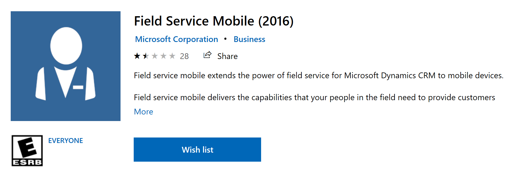

# Field Service version history

## Latest versions

| Solution                             | Latest version | Download links                                                                                                                     |
|--------------------------------------|----------------|------------------------------------------------------------------------------------------------------------------------------------|
| Field Service                        |  8.8.8           | [https://trials.dynamics.com](https://trials.dynamics.com).   See additional notes at the end of this document.                  |
| Field Service Mobile                 | 12.1.203          | [Windows](https://aka.ms/fsmobile-windows),   [iOS](https://aka.ms/fsmobile-ios), and   [Android](https://aka.ms/fsmobile-android) |
| Mobile Configuration Tool (Woodford) | 12.1+          | [Direct download link (English only)](https://aka.ms/fsmobile-configurator)                                                       |
| Mobile Project Template              | 1.0.3514       | [Direct download link (English only)](https://aka.ms/fsmobile-project)      |

## Field Service version history

| Interface | Version Number  |  Release date  |  Notes | More details |
|---|---|---|---|---|
| Unified Interface | 8.8  |  June 2019 |   | [Release notes for 8.8.0.88](https://cloudblogs.microsoft.com/dynamics365/it/2019/06/10/release-notes-for-field-service-version-8-8-0-88/), [8.8.2.160](https://cloudblogs.microsoft.com/dynamics365/it/2019/08/11/enhancements-and-bug-fixes-for-field-service-version-8-8-2-160/) |
| Unified Interface  | 8.7  |  May 2019 |   | [Release notes for 8.7.0.105](https://cloudblogs.microsoft.com/dynamics365/it/2019/05/06/release-notes-for-field-service-version-8-7-0-105/) |
| Unified Interface  | 8.6  |  April 2019 |   | [Release notes for 8.6.0.274](https://cloudblogs.microsoft.com/dynamics365/it/2019/04/06/release-notes-for-field-service-version-8-6-0-274/) |
| Unified Interface  | 8.5  |  March 2019 |   | [Release notes for 8.5.0.345](https://cloudblogs.microsoft.com/dynamics365/it/2019/03/07/release-notes-for-field-service-version-8-5-0-345/) |
| Unified Interface  | 8.4  |  February 2019 |   | [Release notes for 8.4.0.338](https://blogs.msdn.microsoft.com/crm/2019/02/11/release-notes-for-field-service-version-8-4-0-338/) |
| Unified Interface  | 8.3  |  December 2018 | SLA functionality for Work Orders, Connected Field Service solution included with Field Service   | [Release notes for 8.3.0.255](https://blogs.msdn.microsoft.com/crm/2018/12/21/release-notes-for-field-service-version-8-update-release-3/) |
| Unified Interface | 8.0  |  July 2018 |  Multi-resource scheduling (requirement groups) |
| Web |  7.5 |  February 2019 | Not supported | |
| Web |  7.0 |  September 2017 | Not supported |

## Field Service On-Premise

| Version | Status | Details |
| --- | --- | --- |
| 7.x | Latest available | [Link](https://mbs.microsoft.com/customersource/Global/365Enterprise/downloads/product-releases/365fieldservice7) |
| 6.x | Not supported | |

## Field Service Mobile app version history

**Field Service Mobile** applies to Field Service 7.5.5+ and 8.2+

> [!div class="mx-imgBorder"]
> 

**Field Service Mobile (2017)** applies to Field Service 6.1.

> [!div class="mx-imgBorder"]
> 

**Field Service Mobile (2016)** applies to Field Service 6.0.

> [!div class="mx-imgBorder"]
> 

## Mobile project file library

Mobile projects hold configurations and customizations of the Field Service Mobile app such as view and form layout, mobile workflows called form rules, and offline HTML/JavaScript. These mobile projects are imported through the Field Service Mobile Configuration Tool (Woodford). The Field Service engineering team periodically releases new mobile project templates and the latest one can always be downloaded at [https://aka.ms/fsmobile-project](https://aka.ms/fsmobile-project).

To learn more about mobile projects, see our topic on [installing the Field Service Mobile Configuration Tool](https://docs.microsoft.com/dynamics365/customer-engagement/field-service/install-field-service#install-the-field-service-mobile-configuration-tool).

| Template version  | Release date | Relates to Field Service Mobile version |  Publish to Woodford Version | Minimum Field Service Version | 
|---|---|---|---|---| --- |
| [1.0.3514](https://aka.ms/fsmobile-project)  |  January 2020  |  12.1+ | 12.1+ | 8.8.6.300 | 
| [1.0.3482](https://aka.ms/fsmobile-project-3482)  |   November 2019  |  11.3+ | 11.3+ | 8.8.6.300 | 
| [1.0.2735](https://aka.ms/fsmobile-project-2735)  |  August 2019  |  11.3 | 11.3 | | 
| [1.0.1322](https://aka.ms/fsmobile-project-1322)  |   December 2018  |  11.2 | 11.2 | | 
| [Field Service v6.1 v1.0.0.0](https://go.microsoft.com/fwlink/p/?linkid=836310)  |  December 2018  |  **Field Service Mobile (2017)** 9.0+ | 9.1 | | 
| [ Field Service v6.0 v1.0.0.0](https://go.microsoft.com/fwlink/p/?LinkId=808250)  |  December 2018  |  **Field Service Mobile (2016)** 8.0 | 8.0 | | 

### See also

- [New and upcoming features](new-upcoming.md)
- [Self-enabling install of the Unified Interface versions of Field and Project Service](https://cloudblogs.microsoft.com/dynamics365/it/2019/08/01/how-to-enable-unified-interface-apps-of-field-service-and-project-service-automation/)

