# Set up field service users and security roles

[!INCLUDE[pn_field_service](../includes/pn-field-service.md)] comes with security roles and field security profiles unique to the Field Service application.

By setting security roles for users, you control the types of data and entities a user can access and edit. By setting field security profiles, you control which fields a user sees for an entity. For example, a user may have permission to see accounts but not to see specific fields for an account. 
 > [!div class="mx-imgBorder"]
 > 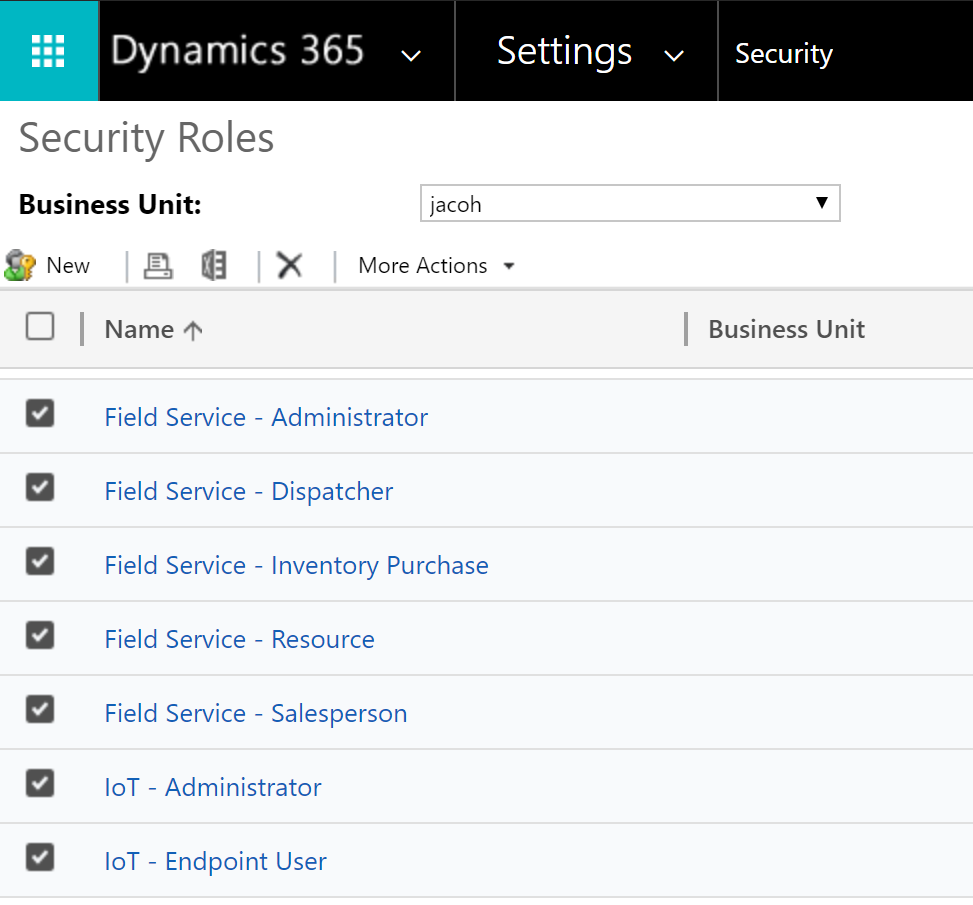 

> [!Note]
> Any users assigned to field service security roles need a Dynamics 365 license that includes the Field Service application. After you complete the steps in this article, it's recommended that you sign in to verify that the capabilities appear as expected.

## Field service roles

**Field Service—Administrator** is designed for service managers and IT administrators. This role has access to all field service entities including work orders, scheduling, and inventory. Additionally, this role has full Create, Read, Update, Delete (CRUD) abilities. For example, a field service administrator can create new work order types for the organization, which other people can then use on work orders that they create.

**Field Service—App Access** and **Field Service—Resource** are designed for field technicians and should be assigned to field technician users who carry out work orders for customers primarily via the mobile application. This role is generally characterized by read and update privileges. An example is the ability to view and update information on work orders that are assigned to this user (and only this user).

**Field Service—Dispatcher** is designed for schedulers who are responsible for managing and assigning a group of work orders to a group of resources. It is characterized by limited CRUD abilities for scheduling related entities within his or her business unit. An example is editing and scheduling work orders to resources in the Washington territory.

**Field Service—Inventory Purchase** is designed for inventory managers who are responsible for managing truck stocks, purchasing and reordering inventory, and processing product returns. It is characterized by limited CRUD abilities for inventory related entities within his or her business unit. An example is processing a product return for one or many lines of business. **This security role should be given to a user in addition to the Field Service-Resource or Field Service-Dispatcher security roles**.

**IoT - Administrator** is designed for users who are responsible for device registration and device data pulls that are IoTHub operations related to Connected Field Service. These roles are characterized by full CRUD abilities for IoT  related entities. For example, a user with these roles may have access to all IoT Alerts and devices. 

**IoT - Endpoint User** is used by Microsoft to connect Dynamics 365 to IoT systems. For more information on CFS security, see the topic on [setting up security roles for Connected Field Service](cfs-security-roles.md).  

## Prerequisites

- Dynamics 365 System Administrator access

> [!Note]
> New product releases may update field service security roles. You can either make custom roles or copies of existing roles to mitigate the risks. If you intend to **add** additional privileges it is recommended to create a custom security role with the added privileges and assign both the field service security role and the add on role. If you intend to **remove** or "lower" privileges then it is recommended to make a copy of the field service security role, make your changes, and assign the copied security role to the user. To copy a security role, go to **Settings > Security > Security Roles**, then select a security role record and choose **Actions > Copy Role**. See the following screenshot for reference.

> [!div class="mx-imgBorder"]
>  

## Set up a user for field service 
  
Go to **Dynamics 365** > **Settings** > **Security** > **Users**, and then set the fields used in the Field Service application. Refer to the table to learn how the fields are used in the Field service application.  
  
|                              |                                                                                                                                                                                                                                                                                                                                  |
|------------------------------|----------------------------------------------------------------------------------------------------------------------------------------------------------------------------------------------------------------------------------------------------------------------------------------------------------------------------------|
|           **Item**           |                                                                                                                                                         **Description**                                                                                                                                                          |
|   **Account Information**    |               User Name: Validates the user record against [!INCLUDE[pn_Active_Directory](../includes/pn-active-directory.md)]. Users must be created in [!INCLUDE[pn_Active_Directory](../includes/pn-active-directory.md)] before being added to [!INCLUDE[pn_field_service](../includes/pn-field-service.md)].                |
|     **User Information**     |                                                                                                                                 Enter the user’s name, title, email address, and phone numbers.                                                                                                                                  |
| **Organization Information** | Enter the user’s site, territory, business unit, and manager. Territory on a user record is a [!INCLUDE[pn_crm_shortest](../includes/pn-crm-shortest.md)] entity and will not add the associated resource record to the territory.  You must do this  in the **Resources** section of the **Field Service Administration** tile. |
|     **Mailing Address**      |            Enter the user’s address. This information can be used by the routing engine and scheduling assistant to calculate travel times and mileage. If the user is going to be a bookable resource, make sure to geocode the address. On the command bar at the top, click **More**, and then click **Geo Code**.            |

After assigning a user a security role, you must assign the user the corresponding field security profile.

> [!div class="mx-imgBorder"]
> 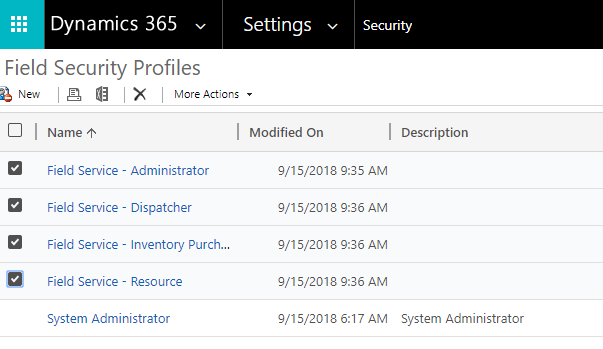 

## Set up a dispatcher user

Follow these steps to set up a dispatcher who schedules work orders for field technicians.

1. Go to **Settings > Security > Security Roles** and copy the **Field Service - Dispatcher** role

> [!div class="mx-imgBorder"]
> 

2. Select a user, and then choose **Manage Roles**.

> [!div class="mx-imgBorder"]
>  

3. Assign the copied **Field Service—Dispatcher** role to allow schedule, dispatch, and work order editing capabilities to the user. Or, if the user is responsible for more than schedule and dispatch, make a copy of the **Field Service – Administrator** role and assign it to the user.

4. Open the dispatcher's user record, and then select **Field Security Profiles**.

> [!div class="mx-imgBorder"]
> 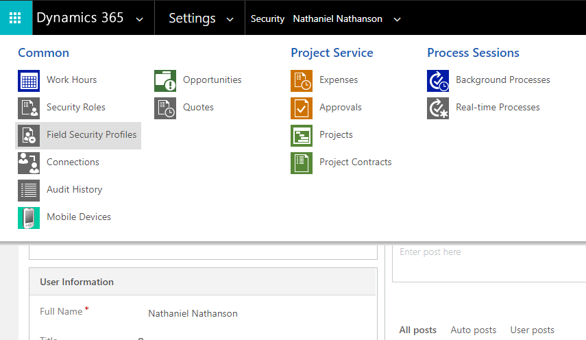 

1.  Assign the **Field Service – Dispatcher** field security role.

> [!div class="mx-imgBorder"]
> 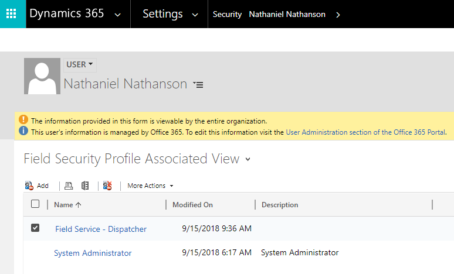 

## Set up a field technician user

1. Go to **Settings** > **Security** > **Users**.

2. Select a user other than your dispatcher/administrator user to be a field technician, and then assign the **Field Service – Resource** and **Field Service—App Access** security roles.

> [!div class="mx-imgBorder"]
> 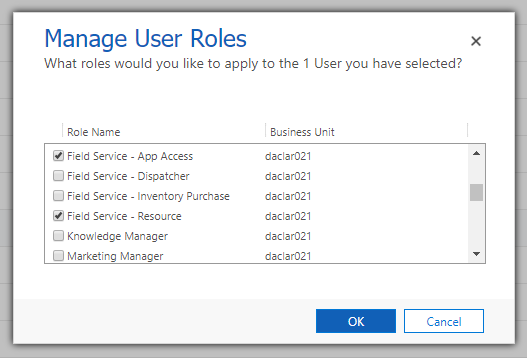 

3. For the same user, select **Field Security Profiles**.

> [!div class="mx-imgBorder"]
> 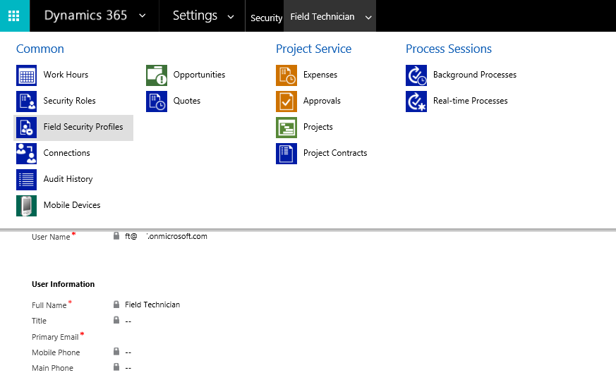 

5. Assign the field technician user the **Field Service – Resource** field security profile. 

> [!div class="mx-imgBorder"]
> 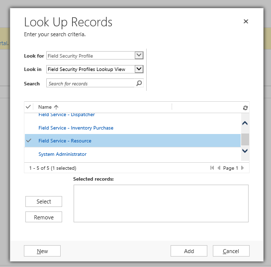 

> [!Note]
> Field technicians aren't able to edit fields on the mobile work order form untl you complete this step.

> [!div class="mx-imgBorder"]
> 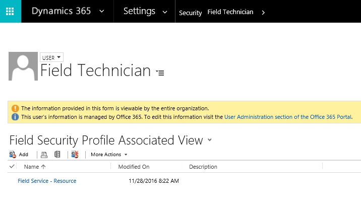 

## Set up geocoding for a field technician user
To set up geocoding to enable location awareness for scheduling and routing, define where each resource starts and/or ends the day. 

1.  Go to **Settings** > **Users**, and then select the field technician's record.

2.  Verify that the record includes an address. 

> [!div class="mx-imgBorder"]
>  

If there isn't already an address for the user, navigate to the Microsoft 365 admin center and enter one. To display the address in the Dynamics 365 organization, refresh the page.

> [!div class="mx-imgBorder"]
> 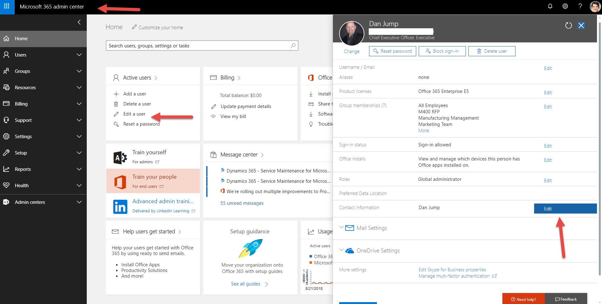 

1.  To enable geocoding in the Dynamics 365 organization, go to **Resource Scheduling** > **Administration** > **Scheduling Parameters**.

> [!div class="mx-imgBorder"]
> 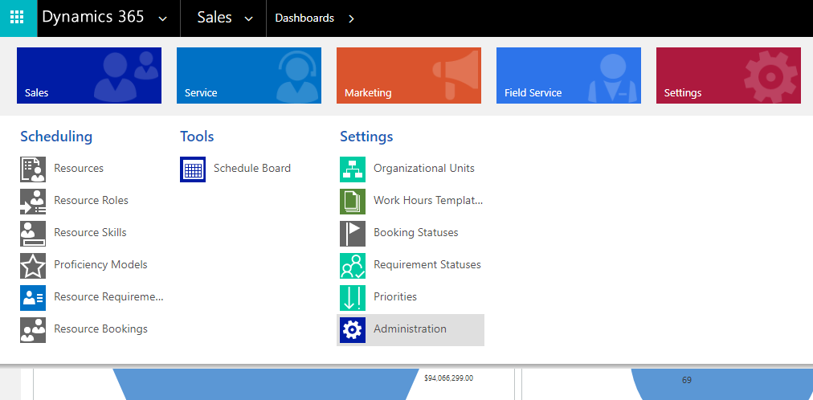 

> [!div class="mx-imgBorder"]
> 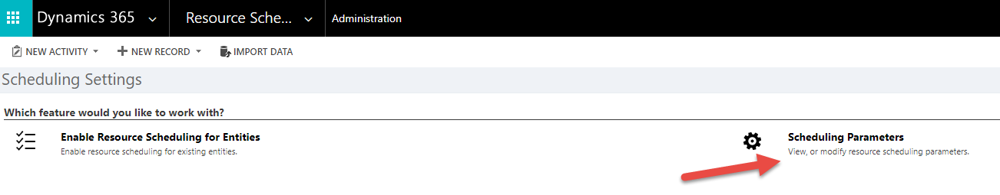 

1.  To tag a latitude and longitude for the address on the user record, set **Connect to Maps** to **Yes**. The API key is filled out automatically to use Bing Maps API.

> [!div class="mx-imgBorder"]
> 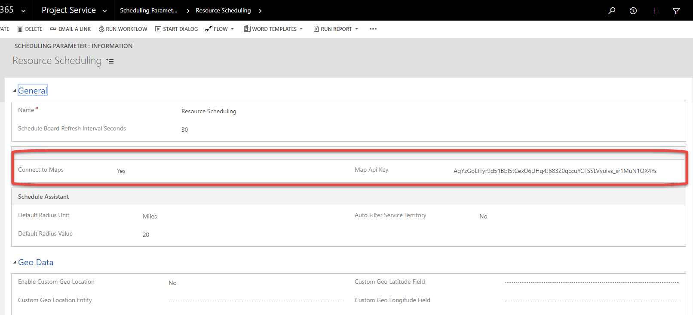 

5. Go to the user record, and then select **Geo Code**.

> [!div class="mx-imgBorder"]
> 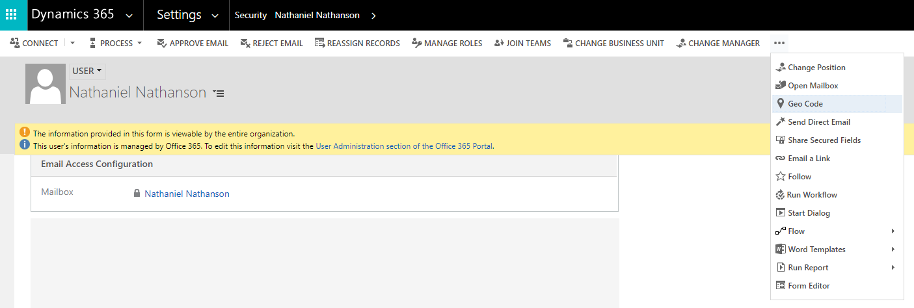 

6. On the **Found Places** dialog, choose the address.
> [!div class="mx-imgBorder"]
> 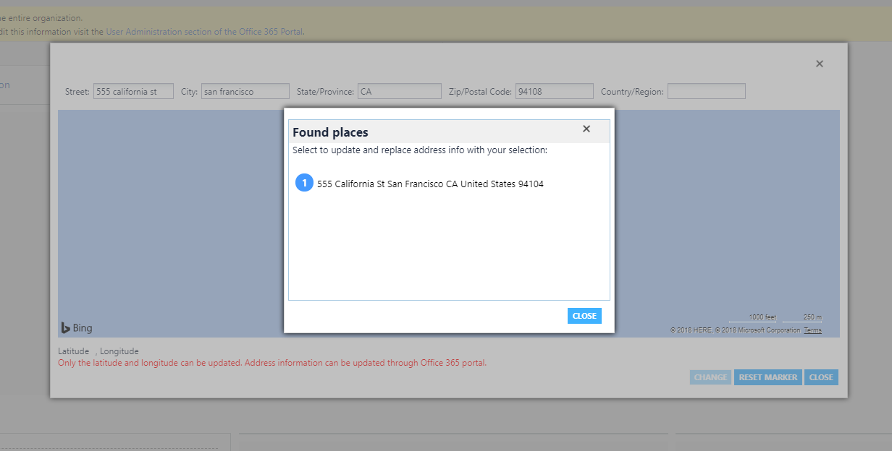 

7.  Select **Change**.

> [!div class="mx-imgBorder"]
> 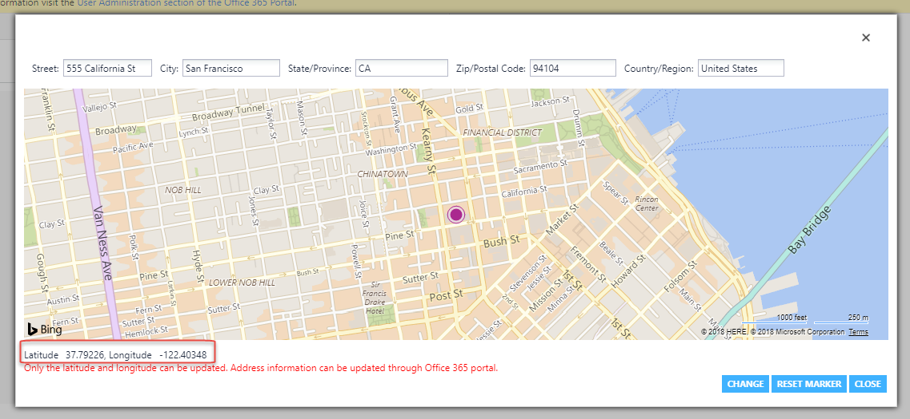

8. Verify that the latitude and longitude display in the **Scheduling** section.

> [!div class="mx-imgBorder"]
> 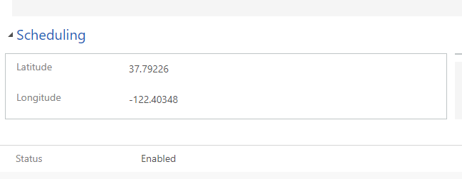 

> [!Note]
> If you are having trouble populating an address or geocoding an address, manually enter a latitude and longitude into the fields.

