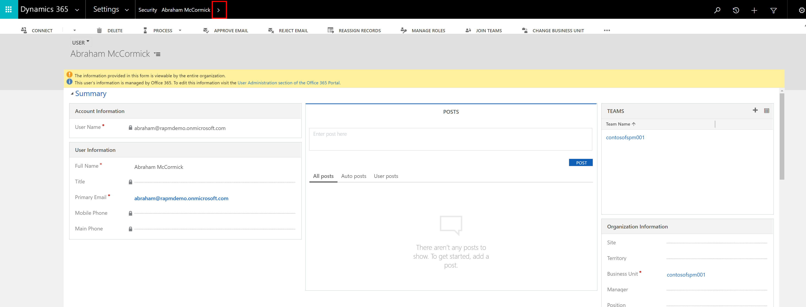
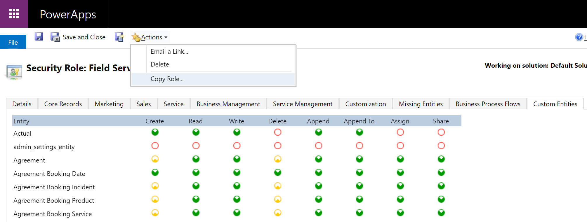
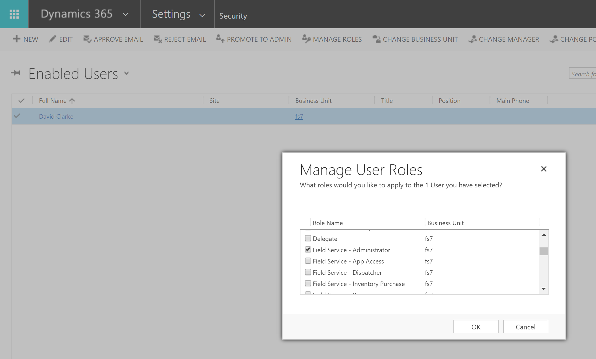

# Set up Dynamics 365 Field Service users and security profiles

In today's workforce, field service management requires several individuals with different roles to execute a work order, including administrators, dispatchers, and frontline workers. This document will provide you the steps to set up each role to successfully use Dynamics 365 Field Service through the different security profiles - security role and field security profile. 

## Dynamics 365 Field Service roles + definitions
First, let's define the roles that are within of your workforce and understand how they are referred to in Dynamics 365 Field Service.  

**Field Service—Resource** are designed for **frontline workers** who carry out work orders for customers on-site primarily via the Dynamics 365 Field Service mobile application. This role only has read and update abilities on work orders. For example, frontline workers can only view and update information on work orders that are assigned to them.

**Field Service—Administrator** is designed for **IT administrators or service managers**. This role has access to all field service entities including work orders, scheduling, and inventory. Additionally, this role has full create, read, update, delete (CRUD) abilities on work orders. For example, a field service administrator can create new work order types for the organization.

**Field Service—Dispatcher** is designed for **schedulers** who are responsible for managing and assigning a group of work orders to a group of frontline workers. It is characterized by limited delete (CRUD) abilities for scheduling related entities within their business unit. For example, dispatchers can edit and schedule work orders to frontline workers in the Washington territory.

**Field Service—Inventory Purchase** is designed for **inventory managers** who are responsible for managing truck stocks, purchasing and reordering inventory, and processing product returns. This role has limited delete (CRUD) abilities for inventory-related entities within their business unit. For example, inventory managers process a product return for one or more lines of business. **This security role should be given to a user in addition to the Field Service-Resource or Field Service-Dispatcher security roles**.

**IoT - Administrator** is designed for **IT administrators or service managers** who are responsible for device registration and device data pulls that are IoTHub operations related to Connected Field Service. This role is characterized by full delete (CRUD) abilities for IoT related entities. For example, a user with these roles may have access to all IoT alerts and devices. 

**IoT - Endpoint User** is used by Microsoft to connect Dynamics 365 to IoT systems. For more information on CFS security, see the article on [setting up security roles for Connected Field Service](cfs-security-roles.md).  

## Prerequisites 
- Your organization must have a Microsoft 365 or Microsoft 365 [administrator account](https://www.microsoft.com/microsoft-365/business/office-365-administration?rtc=1). For more information, learn more about [admin permission](https://docs.microsoft.com/microsoft-365/admin/admin-overview/admin-overview?redirectSourcePath=%2Farticle%2Foffice-365-admin-overview-c7228a3e-061f-4575-b1ef-adf1d1669870&view=o365-worldwide).
- You'll need either a free trial of Dynamics 365 Field Service, or have paid licenses. Learn more about [starting a free trial](https://dynamics.microsoft.com/get-started/free-trial/?appname=fieldservice).

## Step 1: Add users + assign Dynamics 365 Field Service licenses
After the admin has purchased trial or paid Dynamics 365 Field Service licenses for their users, they can now add and assign them licenses.

See the topic on [Creating users and assigning security roles in the Power Platform](https://docs.microsoft.com/power-platform/admin/create-users-assign-online-security-roles) for more details. 

1. Log into the [Microsoft 365 administrator portal](https://www.microsoft.com/microsoft-365/business/office-365-administration?rtc=1) using your organization’s admin account. 

2. In the left navigation bar, select **Users** > **Active Users**.

3. Select **Add a user** to add individual users or select **Add multiple users** to import multiple users via a CSV file. For more information, visit the [Microsoft 365 article on individual users](https://docs.microsoft.com/microsoft-365/admin/add-users/add-users?view=o365-worldwide).

4. If adding individual users, fill out your user's basic information, including first name, last name, and password. If adding multiple users, you will fill out this information in a CSV file and you must upload it. 

5. Assign your users a product license. Specifically, select the Dynamics 365 Field Service to assign your users this license. 

6. Fill out the settings of your users, such as job title, mobile phone number, and address. While this may be optional, it is highly recommended! Additionally, you may give administrator access ability to certains users in this section, too. 

7. Review and select **Finish adding** to add and assign this users a Dynamics 365 Field Service license. 

Woohoo, your users in your organization are now added and assigned Field Service licenses!

## Step 2: Assign security roles and field security profiles
After adding and assigning Dynamics 365 Field Service licenses to your users, you can now assign them specific Field Service security roles and field security profiles. By setting **security roles** for users, you control the types of data and entities a user can access and edit. By setting **field security profiles**, you control which fields a user sees for an entity. For example, a user may have permission to see accounts, but not to see specific fields for an account. Make sure you understand which role to assign your users; view the roles and definitions.  

> ![NOTE]
> These steps allow you to assign security roles and field security profiles to individual users rather than multiple users at once. 

1. Sign into the [Power Platform Admin Center](https://admin.powerplatform.microsoft.com/environments).

2. Select your environment. 

3. Select **Settings**. 

4. Select **Users + permissions** > **User**. 

5. Find and select your user's name. This takes you to a new page. 

6. Select **Manage roles**. 

7. Select the appropriate role for your user > **OK**. View the roles and definitions to learn which one to choose. 

8. Select the **>** next to your user's name and then select **Field Security Profiles**. 

> [!div class="mx-imgBorder"]
> 

9. Select **Add**. 

10. Select the appropriate role for your user > **Select** > **Add**. View the roles and definitions to learn which one to choose. 

Woohoo! You have now assigned a security role and field security profile to a user. Repeat the steps above starting from Step 5 to provision another user. 

## Q + A 

1. After adding and assigning security profiles, what should I do next? 

As an admin, you can start configuring the rest of Dynamics 365 Field Service. Specifically, to fully provision your frontline workers, you will need to assign them to an [offline data profile](https://docs.microsoft.com/dynamics365/field-service/mobile-power-app-system-offline).

2. Can I add multiple people to a security role and/or a field security profile? 

Yes. Use the [Teams feature](https://docs.microsoft.com/power-platform/admin/manage-teams) to help you group multiple users and then assign them to a security role and/or profile. 

3. Can I make a copy of security roles? 

> [!Note]
> New product releases may update field service security roles. You can either make custom roles or copies of existing roles to mitigate the risks. If you intend to add additional privileges, we recommend creating a custom security role with the added privileges, and assigning both the Field Service security role and the add-on role. If you intend to remove or lower privileges, then we recommend that you make a copy of the Field Service security role, make your changes, and assign the copied security role to the user. To copy a security role, go to Settings > Security > Security Roles, then select a security role record and choose Actions > Copy Role. See the following screenshot for reference.

Yes. Here's an example of copying the **Field Service - Dispatcher** role:

1. Go to **Settings** > **Security** > **Security Roles** and copy the **Field Service - Dispatcher** role.

> [!div class="mx-imgBorder"]
> 

2. Select a user, and then choose **Manage Roles**.

> [!div class="mx-imgBorder"]
>  

3. Assign the copied **Field Service—Dispatcher** role to allow schedule, dispatch, and work order editing capabilities to the user. Or, if the user is responsible for more than schedule and dispatch, make a copy of the **Field Service – Administrator** role and assign it to the user.
