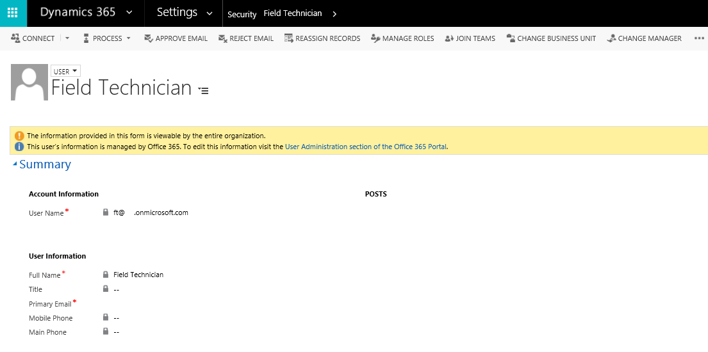
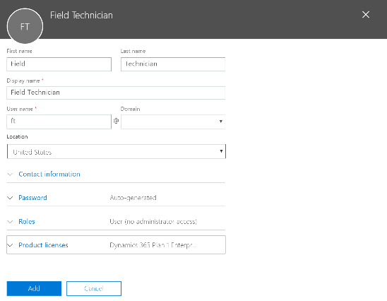
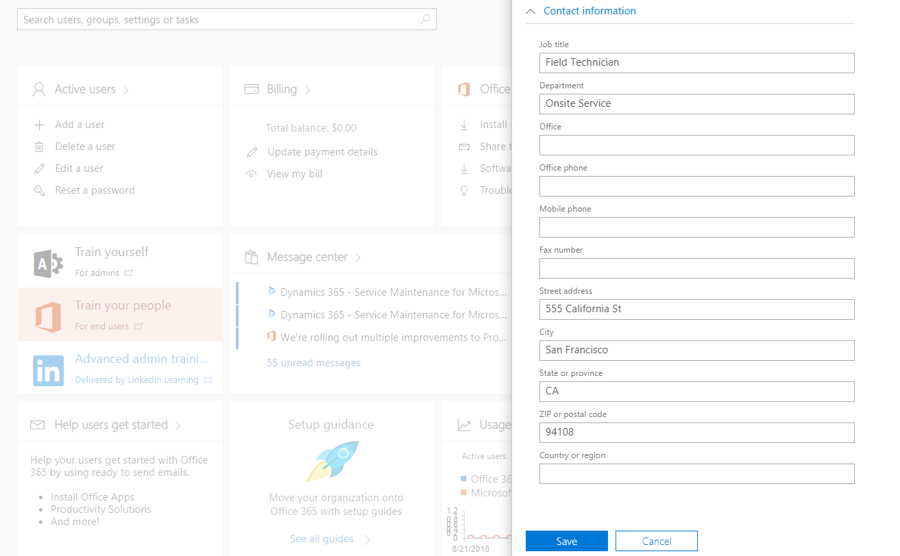

# Set up field service users and security roles
[!INCLUDE[cc-applies-to-update-9-0-0](../includes/cc_applies_to_update_9_0_0.md)]

[!INCLUDE[pn_field_service](../includes/pn-field-service.md)] comes with security roles and field security profiles unique to the Field Service application.

By setting security roles for users, you control the types of data and entities a user can access and edit. By setting field security profiles, you control which fields a user sees for an entity. For example, a user may have permission to see accounts but not to see specific fields for an account. 
 > [!div class="mx-imgBorder"]
 >  

> [!Note]
> Any users assigned to field service security roles need a Dynamics 365 license that includes the Field Service application. After you complete the steps in this article, it's recommended that you sign in to verify that the capabilities appear as expected.

## Field service roles
**Field Service—Administrator** is designed for service managers and IT administrators. This role has access to all field service entities including work orders, scheduling, and inventory. Additionally, this role has full Create, Read, Update, Delete (CRUD) abilities. For example, a field service administrator can create new work order types for the organization, which other people can then use on work orders that they create.

**Field Service—App Access** and **Field Service—Resource** are designed for field technicians and should be assigned to field technician users who carry out work orders for customers primarily via the mobile application. This role is generally characterized by read and update privileges. An example is the ability to view and update information on work orders that are assigned to this user (and only this user).

**Field Service—Dispatcher** is designed for schedulers who are responsible for managing and assigning a group of work orders to a group of resources. It is characterized by limited CRUD abilities for scheduling related entities within his/her business unit. An example is editing and scheduling work orders to resources in the Washington territory.

**Field Service—Inventory Purchase** is designed for inventory managers who are responsible for managing truck stocks, purchasing and reordering inventory, and processing product returns. It is characterized by limited CRUD abilities for inventory related entities within his/her business unit. An example is processing a product return for one or many lines of business.

## Set up a user for field service 
  
1.  Go to **Dynamics 365** > **Settings** > **Security** > **Users**, and then set the fields used in the Field Service application. Refer to the table to learn how the fields are used in the Field service application.  
  
|                              |                                                                                                                                                                                                                                                                                                                                  |
|------------------------------|----------------------------------------------------------------------------------------------------------------------------------------------------------------------------------------------------------------------------------------------------------------------------------------------------------------------------------|
|           **Item**           |                                                                                                                                                         **Description**                                                                                                                                                          |
|   **Account Information**    |               User Name: Validates the user record against [!INCLUDE[pn_Active_Directory](../includes/pn-active-directory.md)]. Users must be created in [!INCLUDE[pn_Active_Directory](../includes/pn-active-directory.md)] before being added to [!INCLUDE[pn_field_service](../includes/pn-field-service.md)].                |
|     **User Information**     |                                                                                                                                 Enter the user’s name, title, email address, and phone numbers.                                                                                                                                  |
| **Organization Information** | Enter the user’s site, territory, business unit, and manager. Territory on a user record is a [!INCLUDE[pn_crm_shortest](../includes/pn-crm-shortest.md)] entity and will not add the associated resource record to the territory.  You must do this  in the **Resources** section of the **Field Service Administration** tile. |
|     **Mailing Address**      |            Enter the user’s address. This information can be used by the routing engine and scheduling assistant to calculate travel times and mileage. If the user is going to be a bookable resource, make sure to geocode the address. On the command bar at the top, click **More**, and then click **Geo Code**.            |

After assigning a user a security role, you must assign the user the corresponding field security profile.

> [!div class="mx-imgBorder"]
>  

## Set up a dispatcher user

Follow these steps to set up a dispatcher who schedules work orders for field technicians.

1. Navigate to **Settings** > **Security** > **Users**.

2. Select a user and then **Manage Roles**.

> [!div class="mx-imgBorder"]
>  

3. Assign the **Field Service – Administrator** role to allow schedule, dispatch, and configuration capabilities. Or, if the user is solely a dispatcher, then assign the **Field Service—Dispatcher** role.

4. Open the dispatcher's user record, and then select **Field Security Profiles**.

> [!div class="mx-imgBorder"]
>  

5.  Assign the **Field Service – Dispatcher** field security role.

> [!div class="mx-imgBorder"]
>  

## Set up a field technician user

1. Navigate to **Settings** > **Security** > **Users**.

2. Select the user other than your dispatcher/administrator user to be a field technician, and then assign the **Field Service – Resource** and **Field Service—App Access** security roles.

> [!div class="mx-imgBorder"]
>  

3. Open the user record, and then select **Field Security Profiles**.

> [!div class="mx-imgBorder"]
>  

> [!div class="mx-imgBorder"]
>  

4. Assign the field technician user the **Field Service – Resource** field security profile. 

> [!div class="mx-imgBorder"]
>  

> [!Note]
> Field technicians aren't able to edit fields on the mobile work order form unless you complete this step.

> [!div class="mx-imgBorder"]
>  

> [!div class="mx-imgBorder"]
>  

## Set up geocoding for a field technician
To set up geocoding to enable location awareness for scheduling and routing, define where each resource starts and/or ends the day. 

1.  Navigate to **Settings** > **Users**, and then select the field technician's record.

2.  Verify that the record includes an address. If not, navigate to the Office 365 admin center and enter an address.

> [!div class="mx-imgBorder"]
>  

> [!div class="mx-imgBorder"]
>  

> [!div class="mx-imgBorder"]
>  

If you need to enter the address for a user, refresh the page in the Dynamics 365 organization to display the updated address.

3.  To enable geocoding in the Dynamics 365 organization navigate to **Resource Scheduling* > **Administration** > **Scheduling Parameters**.

> [!div class="mx-imgBorder"]
>  

> [!div class="mx-imgBorder"]
>  

4.  To tag a latitude and longitude to the address on the user record, set **Connect to Maps** to **Yes**. The API key is filled out automatically and uses Bing Maps API.

> [!div class="mx-imgBorder"]
>  

5. Navigate to the user record, and then select **Geocode**.

> [!div class="mx-imgBorder"]
>  

> [!div class="mx-imgBorder"]
>  

> [!div class="mx-imgBorder"]
> 

6.  Select **Change** to populate the latitude and longitude in the **Scheduling** section.

> [!div class="mx-imgBorder"]
>  

> [!Note]
> If you are having trouble populating an address or geocoding an address, manually enter a latitude and longitude into the fields.

