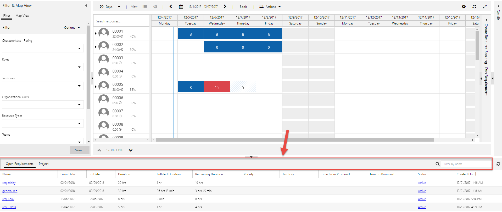
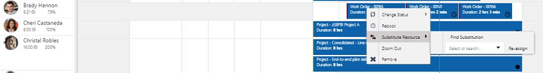
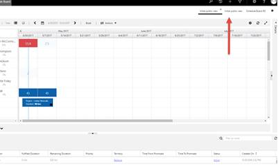
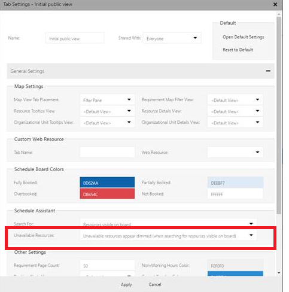

# What's new in Universal Resource Scheduling (URS)

Applies to Project Service Automation application (version 2.2.0.74)

The team is excited to announce the newest updates released in December 2017. Ranging from improvements to screen layout, all the way to more powerful search queries for resource scheduling, and more. You asked; we listened.

Here's a quick overview of what's included:

- Increased threshold allows for search of more resources at once
- More screen real estate and better screen layout
- Ability to drag-and-drop across resource summary cells to book
- Schedule board detail panel now available with the pop-out schedule board
- Improved zoom on the schedule board
- New sort option by total available time
- Ability to include schedule board date ranges in custom queries

[For a detailed list of bug fixes, check out our release notes blog post](https://blogs.msdn.microsoft.com/crm/2017/12/05/release-notes-for-field-service-and-project-service-automation-update-release-2/).  

## December 2017 update
Let's dig into the details about how these new capabilities can help your organization.

### Increased threshold allows for search of more resources at once

While searching for available resources for a work order, users may have run into an error message explaining: &quot;Schedule availability found for more than 100 resources, please try to add more filter criteria to narrow the results down.&quot;

In previous versions, if you searched more than 100 resources, the search returned an error and did not filter out resources at all, since the search didn't execute if it included more than 100 resources.

Now, the threshold limit is increased to 1000 resources, and that limit is configurable to help you balance the need to search across a higher number of resources with the processing time needed to perform more complex calculations.

Plus, even if the search criteria cause the number of matching resources to exceed the threshold, the search still completes based on those top _n_ matches, where _n_ equals the threshold setting. No more error message.

[For more details on how the search works behind the scenes, check out this blog post](https://go.microsoft.com/fwlink/p/?linkid=865113).

#### How to configure the threshold limit

By default, the system enforces the 100-resource limit for search unless you change the setting. But even though you can raise the limit to 1000, keep in mind that doing the search on a large number of resources could take time to calculate.

Because search needs could vary depending on the type of record, the threshold setting is available for each entity that can be scheduled, instead of a globally.

For example, let's say at a Field Service organization, work orders are typically searched within a 3-day range. Because the range is small, searching for availability across 1000 resources will be fairly quick.

However, let's say instead that you're scheduling a project requirement for a Project Service consultancy, and the typical search range is 6 months. Searching 1000 resources across a 6-month range may not be quite as snappy. In that case, you could set the threshold for project requirements to 200 resources. The same applies to any other entity used for scheduling, such as cases, leads, opportunities, and more.

To set the threshold by entity, navigate to **Resource Scheduling** &gt; **Administration** &gt; **Schedulable Entities,** double-click the entity name, and then set the value in **Max Resources** field. Note that if you leave the value field blank, the system assumes it to be the default 100-resource limit.

### More screen real estate

Resource managers and dispatchers need to view as many resources as possible at once, and every pixel of screen real estate makes a difference. As a result, we made two changes to screen design.

#### Removed extra row of padding on the booking requirements grid

When users expand the booking requirements grid, the screen used to include an extra row of padding to display a label for the grid. That extra row has now been removed so there's room to show more resources.

**Before:**

**After:**

#### Removed the &quot;Other&quot; row when no bookings to display

Previously, on the daily, weekly, and monthly schedule boards, the system displayed an &quot;Other&quot; row when users expanded a resource for any bookings not linked to a schedulable entity type.

Now, the system only shows the rows if there are bookings to display. If there aren't any bookings for a resource, the system doesn't show the expand icon.

Plus, if there are bookings only for work orders, then only the work order row is displayed.

### Drag-and-drop across resource summary cells to book

On the schedule board, whether users are searching for availability or just creating ad-hoc bookings, they can now drag their mouse across a resource's summary cells to select those cells and display the booking panel. This drag-and-drop action works for the Schedule Assistant as well as on the standard schedule board.

### Schedule board detail panel is now available with the pop-out schedule board

When a user accesses the Schedule Assistant from the schedule board, the pane containing alerts, details, and a custom tab becomes available. Now, when a user clicks **Book** on a requirement or a schedulable entity, and the pop-up schedule board is displayed, the pane is now also available.

### Improved zoom on the schedule board

In a previous release, we launched a productivity feature that allows schedule board users to [zoom seamlessly](https://blogs.msdn.microsoft.com/crm/2017/10/16/july-2017-update-for-field-service-and-project-service-automation-universal-resource-scheduling-part-2/#general) between schedule board views, while still keeping track of their context on the board.

Now, the click count is reduced even further. If a user has a resource expanded and zooms between the daily, weekly, and monthly schedule board views, the resource remains expanded. The hourly view doesn't have expanded resources, so this feature does not apply.

### New sort option by total available time

Previously, the system included two out-of-the-box options for sorting results when searching for available resources, plus any additional custom sort options. Now the system includes a third option to sort resources by total availability.

For example, let's say a user wants to find the resources that are most underutilized or most overutilized. The user can select the total availability sort option, and then select choose ascending or descending order.

Note that certain resources are considered eligible for work. So, assuming a resource is eligible, and is returned as a possible candidate presented on the schedule board, the sort option shows the resource with the most or least total hours available within the date range.

[For more details about this new sort option, visit our blog post on the topic](https://go.microsoft.com/fwlink/p/?linkid=865112).

### Include schedule board date ranges in custom queries

In a previous release, we introduced scheduling extensibility, opening up countless scenarios for field service organizations. Since then, we’ve heard from our partners and customers about some additional use cases that require being able to include a date range in custom queries on the schedule board. Now, you can do that.

For example, let’s say you want to display a count of total bookings scheduled during date range the user is currently viewing. Now, a custom query can include the date range displayed on the schedule board to return matching bookings within that date range. 

[For more details about using date ranges in custom queries, visit our blog post on the topic](https://go.microsoft.com/fwlink/p/?linkid=865114).

<!----OLD CONTENT 
---->
  
## October 2017 update   
 
The following capabilities were included with the October 2017 update to Field Service, Project Service Automation, and the Universal Resource Scheduling solution.
 
 **Field Service**
 
 - **Field Resource Hub app for field techs**: With this app, field technicians can do basic tasks on their phone or tablet, such as view upcoming appointments, view and edit bookings, and mark service tasks complete. For more information, check out the [Field Resource Hub User's Guide](./field-service-mobile-app-user-guide.md)

- **Easily find and assign another resource for a booking on the schedule board.** If the original resource is unavailable, right-click the booking and choose **Substitute Resource** to find another resource. The system automatically checks the original resource requirement for the booking and finds a substitute resource that fits the requirement.

- Users can download the Field Resource Hub app from their usual app store. Note that the hub app is different from the full-featured Resco mobile app and doesn't require the organization to install the Woodford mobile solution.

    
 
**Project Service Automation**
 - **Project Resource hub**: The Project Resource Hub app lets resources use their phone or tablet to enter time and expenses for projects. For more information, check out the [Project Resource Hub User's Guide](/dynamics365/project-operations/psa/project-resource-hub-users-guide)
 
**Connected Field Service**
 - **Use your existing Azure resources to provision Connected Field Service.** Do this by importing devices that are registered in Azure IoT hub into Dynamics 365. You can also use existing resource groups to provision required Azure resources. The following Azure resources can be used with Connected Field Service: 
     - IoT hub
     - Storage account
     - Service bus
     - Azure SQL server
     - Azure SQL DB 

**Resource Scheduling Optimization**
 - **Show Resource Scheduling Optimization results in an easy-to-understand visual view.** Easily find available resources, look up the reason a scheduling request failed, quickly create a new Resource Scheduling Optimization request, and more.
 
**Universal Resource Scheduling**
 - Add custom attributes or entities to resources and resource requirements and use them in the schedule board to filter resources or resource requirements.   

   
## October 2017 patch   

These updates apply to Dynamics 365 (online), version 8.x.
 
 **Field Service:**  
  
- **Share the schedule board**: You can now share the schedule board with specific people, everyone, or yourself only.  
  
    - **Just me** – Only the owner of the schedule board settings record sees it.   
  
    - **Specific people** – Only users with read access to that schedule board settings record see this of they have higher security rights, or if the record is shared using Dynamics 365 share functionality.  
  
    - **Everyone** – If the user has access to use the schedule board, they will see these boards.  
  
    
  
- **Dim unavailable resources**: When searching for availability on the schedule board, resources that are unavailable in the search are either be dimmed or removed from the schedule board.  
  
     A user who only wants to see a specific set of resources can choose to dim unavailable resources instead of removing resources that are  not a match while a user  without this requirement can have unavailable resources completely removed from the board. This setting can be changed in the schedule board tab settings.  
  
    
  
  **Project Service Automation:**  
  
- Now you can credit or correct an invoice that was sent to a customer. Quantity of billable hours, bill rates, and other charges and can be corrected or entirely reversed.  
  
### See also  
 [Dynamics 365 Field Service - User's Guide](../field-service/user-guide.md)   
 [Dynamics 365 Project Service Automation - User's Guide](/dynamics365/project-operations/psa/admin-guide)

[!INCLUDE[footer-include](../includes/footer-banner.md)]
