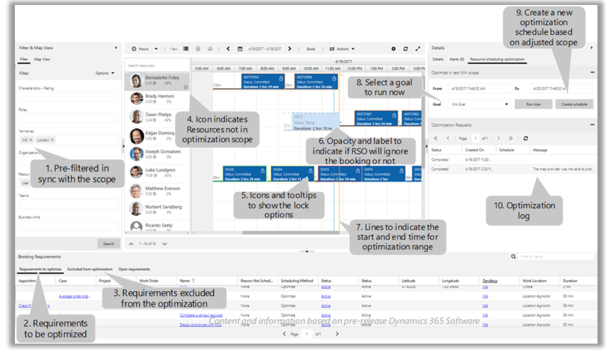

# What's new in [!INCLUDE[pn_dyn_365_field_service](../includes/pn-dyn-365-field-service.md)] and [!INCLUDE[pn_dyn_365_project_service_auto](../includes/pn-dyn-365-project-service-auto.md)]

[!INCLUDE[cc-applies-to-update-9-0-0](../includes/cc_applies_to_update_9_0_0.md)]

Welcome to [!INCLUDE[pn_dyn_365_field_service](../includes/pn-dyn-365-field-service.md)] and [!INCLUDE[pn_dyn_365_project_service_auto](../includes/pn-dyn-365-project-service-auto.md)]. Here's a list of features we've added recently. For a detailed list of improvements and bug fixes for the latest release, see our [blog](https://blogs.msdn.microsoft.com/crm/tag/universal-resource-scheduling/).  
  
## What's new in the July 2017 update  
 **Field Service**
 
 - **New Field Resource hub app for field techs**: Field techs can do basic tasks in the field like, view upcoming appointments, view and edit bookings, and complete service tasks using the new app. For more information, [Field Resource Hub User's Guide](../field-service/field-resource-hub-users-guide.md)

- Now you can easily find and assign another resource for a booking on the schedule board. If the original resource is unavailable, you can right-click the booking and choose the **Substitute Resource** option to find another resource for the booking. The system will automatically check the original resource requirement for the booking and find the best resources that fits the requirement.

    
 
**Project Service Automation**
 - **Project Resource hub**: The Project Resource hub lets you enter time and expenses for the projects you’re working on the go. For more information, [Project Resource Hub User's Guide](../project-service/project-resource-hub-users-guide.md)
 
**Connected Field Service**
 - Use your existing Azure resources you provision Connected Field Service. You can do this by importing devices that are registered in Azure IoT hub to Dynamics 365. You can also use existing resource group to provision required Azure resources. The following Azure resources, can be used with Connected Field Service. 
     - IoT Hub
     - Storage account
     - Service bus
     - Azure SQL Server
     - Azure SQL DB 

**Resource Scheduling Optimization**
 - You can now enable the schedule board to see Resource Scheduling Optimization results in an easy to understand visual view. Easily find resource availability, find why a Resource Scheduling Optimization scheduling request failed, quickly create a new Resource Scheduling Optimization request, and more.
 
     
 
**Universal Resource Scheduling Enhancements**
 - Allow users to add custom attributes or entities to resources and resource requirements and make use of them in schedule board to filter resources or resource requirements.   

   
## What's new in Update 2  
 **Field Service:**  
  
- **Share the schedule board**: You can now share the schedule board with specific people, everyone, or yourself only.  
  
    - **Just me** – Only the owner of schedule board settings record sees it. This must be a Dynamics 365 user.  
  
    - **Specific people** – Only users with read access to that schedule board settings record see this. This can be based on having higher security rights, or if the record is shared using Dynamics 365 Share functionality.  
  
    - **Everyone** – If the user has access to use the schedule board, they will see these boards.  
  
   
  
- **Dim unavailable resources**: When searching for availability on the schedule board, resources that are unavailable in the search can either be dimmed, or removed from the schedule board.  
  
     A user who only wants to see a specific set of resources can choose to dim unavailable resources instead of removing resources that are  not a match while a user  without this requirement can have unavailable resources completely removed from the board. This setting can be changed in the schedule board tab settings.  
  
   
  
 **Project Service Automation:**  
  
-   Now you can credit or correct an invoice that was sent to a customer. Quantity of billable hours, bill rates, and other charges and can be corrected or entirely reversed.  
  
### See also  
 [Dynamics 365 for Field Service - User's Guide](../field-service/user-guide.md)   
 [Dynamics 365 for Project Service Automation - User's Guide](../project-service/admin-guide.md)
