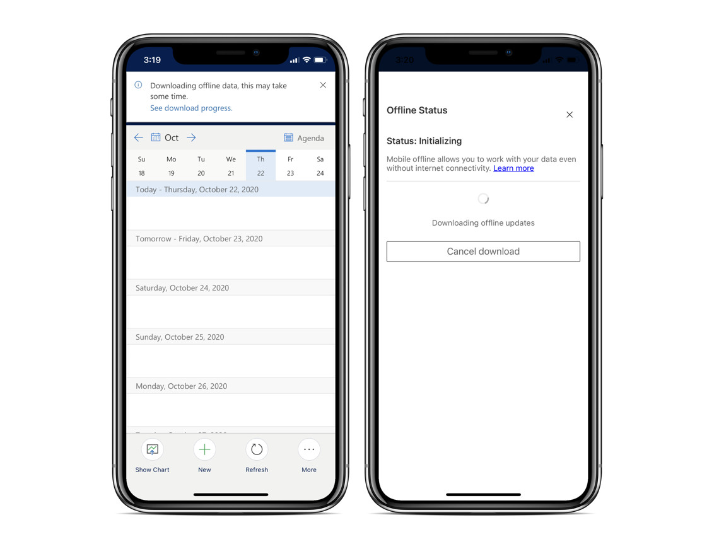
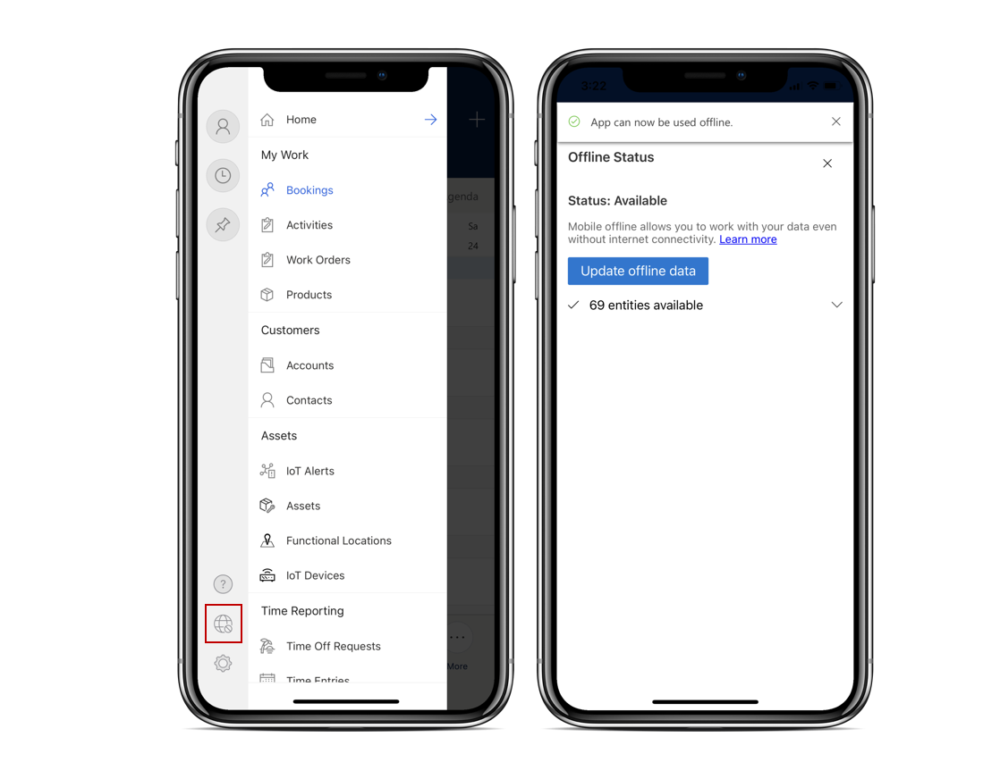

# Work offline and update offline data

To work in areas without internet access, the app downloads important information to the mobile device for a seamless experience. When the device connects to the internet, data automatically syncs with the server.

An administrator has to configure the offline profile for the app before technicians can download the data. For more information, see [Configure offline capabilities in the Field Service (Dynamics 365) mobile app](mobile-power-app-system-offline.md)

## [Unified Interface app](#tab/vCurrent)

Downloading the offline data can take some time. aYou can check the download progress and status from the header of the app.

> [!div class="mx-imgBorder"]
> 

Your administrator defines which data is available offline and how often the app looks for changes on the server. To manually update the data on the device, open the app navigation and select the globe icon. In the **Offline Status** page, select **Update offline data**.

> [!div class="mx-imgBorder"]
> 

To sync specific views, for example, to check for new bookings or work order updates, open the view and select **Refresh** in the footer.

> [!div class="mx-imgBorder"]
> 

## [Native UX (preview)](#tab/vNext)

<!--- Content here  -->

---

[!INCLUDE[footer-include](../includes/footer-banner.md)]
