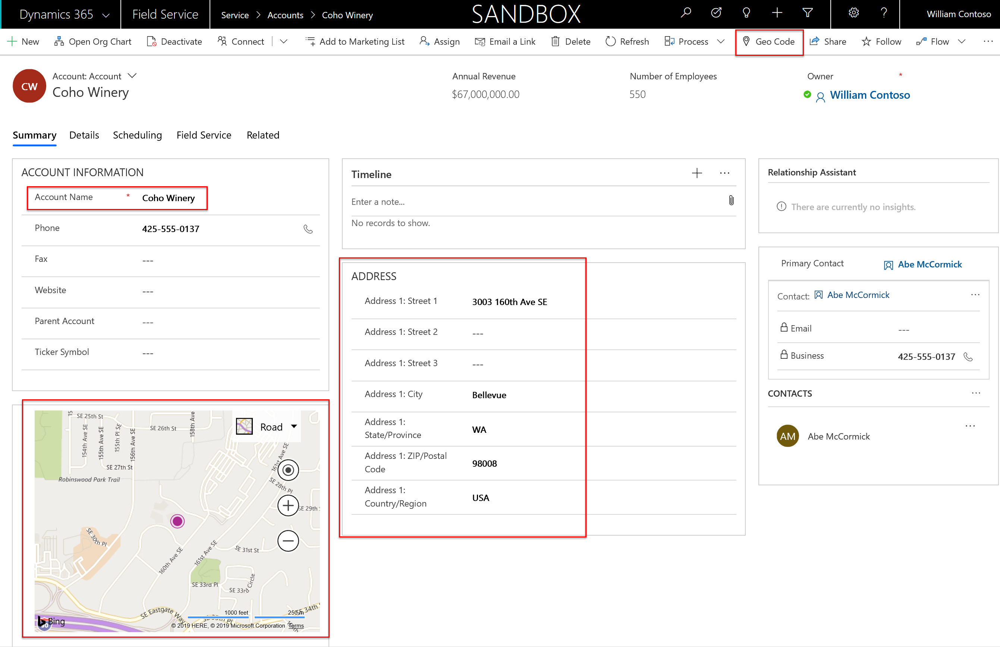
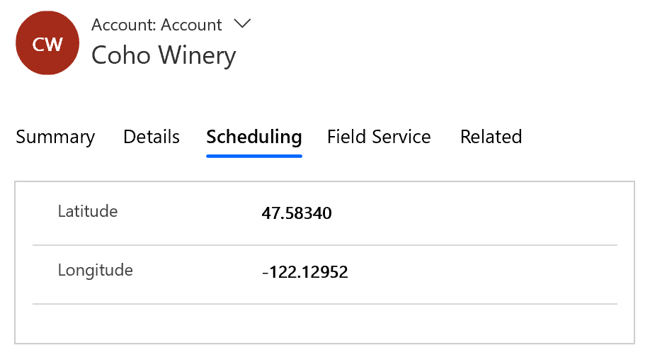
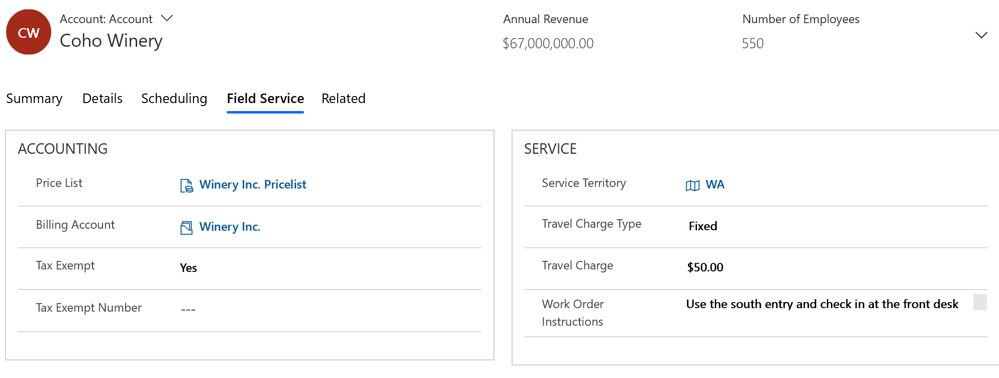
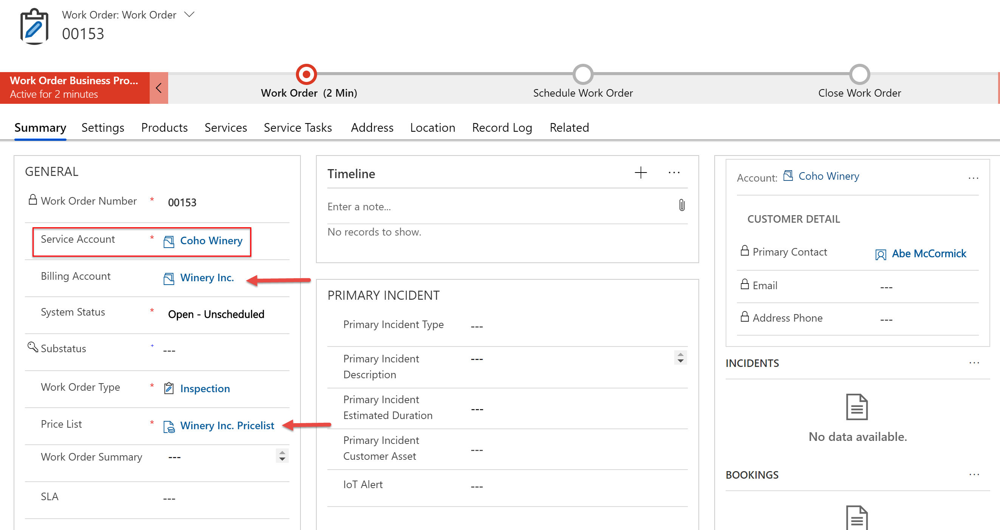
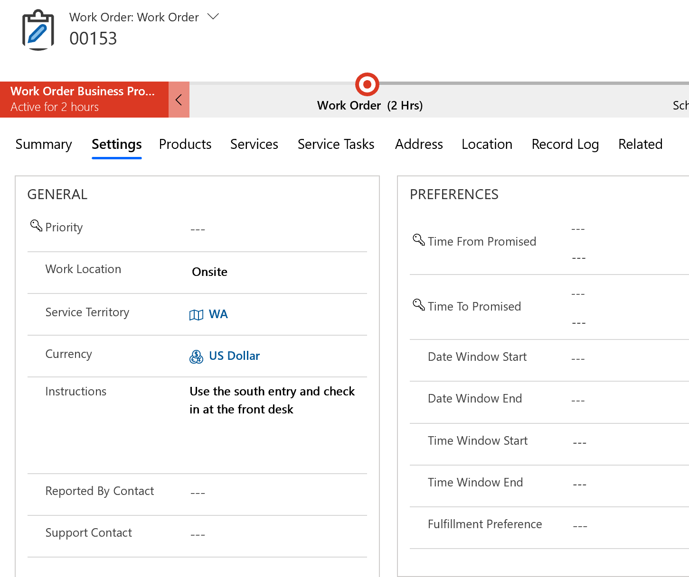
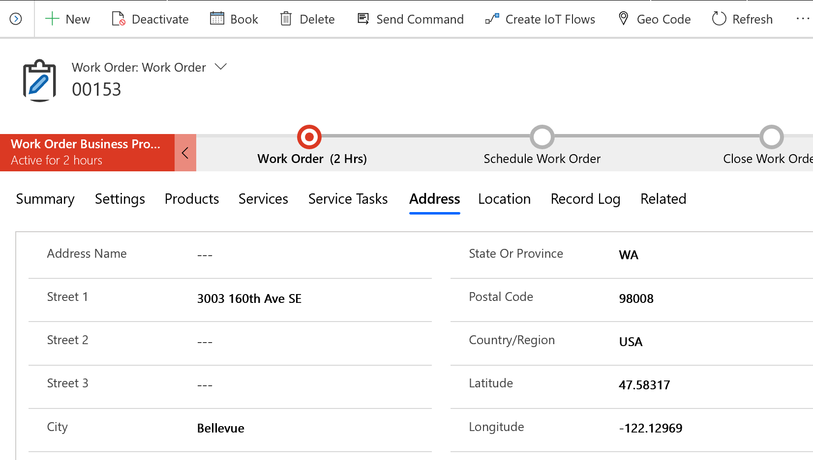
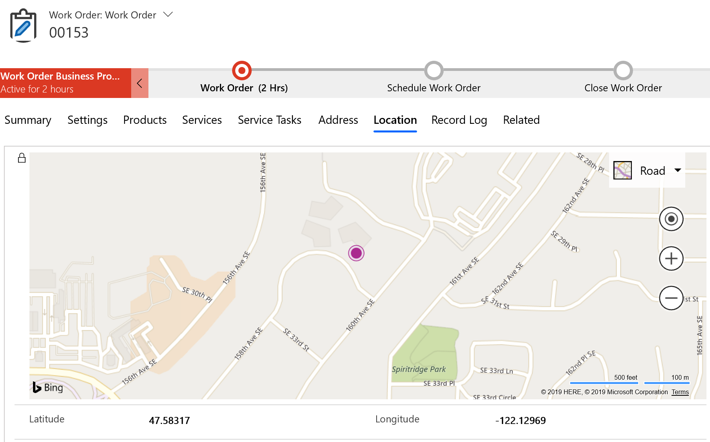
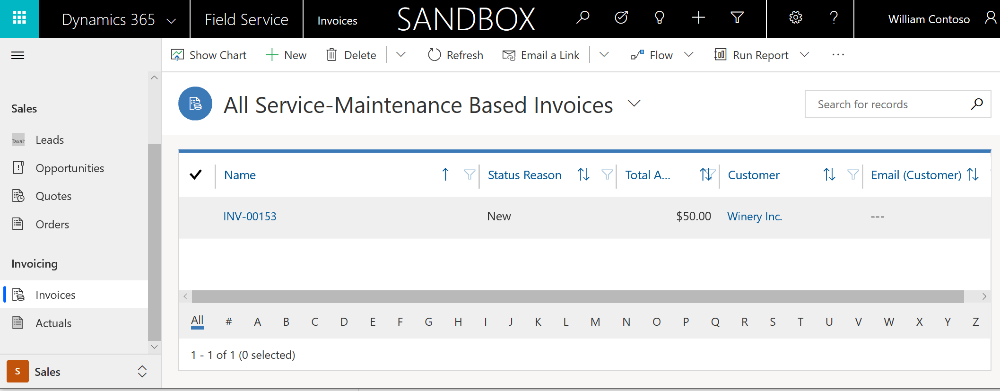
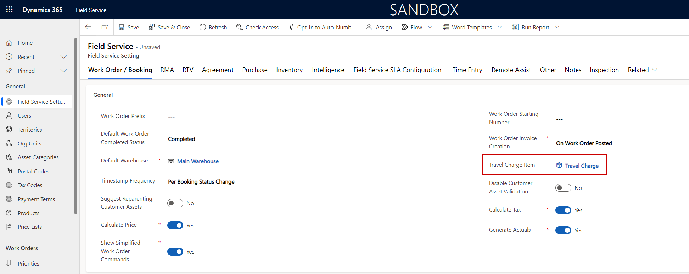
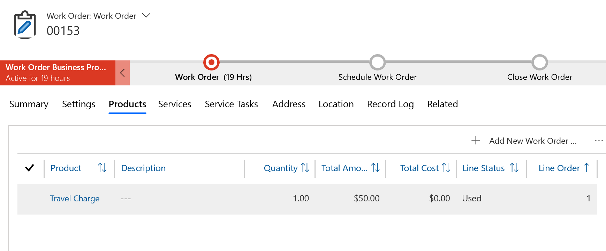

# Add a customer, location, and related account details to a work order

Locations are important in field service scenarios where field technicians may need to travel to multiple customer locations each day.

Dynamics 365 Field Service uses accounts and contacts throughout the work order process. Accounts represent who is receiving the site service (driven by work orders), and which customer account should be billed for invoices generated from the work order.

**Service accounts** represent **who** is the receiving account of the on-site service (work order), and **where** the field technician will be dispatched.

**Billing accounts** represent which account should receive invoices, and identifies the parent account in cases where many service accounts belong to a central organization (for example: multiple wine vineyards are owned by a wine corporation). 

Selecting accounts will also autopopulate other fields on a work order.

This proves useful in several scenarios, including: 

- passing account (customer) price lists to all related work orders.
- passing the account territory to all related work orders, which ensures that resources devoted to the territory are scheduled to perform the on-site work.
 
In this article, we'll explore creating and using accounts on work orders. 

## Prerequisites

- Any version of Dynamics 365 Field Service
- Connect to Bing maps and enable map visualizations. For more information, [check out this article.](https://docs.microsoft.com/dynamics365/customer-engagement/field-service/perform-initial-configurations-setup#step-1-resource-scheduling) 
- Enable and test geocoding. For more information, [check out this article.](https://docs.microsoft.com/dynamics365/customer-engagement/field-service/perform-initial-configurations-setup#step-2-field-service-settings)
 

## Create a service account

First, let's create a service account that represents a specific customer location where work orders will be performed. Whether it's a service account or a billing account, both are simply account records. The most important difference is that service accounts have addresses and are geocoded.

Go to **Field Service > Accounts > +New**.

Enter an **Account name** and an **address** along with any other important details based on your business needs.

Next, select **Geo Code** at the top of the form. If you have set **Auto Geo Code** to **Yes** in Field Service Settings (as noted in the prerequisites), then you can skip this step. 

> [!div class="mx-imgBorder"]
> 

Confirm geocoding is successful by the location visualized on the map and values populated in the latitude and longitude fields in the scheduling section. 

> [!div class="mx-imgBorder"]
> 

Next, go to the **Field Service** section of the account form and fill in details based on your business needs. Values entered here are passed down to work orders where this account is listed as the service account, but the values can be edited on each work order if needed.

Let's take a look at what you can expect from each of these fields.

### Billing Account 

The value chosen here will populate the billing account field on the work order when this account is entered as the service account. This field is not required, and if no account is selected, the service account listed on the work order will act as both the service account and the billing account. In the screenshot at the end of this section, Winery Inc. is the billing account for the service account, Coho Winery. This implies Coho Winery is a specific location of Winery Inc. and invoices should be sent to Winery Inc.

### Price List 
This value is listed on related work orders and all related work order products and services. It dictates the price of those products and services on the resulting invoices. If the billing account field in the previous step has a value, then the price list on the billing account record will be used. If no billing account is entered, then the price list entered here will be used on resulting work orders and invoices. If the work order products or services are not listed on the price list, then the list price on the product record is used. 

### Tax Exempt

This decides if sales tax should be added to the price of related work orders. Set to **Yes** to *not* add sales tax. Set to **No** to specify a sales tax code (percentage) that should be added to the work order price and invoice.

### Service Territory

In this field, you choose the geographical region in which this account is located. This value will be passed down to the related work orders and work order requirements, and is considered in the scheduling process on the schedule board, in the schedule assistant, and with Resource Scheduling Optimization (RSO).

### Travel Charge Type

This decides if and how travel by a field technician to this service account should be priced and billed on work orders. For more information, see configuration considerations in this article.

### Work Order Instructions

This value serves as a text note and populates the **Instructions** field on all related work orders. This is a good way to ensure field technicians follow processes specific to this account. See an example in the following screenshot.

> [!div class="mx-imgBorder"]
> 

> [!Note]
> Updating these values will not update previous work orders, only future work orders.

## Create a work order for the service account

Next, go to **Field Service > Work Orders > +New**.

Add the account you created as the service account. 

Notice the following values are automatically populated:

- **Billing Account**: populated as the billing account specified on the service account record.

- **Price List**: populated as the price list specified on the **billing account** record.

> [!Note]
> If the work order price list does not reflect the price list entered on your service account or billing account, this means it is being overridden by the price list related to work order types or entitlements.

- **Primary Contact**: the primary contact of the service account shown on the work order.

> [!div class="mx-imgBorder"]
> 

- **Service Territory and Instructions**: represented in the following screenshot.

> [!div class="mx-imgBorder"]
> 

- **Address**: represented in the following screenshot.

> [!div class="mx-imgBorder"]
> 

- **Location**: this work order location is passed down to the work order requirement and is reflected on the schedule board map. 

> [!div class="mx-imgBorder"]
> 

**Bonus tip:** You can select and drag the map pin to edit the work order location (latitude and longitude) as needed. This is helpful for scenarios where the address points to an arbitrary location--at a university campus, for example--but the work order must take place at a specific building or location on-site.

> [!Note]
> Work orders can be assigned addresses and geocoded independently of the service account, if needed.

## Invoice the billing account

When the work order is finished and the system status is changed to **Closed-Posted**, an invoice with all used work order products and services is generated for the account listed in the **billing account** on the work order.

Go to **Field Service > Sales > Invoices** to view the newly generated invoice for the closed work order. Notice the account on the invoice is the billing account on the work order, and the name references the work order number. See the following screenshot for reference.

> [!div class="mx-imgBorder"]
> 

## Configuration considerations

### Travel charges, demystified

If the work order's service account (*not* billing account) has a travel charge type set, then a work order product for a travel charge will be added when the **Work Order System Status** becomes **Open-Completed** after being booked. 

First, go to **Field Service > Settings > Field Service Settings** and specify a product in the **Travel Charge Item** field. 

> [!div class="mx-imgBorder"]
> 

This is the product that will later show as a work order product.

> [!div class="mx-imgBorder"]
> 

> [!Note]
> The travel charge work order product is subject to the same pricing rules as all work order products and services. The unit amount pricing of travel charge work order products is dictated first by the **price list**; if the travel charge product is not part of the price list as a price list item, then the **list price** on the travel charge product will be used. If no list price is entered, the unit amount price will be the value entered in the service account **travel charge**.

Though the unit amount price of the travel charge is dictated by the price list, list price, and travel charge, the *quantity* is dictated by the **Travel Charge Type** on the service account. Here's what the quantity options mean: 

- **Hourly:** Quantity will be the **Actual Travel Duration** of the booking per 60 minutes. For example, if the unit amount price of the **Travel Charge** is set to $60 and actual travel duration is 30 minutes, the travel charge work order product will be priced as $30.
- **Mileage:** Quantity is the **Miles Traveled** of the booking. For example, if the unit amount price of the **Travel Charge** is set to $1 and miles traveled is 20 miles, the travel charge work order product will be priced as $20.
- **Fixed:** Quantity is **1**. For example, if the unit amount price of the **Travel Charge** is set to $50, the travel charge work order product will be priced as $50, regardless of miles or time spent traveling. 
- **None:** No travel charge will be added to the work order.

> [!Note]
> In cases of multiple bookings for a single work order, multiple travel charges will be added as work order products.

[!INCLUDE[footer-include](../includes/footer-banner.md)]