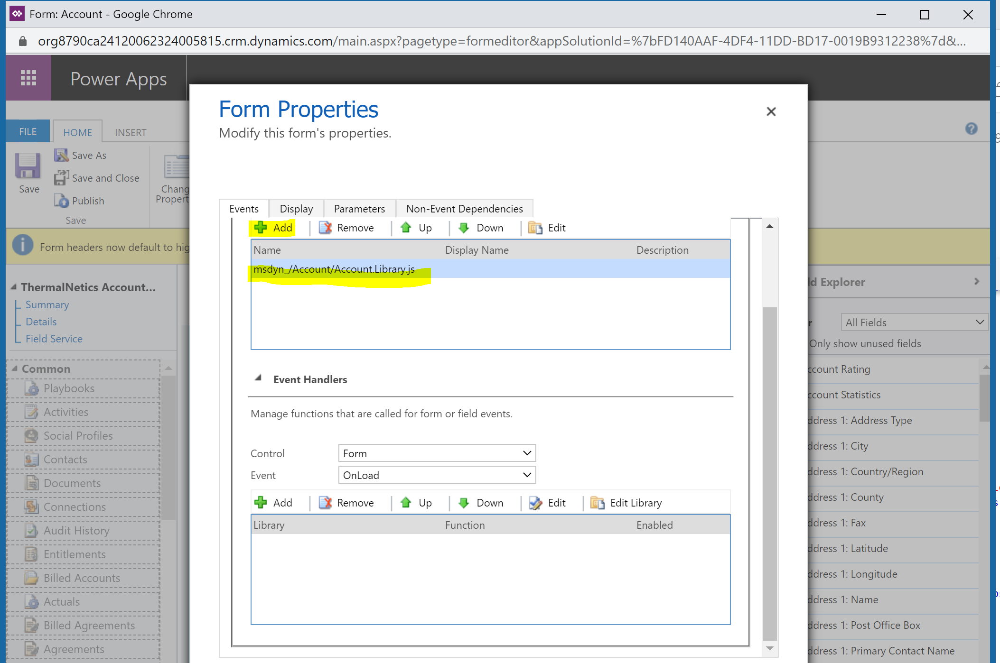
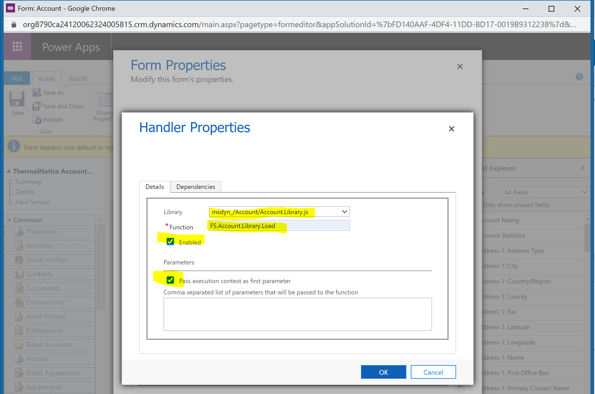

# Work orders and service accounts

Dynamics 365 Field Service uses accounts and contacts throughout the work order process.

In this article, we'll explore creating and using accounts on work orders.

## Use a service account on a work order

1. Go to **Field Service** > **Work Orders**.
1. Select **+New**.
1. Choose an [existing service account or create a new one](accounts.md).

   Some values are automatically populated:

   - **Billing Account**

   - **Price List**

   - **Primary Contact**

   - **Service Territory and Instructions**

   - **Address**

   - **Location**

     > [!TIP]
     > Move the map pin to edit the work order location. For example, if the address points to an arbitrary location but the work order must take place at a specificlocation.

## Invoice the billing account

When the work order is finished and the system status is changed to **Closed-Posted**, an invoice with all used work order products and services is generated for the account listed in the **billing account** on the work order.

Go to **Field Service > Sales > Invoices** to view the newly generated invoice for the closed work order. Notice the account on the invoice is the billing account on the work order, and the name references the work order number. See the following screenshot for reference.

> [!div class="mx-imgBorder"]
> 

## Customization notes

### Known issues

#### Latitude and longitude values don't update as expected

Sometimes, an issue occurs where latitude and longitude values aren't updated, or address suggestions don't show up on account or contact form.

One reason this issue occurs is because Field Service libraries are missing from the form. To add the relevant Field Service libraries and event handlers to the form, follow these steps.

1. Select **Account** form from **Customization** and open the **Form Properties**.

2. Add the form library `msdyn_/Account/Account.Library.js`.



1. In the **Event Handlers** section, select **Add**, and specify the function as seen in the following screenshot.



4. Save and publish the customization.

#### Bing Maps can't be added to the work order form

If the Bing Maps control is manually removed from the out-of-the-box work order form, it can't be added back.

To enable Bing Maps button in form designer, at least one of the attributes of type address should have the mask *ValidForMap* added in the form. 

Below is the XML for the account form where we see *ValidForMap* added to its address attribute.

```
<DisplayMask>ValidForAdvancedFind\|ValidForForm\|ValidForGrid\|ValidForMap</DisplayMask>
```

1. Create a solution on customer's sandbox environment that includes the form to which the Bing Maps control needs to be added. Export it as managed solution.

2. In the solution's `customizations.xml` file, go the `formxml` part of it.

3. Add the following maps control to the `<controlDescriptions>`.

```
        <controlDescription forControl="{8b67ae03-1701-54d2-09be-35295876ca8a}">

        <customControl id="{4273EDBD-AC1D-40d3-9FB2-095C621B552D}">

        <parameters>

        <datafieldname>msdyn\_mapcontrol</datafieldname>

        </parameters>

        </customControl>

        <customControl formFactor="0" name="MscrmControls.Map.MapControl">

        <parameters>

        <value>msdyn\_mapcontrol</value>

        <mapSourceSwitch isGroup="true" static="true">CoordinatesGroup</mapSourceSwitch>

        <latitude>msdyn\_latitude</latitude>

        <longitude>msdyn\_longitude</longitude>

        <addressEditableSwitch isGroup="true" static="true">isAddressEditableYesGroup</addressEditableSwitch>

        <outputLatitude>msdyn\_latitude</outputLatitude>

        <outputLongitude>msdyn\_longitude</outputLongitude>

        </parameters>

        </customControl>

        <customControl formFactor="1" name="MscrmControls.Map.MapControl">

        <parameters>

        <value>msdyn\_mapcontrol</value>

        <mapSourceSwitch isGroup="true" static="true">CoordinatesGroup</mapSourceSwitch>

        <latitude>msdyn\_latitude</latitude>

        <longitude>msdyn\_longitude</longitude>

        <addressEditableSwitch isGroup="true" static="true">isAddressEditableYesGroup</addressEditableSwitch>

        <outputLatitude>msdyn\_latitude</outputLatitude>

        <outputLongitude>msdyn\_longitude</outputLongitude>

        </parameters>

        </customControl>

        <customControl formFactor="2" name="MscrmControls.Map.MapControl">

        <parameters>

        <value>msdyn\_mapcontrol</value>

        <mapSourceSwitch isGroup="true" static="true">CoordinatesGroup</mapSourceSwitch>

        <latitude>msdyn\_latitude</latitude>

        <longitude>msdyn\_longitude</longitude>

        <addressEditableSwitch isGroup="true" static="true">isAddressEditableYesGroup</addressEditableSwitch>

        <outputLatitude>msdyn\_latitude</outputLatitude>

        <outputLongitude>msdyn\_longitude</outputLongitude>

        </parameters>

        </customControl>

        </controlDescription>

```

4. Search for "Bing Maps" in the same file.

5. Add the control with the following code to the row and cell wherever it needs to be added.

```  
    <control disabled="false" id="msdyn\_mapcontrol" classid="{F9A8A302-114E-466A-B582-6771B2AE0D92}" uniqueid="{8b67ae03-1701-54d2-09be-35295876ca8a}" datafieldname="msdyn\_mapcontrol"/>
```

6. Save the file and create a new managed solution zip file out of it.

7. Import the solution to the affected environment.

> [!Note]
> If the map control is still not visible on the form after following these steps, try removing the active form customizations.

[!INCLUDE[footer-include](../includes/footer-banner.md)]
