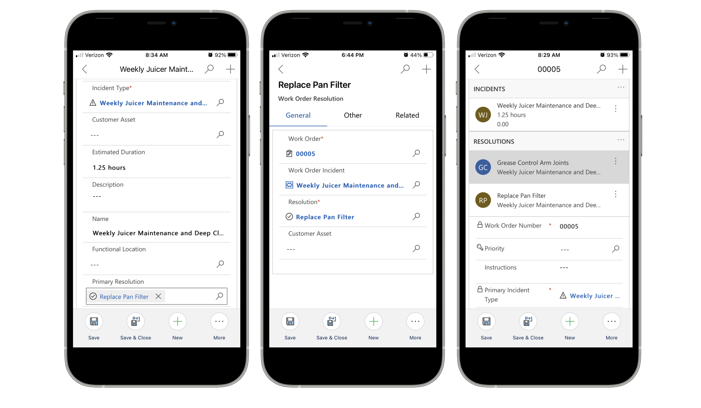

# Capture work order resolution details in Field Service

Organizations need to be able to report on how work orders are resolved. Reporting on how work is resolved increases customer visibility and provides data for the system to begin providing meaningful resolution suggestions. Tracking how work is resolved can also help with training technicians on specific issues.

In Dynamics 365 Field Service, you can: 

- Associate work order resolutions with work orders
- Relate resolutions to specific work order incident types to correlate issues with resolutions

For a guided walkthrough, check out the following video.

> [!VIDEO https://www.microsoft.com/videoplayer/embed/RWAMXK]

In this article, we'll walk through how to create resolutions, add them to work orders, and associate them to incident types.

## Create resolutions

In Field Service, go to **Settings** > **Resolutions**.

Create resolution records based on your business needs. For example, if "reinstall firmware" is a common way to resolve a work order issue, create a resolution record with "reinstall firmware" as the title. The description should be additional information on why or how to reinstall firmware.

> [!div class="mx-imgBorder"]
> 

>[!Note]
> At this time, a resolution only includes a name and a text description.

## Note resolutions on work orders

Once resolutions are defined, field technicians can update work orders with resolutions on their Field Service mobile app. Add a resolution to a work order by selecting a resolution from the lookup in the **Primary Resolution** field.

> [!div class="mx-imgBorder"]
> 

Dispatchers can also update the primary resolution on the work order from the web browser.

> [!div class="mx-imgBorder"]
> 

No matter who adds a resolution, doing so creates a new work order resolution record. 

A work order can have many resolutions. From the work order, go to the **Resolution** tab and add as many resolutions as needed. The primary resolution is added automatically.

> [!div class="mx-imgBorder"]
> 

## Associate resolutions to incident types (optional)

Organizations using incident types to organize and track common work order issues will find that incident types and resolutions can work together.

For each work order incident type, technicians and dispatchers can tag one or more work order resolutions and vice versa.

> [!div class="mx-imgBorder"]
> 

> [!Note]
> The primary resolution is associated to the primary work order incident type by default. 

When administrators set up incident types in **Settings** > **Incident types**, they can associate multiple resolutions to an incident type. When these incident types are added to work orders later on - thus creating work order incident types - the list of resolutions to tag to the work order incident type are filtered based on the resolutions that were previously associated to the incident types.

## Configuration considerations

- Work order resolutions are never automatically added to work orders.
- Using incident types is not required to use resolutions. You can tag resolutions to work orders that do not have incident types.

[!INCLUDE[footer-include](../includes/footer-banner.md)]
