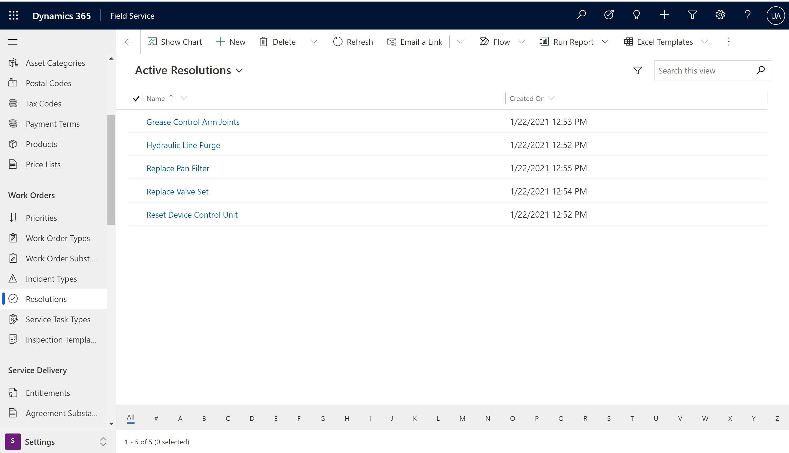
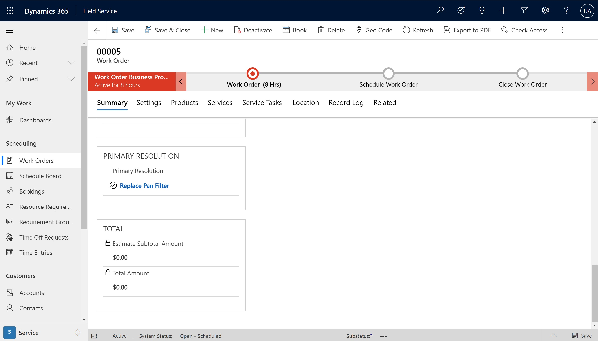
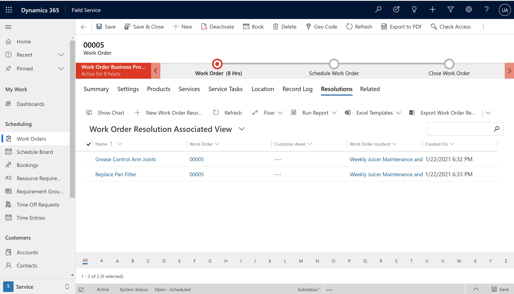
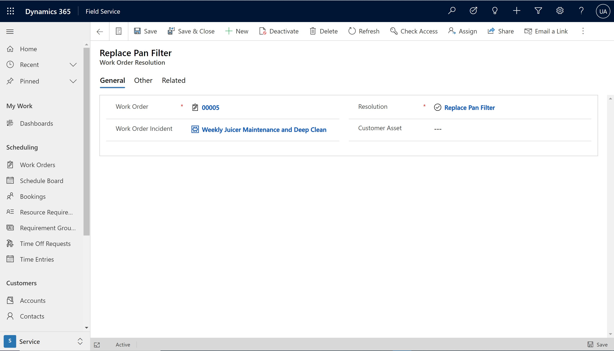

# Capture Work Order resolution details

// https://msit.microsoftstream.com/video/8930a1ff-0400-9887-cc7d-f1eb56bda718?channelId=0bf6f71a-b361-4d7b-9668-62ff5207b60d

record how work order was resolved

features details
- tag resolutions to work orders
- relate resolutions to specific work order incident types to correlate isses with resolutions
- more organized than note fields

business value
- improve first time fix rate
- manage resolutions better
- good for training

## Create resolutions

From the Field Service app go to Settings > Resolutions.

Create resolution records based on your business needs. As an example, if "reinstall firmware" is a common way to resolve a work order issue then create a resolution record with "reinstall firmware" as the title. The description should be additional information on why or how to reinstall firmware. 

> [!div class="mx-imgBorder"]
> 

At this time a resolution is simply a name and a text description. 

## Specify resolutions to work orders

Technicians in the field will then update the work order with the resolution by selecting a resolution from the lookup in the **Primary Resolution** field. Techncicians will do this on the mobile app. 

> [!div class="mx-imgBorder"]
> 

Dispatchers in the back office can also update the primary resolution on the work order from the web browser. 

> [!div class="mx-imgBorder"]
> 

Regardless of who adds a resolution, doing so creates a new Work Order Resolution record. 

A work order can have many resolutions. From the work order go to the resolution tabs and add as many resolutions as needed. The primary resolution is added automatically. 

> [!div class="mx-imgBorder"]
> 

## Associate resolutions to incident types (optional)

Organizations using Incident types to organize and track common work order issues will find that incident types and resolutions work well together.

For each work order incident type, technicians and dipsatchers can tag one or more Work Order resolutions and vice versa.

> [!div class="mx-imgBorder"]
> 

> [!Note]
> The Primary Resolution is associated to the Primary work order incident type by default. 

When administrators set up Incident Types in Settings > Incident types, they have the option to associate multiple resolutions to an incident type. When these incident types are added to work orders later on, thus creating Work Order Incident Types, the list of resolutions to tag to the work order incident type are filtered based on the resolutions that were previously associated to the incident types.

## Configuration considerations

- Work Order resolutions are never automatically added to work orders. 
-  Using incident types is not required to use resolutions. You can tag resolutions to work order that do not have incident types. 

