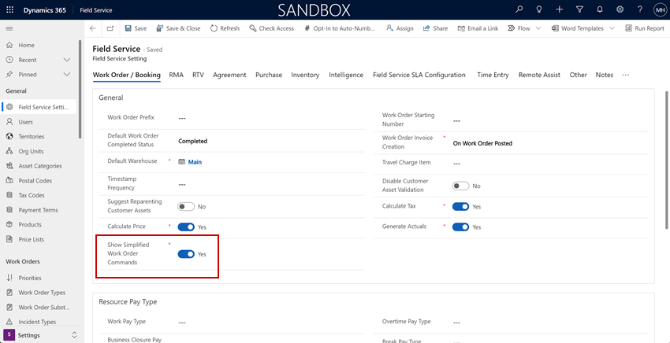
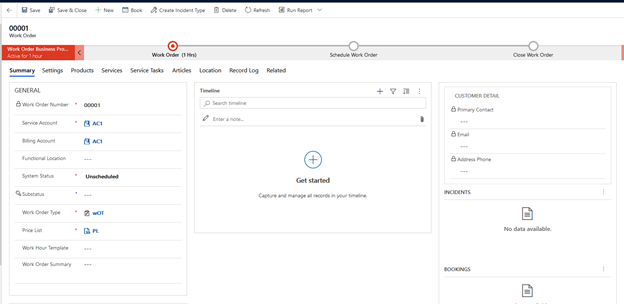
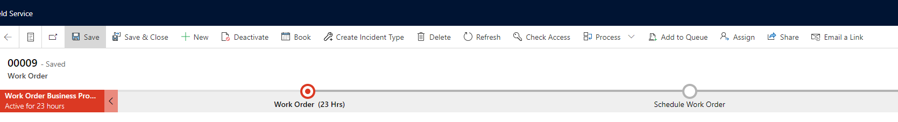
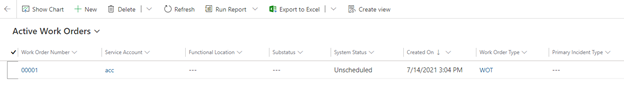
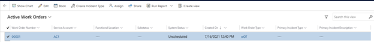

In Field Service Wave 2 2021 updates (8.8.47+) the work order ribbon is simplified upon upgrade because a new Field Service Setting called **Show Simplified Work Order Commands** is set to **Yes**. 

> [!div class="mx-imgBorder"]
> 

When Enabled

Form

> [!div class="mx-imgBorder"]
> 

Disable

> [!div class="mx-imgBorder"]
> 

Homepage

> [!div class="mx-imgBorder"]
> 

Homepage when record is selected

> [!div class="mx-imgBorder"]
> 

> [!Note]
> The **Show Chart** ribbon command is **not** impacted by the _Show Simplified Work Order Commands_ setting.