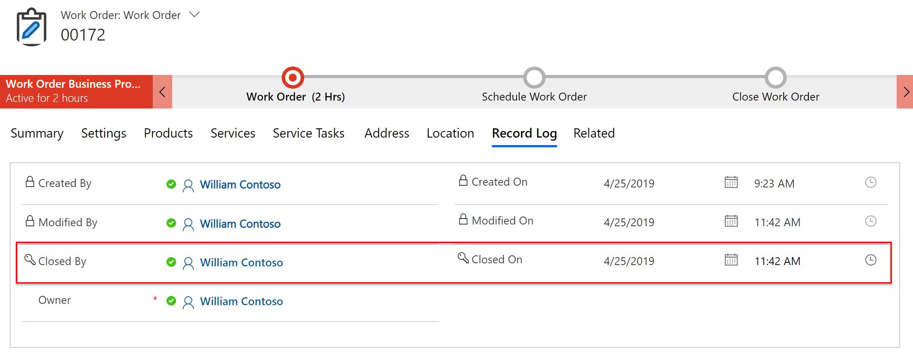

# Work Order life cycle and statuses

Work Order System Statuses, Work Order Substatuses, and Booking Statuses all work together to help stakeholders stay up to date with work orders during the life cycle from creation to close. Updating one of these statuses can update the others automatically.

**Work Order System Statuses** are noted on the Work Order entity, mark the current point of a work order in its life cycle, are part of the product by default and **should not** be edited, and are:

- Open - Unscheduled
- Open - Scheduled
- Open - In Progress
- Open - Completed
- Closed - Posted
- Closed - Canceled

**Work Order Substatuses** are noted on the Work Order entity, relate to and provide more detail to Work Order System Statuses, and are created custom for each organization.

**Booking Statuses** are noted on the Bookable Resource Booking entity, are updated by field technicians on the Field Service Mobile app to track their progress for a specific work order requirement, are visualized on the schedule board with a distinct color and icon, and a few booking statuses are part of the product by default and more custom ones can be added, but out of the box include:

- Scheduled
- Traveling
- In Progress
- On Break
- Completed
- Canceled

### Use cases

Lets explore work order and booking statuses with the following scenarios:

1. **Work Order life cycle**. A field service organization wants to understand how the out-of-the-box statuses are designed for the work order process without any customizations based on their specific business needs.

2. **Estimate work order**. A field service organization would like to utilize work orders for estimating potential products, services, and prices for their clients and want to mark such work orders with a custom "Estimate" work order substatus.

3. **Delayed schedules**. Field technicians want to make dispatchers aware if they are running more than 15 minutes behind schedule due to longer than expected work by changing the status of their bookings to "Delayed".

4. **Follow up work orders**. It is common for a field service organization to schedule a follow up inspection after an initial installation or repair work order. If a follow up is required, field technicians should note this with a custom "Follow Up Required" work order substatus to ensure back office workers create a follow up before closing the work order.

## Prerequisites

- Any version of Field Service
- You must be logged in as a user with **Field Service - Dispatcher**, **Field Service - Administrator**, or **System Administrator** security roles to edit Work Order Substatuses and Booking Statuses

> [!Note]
> Work Order System Statuses should NEVER be edited because system jobs and plug-ins rely on these statuses. Instead, administrators should create custom Work Order Substatuses that relate to Work Order System Statuses.

> [!div class="mx-imgBorder"]
> 

## Statuses and the Work Order life cycle

A field service organization wants to understand how the out-of-the-box statuses are designed for the work order process without any customizations based on their specific business needs.

Field Service ships with standard Work Order System Statuses and Booking Statuses that should be considered during all field service implementations because many processes are triggered based on those statuses that make the field service app more valuable for an organization by **(1)** automatically calculating and populating data and **(2)** automating the next step in the work order process. As one example, when the **booking status** is changed to **in progress** to indicate the field technician has arrived on site, the Actual Arrival Time field is populated accordingly on the bookable resource booking. As another example, when the **work order system status** is changed to **Open-Completed**, applicable Work Order Products are converted to Customer Assets to begin building service history.

Let's walk through the standard work order and booking statuses at each stage of the work order life cycle.

When a work order is created, it has a status of **Open-Unscheduled** by default.

> [!div class="mx-imgBorder"]
> 

Once the work order is scheduled, the booking created for it has a booking status of **Scheduled** by default.

> [!div class="mx-imgBorder"]
> 

The creation of a booking automatically changes the work order system status to **Open-Scheduled**.

> [!div class="mx-imgBorder"]
> 

After the work order is scheduled to a field technician resource, it is viewable on the Field Service Mobile app and the next step is for the field technician to note that he or she is traveling to the work order location by changing the booking status to **Traveling**. 

> [!div class="mx-imgBorder"]
> 

> [!div class="mx-imgBorder"]
> 

Each booking status has a color and icon and is displayed on the schedule board.

> [!div class="mx-imgBorder"]
> 

> [!div class="mx-imgBorder"]
> 

Changing the booking status to Traveling automatically changes the work order system status to **Open - In Progress**.
> [!div class="mx-imgBorder"]
> 

> [!Note]
> If there are multiple bookings for a single work order, if at least one booking is traveling or in progress, the related work order will have a status of Open - In Progress.

When the field technician arrives on site and is ready to begin the work order, he or she changes the booking status to **In Progress**.

> [!div class="mx-imgBorder"]
> 

During work, the field technician may want to record times he or she is on break by changing the booking status to **On Break**.

> [!div class="mx-imgBorder"]
> 

> [!div class="mx-imgBorder"]
> 

For both **In Progress** and **On Break** booking statuses, the work order system status remains in **Open - In Progress**.

When the work is complete, the field technician will change the booking status to **Completed**. 

> [!div class="mx-imgBorder"]
> 

> [!div class="mx-imgBorder"]
> 

In the image above, the color and icon reflect a completed status, the duration is updated to the actual duration of the booking, and the end time is updated to reflect the time the status was changed to completed.

This will change the related Work Order System Status to **Open-Completed**.

> [!div class="mx-imgBorder"]
> 

> [!Note]
> If there are multiple bookings for a single work order, once all related booking have statuses of Completed including if some are Canceled, the related work order will have a status of **Open - Completed**. 

Finally, a back office worker will review the completed work order ensure data was entered correctly, communicate with the customer, review survey results and more depending on the organization's specific business needs. The last step is to change the Work Order System Status to **Closed-Posted**. 

> [!div class="mx-imgBorder"]
> 

Changing the work order system status to Closed-Posted is only performed by office workers in the web interface. In fact, the out of the box resource security roles prohibit field technicians from editing the Work Order System Status field on the Field Service Mobile app.

> [!div class="mx-imgBorder"]
> 

Here is a table of the out of the box relationship between work order system statuses and booking statuses.

| Work Order System Status | Booking Status | Details |
| --- | --- | --- |
| Open-Unscheduled | -- | Not applicable as booking does not exist yet |
| Open-Scheduled | Scheduled | |
| Open-In Progress | Traveling | |
| Open-In Progress | In Progress | |
| Open-In Progress | On Break | |
| Open-Completed | Completed | |
| Closed-Posted | Scheduled | |
| Closed-Canceled | Canceled | If the work order system status is changed to Closed-Canceled all bookings with a status of Scheduled will change to Canceled, you cannot cancel a work order if in progress bookings exist, completed bookings will remain as completed |
| Open-Unscheduled | Canceled | If the booking status is canceled, and is the only booking, the work order system status will revert to Open-Unscheduled. If one of multiple bookings is canceled, the work order system status will revert to  |

## Status related processes

Beyond work order system statuses updating booking statuses and vice versa, many processes and data updates are also triggered. Here are the most common.

### Work order system status processes

#### Open – Completed
- Used work order products are converted to new customer assets if applicable. This is accomplished by setting the **Convert to Customer Asset** field on the published product record to **Yes**.

> [!div class="mx-imgBorder"]
> 

> [!div class="mx-imgBorder"]
> 

- Travel charge item is added to work order products if applicable. See [this topic](https://docs.microsoft.com/en-us/dynamics365/customer-engagement/field-service/work-order-customer-account#configuration-considerations) for more details.

#### Closed – Posted
- Invoice is generated for used work order products and services billing account 
- Actuals records are created for time and materials costs related to work orders and bookings. 
- Closed By field updated.
- Closed On field updated.

> [!div class="mx-imgBorder"]
> 

> [!div class="mx-imgBorder"]
> 

### Booking status processes
		
#### Scheduled
- Miles Traveled updated, calculated as the driving distance from the previous location to the booking location (typically the work order location).
- Booking Timestamp created. Booking Timestamps track the date and time of all booking status changes.

> [!div class="mx-imgBorder"]
> 

> [!div class="mx-imgBorder"]
> 

#### Traveling
- Booking Timestamp created.

#### In Progress
- Actual arrival time field updated with the date and time the booking status was changed.
- Actual travel duration field updated, calculated as the total time the booking status is 
**Traveling**.
- Booking Timestamp created.

> [!div class="mx-imgBorder"]
> 

#### On Break
- Booking Timestamp created.

#### Completed
- End time updated
- Total duration in progress updated, calculated as the total time the booking status is **In progress**.
- Total break duration updated, calculated as the total time the booking status is **On Break**.
- Total cost updated, defined as the internal cost of the resource for the booking and calculated as the sum total of actual travel duration, total duration in progress, and total break duration, multiplied by the resource's hourly rate. 
- Total billable duration updated, calculated as the sum total of total duration in progress and total break duration.
- Booking Journals created. Booking Journals use Booking Timestamps to calculate the working duration, travel time, and break time for a specific booking. Booking Journals also calculate internal resource costs for bookings based on resource's hourly rate as defined on the Bookable Resource record.
- Booking Timestamp created.

> [!div class="mx-imgBorder"]
> 

> [!div class="mx-imgBorder"]
> 

## Estimate Work Order Substatus

A field service organization would like to utilize work orders for estimating potential products, services, and prices for their clients and want to mark such work orders with a custom "Estimate" work order substatus.

First, create a new work order substatus by going to **Field Service > Settings > Work Order Substatuses > then select +New**

**Name:** enter Estimate.

**System Status:** enter Open-Unscheduled. When the field service organization is building an estimated work order, this is before it should be scheduled to a resource, therefore, this substatus will relate to the Open-Unscheduled system status.

**Default Substatus:** choose if you want this substatus populated by default any time a work order has a system status up Open-Unscheduled. Because work orders are given a system status of Open-Unscheduled when created, this substatus would populate on all newly created work orders, but can be manually updated. If all or most work orders first originate as an estimate, then this field should be set to **Yes**, giving the work order creator one less field to manually populate. If a smaller proportion of work orders are estimates, then set to **No**. In this example we will choose **Yes**.

> [!div class="mx-imgBorder"]
> 

Next time a work order is created, this substatus will populate automatically or be available in the substatus lookup. This lets dispatchers and other stakeholders know this work order is a "work in progress" and not agreed upon yet with the customer as the work order creator adds tasks, products, services, and other relevant data.

> [!div class="mx-imgBorder"]
> 

Next, it is important that dispatchers do not schedule estimate work orders as they are not ready yet. One way to achieve this is to remove esitmate work orders from the Unscheduled Work Orders view on the schedule board.

To accomplish this go to **Settings > Customizations > Customize the System > Entities > Resource Requirements > Views**.

Next, edit the Unscheduled Work Order Requirements view to filter out requirements related to work orders where the substatus equals estimate.
> [!div class="mx-imgBorder"]
> 

This will remove estimate work orders from the lower pane in the schedule board among other places.

> [!div class="mx-imgBorder"]
> 

## Delayed Booking Status

Field technicians want to make dispatchers aware if they are running more than 15 minutes behind schedule due to longer than expected work by changing the status of their bookings to "Delayed". This will help dispatchers manage the remaining bookings for that resource for the rest of the day by running [Single Resource Optimization](../field-service/single-resource-optimization) or triggering automated messages to the next customer.

First, go to **Resource Scheduling > Settings > Booking Statuses > +New**

**Name:** enter Delayed

**Status:** select Committed

work-order-status-booking-status-delayed

**Status Color:** choose a color. This color will appear on the schedule board when the booking has this status. Because the out of the box Traveling status has a red color, one option is to make this delayed travel status a darker red that is distinguishable. 

> [!div class="mx-imgBorder"]
> 

**Image URL:** select the Web Resource URL that references an image icon that will appear on the schedule board. New images can be uploaded via Settings > Customizations > Customize the System > Web Resources.

> [!div class="mx-imgBorder"]
> 

**Field Service Status:** select Traveling. This means the new Delayed status applies to the travel portion of the field service booking process. If for example, we wanted a status to indicate when actual work was taking longer than expected, we could choose In Progress for the Field Service Status.

> [!div class="mx-imgBorder"]
> 

> [!Note]
> Field Service Status is required when creating Booking Statuses for Field Service use cases. This allows the booking status to fit into the above work order processes. By default, only booking statuses with field service statuses are available for work order bookings, but this is editable in Booking Setup Metadata.

**Save & Close**

This means the new Delayed Booking Status will appear as an option on the Field Service Mobile for field technicians, and on the schedule board. 

> [!div class="mx-imgBorder"]
> 

## Follow up Work Order Sub-status

It is common for a field service organization to schedule a follow up inspection after an initial installation or repair work order. If a follow up is required, field technicians should note this with a custom "Follow Up Required" work order substatus to ensure back office workers create a follow up before closing the work order.

Similar to the example before, go to **Field Service > Settings > Work Order Substatuses > then select +New**

**Name:** enter Follow Up Required.

**System Status:** enter Open-Completed. When the field service organization is building an estimated work order, this is before it should be scheduled to a resource, therefore, this substatus will relate to the Open-Unscheduled system status.

**Default Substatus:** choose if all Open-Completed work orders should be given a substatus of Follow Up Required by default. For our example, we will choose **No** because not all completed work orders require a follow up and it is left to the discretion of the field technician.

> [!div class="mx-imgBorder"]
> 

**Save & Close**

Unlike work order system statuses, work order substatuses can be updated on the mobile app by the field technicians. The substatuses will appear based on the work order system status. In the example above, Follow Up Required only appears when the Work Order System Status is Open-Completed because we related the two.

## Configuration considerations

If your organization is using Resource Scheduling Optimization then an additional field called Scheduling Method will appear on the Book Status entity. 

Options include:
- Optimize
- Do Not Move
- Ignore

If you create a new custom Booking Status, then you should pick a scheduling method that relates to the field service booking status. As an example, the out of the box booking status, Traveling, has an RSO scheduling method set to **Do Not Move** because RSO should not move bookings that a field technician is traveling to. Therefore, using our example above, our new Delayed booking status is related to the Traveling Field Service Status so its scheduling method should be sent to **Do Not Move** as well.

see the topic on [RSO configuration](../field-service/rso-configuration) for more details.

### See also
[Booking Statuses Blog](https://community.dynamics.com/365/b/365teamblog/archive/2017/06/01/manage-the-status-of-your-team-s-bookings-with-universal-resource-scheduling)