# Work order life cycle and statuses in Dynamics 365 Field Service

Work order system statuses, work order substatuses, and booking statuses all work together to help stakeholders stay up to date with work orders from creation to closing. Updating one of these statuses can update the others automatically.

**Work Order System Statuses** are noted on the work order entity, marking the current point of a work order in its life cycle. They are part of the product by default and **should not** be edited. Work order system statuses are:

- Open - Unscheduled
- Open - Scheduled
- Open - In Progress
- Open - Completed
- Closed - Posted
- Closed - Canceled

**Work Order Substatuses** are noted on the work order entity and relate to and provide more detail for work order system statuses. Work order substatuses are created custom for each organization.

**Booking Statuses** are noted on the bookable resource booking entity and are updated by field technicians on the Field Service Mobile app to track their progress for a specific work order requirement. Additionally, booking statuses are visualized on the schedule board with a distinct color and icon, and a few booking statuses are part of the product by default, though more custom ones can be added. Out of the box, the booking statuses are:

- Scheduled
- Traveling
- In Progress
- On Break
- Completed
- Canceled

In this article, we explore work order and booking statuses with the following scenarios:

1. **Work order life cycle**: A field service organization wants to understand how the out-of-the-box statuses are designed for the work order process without any customizations, based on their specific business needs.

2. **Estimate work order**: A field service organization wants to use work orders for estimating potential products, services, and prices for their clients, and wants to mark such work orders with a custom "Estimate" work order substatus.

3. **Delayed schedules**: Field technicians want to make dispatchers aware if they are running more than 15 minutes behind schedule due to traffic by changing the status of their bookings to "Delayed".

4. **Follow up work orders**: Field service organizations often schedule a follow-up inspection after an initial installation or repair work order. If a follow-up is required, field technicians should note it with a custom "Follow Up Required" work order substatus to ensure back-office workers create a follow-up before closing the work order.

For more information, see this video: [Work Orders: Record log total estimated duration, first arrived on, completed on](https://youtu.be/8sISJXS48fQ)

## Prerequisites

- Any version of Field Service
- Fields and processes related to **First Arrived On**, **Completed On**, and **Total Estimated Duration** are available with Field Service 8.8+
- You must be logged in as a user with **Field Service - Dispatcher**, **Field Service - Administrator**, or **System Administrator** security roles to edit work order substatuses and booking statuses

> [!Note]
> Work order system statuses should *never* be edited because system jobs and plug-ins rely on these statuses. Instead, administrators should create custom work order substatuses that relate to work order system statuses.

## Statuses and the work order life cycle

A field service organization wants to understand how the out-of-the-box statuses are designed for the work order process without any customizations, based on their specific business needs.

Field Service ships with standard work order system statuses and booking statuses that should be considered during all field service implementations; many processes are triggered based on those statuses, which makes the Field Service app more valuable for an organization by:

1. automatically calculating and populating data.
2. automating the next step in the work order process. 

For example, when the **Booking Status** is changed to **In Progress** to indicate the field technician has arrived on site, the **Actual Arrival Time** field populates accordingly on the bookable resource booking. For another example, when the **Work Order System Status** is changed to **Open-Completed**, applicable work order products are converted to customer assets in order to begin building service history.

Let's walk through the standard work order and booking statuses at each stage of the work order life cycle.

When a work order is created, it has a status of **Open-Unscheduled** by default.

> [!div class="mx-imgBorder"]
> 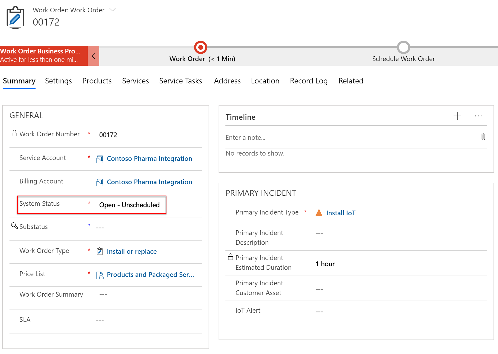

Once the work order is scheduled, the booking created for it has a booking status of **Scheduled** by default.

> [!div class="mx-imgBorder"]
> 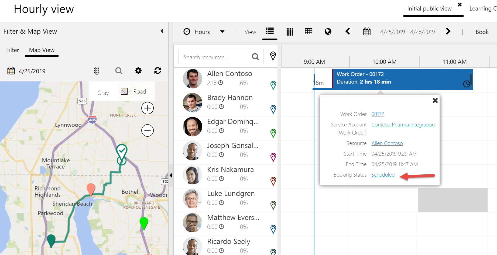

The creation of a booking automatically changes the work order system status to **Open-Scheduled**.

> [!div class="mx-imgBorder"]
> 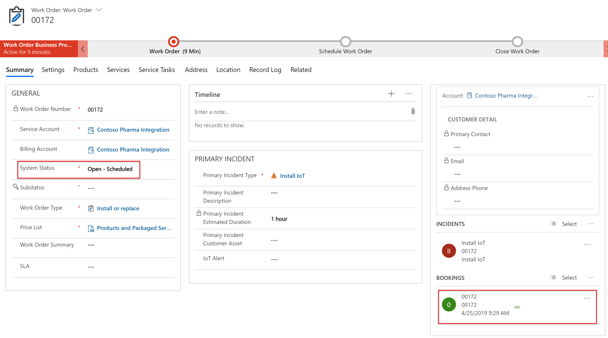

After the work order is scheduled to a field technician resource, you can see it on the Field Service Mobile app. Then the field technician can note that they are traveling to the work order location by changing the booking status to **Traveling**.

> [!div class="mx-imgBorder"]
> 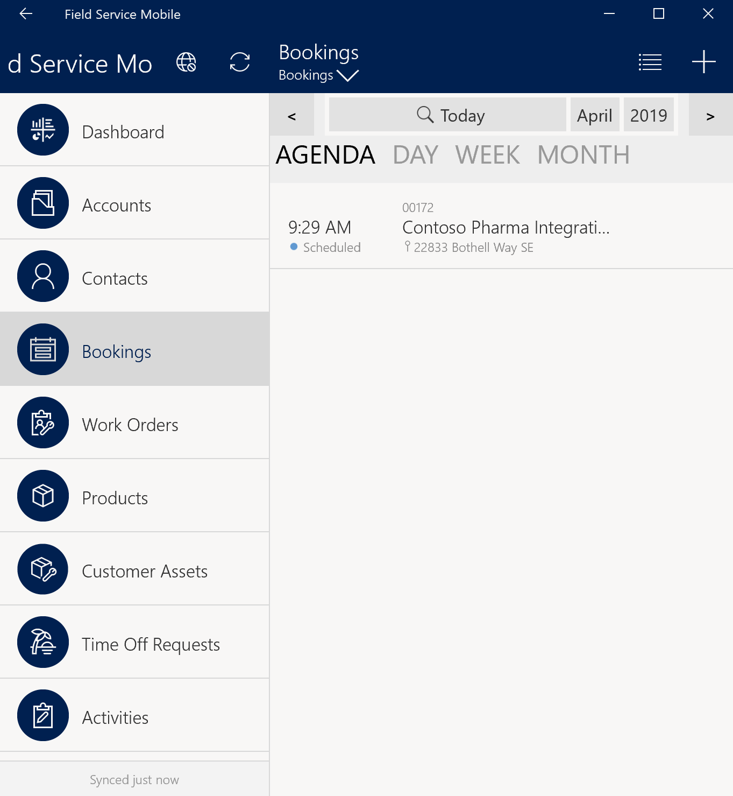

> [!div class="mx-imgBorder"]
> 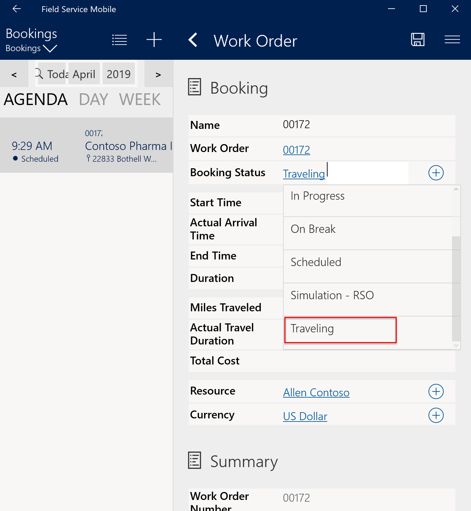

Each booking status has a color and icon and appears on the schedule board.

> [!div class="mx-imgBorder"]
> 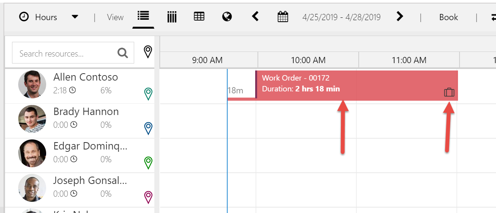

The status and a color appear on the mobile app, too.
> [!div class="mx-imgBorder"]
> 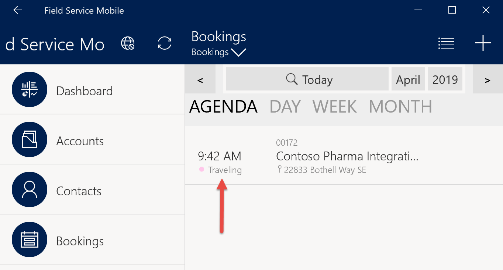

Changing the booking status to **Traveling** automatically changes the work order system status to **Open - In Progress**.
> [!div class="mx-imgBorder"]
> 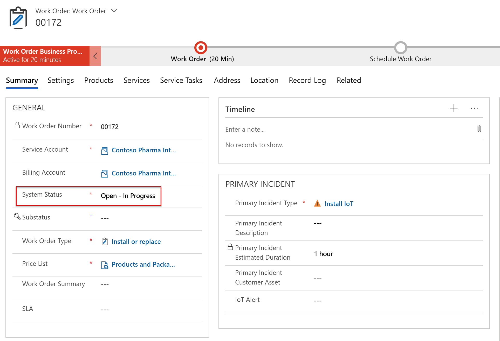

> [!Note]
> If there are multiple bookings for a single work order, if at least one booking is traveling or in progress, the related work order will have a status of **Open - In Progress**.

When the field technician arrives on site and is ready to begin the work, they change the booking status to **In Progress**. The work order status remains as **Open - In Progress**.

> [!div class="mx-imgBorder"]
> 

On the related work order, the **First Arrived On** field is updated with the **Actual Arrival Time** of the booking.

During work, the field technician may want to record times they are on break by changing the booking status to **On Break**. 

> [!div class="mx-imgBorder"]
> 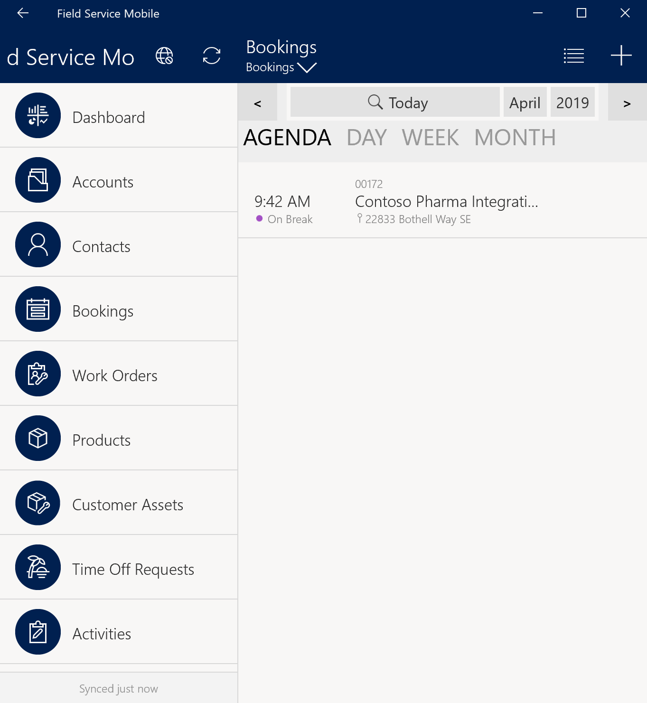

> [!div class="mx-imgBorder"]
> 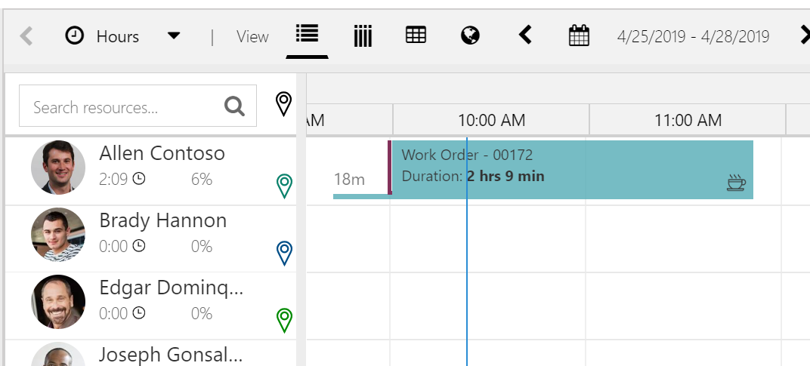

For both **In Progress** and **On Break** booking statuses, the work order system status remains as **Open - In Progress**.

When the work is complete, the field technician will change the booking status to **Completed**. 

> [!div class="mx-imgBorder"]
> 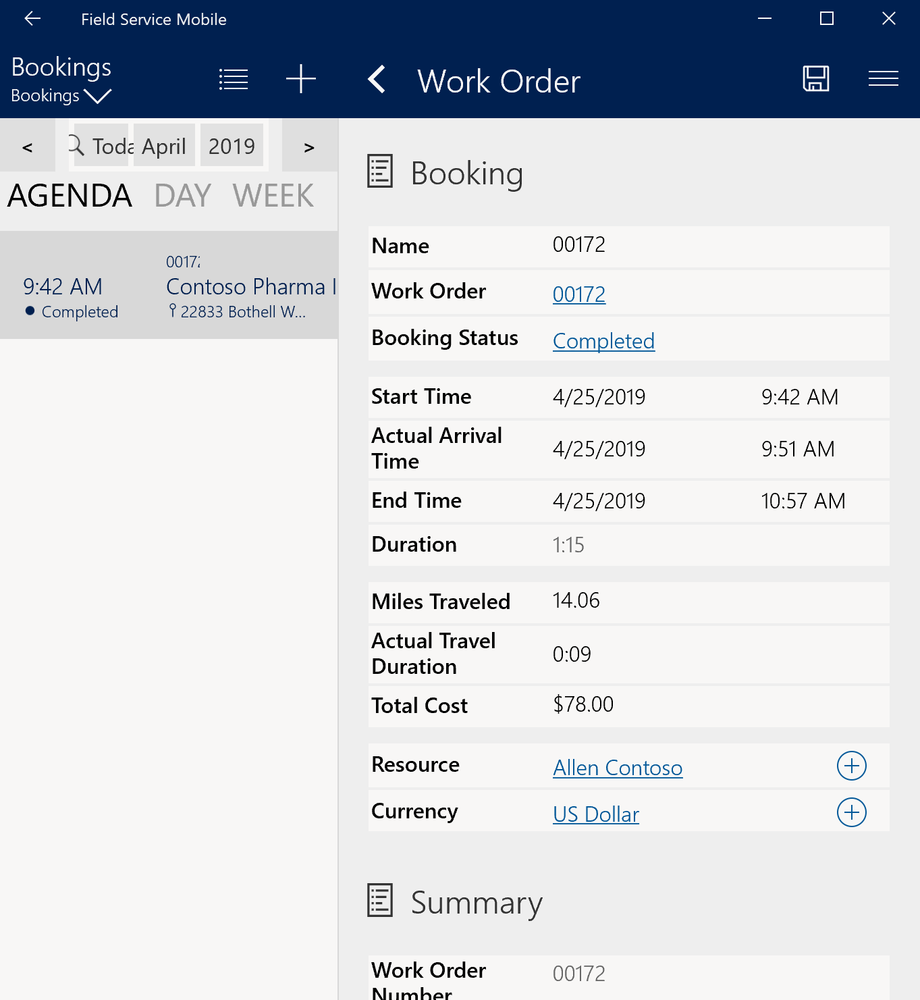

> [!div class="mx-imgBorder"]
> 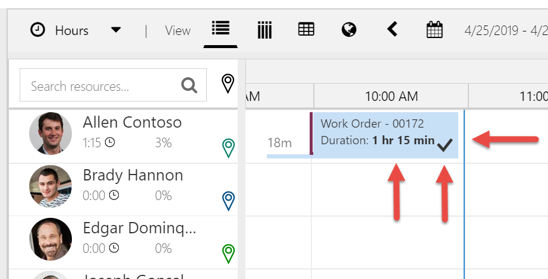

In the previous screenshot, the color and icon reflect a completed status. The duration is updated to the actual duration of the booking, and the end time is updated to reflect the time the status was changed to completed.

The related work order system status will become **Open-Completed**.

> [!div class="mx-imgBorder"]
> 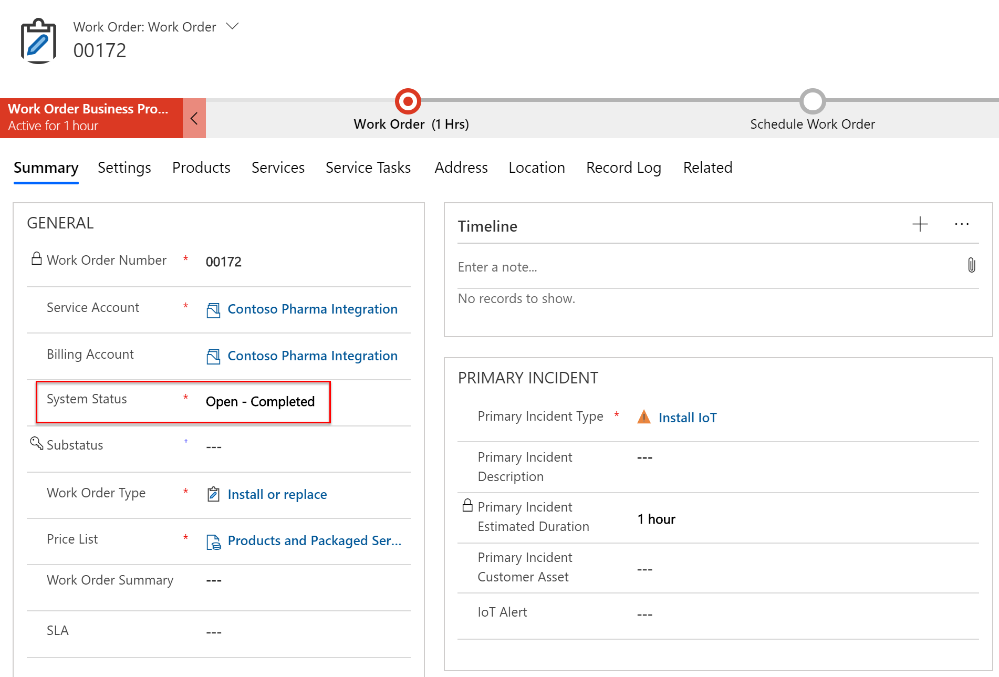

> [!Note]
> If there are multiple bookings for a single work order, once all related booking have statuses of **Completed** (including ones that are **Canceled**), the related work order will have a status of **Open - Completed**. 

Finally, a back-office worker will review the completed work order to make sure data was entered correctly, communicate with the customer, review survey results, and more depending on the organization's specific business needs. The last step is to change the work order system status to **Closed-Posted**. 

> [!div class="mx-imgBorder"]
> 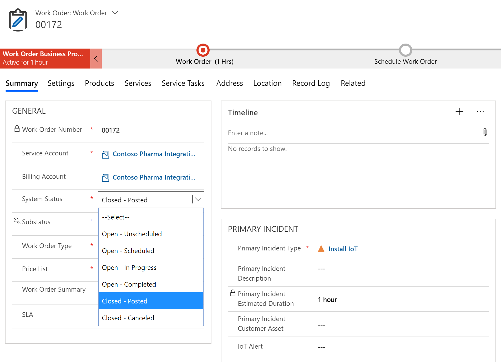

Changing the work order system status to **Closed-Posted** is only performed by office workers in the web interface. In fact, the out-of-the-box resource security roles prohibit field technicians from editing the work order system status field on the Field Service Mobile app.

> [!div class="mx-imgBorder"]
> 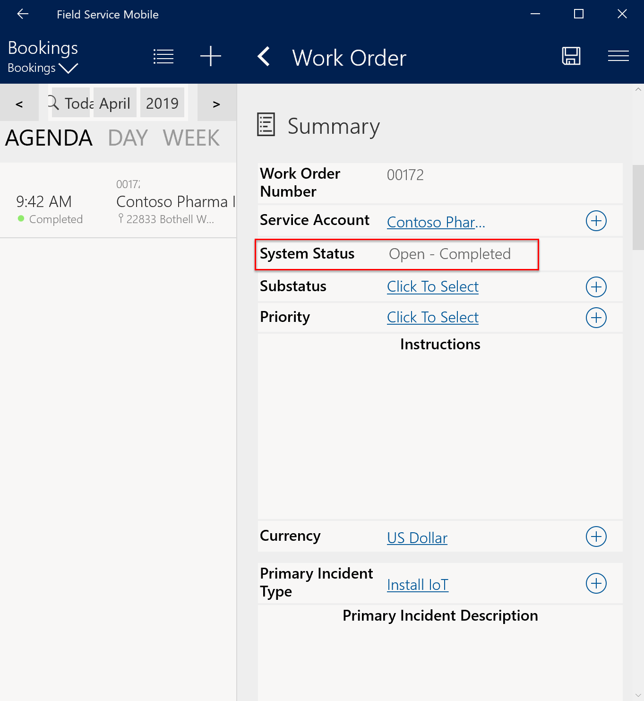

Here is a table summarizing the out-of-the-box relationship between work order system statuses and booking statuses.

| Work Order System Status | Booking Status | Details |
| --- | --- | --- |
| Open-Unscheduled | -- | Not applicable, as booking does not exist yet |
| Open-Scheduled | Scheduled | |
| Open-In Progress | Traveling | |
| Open-In Progress | In Progress | |
| Open-In Progress | On Break | |
| Open-Completed | Completed | |
| Closed-Posted | -- | No booking status can change the work order system status to **Closed-Posted**. If there are any bookings with an incomplete or non-canceled status, changing the system status to **Closed-Posted** will update those bookings to a canceled state.|
| Closed-Canceled | Canceled | If the work order system status is changed to **Closed-Canceled**, all bookings with a status of **Scheduled** will change to **Canceled**. You can't cancel a work order if in progress bookings exist. Completed bookings will remain as completed. |
| Open-Unscheduled | Canceled | If the booking status is **Canceled**, and is the only booking, the work order system status will revert to **Open-Unscheduled**. If one of multiple bookings is canceled, the work order system status will revert to **Open-Scheduled**, **Open-In Progress**, or **Open-Completed** based on the other remaining uncanceled bookings. |

## Status-related processes

Beyond work order system statuses updating booking statuses and vice versa, many processes and data updates are also triggered. Here are the most common.

### Work order system status processes

#### Open – Completed

- Used work order products are converted to new customer assets if applicable. This conversion is accomplished by setting the **Convert to Customer Asset** field on the published product record to **Yes**.

> [!div class="mx-imgBorder"]
> 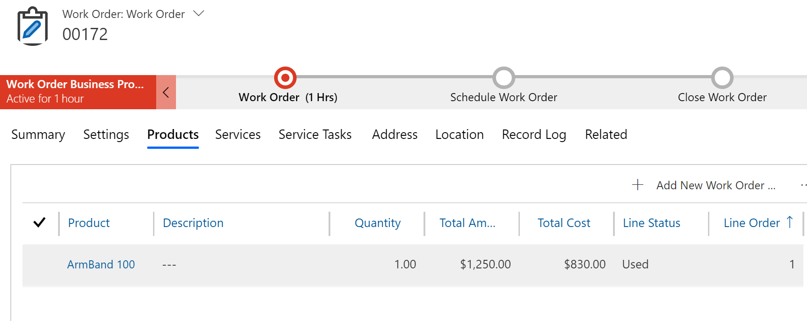

Here is the customer asset that results from the used work order product. Notice the customer asset record references the specific work order product.
> [!div class="mx-imgBorder"]
> 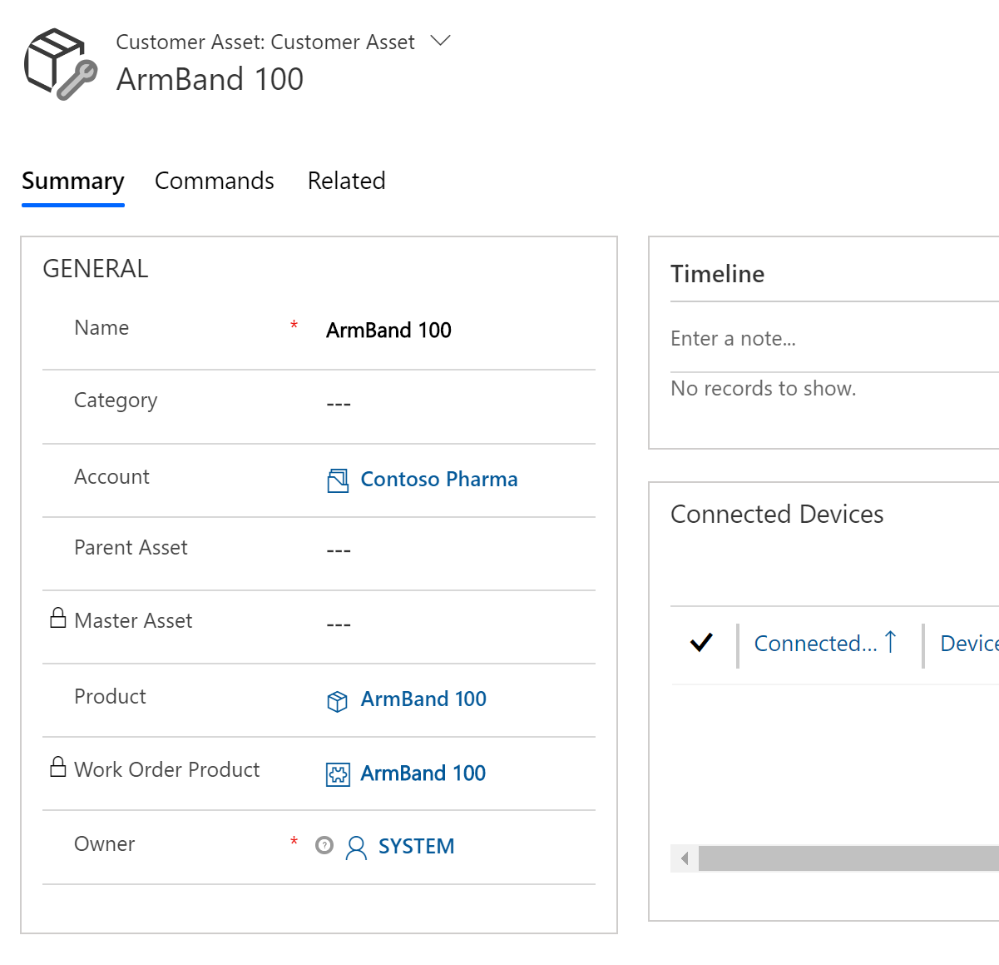

- Travel charge item is added to work order products, if applicable. For more information, see [this article](/dynamics365/customer-engagement/field-service/work-order-customer-account#configuration-considerations).

#### Closed – Posted
- Invoice is generated for used work order products and services billing account 
- **Actuals** records are created for time and materials costs related to work orders and bookings. Sales actuals for billed products and services are created once the generated invoice is confirmed.

> [!div class="mx-imgBorder"]
> 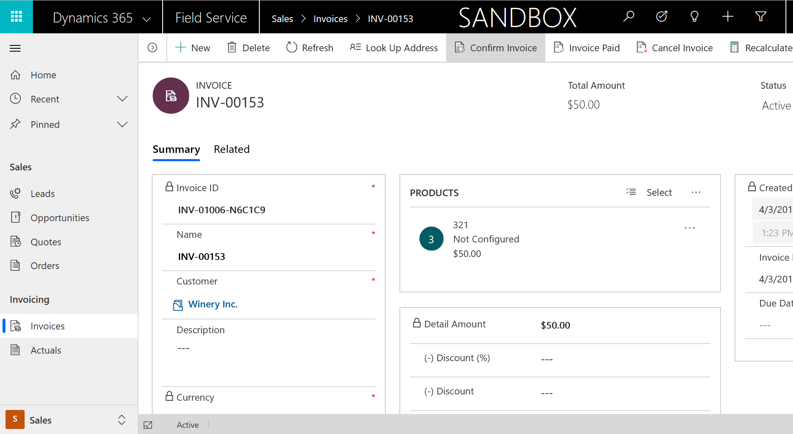

> [!div class="mx-imgBorder"]
> 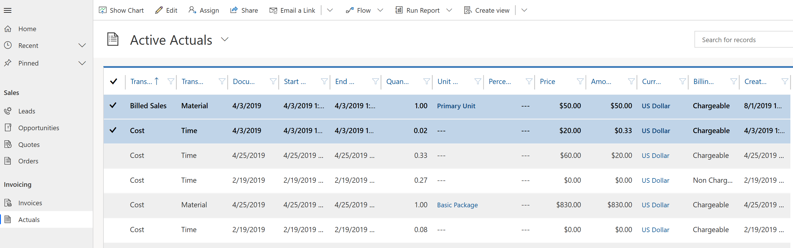 

- **Closed By** field is updated.
- **Closed On** field is updated.

> [!div class="mx-imgBorder"]
> 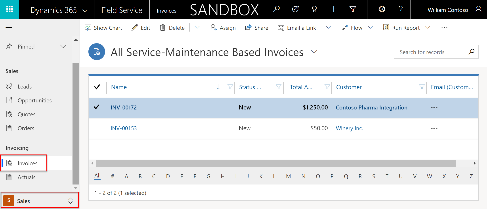

> [!div class="mx-imgBorder"]
> 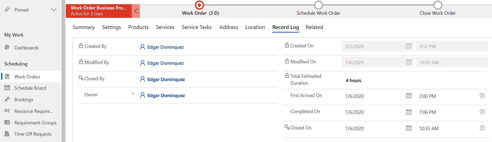

### Booking status processes
		
#### Scheduled

- **Miles Traveled** is updated, calculated as the driving distance from the previous location to the booking location (typically the work order location).
- **Booking Timestamp** created. Booking timestamps track the date and time of all booking status changes.

> [!div class="mx-imgBorder"]
> 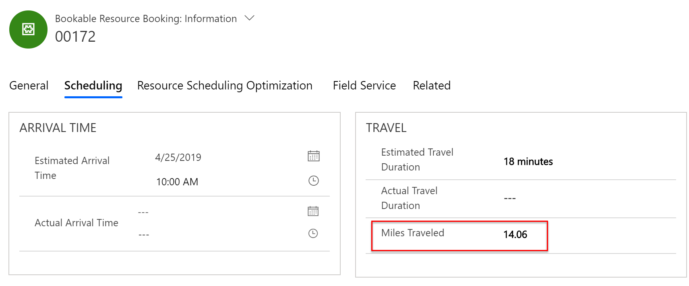

> [!div class="mx-imgBorder"]
> 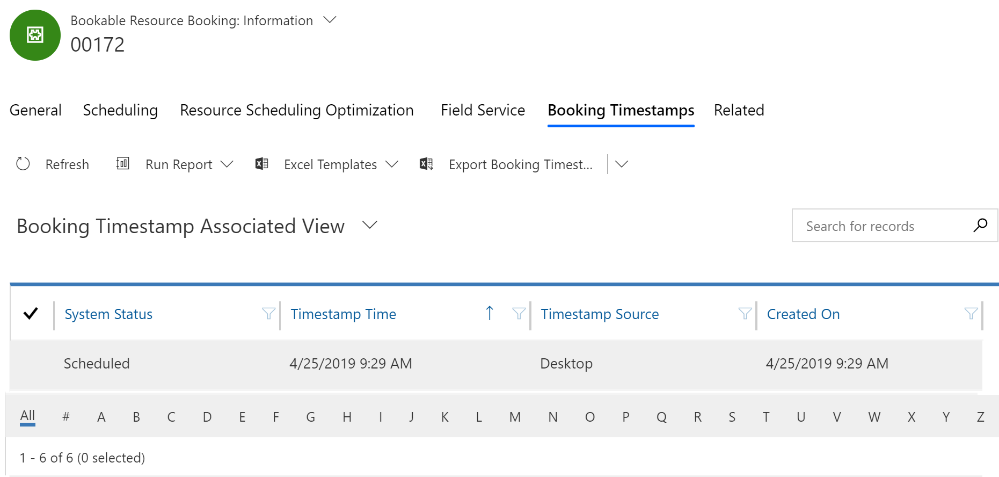

#### Traveling
- **Booking Timestamp** is created.

#### In Progress
- **Actual Arrival Time** field is updated with the date and time when booking status is changed from the mobile app or schedule board, but not from the form.
- **First Arrived On (Work Order)** field on the related _work order_ is updated with the **Actual Arrival Time** of the booking. If **Actual Arrival Time** is edited, manually or otherwise, **First Arrived On** will be updated. If there are multiple bookings, this field is updated with the actual arrival time of the first booking. The **First Arrived On** value will respect offline scenarios and calculate correctly once the technician syncs their mobile data.
- **Actual Travel Duration** field is updated, calculated as the total time the booking status is **Traveling**.
- **Booking Timestamp** is created.

> [!div class="mx-imgBorder"]
> 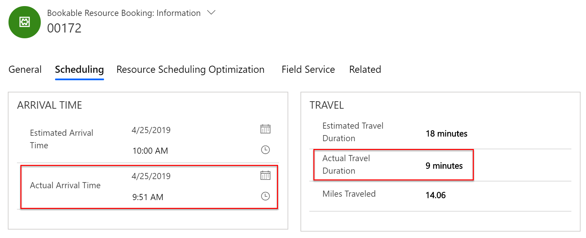

#### On Break
- **Booking Timestamp** is created.

#### Completed
- **End Time** is updated.
- **Total Duration in Progress** is updated, calculated as the total time the booking status is **In progress**.
- **Total Break Duration** is updated, calculated as the total time the booking status is **On Break**.
- **Total Cost** is updated, defined as the internal cost of the resource for the booking, calculated as the sum total of actual travel duration, total duration in progress, and total break duration, multiplied by the resource's hourly rate. 
- **Total Billable Duration** is updated, calculated as the sum total of total duration in progress and total break duration.
- **Booking Journals** created. Booking journals use booking timestamps to calculate the working duration, travel time, and break time for a specific booking. Booking journals also calculate internal resource costs for bookings based on resource's hourly rate as defined on the bookable resource record.
- **Booking Timestamp** is created.
- **Completed On (Work Order)** field on the related _work order_ is updated with the end time of the booking. If the booking end time is edited, manually or otherwise, **Completed On** will be updated. If there are multiple bookings, this field is updated with the end time of the last booking, meaning the most recently completed booking related to the work order. The **Completed On** value will respect offline scenarios and calculate correctly once the technician syncs their mobile data.

> [!div class="mx-imgBorder"]
> 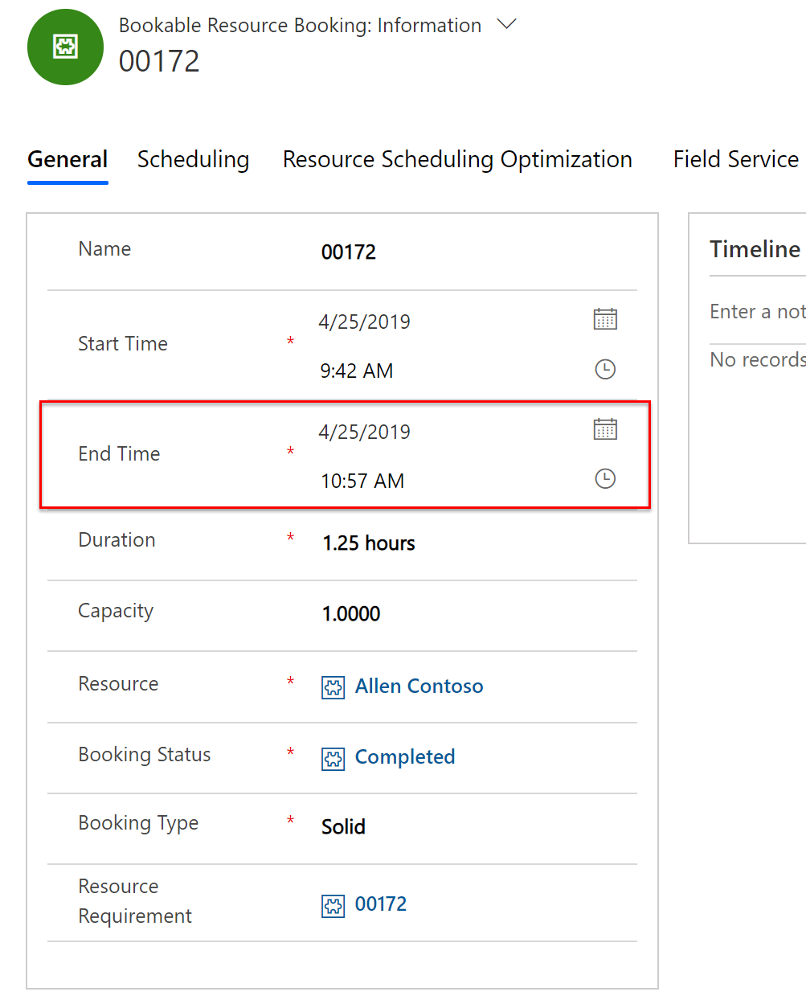

> [!div class="mx-imgBorder"]
> 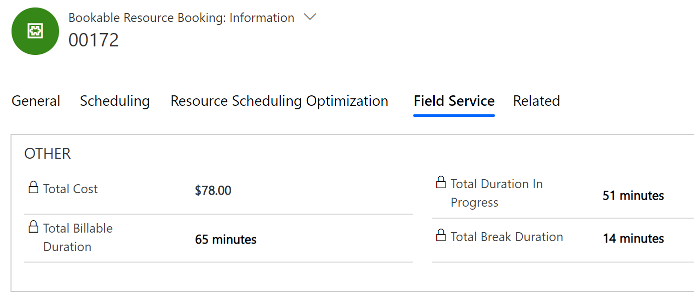

By the end of the work order life cycle, you will have timestamps of all booking status changes from both the field technicians and dispatchers.
> [!div class="mx-imgBorder"]
> 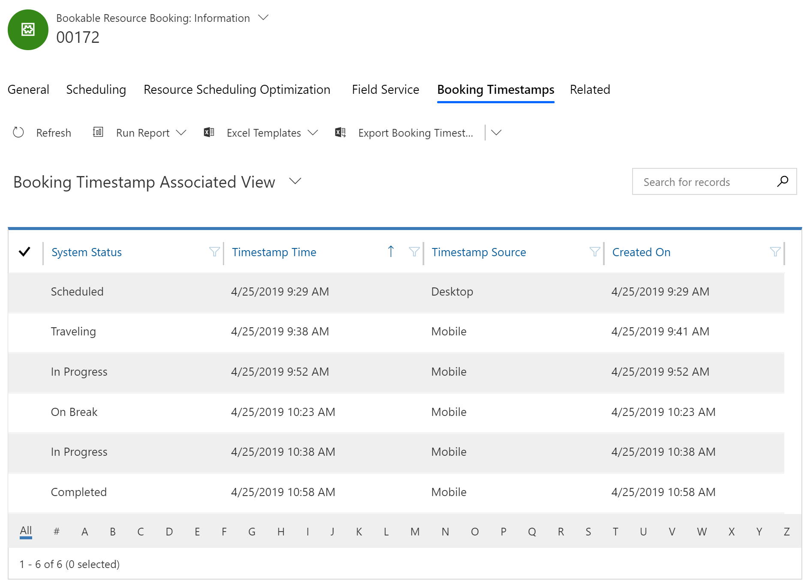

## Example 1: Estimate work order substatus

In our next scenario, a field service organization wants to utilize work orders for estimating potential products, services, and prices for their clients and want to mark such work orders with a custom "Estimate" work order substatus.

> [!Note]
> For this scenario, substatuses must be used. Work order system statuses should *never* be edited because system jobs and plug-ins rely on these statuses. Instead, administrators should create custom work order substatuses that relate to work order system statuses.

First, create a new work order substatus by going to **Field Service > Settings > Work Order Substatuses > then select +New**.

Enter for the following fields: 

- **Name:** Estimate.

- **System Status:** Open-Unscheduled. When the field service organization is building an estimated work order, it's usually before it should be scheduled to a resource. The substatus will relate to the **Open-Unscheduled** system status.

- **Default Substatus:** choose if you want this substatus populated by default when a work order has a system status of **Open-Unscheduled**. Because work orders are given a system status of **Open-Unscheduled** when created, this substatus would populate on all newly created work orders, but can be manually updated. If all or most work orders first originate as an estimate, then this field should be set to **Yes**, giving the work order creator one less field to manually populate. If only a few work orders are estimates, then set to **No**. In this example, we will choose **Yes**.

> [!div class="mx-imgBorder"]
> 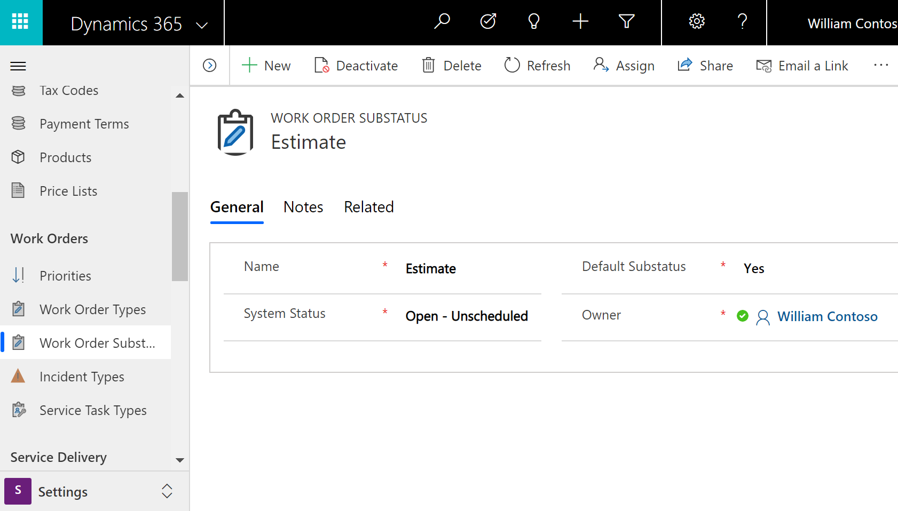

The next time a work order is created, this substatus will populate automatically or be available in the substatus lookup. The substatus lets dispatchers and other stakeholders know that this work order is a "work in progress" and not agreed upon yet with the customer.

> [!div class="mx-imgBorder"]
> 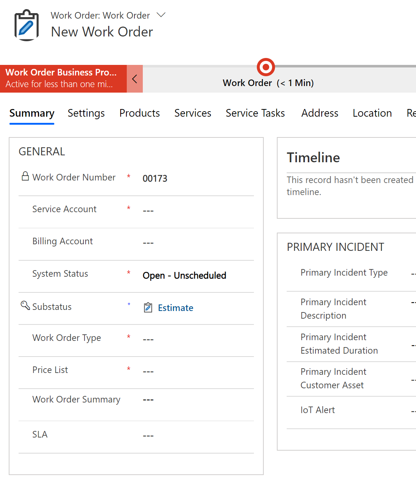

Next, it's important to note that dispatchers do not schedule estimate work orders, as they are not ready yet. One way to notify them is to remove estimate work orders from the **Unscheduled Work Orders** view on the schedule board.

Go to **Settings** > **Customizations** > **Customize the System** > **Entities** > **Resource Requirements** > **Views**.

Next, edit the **Unscheduled Work Order Requirements** view to filter out requirements related to work orders where the substatus equals estimate.

> [!div class="mx-imgBorder"]
> 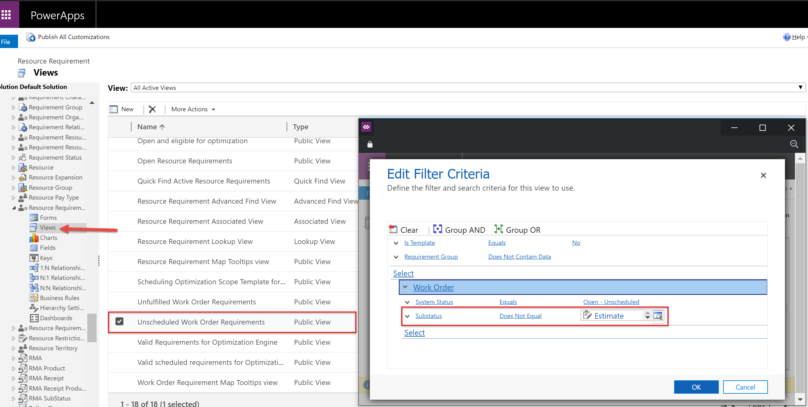

Editing this view will remove estimate work orders from the lower pane in the schedule board, among other places.

> [!div class="mx-imgBorder"]
> 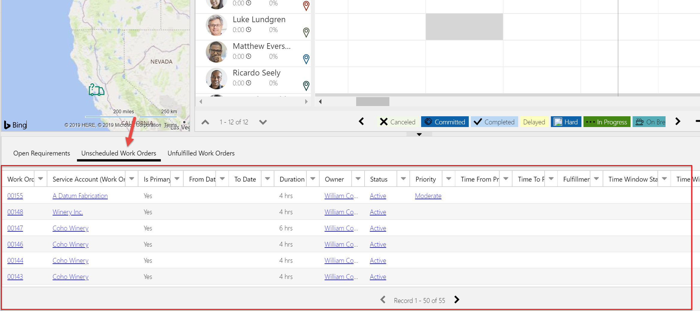

## Example 2: Delayed Booking Status

Field technicians want to make dispatchers aware if they are running more than 15 minutes behind schedule by changing the status of their bookings to "Delayed". This status change will help dispatchers manage the remaining bookings for that resource for the rest of the day by running [Single Resource Optimization](single-resource-optimization.md) or triggering automated messages to the next customer.

First, go to **Resource Scheduling** > **Settings** > **Booking Statuses** > **+New**.

For the following fields:

- **Name:** Enter "Delayed."

- **Status:** Select **Committed**.

> [!div class="mx-imgBorder"]
> 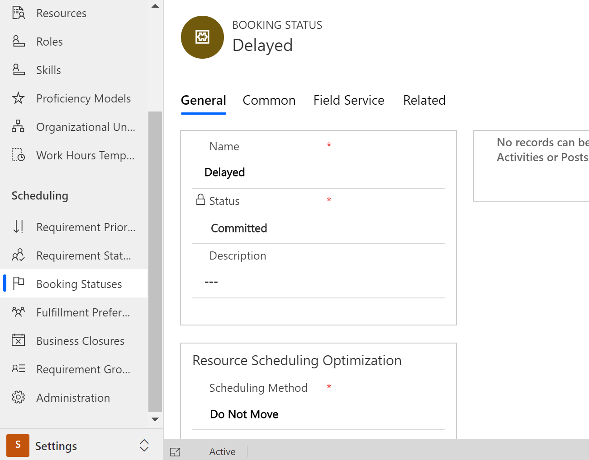

- **Status Color:** Choose a color. This color will appear on the schedule board when the booking has this status. Because the out-of-the-box **Traveling** status has a red color, one option is to make this delayed travel status a darker red that is distinguishable. 

> [!div class="mx-imgBorder"]
> 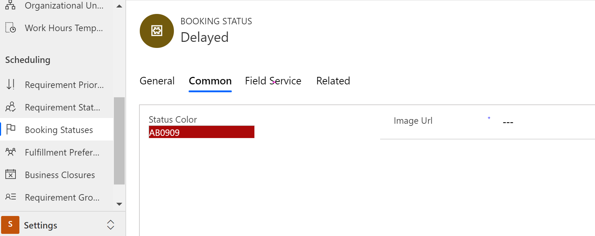

- **Image URL:** Select the web resource URL that references an image icon to appear on the schedule board. New images can be uploaded by going to **Settings** > **Customizations** > **Customize the System** > **Web Resources**.

> [!div class="mx-imgBorder"]
> 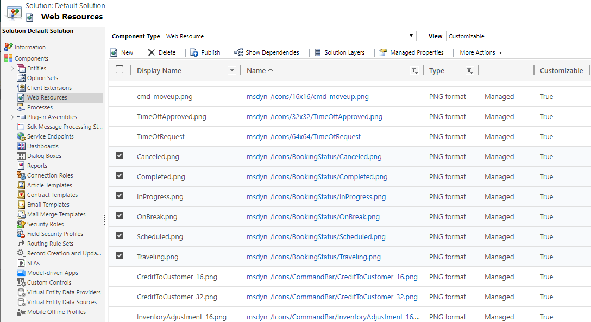

- **Field Service Status:** select **Traveling**. The new **Delayed** status applies to the travel portion of the field service booking process. If for example, we wanted a status to indicate when actual work was taking longer than expected, we could choose **In Progress** for the **Field Service Status**.

> [!div class="mx-imgBorder"]
> 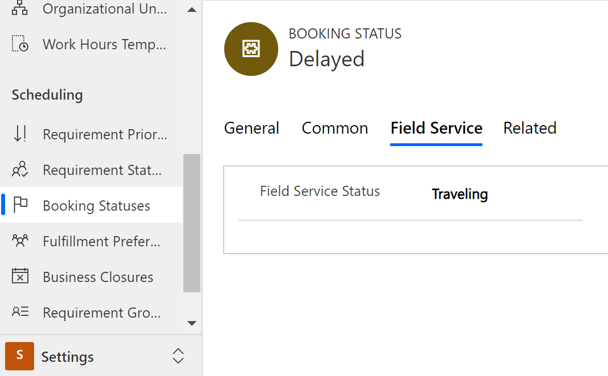

> [!Note]
> **Field Service Status** is required when creating booking statuses for Field Service use cases. This allows the booking status to fit into the above work order processes. By default, only booking statuses with field service statuses are available for work order bookings, but this is editable in **Booking Setup Metadata**.

**Save and Close**.

Now the new **Delayed Booking Status** will appear as an option on the Field Service Mobile for field technicians, and on the schedule board.

> [!div class="mx-imgBorder"]
> 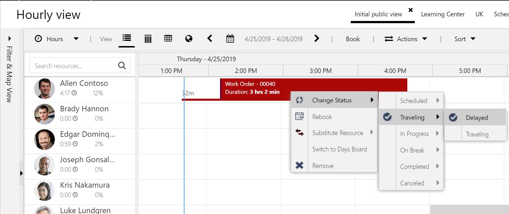

## Follow-up work order substatus

Field service organizations often schedule a follow-up inspection after an initial installation or repair work order. If a follow-up is required, field technicians should note it with a custom "Follow-Up Required" work order substatus to ensure back-office workers create a follow-up before closing the work order.

Similar to the example before, go to **Field Service** > **Settings** > **Work Order Substatuses** > then select **+New**.

For the following fields: 

**Name:** enter "Follow-Up Required."

**System Status:** enter **Open-Completed**, which implies the follow-up required substatus can only be entered on **Open-Completed** work orders and the organization's follow-up process should only be carried out on these work orders.

**Default Substatus:** set to **Yes** if all **Open-Completed** work orders should be given a substatus of **Follow-Up Required** by default. For our example, we will choose **No** because not all completed work orders require a follow-up so it's left to the discretion of the field technician.

Select **Save and Close**.

Unlike work order system statuses, work order substatuses can be updated on the mobile app by the field technicians. 

> [!div class="mx-imgBorder"]
> 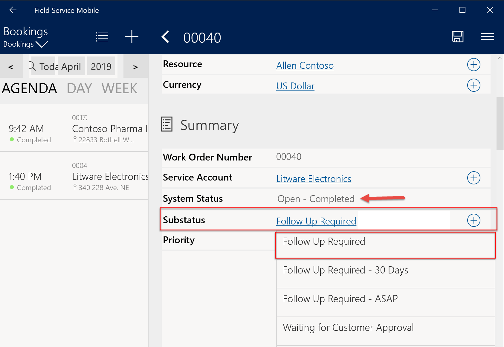

The substatuses will appear based on the work order system status. In the example above, **Follow-Up Required** only appears when the work order system status is **Open-Completed** because we related the two.

## Configuration considerations

If your organization is using Resource Scheduling Optimization, then an additional field called **Scheduling Method** will appear on the book status entity. 

Options include:

- Optimize
- Do Not Move
- Ignore

If you create a new custom **Booking Status**, then you should pick a scheduling method that relates to the field service booking status. For example, the out-of-the-box booking status **Traveling** has an RSO scheduling method set to **Do Not Move** because RSO should not move bookings that a field technician is traveling to. Therefore, using our previous example, our new **Delayed** booking status is related to the **Traveling** Field Service status, so its scheduling method should be set to **Do Not Move** as well.

For more information, see the article on [Resource Scheduling Optimization (RSO) configuration](rso-configuration.md).

### See also
- [Booking Statuses blog post](https://community.dynamics.com/365/b/365teamblog/archive/2017/06/01/manage-the-status-of-your-team-s-bookings-with-universal-resource-scheduling)

[!INCLUDE[footer-include](../includes/footer-banner.md)]