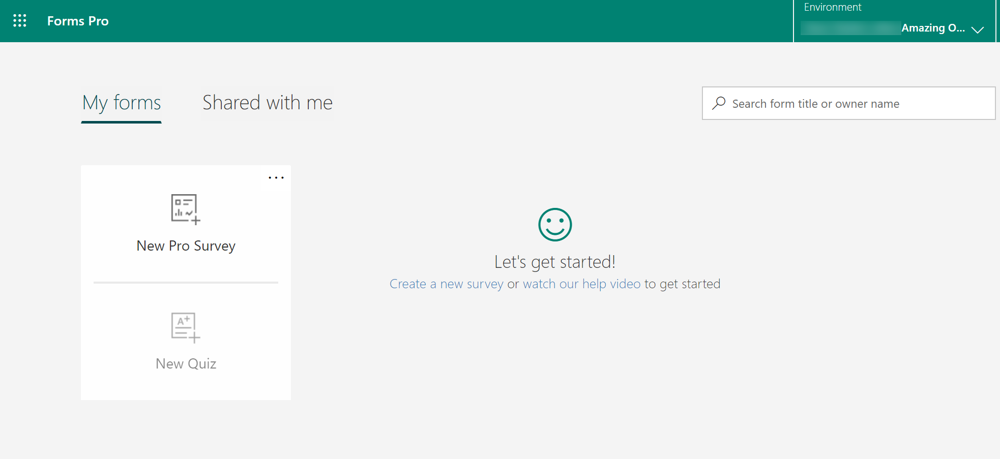
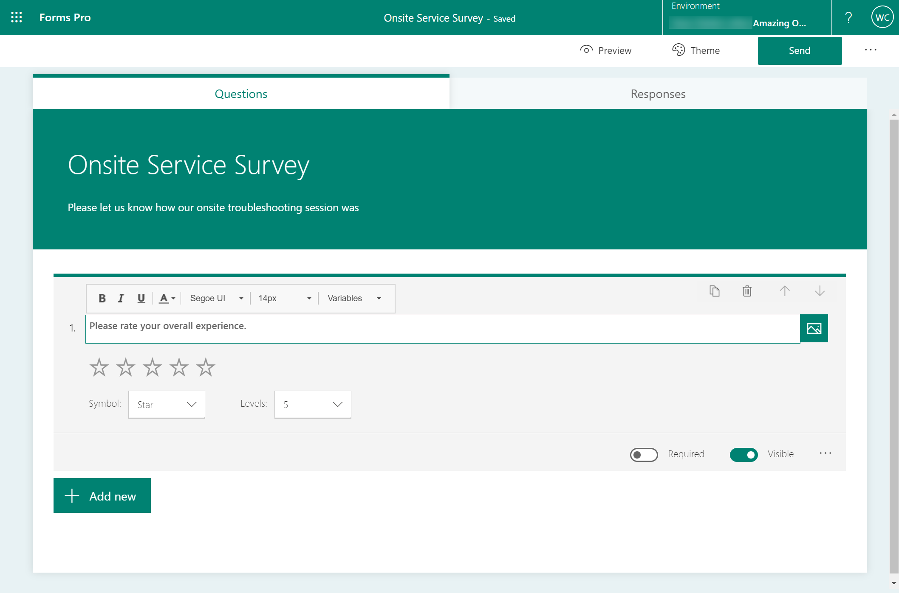
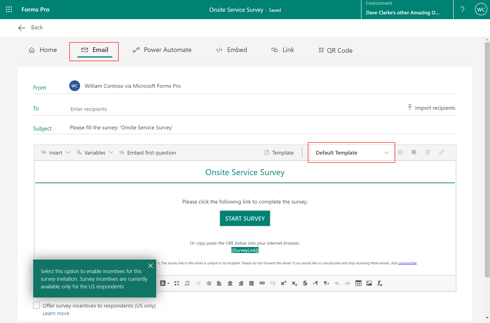
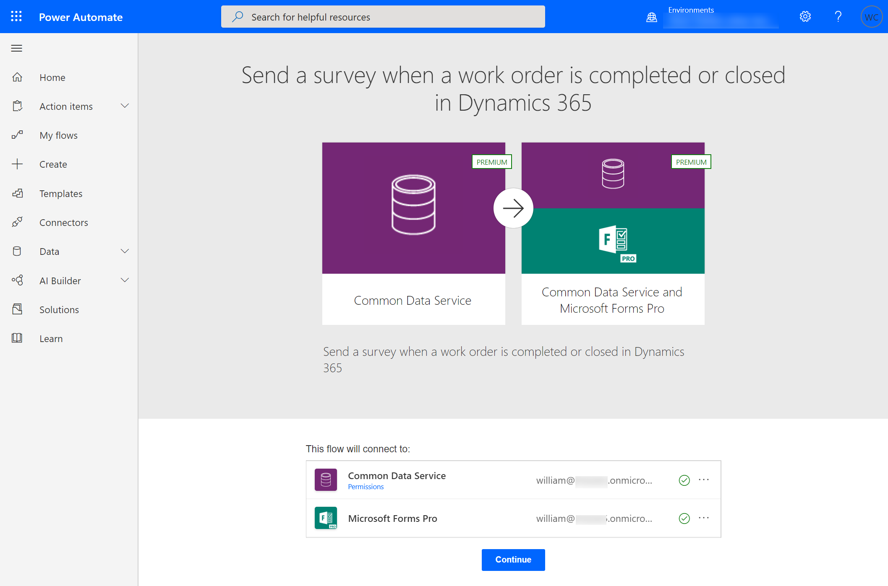
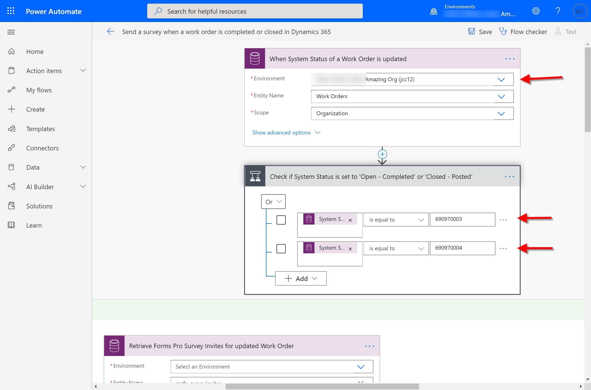
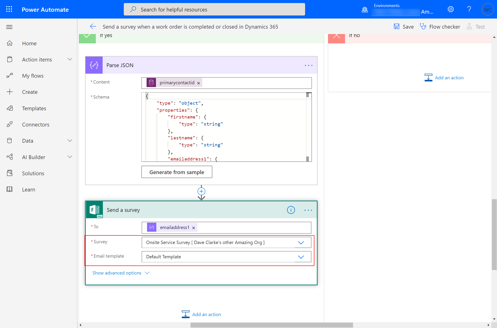
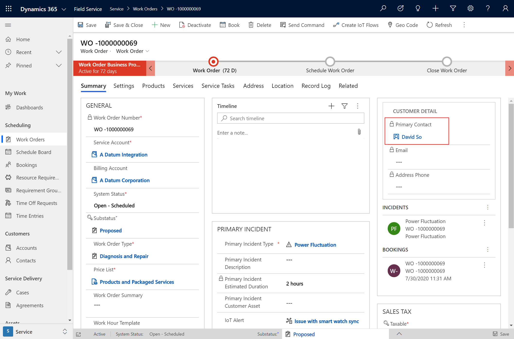
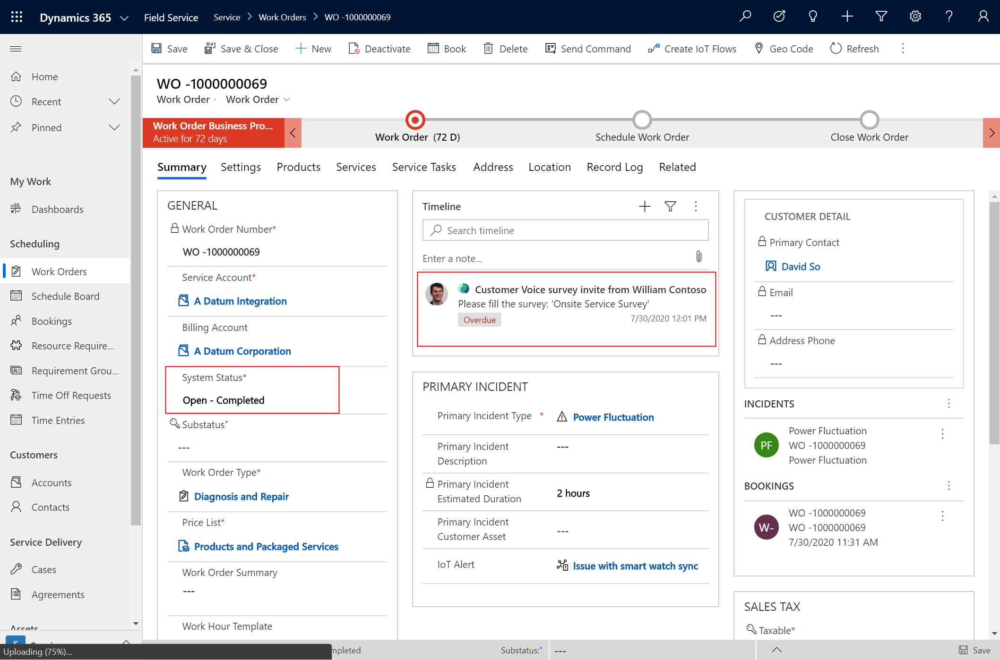
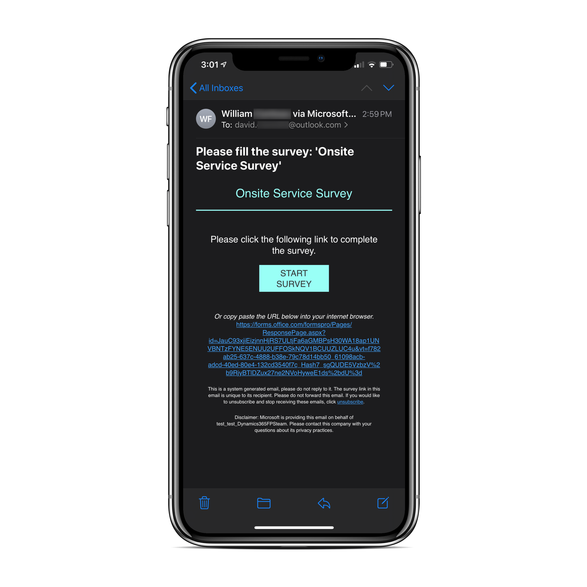

# Work order completion surveys with Customer Voice (formerly Forms Pro)

Send surveys and questionnaires to customers when a work order is completed to learn about customer satisfaction, how to improve onsite service, and more! With Customer Voice (formerly Forms Pro), create custom surveys based on your business needs. Then with Power Automate flow templates, automatically send those surveys to the primary contact on a Dynamics 365 Field Service work order.

## Prerequisites

- Access and licenses to use Dynamics 365 Field Service, Customer Voice, and Power Automate.

## Create a survey with Customer Voice

Create a survey that you would like to send once a work order in complete.

If you're an existing Customer Voice user, use [https://forms.office.com](https://forms.office.com) to sign in. To purchase Forms Pro licenses, see the article: [Purchase Microsoft Forms Pro](https://docs.microsoft.com/forms-pro/purchase).

> [!div class="mx-imgBorder"]
> 

Use the drag-and-drop interface to create your survey.

> [!div class="mx-imgBorder"]
> 

## Prepare the email template to send the survey

From the survey, go to **Send** in the top right. Choose **Email** and edit the template as needed. Note the name of the template. In the following example, we use the **Default Template** that is included with Customer Voice.

> [!div class="mx-imgBorder"]
> 

## Edit the Power Automate flow template

Go to [https://flow.microsoft.com](https://flow.microsoft.com) and search for the template called [**Send a survey when a work order is completed or closed in Dynamics 365**](https://us.flow.microsoft.com/galleries/public/templates/7135fe34812745d5af513437a7657002/send-a-survey-when-a-work-order-is-completed-or-closed-in-dynamics-365/).

Sign in to Common Data Service with your Dynamics 365 or Field Service administrator credentials, and sign in to your Microsoft Forms Pro account. These accounts might be different.

Select **Continue** to begin editing the flow template.

Enter your Dynamics 365 Field Service environment name in the parts of the template that require it.

> [!div class="mx-imgBorder"]
> 

This flow template will execute if the **Work Order System Status** equals **Open - Completed** or **Closed - Posted**. The number values in the following screenshot represent the unique identifer of the system status option set.

> [!div class="mx-imgBorder"]
> 

In other parts of the Flow template, enter your survey and email template used in Customer Voice.

> [!div class="mx-imgBorder"]
> 

## Create a work order

You're now ready to test your work order completion survey.

Create a work order in Field Service.

Make sure the primary contact field has a contact that has an email address.

The primary contact is populated from the primary contact of the related service account.

> [!div class="mx-imgBorder"]
> 

## Complete work order

Schedule and complete the work order. If the related booking has a status of **Completed**, the work order status will be changed to **Open - Completed** by default.

> [!div class="mx-imgBorder"]
> 

## Receive survey

A few minutes after the work order system status becomes **Open - Completed** or **Closed - Posted**, the survey with the chosen template will be emailed to the primary contact.

> [!div class="mx-imgBorder"]
> 
