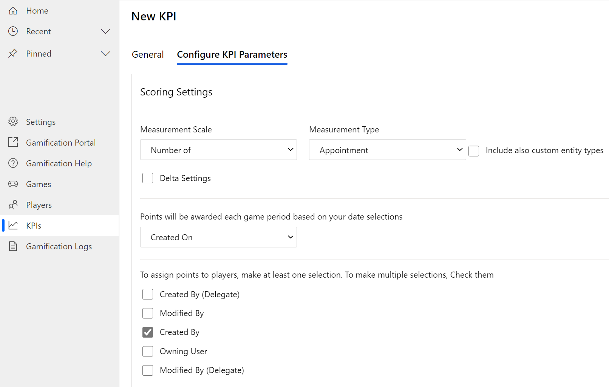
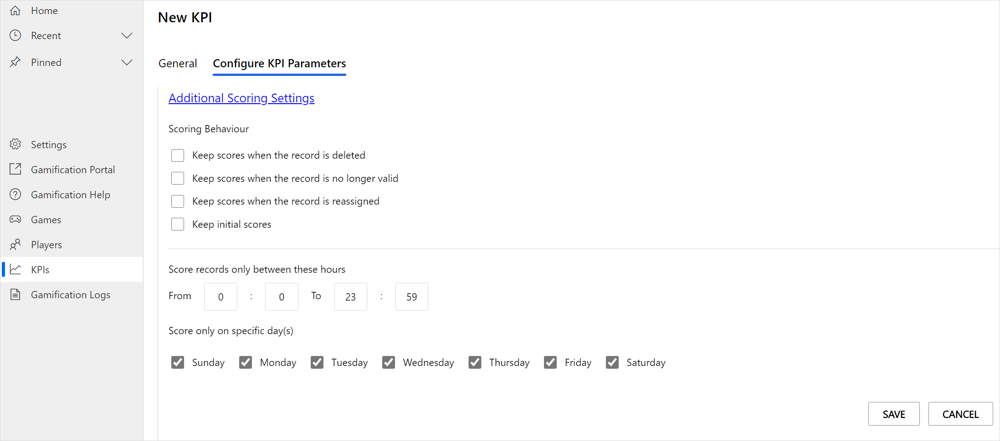

# Configure KPIs for Gamification

[!INCLUDE[cc-gamification-deprecation-notice](../includes/cc-gamification-deprecation-notice.md)]

Scores and achievements in your games are based on KPIs that you define in [!INCLUDE[pn_gamification](../includes/pn-gamification-shortest.md)]. It's a two-step process: first, in [!INCLUDE[pn_CRM_Online](../includes/pn-crm-online-shortest.md)], a user with a **Game Manager** security role creates the KPIs. Next, the user chooses and configures the KPIs in [!INCLUDE[pn_gamification_shortest](../includes/pn-gamification-shortest.md)] when setting up a new game.

More information about setting up KPIs in [!INCLUDE[pn_gamification_shortest](../includes/pn-gamification-shortest.md)]: [Set up and run games in Gamification](run-games.md)  
Basic information about KPIs; [Concepts to learn before you get started using Gamification](get-started.md)

## Create KPIs in Gamification

When you set up a game, step 2 of the game setup experience requires you to define the KPIs for the game.

The KPIs you define in Dynamics 365 apps will be available when you set up the game and the data syncs from the connected organization.

**To create a new KPI**

1. [Sign in to Dynamics 365 - Gamification](manage-gamification-in-dynamics-365-online.md#sign-in-to-dynamics-365---gamification).

2. In the left pane, select **KPIs**.

3. On the **Active KPIs** page, select **New** on the toolbar at the top of the page.

4. On the **General** tab, enter a name for the KPI.

5. Select the **Set Up KPI Parameters** tab. When you select the tab, its name changes to **Configure KPI Parameters**.

6. In the **Measurement Scale** list, choose whether you want to award points based on an **Amount of** or the **Number of** a record.

7. In the **Measurement Type** list, select the object type you want to base your KPI on.

    > [!NOTE]
    > If you want to include custom entities in the **Measurement Type** list, select **Include also custom entity types**.

8. Optionally, select **Delta Settings** to configure a scoring condition for that KPI that is based on the difference (the delta) between two attributes.

   For example, if you want to award points to players who resolve cases quickly, you can specify a condition that checks the **Created On** and **Resolve By** values and award points when the delta **is less than** 300 minutes (5 hours). When you create an amount-based KPI, you can even choose to use the delta value as the KPI amount and award points based on the actual delta value.

9. Under **Points will be awarded each game period based on your date selections**, select which date field the points will be assigned on.

   > [!TIP]
   > Be mindful when you choose date fields. If you're using a date field that might change several times a day, like **Modified On** or **Modified By**, assigned points can be removed from one player and assigned to another, or the date of their point assignment might change.
   >
   >  For example, let's say you create a KPI based on the lead entity that uses **Modified On** as the date field and **Modified By** as the field that specifies which user to assign points to. If a user creates a new lead on Monday, the system will assign points to this user on Monday. When this lead gets updated on Tuesday, the system will remove the user's points from Monday and move them to Tuesday, which could change how many points a player earns within the specified game period.
   >
   >  If you have a system job that updates lead records on a daily basis by using a system account, any points that players earned will be removed after the job runs because the system modified the lead. The same logic applies if another user updates this lead record.
   >
   >  To avoid this, use **Scoring Behavior** in the **Additional Scoring Settings** section.

10. Under **To assign points to players, make at least one selection**, select which users are assigned points from a given KPI.

    

11. Optionally, you can set up an additional query parameter for a KPI by creating a saved view.

    Go to **Advanced Find**, select the fields you want to filter on, and then select **Save as new View**. Next, you can edit the KPI, select the saved view, and then select **Save** to apply your changes.

    For example, if you want to award points only for appointments about a specific product, you can add the product name to the appointment description, and then add a query parameter to select an appointment for scoring only when the **Description** field contains the product name.

   > [!NOTE]
   > [!INCLUDE[pn_gamification_shortest](../includes/pn-gamification-shortest.md)] doesn't support saved views that filter for the date field, or contain linked entities in filters or columns.

12. Optionally, select **Additional Scoring Settings** to choose the scoring behavior. By default (if no check box is selected), points are always assigned based on the current state of the record. You can customize this by selecting one or more of the following options:

   - **Keep scores when the record is deleted**: When a record that is used by a KPI is deleted, scored points aren't removed from the player's score.

   - **Keep scores when the record is no longer valid**: For example, a KPI is configured based on a saved view that assigned scores only to records in the **Completed** state. After some time, a workflow automatically moves completed records to an **Archived** state. If this option is checked, the system will keep scores for these records.

   - **Keep scores when the record is reassigned**: When a record is assigned to another user in [!INCLUDE[pn_CRM_Online](../includes/pn-crm-online-shortest.md)], scores will persist with the user who initially received the scored points.

   - **Keep initial scores**: Scores are assigned based on the values that were initially provided on the record that the KPI uses. For example, if you award points for potential revenue and the revenue forecast, the score won't change when the revenue forecast on the record is updated.

   > [!CAUTION]
   > If you edit a KPI with a custom scoring behavior that is already used in an active game, all points associated with the selected behavior options will be removed.

13. Optionally, set the time scoring under **Score records only between these hours** in the **Additional Scoring Settings** section. By default, KPIs are scored all day, every day. You can specify the hours and days when the KPI is scored.

    

14. Select **Save**.

## Configure and edit KPIs

Configure KPI details to select them for a new contest in [!INCLUDE[pn_gamification_](../includes/pn-gamification-shortest.md)]. The system creates a set of default KPIs when you install [!INCLUDE[pn_gamification_](../includes/pn-gamification-shortest.md)]. Only the owner of a KPI can change its values. If the system created a KPI, you need to assign it to an owner before its values can be changed.

There are various ways to create useful KPIs based on the data of a [!INCLUDE[pn_CRM_Online](../includes/pn-crm-online.md)] instance. Use our examples for inspiration, and adapt them to your business and game requirements. [!INCLUDE[proc_more_information](../includes/proc-more-information-md.md)] [Best practices for new and existing KPIs in Gamification](best-practices-kpis.md)  

**To configure a KPI**

1. [Sign in to Dynamics 365 - Gamification](manage-gamification-in-dynamics-365-online.md#sign-in-to-dynamics-365---gamification).

2. In the left pane, select **KPIs**.

3. On the **Active KPIs** page, select the KPI you want to configure.

    KPIs you've configured will have a status of **Set up**, while KPIs whose configuration is pending will appear as **Not set up**. You must save the changes to update the status to **Set up**.

4. Select the **Set Up KPI Parameters** tab. When you select the tab, its name changes to **Configure KPI Parameters**.

5. Scroll to the bottom of the page, select **Edit**, and then update the configuration as you want.

6. To apply your configuration, select **Save**.

### Next steps

When you are done setting up all required KPIs, the system will sync the data to [!INCLUDE[pn_gamification_shortest](../includes/pn-gamification-shortest.md)] when you start the game.

If you want to score a KPI manually, you can use Excel point scoring. [!INCLUDE[proc_more_information](../includes/proc-more-information-md.md)] [Update game scores by using Excel point scoring capabilities in Gamification](update-scores-using-excel-point-scoring.md)

## Edit a KPI

1. [Sign in to Dynamics 365 - Gamification](manage-gamification-in-dynamics-365-online.md#sign-in-to-dynamics-365---gamification).

2. In the left pane, select **KPIs**.

3. On the **Active KPIs** page, select the KPI you want to edit.

4. Select the **Set Up KPI Parameters** tab. When you select the tab, its name changes to **Configure KPI Parameters**.

5. Select **Edit**.

6. Change the parameters of the KPI to meet your requirements.

7. To apply your changes, select **Save**.

> [!NOTE]
> Before you can edit a KPI that was automatically created when [!INCLUDE[pn_gamification_shortest](../includes/pn-gamification-shortest.md)] was installed, you must assign it an owner. Only the KPI owner can edit the values of a KPI.

### See also

 [Overview for commissioners and game managers in Gamification](for-commissioners-game-managers.md)   
 [Set up and run games in Gamification](run-games.md)

[!INCLUDE[footer-include](../includes/footer-banner.md)]
