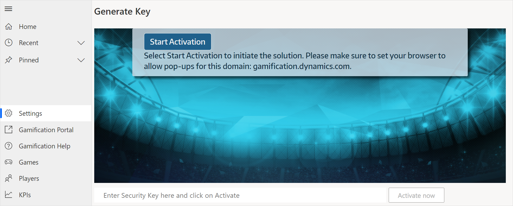
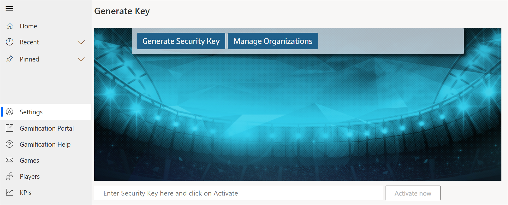
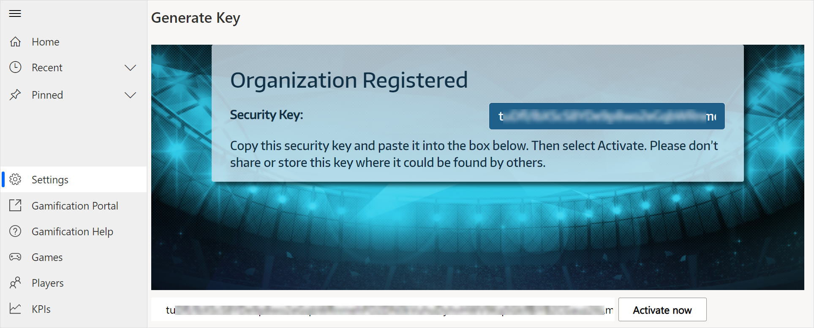

# Install and configure the Gamification solution

The [!INCLUDE[pn_gamification](../includes/pn-gamification.md)] capabilities are a solution for [!INCLUDE[pn_CRM_Online](../includes/pn-crm-online.md)], hosted on [!INCLUDE[pn_microsoft_appsource](../includes/pn-microsoft-appsource.md)], that you need to install before you can start using the capabilities to manage your [!INCLUDE[pn_gamification_shortest](../includes/pn-gamification-shortest.md)] games, KPIs, and players.  
  
## Prerequisites  
  
- [!INCLUDE[pn_gamification_shortest](../includes/pn-gamification-shortest.md)] requires at least [!INCLUDE[pn_crm_8_1_0_online](../includes/pn-crm-8-1-0-online.md)].  
  
- Users must have a [!INCLUDE[pn_CRM_Online](../includes/pn-crm-online.md)] license assigned to access the [!INCLUDE[pn_gamification_shortest](../includes/pn-gamification-shortest.md)] service.  
  
- Users must have an up-to-date browser. [!INCLUDE[proc_more_information](../includes/proc-more-information-md.md)] [Browser requirements to enable a seamless experience in Gamification](browser-system-requirements.md)  

## Install Dynamics 365 - Gamification  

[!INCLUDE[pn_gamification_shortest](../includes/pn-gamification-shortest.md)] capabilities in [!INCLUDE[pn_crm_shortest](../includes/pn-crm-2016-shortest.md)] are a solution for [!INCLUDE[pn_CRM_Online](../includes/pn-crm-online.md)] that you install from [Microsoft AppSource](https://go.microsoft.com/fwlink/p/?linkid=830919).  

### Limitations

We recommend to adhere to the following limits when working with [!INCLUDE[pn_gamification_shortest](../includes/pn-gamification-shortest.md)] to avoid synchronization and performance issues: 
- Up to **15** concurrent games.
- Up to **500** users per game.
- Up to **10** fixed teams per game.
- Up to **4000** users across all connected organizations.
  
> [!NOTE]
> - To avoid timeout issues when syncing the data of more than 2000 users, you need to change the number of users sent per page in the [!INCLUDE[pn_gamification_shortest](../includes/pn-gamification-shortest.md)] settings.    
> - In Dynamics 365, select **Advanced Find**. Look for **Gamification Settings** and select **Results**. Open the **Gamification Settings** and lower the value for **Users sent per page**.

### Install the solution from AppSource  
  
1. Go to the [Microsoft Dynamics 365 - Gamification app](https://go.microsoft.com/fwlink/p/?linkid=830919) on Microsoft AppSource.
  
2. Sign in to your [!INCLUDE[pn_CRM_Online](../includes/pn-crm-online.md)] system admin account, if you aren't already signed in.  
  
3. Select **Get it now** to start installing the solution. 

4. In the **One more thing...** pop-up window, select **Continue**.

    You'll be redirected to [Power Platform admin center](https://admin.powerplatform.microsoft.com/).

5. In the **Install Microsoft Dynamics 365 - Gamification** panel, select the environment in which you want to install this app, select both check boxes, and then select **Install**.

   You'll be redirected to the **Dynamics 365 apps** page.

6. Find the **Microsoft Dynamics 365 - Gamification** app, and check the status of it. If the status says **Installing**, wait until the status is changed to **Installed**.

### Sign in to Dynamics 365 - Gamification

1. Go to [Power Platform admin center](https://admin.powerplatform.microsoft.com/).

2. Enter your Dynamics 365 instance credentials, and sign in.

3. In the left pane, select **Environments**.

4. On the **Environments** page, select your environment.

5. On the toolbar at the top of the page, select **Open environment**.

6. From the list of apps, select **Gamification**.

## Game Manager security role

When you install [!INCLUDE[pn_gamification_shortest](../includes/pn-gamification-shortest.md)], a security role called **Game Manager** is created in Dynamics 365. System admins can assign this security role to users who the admins want to enable to create KPIs.  

 [!INCLUDE[proc_more_information](../includes/proc-more-information-md.md)] [Available security roles in Gamification](understand-security-roles.md)  
 More information about security roles and privileges: [TechNet: Security roles and privileges](https://technet.microsoft.com/library/dn531090.aspx)  
More information about KPIs in [!INCLUDE[pn_CRM_Online](../includes/pn-crm-online.md)]: [Configure KPIs for Gamification in Dynamics 365 apps](configure-kpis.md) 

## Gamification app access security role

When you install [!INCLUDE[pn_gamification_shortest](../includes/pn-gamification-shortest.md)], a security role called **Gamification app access** is created in Dynamics 365. System admins must assign this security role to users (including Game managers) to allow access to the Gamification app for Unified Interface.

  
## Dynamics 365 - Gamification settings

As an administrator, you can use the **Gamification Settings** page to perform tasks such as refreshing data for new or existing games, updating Gamification with Dynamics 365 user data, and so on. You must have the System Administrator role assigned to perform these tasks.

**To access Dynamics 365 - Gamification settings**

1. [Sign in to Dynamics 365 - Gamification](#sign-in-to-dynamics-365---gamification).

2. In the left pane, select **Settings**.

    The **Gamification Settings** page is displayed.

3. Perform the tasks as described in the following sections.

### Activation

After installing the Microsoft Dynamics 365 - Gamification app from Microsoft AppSource, you must activate the Gamification portal. When activated, the Gamification portal will be connected to your Dynamics 365 environment. To know how to activate Gamification, see [Activate Gamification in Dynamics 365](#activate-gamification-in-dynamics-365).

### Refresh data

If you recently added a new game or made changes to an existing game, and want to immediately synchronize the data between the Dynamics 365 environment and the Gamification portal, you must refresh the data. To refresh data, select **Refresh Data**.

### Reset jobs

If the game data has stopped updating, the **Sync status** is shown as **Not Running**. You can reset all the processes to start the sync process. To reset all current processes, select **Reset Jobs**.

### Send users

If a new user is created in Dynamics 365, its data should to be sent to the Gamification portal. To send Dynamics 365 user data to Gamification, select **Send Users**.

### Create default KPIs

If the default KPIs are deleted or modified, you can restore them by selecting **Create Default KPIs**.

### Recalculate active games

If you want to recalculate the scores of all active games from their start date till the current date, select **Recalculate active games**.

## Activate Gamification in Dynamics 365

Before you can sync [!INCLUDE[pn_gamification](../includes/pn-gamification.md)] with Dynamics 365, a user with the following prerequisites needs to complete the setup process to obtain the security key.  

- The user profile in Microsoft 365 has a non-empty first name, last name, email address 
- The user has a global admin role in Microsoft 365 
- The user has a system administrator security role with an [access mode of Read-Write](https://docs.microsoft.com/power-platform/admin/create-users-assign-online-security-roles#create-a-read-write-user-account).

> [!TIP]
> Starting with Gamification solution update 17.10, you can connect multiple organizations (business units) of the same Microsoft 365 tenant to a shared Gamification web portal. Repeat the installation and activation for every organization you want to connect to your shared Gamification portal. Users with the Game Manager security role in Organization A can create games for Organization A in Gamification. If they are regular users in Organization B, they can participate as players or fans in games in Organization B. [Learn how to set up and run games.](run-games.md)
  
### Activate the Gamification portal for your organization  

When you sign in to Dynamics 365 - Gamification for the first time, the **Settings** page is opened and the activation wizard starts.

1. Select **Start Activation**.

    

2. Select **Generate Security Key** to start the activation and obtain the security key.

    

3. Copy the value from the **Security Key** field, and then paste it in the input box.

4. Select **Activate now**.

    

The system creates a set of default KPIs in so you can quickly get started with the first game in [!INCLUDE[cc_gamification_portal](../includes/cc-gamification-portal.md)]. [!INCLUDE[proc_more_information](../includes/proc-more-information-md.md)] [Configure KPIs for Gamification in Dynamics 365 apps](configure-kpis.md)  
  
To sign in as the first Commissioner, go to [Gamification sign-in](https://go.microsoft.com/fwlink/p/?linkid=830344).  
  
## Update the Gamification solution

A system administrator can update the solution.
  
If an update is available, a notification is displayed on the **Gamification Settings** page.   
  
1. Sign in to [Power Platform admin center](https://admin.powerplatform.microsoft.com/) with your global administrator or system administrator credentials.

2. In the left pane, select **Environments**.

3. On the **Environments** page, select your environment.

4. On the toolbar at the top of the page, select **Resources** > **Dynamics 365 apps**.

5. On the **Dynamics 365 apps** page, find the **Microsoft Dynamics 365 - Gamification** app, and check the status of it.

6. In the **Status** column of the app, select **Update available**.

7. In the **Update Microsoft Dynamics 365 - Gamification** panel, select **I agree to the terms and service**, and then select **Update**. The status changes to **Installing**. Wait until the status is changed to **Installed**.
  
## View active games in Dynamics 365 apps  

 You can view information about the active games in [!INCLUDE[pn_CRM_shortest](../includes/pn-crm-2016-shortest.md)].  
  
### View active games  
  
1. [Sign in to Dynamics 365 - Gamification](#sign-in-to-dynamics-365---gamification).

2. In the left pane, select **Games**.
  
3. On the **Active Games** page, select the name of the game you want to see details about.  
  
4. In the **Game Details** section, you'll find basic information about the game, like the name and the start and end date.  
  
    In the **Setup KPIs** section, you can see the KPIs and their setup status in the selected game. More information about KPIs in [!INCLUDE[pn_CRM_Online](../includes/pn-crm-online.md)]: [Configure KPIs for Gamification in Dynamics 365 apps](configure-kpis.md)  

## Uninstall the Gamification solution

You need to remove **GamificationUpdate** *before* you remove **Gamification**. More information about removing a preferred solution: [Delete a preferred solution](https://technet.microsoft.com/library/dn878909.aspx#Delete%20a%20preferred%20solution)

## Privacy notice  

[!INCLUDE[cc_privacy_gamification_solution](../includes/cc-privacy-gamification-solution.md)]  
  
### See also  

 [Overview for commissioners and game managers in Gamification](for-commissioners-game-managers.md)   
 [Configure KPIs for Gamification in Dynamics 365 apps](configure-kpis.md)   
 [Import players and fans from Dynamics 365 and manage their security roles](manage-players-fans.md)   
 [Set up and run games in Gamification](run-games.md)   
 [Troubleshooting guide](troubleshooting-guide.md)    
 [Privacy information and license terms for Gamification](legal-information.md)

[!INCLUDE[footer-include](../includes/footer-banner.md)]