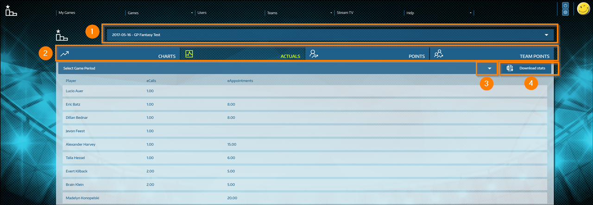
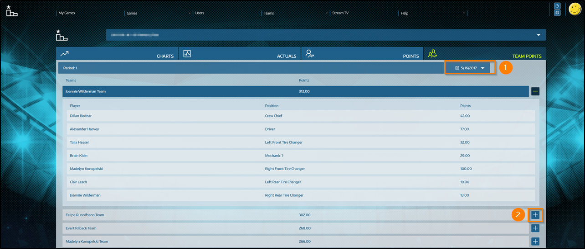

# Get insights into stats from other players and teams

In team games, it's critical to draft a decent roster that keeps you on-par with the competition. Player stats are a handy tool to check which teams perform well and find out how their roster looks like. Even when playing without teams, you can review stats of your fellow competitors and get insights into how many points they are scoring. Keep up your good work and go get'em!

To see player stats for active games, [sign in to Gamification](sign-in.md) and go to **Teams > Player Stats**. You'll see the following screen: 

 
1. Select the game to display the stats for.
2. When you go to **Player Stats**, you start on the **Actuals** section. Switch between the sections to see the different types of stats.
3. Choose the game period to display the stats for. 
4. Optionally, you can download the stats in an [!INCLUDE[pn-excel-short](../includes/pn-excel-short.md)] workbook to create your own charts or analysis from the available data points. 

## Charts section

Get a history chart for a specific user's performance in a set of KPIs. Above the sample chart, select a player and the KPIs you want to see on the chart. Then, select **Submit** to update the chart. 

## Actuals section

Review the actual numbers of other players. Select the game and game period to define the data set. To get an [!INCLUDE[pn-excel-short](../includes/pn-excel-short.md)] file with the current stats of all players in a game, select **Download stats**. 

## Points section

Review the total points of the players across all active KPIs as configured in the game setup. For example, if *Calls made* is a KPI and the game is configured to award 2 points per call, a player with 5 calls will show 10 points.    
Select the game and game period to define the data set. To get an [!INCLUDE[pn-excel-short](../includes/pn-excel-short.md)] file with the current stats of all players in a game, select **Download stats**.

## Team Points section

Ranking of the total points per team (depending on the game model). 

1. Select a game period for the selected game.
2. Select the  icon to see the team roster and each team member's contribution. 

### See also

[Overview for players and fans](for-players-fans.md)    
[Manage your team](manage-fantasy-team.md)    
[View a leaderboard](view-leaderboard.md)

[!INCLUDE[footer-include](../includes/footer-banner.md)]