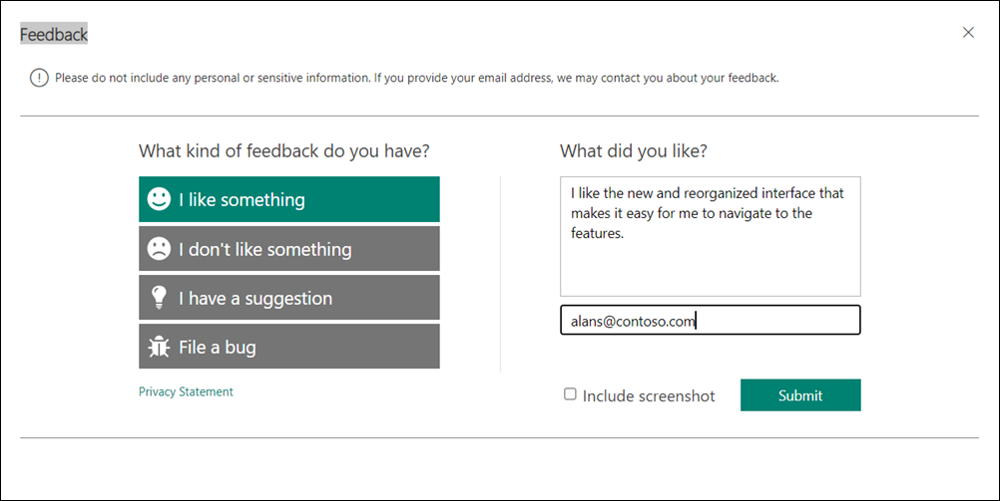

1. In one of the apps, on the top-right corner of the navigation bar, select the **Send Feedback** icon. The Feedback dialog displays the following options:
   
   - I like something
   - I don't like something
   - I have a suggestion
   - File a bug 

2. Select one of the options.
3. The app displays the What did you like? box. Optionally, you can enter additional information in this box.
4. Optionally, enter the mail ID of your choice. Microsoft Support might use the mail ID to contact you for more information.
5. Optionally, attach a screenshot that provides more information.
  
    

6. Select **Submit**.
