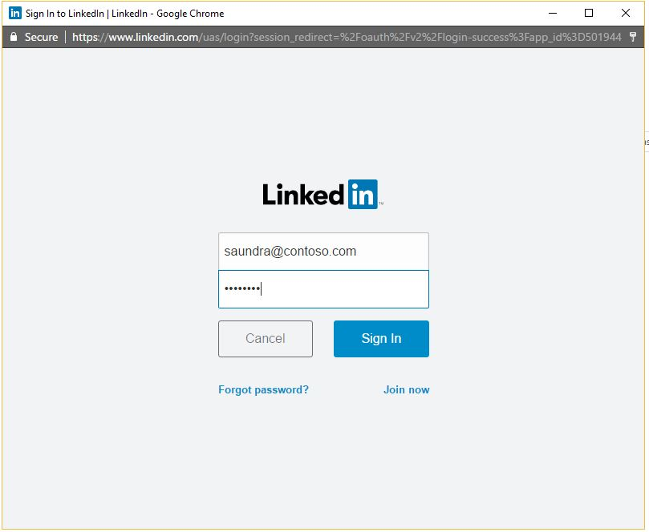
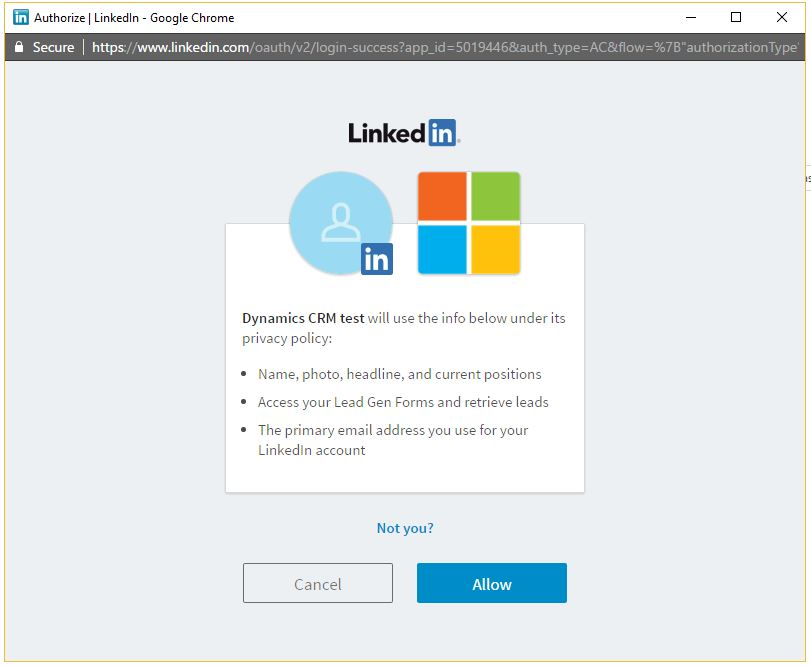
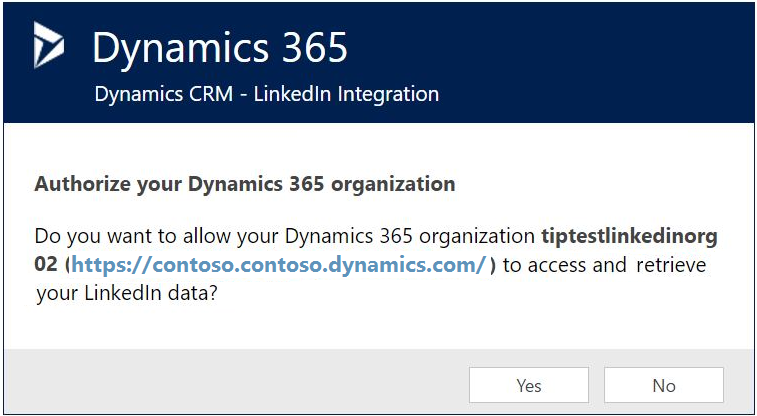

# Establish a connection between Dynamics 365 Connector for LinkedIn Lead Gen Forms and LinkedIn

Before we can sync leads from [!include[LinkedIn](../includes/pn-linkedin.md)] campaign accounts to a Dynamics 365 organization, a [!include[LinkedIn](../includes/pn-linkedin.md)] member with access to [!include[LinkedIn](../includes/pn-linkedin.md)] Campaign Manager is required to authorize their [!include[LinkedIn](../includes/pn-linkedin.md)] accounts in Dynamics 365 apps. This user requires at least a **[!include[LinkedIn](../includes/pn-linkedin.md)] Lead Gen Forms Connector Salesperson** security role.  

## Authorize Dynamics 365 apps to sync data from LinkedIn Campaign Manager

1. Go to **Sales** > **[!include[LinkedIn](../includes/pn-linkedin.md)] Lead Gen Forms** > **[!include[LinkedIn](../includes/pn-linkedin.md)] User Profile**.

2. To add a new [!include[LinkedIn](../includes/pn-linkedin.md)] user profile record, select **New**, enter a **Name**, and then select **Save**.

3. To add [!include[LinkedIn](../includes/pn-linkedin.md)] accounts to this user profile, select **Authorize**.

4. Enter the credentials for your [!include[LinkedIn](../includes/pn-linkedin.md)] profile, and then select **Sign In**.  
     

5. In the permissions dialog box, select **Allow**.  
     

6. Check and confirm the organization you want to sync your LinkedIn data to.  
   

After successful authorization, the [!include[LinkedIn](../includes/pn-linkedin.md)] accounts appear on the **[!include[LinkedIn](../includes/pn-linkedin.md)] User Profile** record. You can review the details of the [!include[LinkedIn](../includes/pn-linkedin.md)] accounts in the form. It might take a few seconds to get the accounts; try refreshing the view if you don’t see them.

[!include[LinkedIn](../includes/pn-linkedin.md)] form submissions are now synced automatically to the destination system. You’ll be able to see the data in Dynamics 365 apps as soon as the sync is complete, which might take a few minutes. 

## See the sync status for LinkedIn data

When you go to **Sales** > **LinkedIn Lead Gen** > **Sync Status**, you'll find an aggregated overview about the data that was pulled from all LinkedIn user profiles to Dynamics 365 Sales. At a glance, you can see when the most recent synchronization took place and find out how many leads were created or updated in total.

If you want to synchronize the LinkedIn data retroactively after migrating to a newly created Dynamics 365 organization, you can trigger an optional, on-demand sync of all data from [!include[LinkedIn](../includes/pn-linkedin.md)] by selecting **Reset Synchronization**. This will pull all lead data from LinkedIn again. We don't recommend this action if you already have a working synchronization set up because the matching will fail for all leads that were matched earlier. Additionally, it can take a long time to complete as it's syncing all leads again and thus shouldn't be used frequently.  

### See also

[How to sync LinkedIn leads by using Dynamics 365 Connector for LinkedIn Lead Gen Forms](sync-linkedin-leads.md)  
[Install Dynamics 365 Connector for LinkedIn Lead Gen Forms from AppSource](install-linkedin-connector.md)

[!INCLUDE[footer-include](../includes/footer-banner.md)]