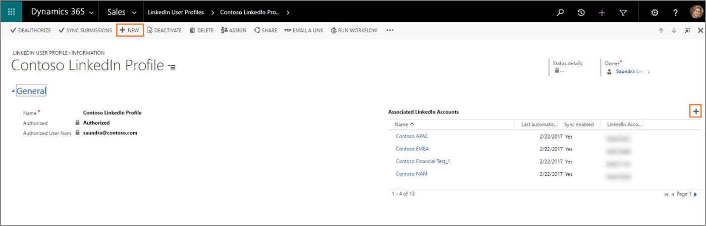

# Establish a connection between [!include[Dynamics 365 Connector for LinkedIn Lead Gen Forms](includes/pn-linkedin-solution.md)] and LinkedIn

[!include[Pre-release disclaimer](includes/cc-beta-prerelease-disclaimer.md)]

Before we can sync leads from [!include[LinkedIn](includes/tn-linkedin.md)] campaign accounts to a [!include[Dynamics 365](includes/pn-dynamics-crm.md)] organization, a [!include[LinkedIn](includes/tn-linkedin.md)] member with access to [!include[LinkedIn](includes/tn-linkedin.md)] Campaign Manager is required to authorize their [!include[LinkedIn](includes/tn-linkedin.md)] accounts in [!include[Dynamics 365 (online)](includes/pn-dyn-365-online.md)]. In [!include[Dynamics 365 (online)](includes/pn-dyn-365-online.md)], this user requires at least a **[!include[LinkedIn](includes/tn-linkedin.md)] Lead Gen Forms Connector Salesperson** security role.  
More information about assigning security roles to users: [TechNet: Create users and assign Microsoft Dynamics 365 (online) security roles](https://technet.microsoft.com/library/jj191623.aspx).

## Authorize [!include[Dynamics 365](includes/pn-dynamics-crm.md)] to sync data from [!include[LinkedIn](includes/tn-linkedin.md)] Campaign Manager

1. In [!include[Dynamics 365](includes/pn-dynamics-crm.md)], go to **Sales** > **[!include[LinkedIn](includes/tn-linkedin.md)] Lead Gen Forms** > **[!include[LinkedIn](includes/tn-linkedin.md)] User Profile**.
2. To add a new [!include[LinkedIn](includes/tn-linkedin.md)] user profile record, select **New**, enter a **Name**, and then select **Save**.
3. To add [!include[LinkedIn](includes/tn-linkedin.md)] accounts to this user profile, select **Authorize**.
4. Enter the credentials for your [!include[LinkedIn](includes/tn-linkedin.md)] profile, and then select **Sign In**.  
  

5. In the permissions dialog box, select **Allow**.  
  

6. Check and confirm the [!include[Dynamics 365](includes/pn-dynamics-crm.md)] organization you want to sync your LinkedIn data to.  

After successful authorization, the [!include[LinkedIn](includes/tn-linkedin.md)] accounts appear on the **[!include[LinkedIn](includes/tn-linkedin.md)] User Profile** record. You can review the details of the [!include[LinkedIn](includes/tn-linkedin.md)] accounts in the form. It might take a few seconds to get the accounts; try refreshing the view if you don’t see them.

[!include[LinkedIn](includes/tn-linkedin.md)] form submissions are now synced automatically to [!include[Dynamics 365](includes/pn-dynamics-crm.md)]. You’ll be able to see the data in [!include[Dynamics 365](includes/pn-dynamics-crm.md)] as soon as the sync is complete, which might take a few minutes. 
Usually it’s not required, but you can trigger an optional, on-demand sync of [!include[LinkedIn](includes/tn-linkedin.md)] form submissions after authorizing a profile by selecting **Sync submissions**.

### See also

[How to sync LinkedIn leads by using Dynamics 365 Connector for LinkedIn Lead Gen Forms](sync-linkedin-leads.md)  
[Install Dynamics 365 Connector for LinkedIn Lead Gen Forms from AppSource](install-linkedin-connector.md)