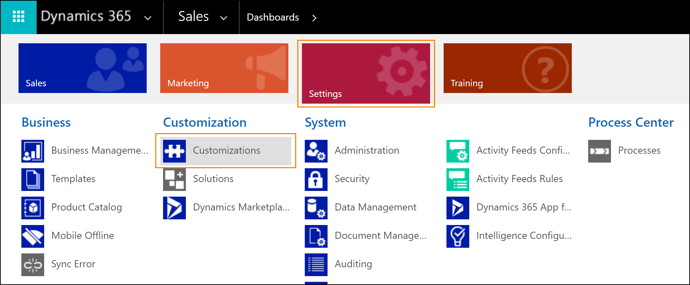
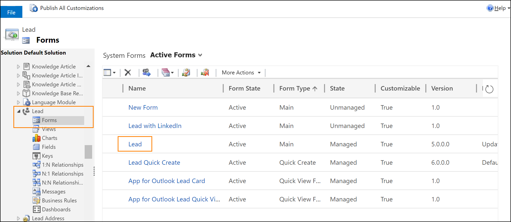
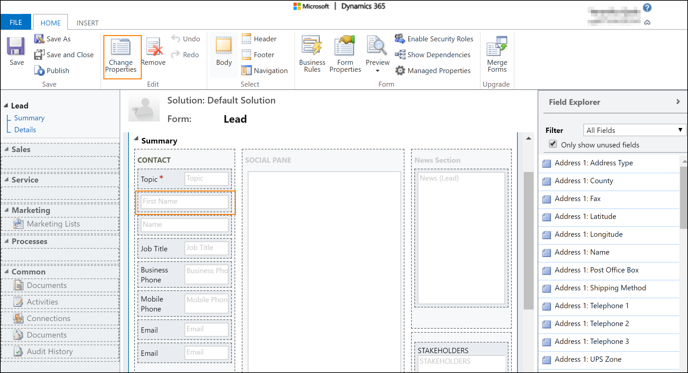
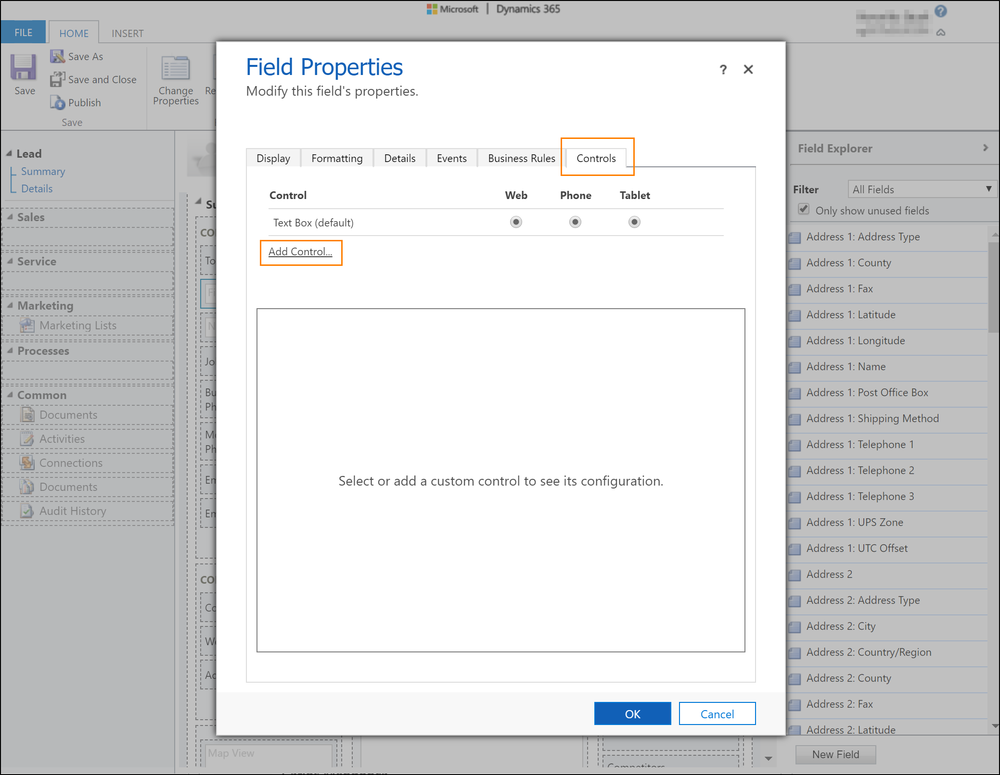
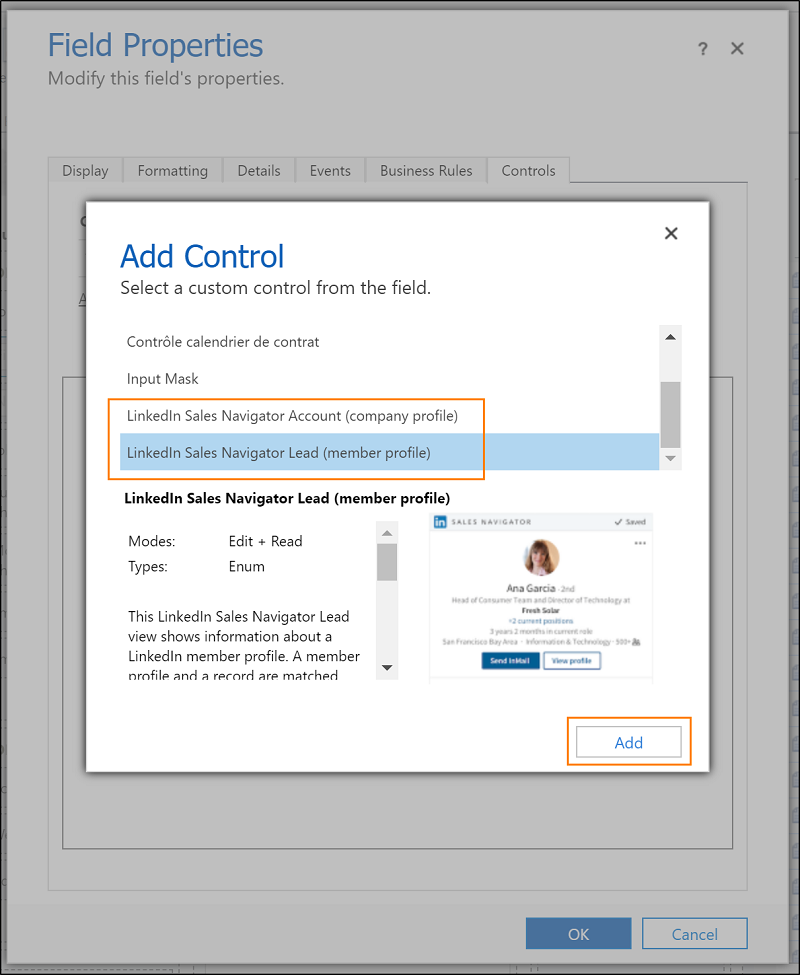
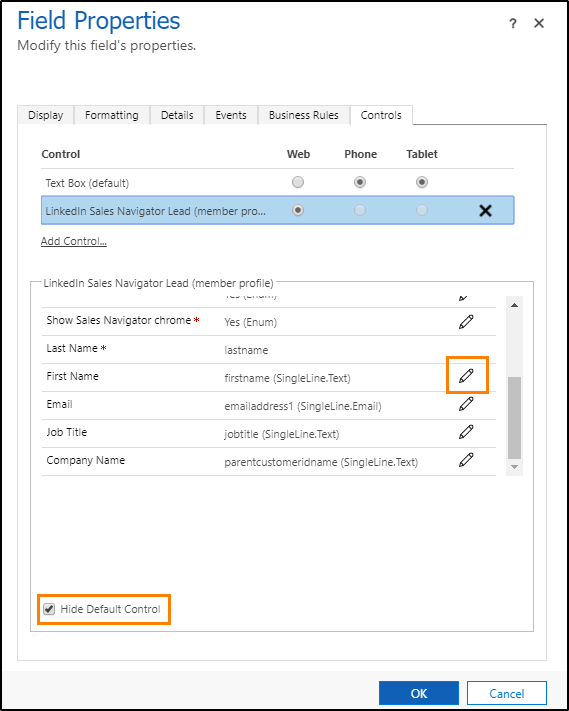
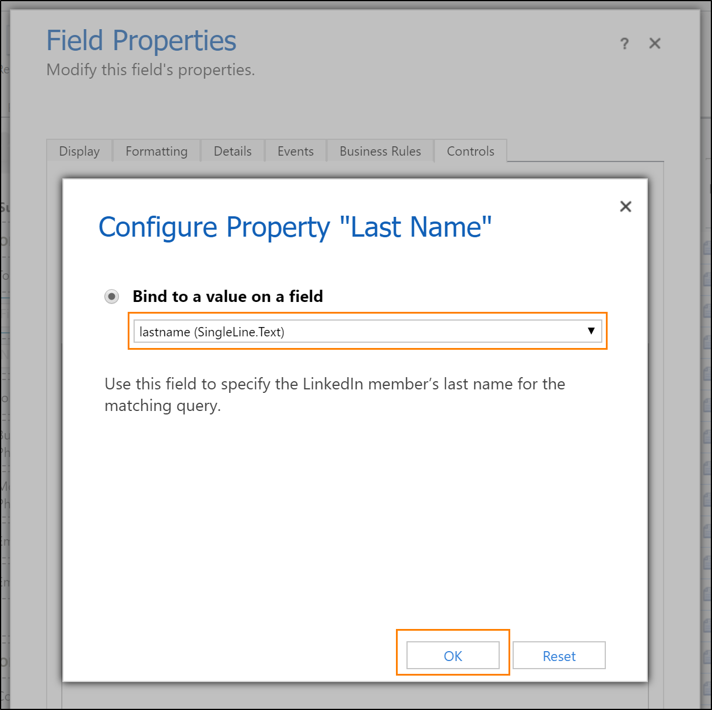
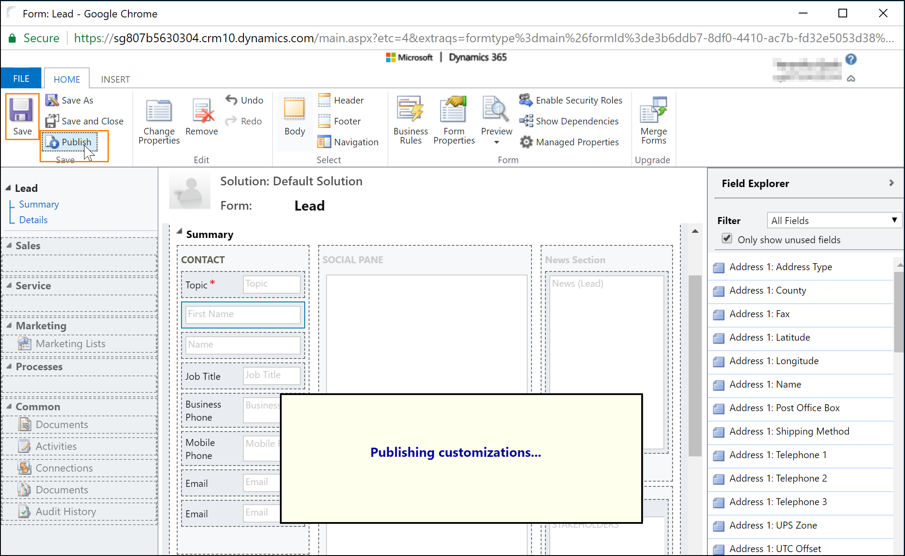

# Add LinkedIn Sales Navigator controls to forms

## Prerequisites

- [!INCLUDE[pn-linkedin](../includes/pn-linkedin.md)] Sales Navigator Controls for [!INCLUDE[pn-dynamics-365](../includes/pn-dynamics-365.md)] Unified Interface [is installed](install-sales-navigator.md) in [!INCLUDE[pn-dynamics-365](../includes/pn-dynamics-365.md)].
- You have Customizer or System Administrator security role in [!INCLUDE[pn-dynamics-365](../includes/pn-dynamics-365.md)]. 
- Your organization uses Unified Interface apps.
- To test the controls, you need to be a [!INCLUDE[pn-linkedin](../includes/pn-linkedin.md)] Sales Navigator seat holder.

## Add Sales Navigator controls to a form

You can [add custom controls](https://docs.microsoft.com/dynamics365/customer-engagement/customize/use-custom-controls-data-visualizations) to any form or entity in [!INCLUDE[pn-dynamics-365](../includes/pn-dynamics-365.md)] that contains a field for last name, primary contact, or account name. 
There are 4 different types of [!INCLUDE[pn-linkedin](../includes/pn-linkedin.md)] controls: 
 
- [!INCLUDE[pn-linkedin](../includes/pn-linkedin.md)] Sales Navigator Lead (member profile): Shows information about a [!INCLUDE[pn-linkedin](../includes/pn-linkedin.md)] member profile using a specific lead or contact name.
- [!INCLUDE[pn-linkedin](../includes/pn-linkedin.md)] Lead Lookup Control: Shows member profile information using the name of the primary contact related to the record.
- [!INCLUDE[pn-linkedin](../includes/pn-linkedin.md)] Sales Navigator Account (company profile): Shows information about a [!INCLUDE[pn-linkedin](../includes/pn-linkedin.md)] company profile using a specific account name. 
- [!INCLUDE[pn-linkedin](../includes/pn-linkedin.md)] Account Lookup Control: Shows company profile information using the account name related to the record.  

The Sales Navigator controls can be added by modifying field on a form in [!INCLUDE[pn-dynamics-365](../includes/pn-dynamics-365.md)]. Modify the following fields according to the control type.

| Sales Navigator Control                            | Field name to modify | Field type |
|----------------------------------------------------|----------------------|------------|
| LinkedIn Sales Navigator Lead (member profile)      | Last Name            | Text       |
| LinkedIn Lead Lookup Control                       | Primary Contact      | Lookup     |
| LinkedIn Sales Navigator Account (company profile) | Account Name         | Text       |
| LinkedIn Account Lookup Control                    | Account Name         | Lookup     |

In the procedure below, show an example on how to add a [!INCLUDE[pn-linkedin](../includes/pn-linkedin.md)] Sales Navigator Lead (member profile) on the **Lead** form by modifying **Last Name** field. 

1. In the web client of [!INCLUDE[pn-dynamics-365](../includes/pn-dynamics-365.md)], go to **Settings** > **Customizations**.

   

2. Select **Customize the System**.

3. Expand the **Entities** node and select the entity you want to customize. You can use any entity, but for this example, we'll select the **Lead** entity and expand the node.

4. Select **Forms** and then select the **Lead** form.

   

5. To add a custom control, begin by adding a new field to the form, which will be bound to the primary attribute of the control (last name for Lead control and company name for Account control). Simply drag the field from the Field Explorer on the right to the desired position. For this example, we will start by dragging the **Last Name** field to the form.

6. Select the **Last Name** field and then select **Change Properties** in the ribbon.
    > [!TIP]
    > By default, controls on the Unified Interface show in two columns with the label and value side by side. To maximize the control so that it takes the full horizontal space available on the column, clear the **Display label** on the form checkbox on the **Display** tab.

   

6. In the **Field Properties** window, switch to the **Control** tab and select **Add control...**.

   

7. Select the **[!INCLUDE[pn-linkedin](../includes/pn-linkedin.md)] Sales Navigator member profile** control and select **Add**.

   

8. Now you need to configure the Sales Navigator control.    
In the **Control** area, select **Web** form factor for the [!INCLUDE[pn-linkedin](../includes/pn-linkedin.md)] control. 
    > [!TIP]
    > Currently, the controls are available on desktop form factors. On mobile (phone and tablet) scenarios, the controls fallback to the default platform control. To hide the default controls from the forms on mobile scenarios, check the **Hide Default Control** checkbox.

   

9. In the property area, make sure all required properties (with a red asterisk) have a binding configured. You might need to scroll down in the list to find additional required properties. For this example, we need to configure one additional property. We recommend to bind the remaining parameters (first name, e-mail, job title, and company name) to the corresponding fields on the Lead entity. The more parameters are passed to the control, the greater will be the accuracy to find the right match.     
Select the **Last Name** property and select the  pencil icon. in the **Bind a value on a field** list, select **lastname (SingleLine.Text)** and select **OK**.

   

10. Select **Add** in the Field Properties window.

11. In the **Form Editor**, select **Save** to apply your changes to the form. 

12. Select **Publish** to make your customizations available to the organization.

### See also

[Overview for LinkedIn Sales Navigator solutions](integrate-sales-navigator.md)     
[Install and configure LinkedIn Sales Navigator Controls](install-sales-navigator.md)     
[Work with Sales Navigator controls on forms](view-sales-navigator-forms.md)