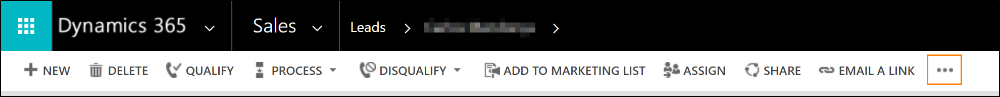
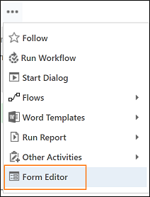

# Add LinkedIn Sales Navigator controls to form

## Prerequisites

- LinkedIn Sales Navigator for Microsoft Dynamics Version 2 is installed in Dynamics 365.
- You have Customizer or System Administrator securtiy role in Dynamics 365. 
- Your organization uses Unified Interface apps.
- To test the controls, you a LinkedIn Sales Navigator member seat.

## Add Sales Navigator member or account controls to a form

You can customize lead, account, and contact forms by adding LinkedIn controls.
There are two controls available: 
- Sales Navigator member profile: information related to a LinkedIn member, a person.
- Sales Navigator account profile: information related to a LinkedIn account, a company. 

For the steps below, we'll customize a first name field on a lead form. Customizing fields on other forms is similar, starting from step 3.

1. In the web client of Dynamics 365, go to Sales > Leads.

2. Select any existing lead.

3. On the lead form, select **More options**. 

4. In the menu, select **Form Editor**.

5. Select the **First Name** field and then select **Change Properties**.

6. In the **Field Properties** window, switch to the **Control** tab and select **Add control...**.

7. Select the **LinkedIn Sales Navigator member profile** control and select **Add**.

8. Now you need to configure the Sales Navigator control.    
In the **Control** area, select **Web** for the LinkedIn control. Phone and tablet aren't supported as of April 1 2018.

9. In the property area, make sure all required properties (with a red asterisk) have a binding configured. You might need to scroll down in the list to find additional required properties. For this example, we need to configure one additional property.    
Select the **Last Name** property and select the edit symbol. in the **Bind a value on a field** list, select **lastname (SingleLine.Text)** and select **OK**.

10. Select **Add** in the Field Properties window.

11. In the **Form Editor**, select **Save** to apply your changes to the form. 

12. Select **Publish** to make your customizations available to the organization.

## Available properties and bindings

### Member

- Show Top Card (required): yes/no
- Show News (required): yes/no
- Last Name: 
    - lastname
    - firstname
    - ...

### Account

- Show Top Card (required): yes/no
- Show News (required): yes/no
...

### See also
...