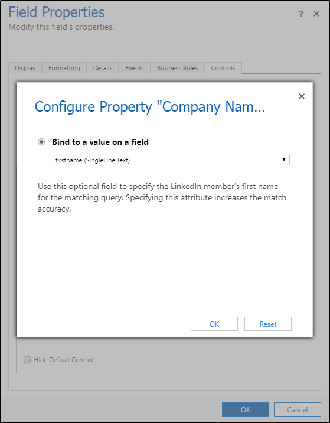

# Add LinkedIn Sales Navigator controls to forms

[comment]: <> (Todo: Tokens, Alt-text)

## Prerequisites

- LinkedIn Sales Navigator Controls for Dynamics 365 Unified Interface  is installed in Dynamics 365.
- You have Customizer or System Administrator security role in Dynamics 365. 
- Your organization uses Unified Interface apps.
- To test the controls, you need to be a LinkedIn Sales Navigator seat holder.

## Add Sales Navigator controls to a form

You can customize lead, account, and contact forms by adding LinkedIn controls.
You can [add two custom controls](https://docs.microsoft.com/dynamics365/customer-engagement/customize/use-custom-controls-data-visualizations) available: 
- LinkedIn Sales Navigator Lead (member profile): Shows information about a LinkedIn member profile.
- LinkedIn Sales Navigator Account (company profile): Shows information about a LinkedIn company profile. 

For the steps below, we'll customize a first name field on a lead form. Customizing fields on other forms is similar, starting from step 3.

1. In the web client of Dynamics 365, go to Sales > Leads.

2. Select any existing lead.

3. On the lead form, select **More options**. 

   

4. In the menu, select **Form Editor**.

   

5. Select the **First Name** field and then select **Change Properties**.
    > [!TIP]
    > By default, controls on the Unified Interface show in two columns with the label and value side by side. To maximize the control so that it takes the full horizontal space available on the column, uncheck the **Display label** on the form checkbox on the **Display** tab.

   

6. In the **Field Properties** window, switch to the **Control** tab and select **Add control...**.

   

7. Select the **LinkedIn Sales Navigator member profile** control and select **Add**.

   

8. Now you need to configure the Sales Navigator control.    
In the **Control** area, select **Web** for the LinkedIn control. 
    > [!TIP]
    > Currently, the controls are available on desktop form factors. On mobile (phone and tablet) scenarios, the controls fallback to the default platform control. To hide the default controls from the forms on mobile scenarios, check the **Hide Default Control** checkbox.

   

9. In the property area, make sure all required properties (with a red asterisk) have a binding configured. You might need to scroll down in the list to find additional required properties. For this example, we need to configure one additional property. We recommend to bind the remaining parameters (first name, e-mail, job title, and company name) to the corresponding fields on the Lead entity. The more parameters are passed to the control, the greater will be the accuracy to find the right match.     
Select the **Last Name** property and select the  pencil icon. in the **Bind a value on a field** list, select **lastname (SingleLine.Text)** and select **OK**.

   

10. Select **Add** in the Field Properties window.

11. In the **Form Editor**, select **Save** to apply your changes to the form. 

12. Select **Publish** to make your customizations available to the organization.

### See also

[Overview for LinkedIn Sales Navigator solutions](integrate-sales-navigator.md)     
[Learn how to install and configure the solution.](integrate-sales-navigator.md)     
[Sign in to your LinkedIn account to see Sales Navigator controls on form.](view-sales-navigator-forms.md)