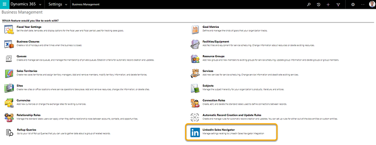

# Disable LinkedIn Sales Navigator

Disabling the integration will stop showing the Sales Navigator controls.

1. In your app, select **Settings** , and then select **Advanced Settings**.

    > [!div class="mx-imgBorder"]  
    > 

    The **Business Management settings** page opens in a new browser tab.

2. Select **LinkedIn Sales Navigator**.

    > [!div class="mx-imgBorder"]  
    > 

3. Turn off the **Enable Sales Navigator integration** toggle.

    > [!div class="mx-imgBorder"]  
    > 

4. Select **OK**.

### See also

[Install and enable LinkedIn Sales Navigator](install-sales-navigator.md)  
[Uninstall LinkedIn Sales Navigator](uninstall-sales-navigator.md)

[!INCLUDE[footer-include](../includes/footer-banner.md)]