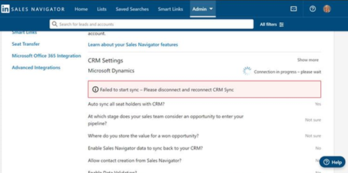
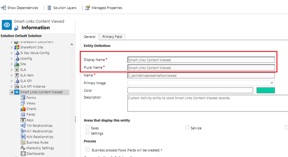
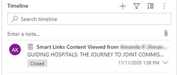
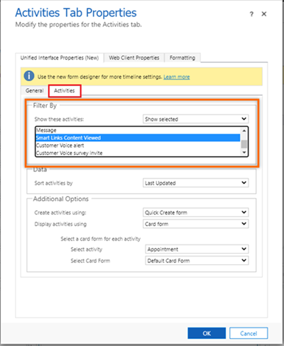

# Frequently asked questions

**Is the LinkedIn Sales Navigator solution available for Dynamics 365 Sales Professional?**   
**Answer:**   
Yes, the LinkedIn Sales Navigator solution is available for Dynamics 365 Sales Professional. Administrator must [integrate the solution](integrate-sales-navigator.md) with your sales professional app and [add the controls to forms](add-sales-navigator-controls-forms.md).   

**Why am I unable to sync or load photos of my contacts from LinkedIn to the org chart?**     
**Answer:**    
Currently, we don't support syncing or loading contact profile pictures from LinkedIn to the org chart. The org chart displays only the pictures that are stored in Dynamics 365 for contact records. 

**Why am I unable to remove or add fields to a contact through the Contact Details side pane after selecting nodes in the org chart?**      
**Answer:**     
Removing or adding fields from the **Contact Details** pane isn't supported.

**Can I import leads or accounts into Dynamics 365 Sales through CRM Sync?**     
**Answer:**     
No, you can't import leads or accounts from Sales Navigator to Dynamics 365 Sales through CRM Sync. However, writeback of InMails, Messages, and Smart Links from Sales Navigator to Dynamics 365 Sales is supported. More information: [Enable Sales Navigator CRM Sync & Activity Writeback for Microsoft Dynamics 365 Sales](https://business.linkedin.com/sales-solutions/sales-navigator-customer-hub/resources/ms-dynamics-sync-activity-writeback)    

**Why hasn't my LinkedIn Sales Navigator solution been upgraded from version 2.x to 3.x?**    
**Answer:**     
Because there's no change to functionality in version 3.x, we aren't upgrading. This will have no effect on your current solution (version 2.x).    

**Why am I unable to sync a Dynamics 365 organization with LinkedIn Sales Navigator on the Admin tab? I get an error message saying that the start of the sync has failed.**    
> [!div class="mx-imgBorder"]  
>    

**Answer:**    
The error is from the LinkedIn Sales Navigator application. Contact [LinkedIn Sales Navigator](https://www.linkedin.com/help/sales-navigator/answer/a107028) support to resolve the issue. 

**Why am I unable to sign in to LinkedIn with Safari?**     
**Answer:**    
Dynamics 365 doesn't own the sign in of users from the display widget. Contact the [LinkedIn Sales Navigator](https://www.linkedin.com/help/sales-navigator/answer/a107028) support to resolve the issue.    

**Why is an incorrect name displayed as the owner of the record instead of my name when I create contact in LinkedIn Sales Navigator?**    
**Answer:**     
Dynamics 365 doesn't own the process of contact creation in LinkedIn Sales Navigator. Contact [LinkedIn Sales Navigator](https://www.linkedin.com/help/sales-navigator/answer/a107028) support to resolve the issue. 

**Why can't I enable CRM sync for a seat in LinkedIn Sales Navigator?**    
**Answer:**    
The issue might occur due to the mismatch of the user's email in Dynamics 365 and LinkedIn Sales Navigator. To resolve the issue, follow the steps described in [How Do I Enable CRM Sync if a User's Email is Mismatched?](https://www.linkedin.com/help/sales-navigator/answer/a162746).     
If the issue persists, contact [LinkedIn Sales Navigator](https://www.linkedin.com/help/sales-navigator/answer/a107028) support.

**Why am I unable to write back inMails and messages from LinkedIn Sales Navigator to Dynamics 365? The Copy message to CRM option is unavailable.**     
> [!div class="mx-imgBorder"]  
>    

**Answer:**     
The issue has occurred due to the insufficient permissions in your user account to write back to Dynamics 365 from LinkedIn Sales Navigator. Contact [LinkedIn Sales Navigator](https://www.linkedin.com/help/sales-navigator/answer/a107028) support to resolve the issue.

**Does Dynamics 365 on-premise version 9.0 with LinkedIn Sales Navigator have the CRM sync capability enabled?**    
**Answer:**     
The on-premise Microsoft Dynamics 2016 and above versions doesn’t support CRM sync and related functionalities. More information: [Prerequisites for CRM sync and write back](https://business.linkedin.com/sales-solutions/sales-navigator-customer-hub/resources/ms-dynamics-sync-activity-writeback#prerequisites).

**Why is Smart Links activity labeled as PointDrive?**      
**Answer:**     
In Dynamics 365, for LinkedIn 3.x solution, only the label is changed from PointDrive to Smart Links and the functionality remains the same. If you're using the LinkedIn solution version 2.x, then we recommend you to change the label manually through customizations by the system administrator or customizer. Follow these steps to change the label:     

1.	Sign into your Dynamics 365 app.    
2.	Go to **Advanced Settings** > **Customizations** > **Customize the System**.    
3.	From the **Entities** site map, select the **PointDrive Presentation Viewed** entity.      
    > [!div class="mx-imgBorder"]
    >      
4.	Change the label for **Display Name** and **Plural Name** to **Smart Links Content Viewed**.    
    > [!div class="mx-imgBorder"]
    >      
5.	Save and publish the customizations.     
6.	Browse an entity record, verify the **Timeline** wall and the Smart Links label appears.     
    > [!div class="mx-imgBorder"]
    >      

**How can I show a Smart Links activity on the Timeline wall?**    
**Answer:**    
If you have properly configured the CRM sync and activity writeback, the Smart Links activity will successfully write back from LinkedIn Sales Navigator to Dynamics 365 and appears on the Timeline wall. If the Smart Links activities don't appear on the Timeline wall, follow these steps:    

1.	Sign into your Dynamics 365 app.   
2.	Go to **Advanced Settings** > **Customizations** > **Customize the System**.      
3.	From the **Entities** site map, select the entity (Contact or Lead) and then form for which you want to configure **Timeline** wall.     
4.	On the entity form, under the **SOCIAL PANE** tab, select **Notes Properties** and then select **Change Properties**.     
    > [!div class="mx-imgBorder"]
    >      
    The **Activities Tab Properties** window opens.    
5.	In the **Activities Tab Properties** window, under **Unified Interface Properties (New)** tab, select **Activities** subtab.     
6.  In the **Filter By** section, select the following options:    
    - From the **Show these activities** list, select **Show selected**.
    - From the options, press **Ctrl** and then select the **Smart Links Content Viewed** activity.    
    > [!div class="mx-imgBorder"]
    >          
7.  Select **OK** and then save and publish the customizations.

### See also

[Troubleshooting LinkedIn integration errors](ts-linkedin-integration.md)
