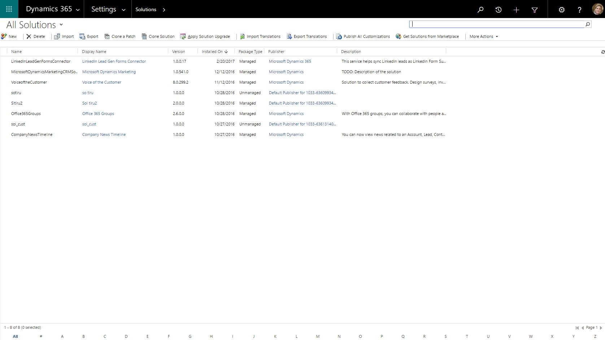

# Install Dynamics 365 Connector for LinkedIn Lead Gen Forms from AppSource

To enable the synchronization of lead data from [!include[LinkedIn](../includes/pn-linkedin.md)] to Dynamics 365 apps, a system administrator needs to install the connector from [Microsoft AppSource](https://go.microsoft.com/fwlink/p/?linkid=850928).

> [!IMPORTANT]
> You can benefit from this connector when you use [!include[LinkedIn](../includes/pn-linkedin.md)] advertising campaigns that generate leads, such as [Sponsored Content](https://business.linkedin.com/marketing-solutions/native-advertising/), [Sponsored InMail](https://business.linkedin.com/marketing-solutions/sponsored-inmail), or [Dynamic Ads](https://business.linkedin.com/marketing-solutions/dynamic-ads).

## Prerequisites

* To install, update, or remove the solution, you’ll need global admin permissions in Microsoft 365, and be a system administrator or have a customizer security role in Dynamics 365 apps.

* To sync leads from [!include[LinkedIn](../includes/pn-linkedin.md)] and run campaigns on [!include[LinkedIn](../includes/pn-linkedin.md)], you need access to a [!include[LinkedIn](../includes/pn-linkedin.md)] Advertising Account that can manage ads by using [!include[LinkedIn](../includes/pn-linkedin.md)] Campaign Manager.    
  More information: [LinkedIn: Campaign Manager Overview](https://www.linkedin.com/help/lms/answer/56969), [LinkedIn: Creating an Account for Campaigns](https://www.linkedin.com/help/lms/topics/8121/8122/5749), [LinkedIn: Adding, Editing, and Removing User Permissions on Advertising Accounts](https://www.linkedin.com/help/lms/answer/5753)

* We recommend using the latest version of [!include[Edge](../includes/pn-microsoft-edge.md)], [!include[Chrome](../includes/tn-google-chrome.md)], [!include[Firefox](../includes/tn-mozilla-firefox.md)], or [!include[Safari](../includes/tn-apple-safari.md)].

## Download and install the solution from AppSource

First, an administrator needs to install the solution.

1. Get the app package from [Microsoft AppSource](https://go.microsoft.com/fwlink/p/?linkid=850928).

2. Sign in to your Dynamics 365 system admin account.

3. Select **Get** to start installing the solution.

4. Review and accept the disclaimer, required permissions, and service terms to install the connector. You need to be a global admin in this Microsoft 365 tenant to authorize S2S inbound. More information about S2S: [MSDN: Build web applications using Server-to-Server (S2S) authentication](/previous-versions/dynamicscrm-2016/developers-guide/mt790168(v=crm.8))  
   It takes a few minutes to install the solution. To monitor the status of the installation, or update or remove a managed solution, go to the [Microsoft 365 admin center](https://admin.microsoft.com/).
   More information: [TechNet: Use the Microsoft 365 admin center to manage your subscription](/power-platform/admin/use-office-365-admin-center-manage-subscription).

5. In Dynamics 365 Sales, go to **Settings** > **Customization** > **Solutions** and select **LinkedIn Lead Gen Forms Connector** to see the solution details.  
   

6. The solution creates two new security roles, which you assign to users so they can work with [!include[LinkedIn](../includes/pn-linkedin.md)] Lead Gen Forms in Dynamics 365 apps. A third role, **LinkedIn Lead Gen S2S Inbound**, is an internal security role used by the solution to sync data.

* **[!include[LinkedIn](../includes/pn-linkedin.md)] Lead Gen Forms Administrator**&mdash;Users with this role can configure lead matching strategies, [!include[LinkedIn](../includes/pn-linkedin.md)] field mapping, and solution settings for the connector.

* **[!include[LinkedIn](../includes/pn-linkedin.md)] Lead Gen Forms Salesperson**&mdash;These users can authorize [!include[LinkedIn](../includes/pn-linkedin.md)] user profiles to sync data to Dynamics 365, and view details about the synced submissions.

Assign these security roles to users you want to provide access to the **[!include[LinkedIn](../includes/pn-linkedin.md)] Lead Gen** menu item. To learn how to assign a security role to users, see [TechNet: Create users and assign security roles](/power-platform/admin/create-users-assign-online-security-roles#BKMK_AssignSecurity).

More information about installing or removing a solution: [TechNet: Install or remove a preferred solution](/previous-versions/dynamicscrm-2016/administering-dynamics-365/dn878909(v=crm.8)).

## Update the solution

After installing the solution, you can visit the [Microsoft 365 admin center](https://admin.microsoft.com/) to see if an update is available. You'll need global admin permissions to start the update process.

1. Go to the [Microsoft 365 admin center](https://admin.microsoft.com/) and sign in with your global admin credentials.

2. Under **Admin centers**, select **Dynamics 365**. 

3. In the **Dynamics 365 Administration Center**, select the **Instances** tab.

4. Under **Solutions**, click **Manage your solutions**.

5. Select **LinkedIn Lead Gen Forms** and click **Upgrade**.

6. Review the **Terms of service** and click **Upgrade**.

### See also

[Configure a matching strategy to update leads from LinkedIn Lead Gen ads](configure-matching-strategy.md)  
[How to sync LinkedIn leads by using Dynamics 365 Connector for LinkedIn Lead Gen Forms](sync-linkedin-leads.md)

[!INCLUDE[footer-include](../includes/footer-banner.md)]