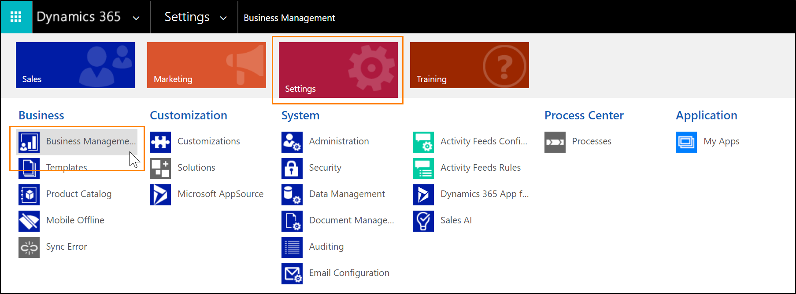
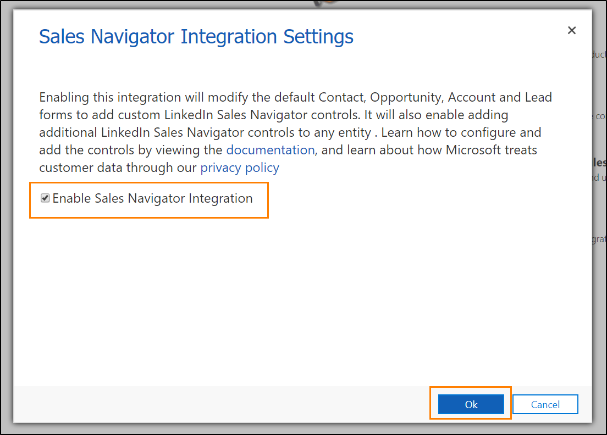

# Install, enable, and disable default LinkedIn Sales Navigator controls

## Prerequisites

- You have a System Administrator security role in [!INCLUDE[pn-dynamics-365](../includes/pn-dynamics-365.md)]. 
- You have a [Microsoft Relationship Sales subscription](https://dynamics.microsoft.com/sales/relationship-sales/) for Dynamics 365   
--OR--   
You will need to sign your team up for [LinkedIn Sales Navigator Team](https://business.linkedin.com/sales-solutions) or [LinkedIn Sales Navigator Enterprise](https://business.linkedin.com/sales-solutions).    
  We recommend having a Sales Navigator Administrator + Team Member seat to complete the installation. However, you may use a Sales Navigator Administrator seat.
- You will need to enable JavaScript in your browser.
- You will need to disable your pop-up blocker for the [!INCLUDE[pn-dynamics-365](../includes/pn-dynamics-365.md)] domain.

## Newly created orgs and orgs without LinkedIn solutions

After June 2019 (build version > 9.1.0.6228), we changed the way the LinkedIn Sales Navigator integration is rolled out to organizations. By default, no LinkedIn solutions are auto-installed anymore. An administrator needs to install the solution package before other users can work with them. 

### To install the Sales Navigator integration

1.	In your app, select the **Settings** icon, and then select **Advanced Settings**.

    > [!div class="mx-imgBorder"]  
    > 
    
    The **Business Management settings** page opens in a new browser tab.

2. Select **LinkedIn Sales Navigator**.
3. In the new **Installation** tab that opens, select **Continue** to install the required solutions. It takes a few minutes to complete the installation.
4. When the installation is completed, select **Go to Configuration** and follow the steps below to [Enable the default Sales Navigator controls](#enable-the-default-sales-navigator-controls).

After a successful installation, the Solutions page in the Admin Center lists three solutions related to LinkedIn Sales Navigator.

## Enable the default Sales Navigator controls

The following procedure guides administrators to enable default controls for LinkedIn Sales Navigator content. The Sales Navigator controls will appear on Account, Contact, Lead, and Opportunity pages by default. However, you can still customize other forms and entities to show Sales Navigator controls.

1.	In your app, select the **Settings** icon, and then select **Advanced Settings**.

    > [!div class="mx-imgBorder"]  
    > 

    The **Business Management settings** page opens in a new browser tab.

   
   
2. Select **LinkedIn Sales Navigator**.
3. Select the **Enable Sales Navigator integration** control.
   > [!div class="mx-imgBorder"]
   > 
4. Select **Ok** to enable the integration.

## Disable the default Sales Navigator controls

Disabling the integration will stop showing the Sales Navigator controls. 

1.	In your app, select the **Settings** icon, and then select **Advanced Settings**.

    > [!div class="mx-imgBorder"]  
    > 
    
    The **Business Management settings** page opens in a new browser tab.

2. Select **LinkedIn Sales Navigator**.
3. Select the **Enable Sales Navigator integration** control.
4. Select **Ok** to disable the integration.

## See profile pictures for matched leads and contacts

For leads and contacts that are matched to a LinkedIn member profile, the system can show profile pictures from LinkedIn. 

1.	In your app, select the **Settings** icon, and then select **Advanced Settings**.

    > [!div class="mx-imgBorder"]  
    > 
    
    The **Business Management settings** page opens in a new browser tab.

2. Select **LinkedIn Sales Navigator**.
3. Select the **Photo refresh** control.
4. Select **Ok** to enable the display of profile pictures.

To enable the display of profile image in the contact or lead form, you must enable **Sales Navigator CRM sync** in the LinkedIn Sales Navigator settings. For more information how to enable CRM sync, see [Integration between Sales Navigator and your CRM](https://www.linkedin.com/help/sales-navigator/answer/82207/integration-between-sales-navigator-and-your-crm-overview).

Please note that only profile pictures for matched leads and contacts can be captured from LinkedIn. 

> [!NOTE]
> The profile picture from Linkedin for a matched contact or lead is only shown in the out-of-the-box Contact or Lead form in the apps built on the Unified Interface.

## Existing orgs that got updated with April 19 features

In the [April 19 release](https://docs.microsoft.com/power-platform/admin/preview-october-2019-updates#when-will-the-2019-release-wave-2-features-be-enabled) we introduced changes to how the Sales Navigator controls are enabled.   
   
Here are a few things to consider if you don't plan to enable the integration. 
   
1. Three solutions related to the LinkedIn integration appear in the **All Solutions** view in **Settings** > **Customizations** > **Solutions**. Although these solutions are pre-installed, the functionality and data transfer between the two systems will be disabled unless you [enable the Sales Navigator controls](#enable-the-default-sales-navigator-controls). Additionally, **CRM Sync** needs to be explicitly enabled on the LinkedIn Sales Navigator Admin Settings. 

   > [!div class="mx-imgBorder"] 
   > 

2. System customizers will see the new LinkedIn controls in Account, Contact, Lead, and Opportunity form editors. However, their default visibility is turned OFF and end users will not be able to see these controls on the forms unless the feature is enabled by a system administrator. Customizers can remove these controls from the pages as they would remove any control in case they find it too distracting.  

   > [!div class="mx-imgBorder"] 
   > 

3. While using **Advanced Find**, end users see the new entities introduced by these solutions (InMails, Messages, and PointDrive Presentation Viewed) even if the integration is not enabled. This is the intended behavior and users can ignore these entities if they are not actively using the LinkedIn Sales Navigator integration.

### See also

[Overview for LinkedIn Sales Navigator solutions](integrate-sales-navigator.md)     
[Customize forms to show Sales Navigator controls](add-sales-navigator-controls-forms.md)    
[Work with Sales Navigator controls on forms](view-sales-navigator-forms.md)
