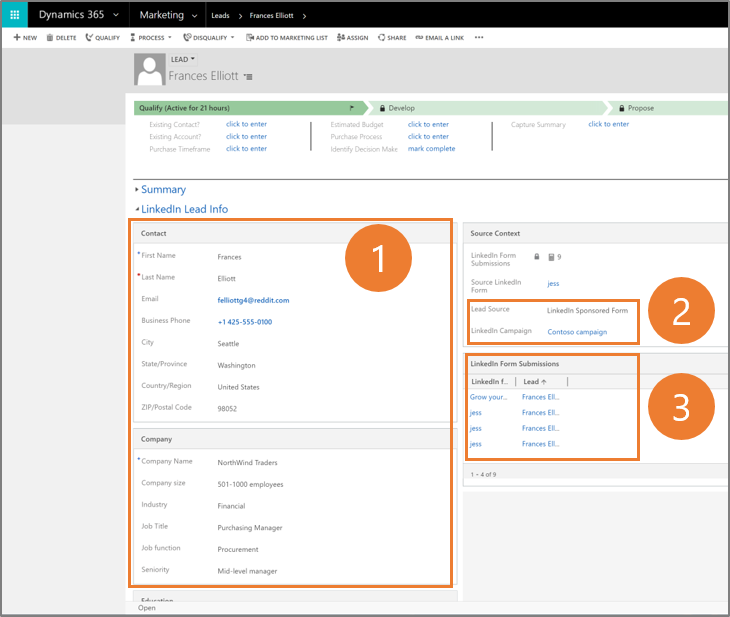
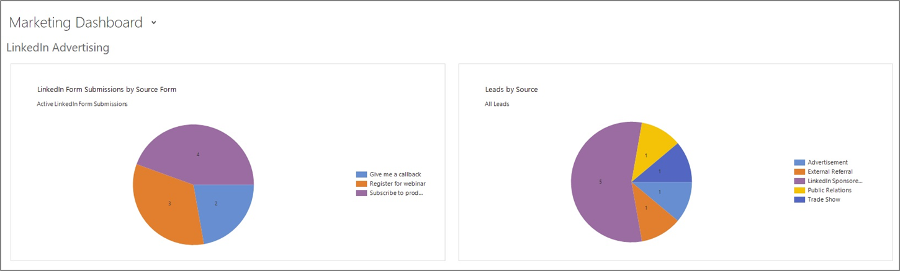
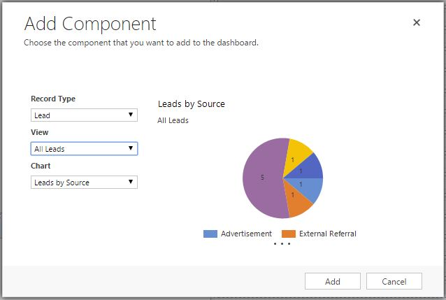
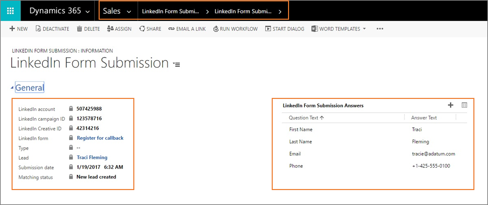

# Analyze leads and lead performance

When a [!include[LinkedIn](../includes/pn-linkedin.md)] lead matches a lead record in Dynamics 365 Sales, the lead record is updated with additional information. In addition to the updates of individual lead records, charts on dashboards can represent the performance of a marketing campaign on [!include[LinkedIn](../includes/pn-linkedin.md)].

## See the details of a lead

To see the details of a lead record, go to **Sales** > **Leads** and select the lead record from the list. If the lead was created by the connector, the lead source is **[!include[LinkedIn](../includes/pn-linkedin.md)] Sponsored Content**. If an existing lead record was updated, the system updates the lead field values by using the information submitted by the lead on [!include[LinkedIn](../includes/pn-linkedin.md)].
More information about creating or editing a lead: [Create or edit a lead](../sales-enterprise/create-edit-lead-sales.md).

1. Information about the lead from [!include[LinkedIn](../includes/pn-linkedin.md)]
2. Source from which the lead originated and the [!include[LinkedIn](../includes/pn-linkedin.md)] campaign related to this lead
3. Forms submitted by this lead

## Review the aggregated lead performance

Work with a dashboard containing charts about the source of new leads, or create new dashboards by using the charts that matter the most to get your reporting completed. 

When you create your own dashboard, consider adding a chart for the record type **[!include[LinkedIn](../includes/pn-linkedin.md)] Form Submissions** to see how your campaigns perform compared to each other. Or, you can create a **Leads by Source** chart for the record type **Lead**. Give it a try!

More information about building custom dashboards: [Create or customize dashboards](/previous-versions/dynamicscrm-2016/admins-customizers-dynamics-365/mt826623(v=crm.8)) and [Manage dashboard components](/previous-versions/dynamicscrm-2016/admins-customizers-dynamics-365/mt826584(v=crm.8)).

## Analyze individual LinkedIn Lead Gen forms and submissions

To see all form submissions, go to **Sales** > **[!include[LinkedIn](../includes/pn-linkedin.md)] Lead Gen** > **[!include[LinkedIn](../includes/pn-linkedin.md)] Form Submissions**. You can drill down to individual submissions to see the details of the lead and the information provided by the [!include[LinkedIn](../includes/pn-linkedin.md)] members when they answered the underlying [!include[LinkedIn](../includes/pn-linkedin.md)] Lead Gen form. 

## Establish and grow relationships with [!include[LinkedIn](../includes/pn-linkedin.md)] Sales Navigator

The [LinkedIn Sales Navigator for Microsoft Dynamics](https://appsource.microsoft.com/product/dynamics-365/linkedin.acdbc404-e99f-4c3e-927f-52fa28a6a682) is an additional integration with separate requirements which might be a useful addition if your organization is already using [!include[LinkedIn](../includes/pn-linkedin.md)] Sales Navigator.

To find out more about the capabilities or request a demo, head over to [Sales Navigator from LinkedIn Sales Solutions](https://business.linkedin.com/sales-solutions/sales-navigator). 

Learn how to install the solution on the [LinkedIn Sales Navigator help center](https://www.linkedin.com/help/sales-navigator/answer/56320/linkedin-for-microsoft-dynamics-crm).

### See also

[Establish a connection between Dynamics 365Connector for LinkedIn Lead Gen Forms and LinkedIn](connect-dynamics-365-linkedin.md)  
[Configure a matching strategy to update leads from LinkedIn Lead Gen ads](configure-matching-strategy.md)

[!INCLUDE[footer-include](../includes/footer-banner.md)]