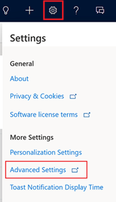

# Enable the display of LinkedIn profile pictures for matched leads and contacts

For leads and contacts that are matched to a LinkedIn member profile, the system can show profile pictures from LinkedIn. 

1.	In your app, select the **Settings** icon, and then select **Advanced Settings**.

    > [!div class="mx-imgBorder"]  
    > 
    
    The **Business Management settings** page opens in a new browser tab.

2. Select **LinkedIn Sales Navigator**.
3. Select the **Photo refresh** control.
4. Select **Ok** to enable the display of profile pictures.

To enable the display of profile image in the contact or lead form, you must enable **Sales Navigator CRM sync** in the LinkedIn Sales Navigator settings. For more information how to enable CRM sync, see [Integration between Sales Navigator and your CRM](https://www.linkedin.com/help/sales-navigator/answer/82207/integration-between-sales-navigator-and-your-crm-overview).    

If you are unable to see the profile picture in custom forms, perform the steps as defined in the [Unable to view photos on custom contact and lead forms](ts-linkedin-integration.md#unable-to-view-photos-on-custom-contact-and-lead-forms-in-unified-interface) section.    

> [!NOTE]
> - Only profile pictures for matched leads and contacts can be captured from LinkedIn.
> - The profile picture from LinkedIn for a matched contact or lead is only shown in the out-of-the-box Contact or Lead form in the apps built on Unified Interface.

### See also

[Install and enable LinkedIn Sales Navigator](install-sales-navigator.md)    

[!INCLUDE[footer-include](../includes/footer-banner.md)]
