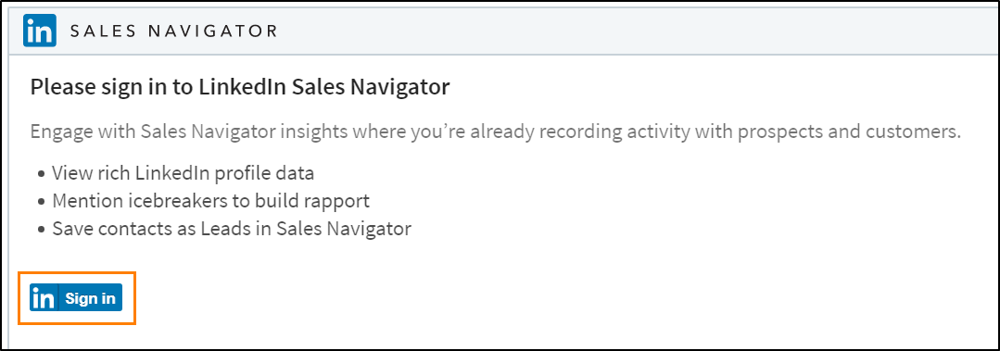
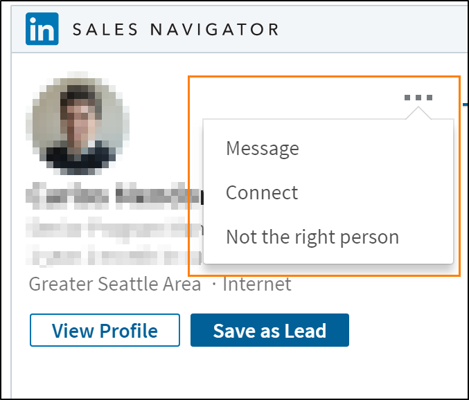
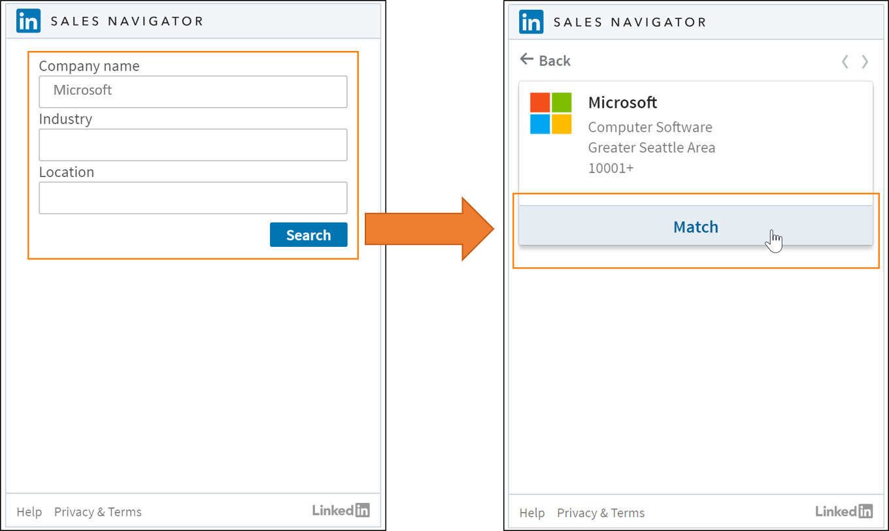

# View Sales Navigator controls on forms

To use the Sales Navigator controls, an admin needs to [enable the Sales Navigator integration](install-sales-navigator.md) and you need to be a [LinkedIn Sales Navigator Seat Holder](https://www.linkedin.com/help/sales-navigator/answer/50233/adding-or-removing-seat-holders-in-sales-navigator). To customize the form with Sales Navigator controls [a customizer needs to add the controls to a form](add-sales-navigator-controls-forms.md). 

## View controls on the form

1. In [!INCLUDE[pn-dynamics-365](../includes/pn-dynamics-365.md)], open the Sales app. 

2. If your organization has added [!INCLUDE[pn-linkedin](../includes/pn-linkedin.md)] controls to any of their forms, you'll find the controls embedded on the form. A system administrator or customizer can [add the controls to forms](add-sales-navigator-controls-forms.md).

3. If you haven't signed in to [!INCLUDE[pn-linkedin](../includes/pn-linkedin.md)] Sales Navigator, select the **Sign in** button in the control and give the requested permissions to the app. 

  

## Work with the Sales Navigator controls

Both Lead and Account controls work by matching certain input parameters received from [!INCLUDE[pn-dynamics-365](../includes/pn-dynamics-365.md)] with [!INCLUDE[pn-linkedin](../includes/pn-linkedin.md)] member profiles and companies, such as: 

- [!INCLUDE[pn-linkedin](../includes/pn-linkedin.md)] Sales Navigator Lead control: last name (primary), first name, email, job title, company name, and [more fields from LinkedIn](https://www.linkedin.com/help/sales-navigator/answer/79552) 

 [!INCLUDE[pn-linkedin](../includes/pn-linkedin.md)] Sales Navigator Account control: company name (primary), company website, and [more fields from LinkedIn](https://www.linkedin.com/help/sales-navigator/answer/79552) 

Once a match is found, the control will show related information about the member or company profile and will persist when you load the form again. Optionally, you can save recommended leads as new leads in Sales Navigator.

### Select the right match from multiple matches

If the system can't find a unique match for a person's profile, it will suggest potential matches. 

Select **Match** on the correct profile to map it to the related record. 

### Change the incorrect matching

If the control doesn't load the correct profile on the first match, you can change the matching permanently. 

1. Select the “…” (more commands) menu.
2. Select the **Not the right person** option. 
3. Find the correct match on [!INCLUDE[pn-linkedin](../includes/pn-linkedin.md)] with the search interface. 
4. Additionally, you can send [!INCLUDE[pn-linkedin](../includes/pn-linkedin.md)] members a request to **Connect** or **Message** them using InMail in Sales Navigator.

> 

### Find a matching company for an account

If no company account is associated with a person's profile, there's no company profile suggested. You can use the search interface to find the right company and match it to the related account. 

1. Enter the Name and other known details of the company you're looking for. 
2. Select **Search**.
2. Review the suggested match and select **Match** to associate it with the related account.

### See also

[Overview for LinkedIn Sales Navigator solutions](integrate-sales-navigator.md)     
[Install and configure LinkedIn Sales Navigator Controls](install-sales-navigator.md)   
[Customize forms to show Sales Navigator controls](add-sales-navigator-controls-forms.md)    

[!INCLUDE[footer-include](../includes/footer-banner.md)]