# Account-based marketing

[!INCLUDE[cc_applies_to_update_9_0_0](../includes/cc_applies_to_update_9_0_0.md)]

Account-based marketing is an approach where you organize your marketing initiatives around account records instead of, or in addition to, contacts. That means, for example, that your leads reference accounts, and are scored based on interactions made by any or all of the contacts that belong to those accounts.

Account-based marketing will make it easier for marketers who work in organizations that focus on business-to-business sales to support their salespeople's strategies and sales processes. Feature include:

- **Account-based journeys**, which can generate account leads, trigger decisions at the account level, assign activities related to accounts, provide account-based insights, and more.
- **Account-based personalization of email content**, which enables you to design content that displays information from, and reacts to, the account record associated with each recipient.
- **Account insights** for each account record to provide results and KPIs that reflect interactions made by all contacts that belong to that account.
- **Account-based leads and lead scoring**, which enable you to generate leads related to accounts and score each of them to reflect activities of all the contacts that belong to an account.

With account-based marketing, business-to-business (B2B) marketers can use [!INCLUDE[pn-marketing-business-app-module-name](../includes/pn-marketing-business-app-module-name.md)] to target each business account as a single unit, so you can focus on those accounts that are most likely to generate the largest revenue and close more deals. Use account-based marketing to:

- **Discover**: Identify key stakeholders and create segments of high-value accounts.
- **Orchestrate**: Engage accounts through account-based customer journeys.
- **Personalize**: Tailor email content for specific accounts.
- **Nurture**: Generate and nurture account-based leads via account-based lead scoring models.
- **Report**: Analyze account engagement and optimize your programs.

## Create segments for account-based journeys

As with all types of segments, the segments that you create for use with account-based customer journeys must resolve to a collection of contacts. However, when an account-based journey processes the segment, it will often look up the account each contact belongs to, and may sometimes group contacts by their account.

### Create a dynamic segment starting with accounts

When you're creating dynamic segments for account-based marketing, you'll probably often want to start by finding the relevant accounts and then finding the attached contacts. Here's how to set up a segment like this:

1. Go to **Marketing** > **Customers** > **Segments** and select **+ New** from the command bar. A new segment record opens with the **Definition** > **Designer** tab showing.  
    

    Do the following:

    - Enter a **Name** for the segment at the top of the page.
    - Select the close button to remove the default contact group from the **Designer** area. Many of your segments will probably start and end with the contact entity, but for this example we will start with accounts instead.

1. When default contact group closes, it's replaced by a **Select a profile or relationship** drop-down list. Select **Accounts** from here.

1. Finish setting up the selection criteria to find the accounts you are looking for. For example, to find all accounts in Chicago with an annual revenue over $100,000, you would set up the following two clauses:

    **Account | Address 1: City | is | Chicago**  
    **And | Account | Annual Revenue | ≥ | 100000**

    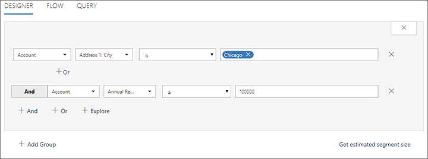

1. When you're done setting up your account query, you must create a relation to the contact entity. To do that, select the **+ And** button to add a new **Select a profile or relationship** drop-down list, and choose **Contact -> Account (Company name)** from that list. This value describes a relationship between the **contact** entity and the **account** entity, where the **Company name** field of the contact entity contains the ID (but displays the name) of the account record that contact belongs to (in other words, it finds the contacts that belong to the accounts we've found so far).

    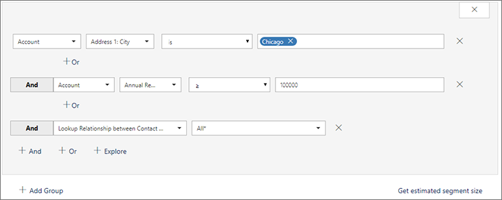

1. If needed, you can now add more contact-based criteria to further limit the set of contacts found for the segment (for example, to filter by job title).

    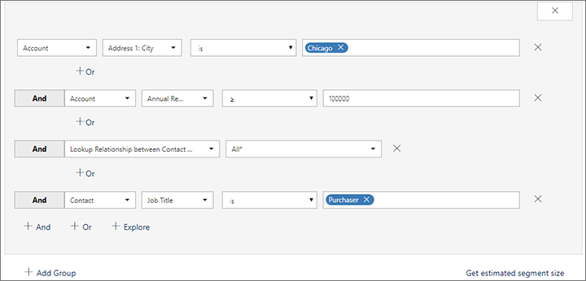

1. When you're done, **Save** your segment and **Go live**.

1. After a few minutes, you'll be able to open the **Members** tab to see which contacts are included in your new segment. Note that the list includes a column that shows which account each contact belongs to.

    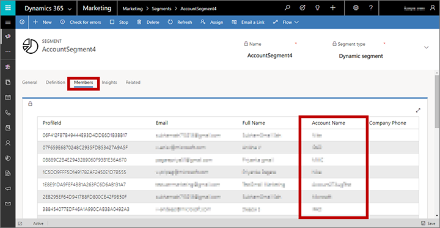

### Create a static segment using an account filter

When you set up a static segment, you'll mark a check box for each specific contact you want to include in the segment. The segment won't change after that unless you edit it manually. If your database includes many contacts, then you'll probably find it useful to use the filter control to find the contacts you are looking for.

1. Go to **Marketing** > **Customers** > **Segments** and select **+ New** from the command bar.

1. Fill out the **General** tab with a name and description for your new segment, and set **Segment type** to **Static segment**.

1. Open the **Definition** tab, where you'll find a list of contacts and filter controls that can help you find the contacts you want to include. Select the filter button to expose the filter controls.

    

1. Use the filter to find the contacts that you want to include in the segment. One query that might be useful when setting up segments for account-based marketing is one that filters the list by account ID. To do that, use the various drop-down lists in the **Filter** area to set up a query clause of the following form:

    **Contact | Company Name account | is | _&lt;account-ID&gt;_**

    Where the _&lt;account-ID&gt;_ is the unique ID for the account you want to look for. 

    > [!NOTE]
    > You can find the account ID for any account by opening the account record and checking for the value of **id** parameter at the end of the page URL.

1. You can continue to add clauses to your query until you've found the collection of contacts you're looking for.

1. Mark the check box for each contact you want to include in your static segment and select **Save**.

1. Continue to search for and add contacts until you have assembled the segment you need. **Save** and **Go live** when you're done.

## Account-based personalization of email content

Use dynamic content to personalize the content of your marketing email messages according to the account that each recipient belongs to. You can use this ability to display the recipient's account name or account ID directly or use these values to control logic such as if-then statements.

Use handlebars expressions of the following form to place account information in your display text or logical expressions:

`{{contact.<relation>.<attribute-name>}}`

Where:

- **Contact** identifies the contact entity, which here refers to the recipient of the message.
- ***&lt;relation&gt;*** is an expression that defines the connection from the contact entity to some other entity. When connecting to the account entity, use **contact\_account\_parentcustomerid.**
- ***&lt;attribute-name&gt;*** is the name of a field from the account entity whose value you want to use.

For example, use the following to place the name of the account associated with a mail recipient:

`{{contact.contact_account_parentcustomerid.name}}`

Another helpful expression is the following, which places the record ID for the account record that recipient belongs to:

`{{contact.parentcustomerid}}`

Unlike the account name, the record ID is always unique and will never change for any given record.

For more information about dynamic content and handlebars expressions, see [Add dynamic content to email messages](dynamic-email-content.md).

## Account-based customer journeys

You must set each customer journey to be _either_ contact-based _or_ account-based. This option modifies many of the ways that the journey's tiles will work. Use the **Target** setting on the **General** tab to configure this option for each journey.

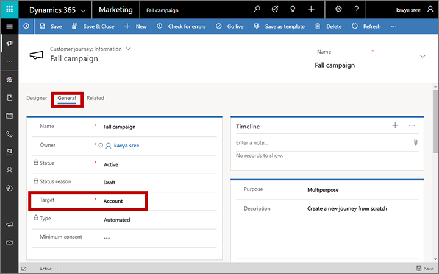

The following subsections summarize how various tiles behave for account-based journeys. Tiles not mentioned here work the same for both contact and account-based journeys (as described in the [Customer journey tiles reference](customer-journey-tiles-reference.md)).

### Trigger tiles

For account-based journeys, trigger tiles can work based on contacts or on accounts.

- Account-based trigger tiles treat accounts as a single unit, so they will always send all contacts from the same account down the same path (true or false).
- Contact-based trigger tiles process contacts one at a time, so contacts from the same account are permitted to flow down different paths.

Use the **Based on** property to set this option for each tile. This option is not available to triggers in contact-based journeys.

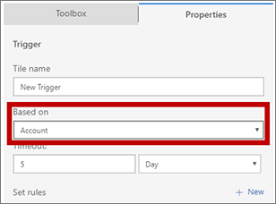

### Activity tiles

When a contact flows through an activity tile in account-based journeys, you can choose to create just one activity for each account, or to generate an activity for each individual contact. If you choose to assign an activity for each account, you can choose to assign it to the journey owner, account owner, or account created-by user.

Use the **Create for each** and **Assigned to** settings to choose these options for each activity tile. The account option is only available when you are working with an account-based journey.

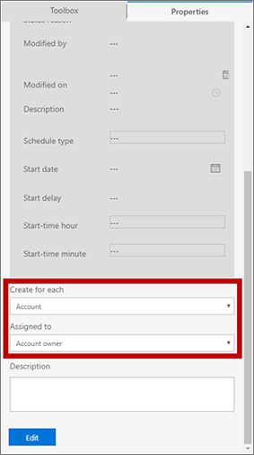

### Launch-workflow tiles

When you are creating an account-based journey, you can control how each launch-workflow tile should react to each contact that enters it:

- **Launch for each contact**: The tile triggers the workflow once for each contact that flows through the tile. The workflow will receive a reference to a single contact record.
- **Launch for each account**: The tile triggers the workflow just once for each account, and the workflow receives a reference to the account record. If additional contacts from a previously processed account flow through the tile, the tile will ignore them.

Use the **Launch for each** setting to choose this option for each launch-workflow tile. The account option is only available when you are working with an account-based journey.

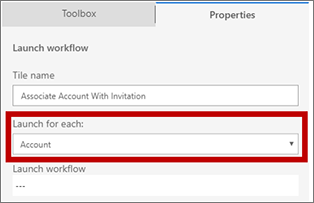

### Create-lead tiles

When you are creating an account-based journey, you can control how each create-lead tile should react to each contact that enters it:

- **Create for each contact**: The tile generates a contact-based lead and associates it with each contact.
- **Launch for each account**: The tile generates an account-based lead and associates it with the account associated with the contact that entered the tile. If additional contacts from a previously processed account flow through the tile, the tile will ignore them.

Use the **Create for each** setting to choose this option for each create-lead tile. The account option is only available when you are working with an account-based journey.

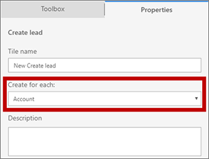

> [!NOTE]
> The create-lead tile doesn't try to match any existing leads. It always creates new leads, regardless of whether you are creating account or contact leads.

### Account-based journey insights

When you are viewing insights on the Designer tab for an account-based journey, you can filter the KPIs shown for any selected tile by account. To do so, select a tile and then choose an account from the **Filter by account** field in the **Data** tab.

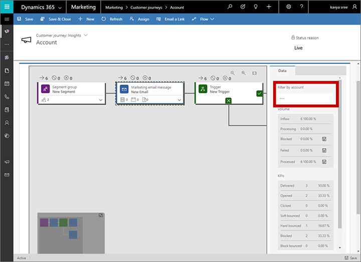

## Account-based leads and lead scoring

Leads can be associated with accounts or contacts. If a lead is associated with both a contact and a lead, then that lead is treated as a contact lead when it comes to lead scoring (the account is ignored). Leads associated with neither a contact nor an account can't be scored by a lead-scoring model in Marketing. The following rules apply for lead-scoring models:

- You can set each lead-scoring model to apply to either contact-based leads or to account-based leads.
- Interactions made by all contacts related to an account contribute to the score of an account-based lead. So, for example, each contact from an account that opens an email message could increase the score of the lead associated with that account.
- You can set demographic or firmographic scoring conditions that score on the lead record itself (by setting Entity = Lead), or on the related account (Entity = Lead.Parent account), or on the related contact (Entity = Lead.Parent contact).

> [!IMPORTANT]
> The accounts entity does not store any GDPR consent information&mdash;only contact entities include it. Lead-scoring models that operate on the account level aren't able to respect the consent of the contacts that belong to that account, but they can still score account leads based on interactions generated by all of those contacts. That means that you must be careful not to use automatic lead scoring for automated decision making (profiling) related to account-based leads if those decisions affect individuals. You can still use the feature to score account leads, but you must not use it for indirect contact scoring if the score is used for automated decision making. [!INCLUDE[proc-more-information](../includes/proc-more-information.md)] [Data protection and the GDPR](gdpr.md)

To set a scoring model to be lead-based or account-based, use the **Entity target** setting on the **Summary** tab for the model.

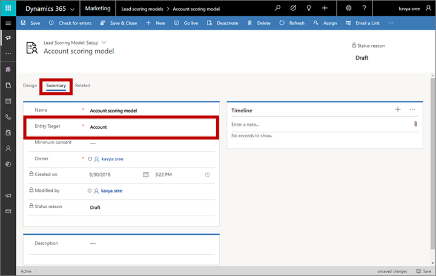

One way to score a lead based on the account associated with it is to set up a condition tile with the following properties:

1. Set **Entity = Lead**.

1. Add an **Expression** where **Parent Account for lead account = _&lt;account-ID&gt;_** , where you can find the account ID by opening the account record and checking for the value of **id** parameter at the end of the page URL.

    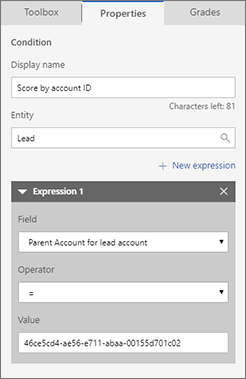

For more information about lead scoring in Marketing, see [Design lead-scoring models](score-manage-leads.md).

To view and assign which contact and/or account is associated with each lead, open the lead and then select the **Inquiry** stage of the **Lead-to-opportunity marketing sales process** business process display. Then view or edit the **Existing contact?** and **Existing account?** fields shown here.

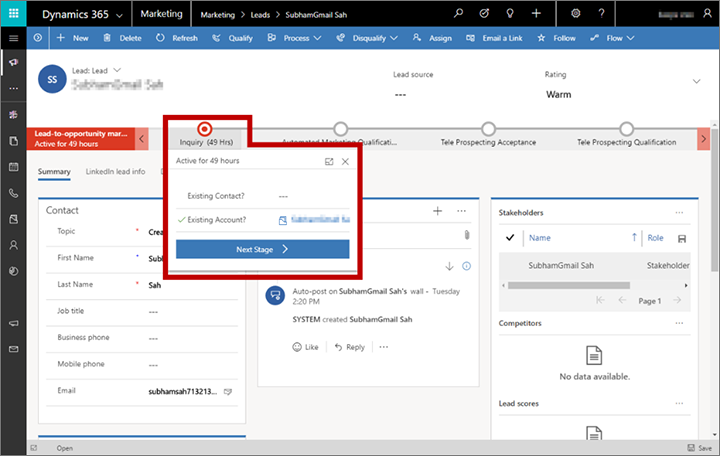

## Account insights

The account entity provides marketing results, KPIs, and insights that are like those provided for contacts. Use them to see email results, web visits, event registrations, form submissions, and many other interaction details that were collected for all contacts that belong to the displayed account. For details about how to find the account insights and interpret their results, see [Analyze results to gain insights from your marketing activities](insights.md).
