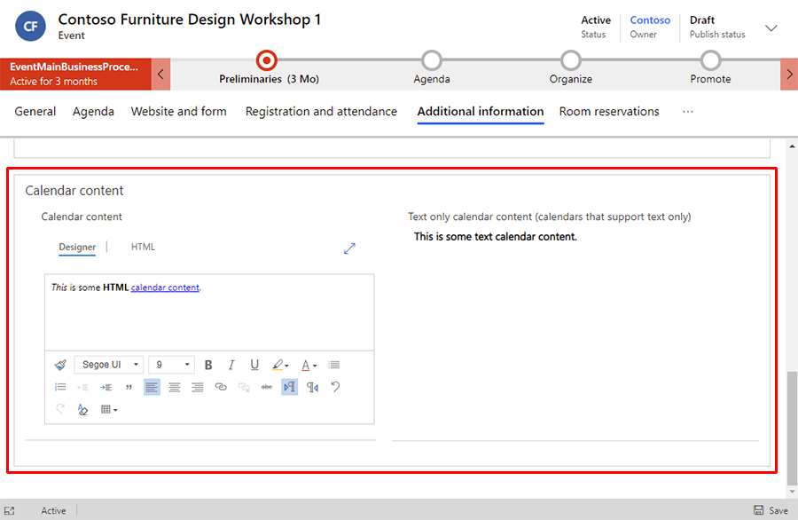

# Generate iCalendar files for events and sessions

[!INCLUDE[consolidated-sku-rtm-only](../includes/consolidated-sku-rtm-only.md)]

For many business people, software-based calendars are an essential organizational tool. When attendees register for an event, they want a way to track not only the date of the event, but what sessions they plan to attend.

The Dynamics 365 Marketing email editor includes the ability to automatically generate personalized iCalendar files to track events and sessions. Using the email editor, you can add a iCalendar file button that is personalized to the email contact. When the contact selects the button, the iCalendar file downloads, allowing the contact to add it to the calendar of their choice.

## How to create a customized iCalendar file

iCalendar files are generated using the new **Add to Calendar** button option in the email editor.

> [!NOTE]
> The **Add to calendar** button is only available in the new email editor. To enable the new email editor, an administrator must enable the **Updated email editing experience** [feature switch](admin-feature-switches.md).

To create an **Add to Calendar** button:

1. In the email designer, add a button.
1. Go to the button **Properties** tab. Select **Add to Calendar** from the **Link to** dropdown.

    > [!div class="mx-imgBorder"]
    > 

1. Choose the information you want to include in the iCalendar file using the **What should be added to calendar** dropdown. The options include:
    - **Only the event**: The iCalendar file will contain only the *event* the contact has registered for.
    - **Only the sessions**: The file will contain only the event *sessions* the contact has registered for.
    - **Both event and associated sessions**: The file will contain information for the *event* and the *sessions* the contact has registered for.
1. Select the event you want to link to.
1. Enter the **Button text** that appears on the button. You can customize button style in the **Style** section.

When you send an email with the **Add to Calendar** button, contacts who registered for the event will receive a personalized link to download their agenda as an iCalendar file.

> [!NOTE]
> If a contact didn't register for the event or session you select for the button, they will not see the **Add to Calendar** button in their email.

## Customize the iCalendar file descriptions

Each event or session in the iCalendar file contains a configurable description. To configure the description content:

1. Go to the **Event planning** work area and choose the event you want to configure.
1. In the event, go to the **Additional information** tab.
1. To edit the iCalendar information, go to the **Calendar content** section. The left content section allows you to edit content for calendars that support HTML descriptions, such as Outlook. The right content section allows you to edit content for calendars that only support text descriptions, such as Gmail and Apple Calendar. Depending on which calendar the iCalendar file is imported into, either the HTML *or* the text only description will be used.

    > [!div class="mx-imgBorder"]
    > 

## Streamed event check-ins

For streamed events, a check-in button is automatically added to the iCalendar file description if the calendar content is empty. You can remove the check-in button or add a new button with the link set to the following wildcard: `{{msevtmgt_checkin_url}}`. The wildcard is converted to a personalized check-in link for the streamed event when the contact downloads the iCalendar file.

[!INCLUDE[footer-include](../includes/footer-banner.md)]
