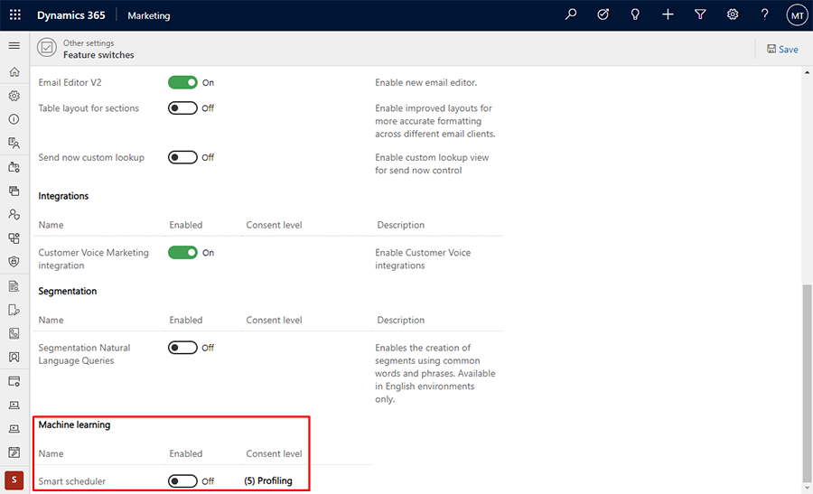
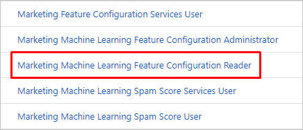

# Enable and configure artificial intelligence features

Dynamics 365 Marketing provides several artificial intelligence (AI), which include:

- **[Spam checker](spam-checker.md)**, which analyzes the content of each marketing email message and generates a score that predicts how likely it is to be flagged by content-based spam filters.
- **[Automated scheduler](automated-scheduler.md)**, which "learns" the days and times when each contact is most likely to be actively reading his or her email by analyzing the email results in your system. The more results you have in your system, and the more you use this feature, the "smarter" the system becomes.

When you first install Marketing, the Automated scheduler is disabled by default. This feature includes privacy settings that may affect compliance with local privacy regulations (including GDPR) and other privacy laws.

## Enable the Automated scheduler in Marketing settings

To enable the Automated scheduler and make privacy settings for it:

1. Go to **Settings** > **Other settings** > **Feature switches**.

    > [!div class="mx-imgBorder"]
    > 

1. Under **Machine learning** > **Smart scheduler**, set the **Enabled** slider to **On**.

1. For the **Consent level** setting, choose the level of consent that each contact must provide before being processed.
    - The **Smart scheduler** feature applies automated processing to data collected for each individual contact. Therefore, you probably need a required level of **(5) Profiling** to use this feature wherever GDPR is in effect.

1. Select the **Save** button near the top of the page to save your settings.

The level of consent required for the Automated scheduler depends on your geographic location and that of your contacts. It may also depend on the way you have set up the data-protection features of Dynamics 365 Marketing. It is your organization's responsibility to ensure that you are following all applicable laws in the countries/regions where you operate. More information: [Data protection and the GDPR](gdpr.md)

## Set security roles

Each user who needs access to the Marketing AI features needs to be granted the **Marketing Machine Learning Feature Configuration Reader** role. To inspect and customize a user's security roles:

1. Open the **Settings** menu  at the top of the page and select **Advanced settings**.

1. The advanced-settings area opens in a new browser tab. Note that this area uses a horizontal navigator at the top of the page instead of a side navigator. Navigate to **Settings** > **System** > **Security**.

1. Select the **Security roles** icon.

1. You now see a list of security roles. Select a role to open the **Security role** window, which shows individual access levels for each available entity. Most entities are named intuitively to map to various features and areas of the app.

1. Ensure that the user's [**Business Unit**](business-units.md) contains the **Marketing Machine Learning Feature Configuration Reader** role.

    > [!div class="mx-imgBorder"]
    > 

[!INCLUDE[footer-include](../includes/footer-banner.md)]