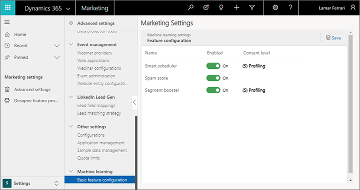

# Preview: Enable and configure artificial intelligence features

> [!IMPORTANT]
> All AI features are currently preview features. [!INCLUDE[cc_preview_features_definition](../includes/cc-preview-features-definition.md)]
> [!INCLUDE[cc_preview_features_no_MS_support](../includes/cc-preview-features-no-ms-support.md)]  

Dynamics 365 Marketing provides several artificial intelligence (AI), which include:

- **[Spam score](spam-checker.md)**, which analyzes the content of each marketing email message and generates a score that predicts how likely it is to be flagged by content-based spam filters.
- **[Automated scheduler](automated-scheduler.md)**, which "learns" the days and times when each contact is most likely to be actively reading his or her email by analyzing the email results in your system. The more results you have in your system, and the more you use this feature, the "smarter" the system becomes. 

When you first install Dynamics 365 Marketing, all artificial intelligence (AI) features are disabled by default. These artificial intelligence features include privacy settings that can help you remain compliant with local privacy regulations (including GDPR) and other privacy laws when you use them.

To enable AI features and make privacy settings for them:

1. Go to **Settings** > **Advanced settings** > **Machine learning** > **Basic feature configuration**.

    

1. For each AI feature you'd like to use, set the **Enabled** slider to **On**.

1. For those AI features that include a **Consent level** setting, choose the level of consent that each contact must provide before being processed by that feature.
    - The **Optimal email sending time** feature applies automated processing to data collected for each individual contact. Therefore, you probably need a required level of **(5) Profiling** to use this feature wherever GDPR is in effect.
    - The **Spam checker** feature doesn't process any personal data, so no consent level is required for this feature.

1. Select the **Save** button near the top of the page to save your settings.

The level of consent required for each AI feature depends on your geographic location and that of your contacts. It may also depend on the way you have set up the data-protection features of Dynamics 365 Marketing. It is your organization's responsibility to ensure that you are following all applicable laws in the countries/regions where you operate. More information: [Data protection and the GDPR](gdpr.md)
