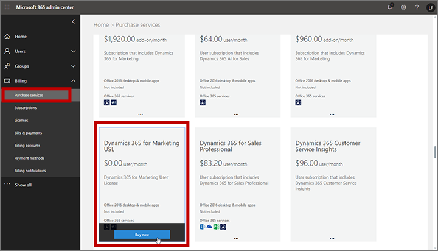
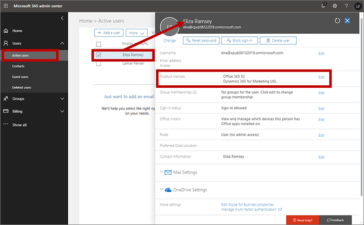
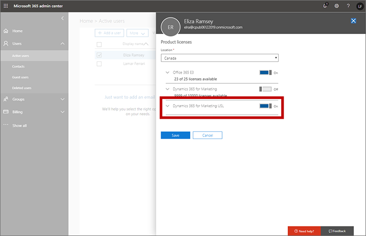

# Manage user accounts, licenses, and roles

Read this topic to learn how to work with user accounts, user licenses, and security roles in Dynamics 365 for Marketing and Customer Engagement.

## Create user accounts and assign licenses

Like most Customer Engagement apps, Dynamics 365 for Marketing integrates with the user management and licensing features of the Microsoft 365 admin center, so to get started, each user that requires access to Marketing must have a user account on your Microsoft 365 tenant. [!INCLUDE[proc-more-information](../includes/proc-more-information.md)] [Add users individually or in bulk to Office 365](https://docs.microsoft.com/office365/admin/add-users/add-users)

Unlike most Customer Engagement apps, Dynamics 365 for Marketing is licensed per instance (also based on certain quotas, such as the number of marketing contacts and monthly email messages) but it isn't licensed per seat, which means that you can add as many users to each Marketing instance as you like for no extra charge because Marketing user licenses are free.

### Grant access to users that already have a Customer Engagement license

Any user that already has a license for any Customer Engagement app also will be able to access Dynamics 365 for Marketing without requiring any additional licenses. All you need to do is [assign them the security roles and privileges](#assign-role) required to access the Marketing features they need.  

### Grant access to users without a Customer Engagement license

For Microsoft 365 users that don't have a Customer Engagement license, you can "purchase" and assign a free Marketing user license. Free Marketing user licenses don't grant access to any other Customer Engagement apps, but you can have as many of them as you need to grant access to Marketing.

To purchase and assign a free Marketing user license:

1. Sign in to your [Microsoft 365 admin center](https://admin.microsoft.com) using an admin account that has permissions to purchase services and assign licenses.

1. In the Microsoft 365 admin center, go to **Billing** > **Purchase services**.
1. On the **Purchase services** page, type "Marketing" into the serch field near the top of the page and then press Enter on your keyboard.

1. Select the **Dynamics 365 for Marketing User License** tile, which shows a price of **Free**.

    

1. Follow the instructions on your screen to complete the transaction.

1. Return to the Microsoft 365 admin center and go to **Users** > **Active users** and select the user you want to assign a license to. The settings for that user open in a fly-out.

    

1. Select the **Licenses and Apps** tab in the flyout and then select the **Dynamics 365 for Marketing User License** check box to assign the license to this user.

    

1. Select **Save changes** and then close the fly-out. The user now has a free Marketing license and should be visible in the Customer Engagement user-admin interface in a few minutes.

1. Assign the appropriate security roles to grant the new user access to the required Marketing features, as described in the next section. The app doesn't allow access to any user who does not have at least one relevant security role.

[!INCLUDE[proc-more-information](../includes/proc-more-information.md)] 
[Assign licenses to users in Office 365 for business](https://docs.microsoft.com/office365/admin/subscriptions-and-billing/assign-licenses-to-users)

## Assign security roles to users

Security roles enable administrators to control users' access to data through a system of access levels and privileges. The combination of access levels and privileges that are included in a specific security role sets limits on each user's view of data and on what actions the user can perform with that data.

You can assign more than one security role to a user. The effect of multiple security roles is cumulative, which means that the user has the permissions associated with all security roles assigned to the user.

Administrators can also create teams, apply security roles to those teams, and add users to each team. All users that belong to a team inherit the security roles applied to that team for as long as they remain a member, and lose those roles as soon as they leave the team (other than roles also granted to them personally or by other teams they are on).

> [!IMPORTANT]
> You must assign at least one security role to every user. The app doesn't allow access to any user who does not have at least one security role.

To apply security roles to users, and to customize each role, do the following:

1. Open the **Settings** menu  at the top of the page and select **Advanced settings**.

1. The [!INCLUDE[pn-microsoftcrm](../includes/pn-microsoftcrm.md)] advanced-settings area opens in a new browser tab. Note that this area uses a horizontal navigator at the top of the page instead of a side navigator. Navigate to **Settings** > **System** > **Security**.

1. Work with the **Users** settings here to assign security roles to users. For details, see [Manage security, users, and team](../admin/manage-security-users-and-teams.md) and [Create or edit a security role](../admin/create-edit-security-role.md).

## Inspect and customize security roles

All [!INCLUDE[pn-microsoftcrm](../includes/pn-microsoftcrm.md)] applications come with a collection of preconfigured security roles to help get you started. Each of these roles provides various levels of access to a collection of entities that are typically used together by specific user roles. Each of these roles is given a name that indicates the type of user that should be assigned the role.

> [!IMPORTANT]
> Each time you update Dynamics 365 for Marketing, all of the standard, out-of-box roles are likewise updated to the latest versions to ensure that each role will receive permissions to access relevant new features added by the update. This means that you probably shouldn't customize the out-of-box roles because your customizations are likely to get overwritten after each update. If you need custom security roles, you should usually start by creating a copy of an existing role that is close to what you want, and then customize the copy. If you use custom security roles, then you will probably need to update your custom roles after each update to grant access to new entities.

To find out which permissions apply to any existing security role (and/or edit a role):

1. Open the **Settings** menu  at the top of the page and select **Advanced settings**.

1. The [!INCLUDE[pn-microsoftcrm](../includes/pn-microsoftcrm.md)] advanced-settings area opens in a new browser tab. Note that this area uses a horizontal navigator at the top of the page instead of a side navigator. Navigate to **Settings** > **System** > **Security**.

1. Select the **Security roles** icon.

1. You now see a list of security roles. Select a role to open the **Security role** window, which shows individual access levels for each available entity. Most entities are named intuitively to map to various features and areas of the app.

    

Here are a few notes for working with the **Security role** settings:

- Most of the entities added by Dynamics 365 for Marketing are on the **Custom entities** tab. The other tabs manage features that belong to other [!INCLUDE[pn-microsoftcrm](../includes/pn-microsoftcrm.md)] apps and basic platform features.
- There is a tab called **Marketing**, but it doesn't contain entities related to Dynamics 365 for Marketing. Its settings apply to the *enterprise marketing* feature included with the [!INCLUDE[pn-microsoftcrm](../includes/pn-microsoftcrm.md)] platform (though Dynamics 365 for Marketing does make use of the marketing lists feature that is provided here).
- Some of the security roles provided with Dynamics 365 for Marketing include permissions from all available tabs. This is to provide access to relevant platform features required by users marketing roles.

Security roles are a concept shared by all [!INCLUDE[pn-microsoftcrm](../includes/pn-microsoftcrm.md)] apps. For more information about how to work with them, see [Manage security, users, and teams](../admin/manage-security-users-and-teams.md) and [Create or edit a security role](../admin/create-edit-security-role.md).

## Form and field level security

In addition to the entity-level security set directly on each security role, you can also control access to specific forms and/or fields. These work as follows:

- *Form-level security* restricts access to specific forms, so even if a user has a security role that grants access to a given entity (such as customer journeys), that user might not be able to access some of the forms of that entity (such as the insights) unless they have one of the additional roles required by that form. Most of the entities added by Dynamics 365 for Marketing don't include any form-level security out of the box, so users that can access these entities can also access all the forms that belong to them, though some exceptions exist (including insights forms for some entities).
- *Field-level security* applies extra restrictions on specific fields, so even if a user can view a given form, some fields on that from could be hidden if they require an additional field security profile. Field security profiles are similar to, but separate from, the entity-level security roles otherwise described in this topic.

You don't see form or field settings when you edit the security role, so you must manage these separately.

Form and field level security are concepts shared by all [!INCLUDE[pn-microsoftcrm](../includes/pn-microsoftcrm.md)] apps. For more information about how to work with them, see Field level security and  Assign security roles to a form.

## Security roles added by Dynamics 365 for Marketing

The tables in this section summarize the purpose of each role added by Dynamics 365 for Marketing. They should give you a good idea of which roles to assign each of your users. For details information about precisely which permissions and access levels any single role provides, inspect the permissions tables provided in the **Security roles** window, as described previously in [Inspect and customize security roles](#inspect-roles).

### Core marketing security roles

| Security&nbsp;role | Who&nbsp;needs&nbsp;it | Access&nbsp;granted |
|---------------|--------------|----------------|
| Marketing Professional - Business | Most standard marketers who require access to Dynamics 365 for Marketing core features, but don't need to configure the system | Nearly all entities in the **Marketing** work area, including segments, customer journeys, emails, marketing pages, marketing lists, and related features and templates (but not including LinkedIn or lead-scoring features). This role grants only limited access to the **Settings** work area. It also grants access to fundamental entities like contacts, leads, accounts, activities (tasks, phone calls, appointments), and marketing lists. Because this role is intended for individual contributors, most create and delete permissions are limited to records the user owns, but they can view and edit records owned by other users in their business unit. This role is provided access to insights forms through form-level security.|
| Marketing Manager - Business | Marketing managers (who also administer the system) | All the same entities as the **Marketing Professional – Business** role, but more often grants enhanced permissions to work with records owned by other users in the same business unit as the manager. This role also provides access to all views and settings of the **Settings** work area. This role is provided access to insights forms through from-level security. |
| Marketing, Business App Access | For internal use only, do not delete or modify | This is an internal security role used by the solution to perform internal tasks, such as syncing data. Do not delete or modify this role. |
| Marketing Services User | For internal use only, do not delete or modify | This is an internal security role used by the solution to perform internal tasks, such as syncing data. Do not delete or modify this role. |
| Lead Score Modeler | Marketing strategists responsible for building lead-scoring models (must be combined with a core marketing role) | Can view and edit lead scoring models, view lead scores, and customize the lead-to-opportunity marketing business process for leads. All these features are in the **Lead management** section of the **Marketing** work area.  |
| Lead Score Viewer | Marketers and salespeople that should see calculated lead scores (must be combined with one of the other marketing and/or sales roles) | Can view the score achieved by each lead. |

### Event Management security roles

| Security&nbsp;role | Who&nbsp;needs&nbsp;it | Access&nbsp;granted |
|---------------|--------------|----------------|
| Event Administrator | Managers who plan events and administer the event-management features. | All entities in in the **Events** work area, and all event-related settings in the **Settings** work area. These users can create, read, write, delete, assign, and share records owned by themselves and other users in the same business unit. |
| Event Planner | All users involved with event planning. | All entities in in the **Events** work area. Users with this role can create, read, write, and share these records with other users in the same business unit, but can only delete and assign the records that they own. |
| EventManagement S2S Inbound | For internal use only, do not delete or modify | This is an internal security role used by the solution to perform internal tasks, such as syncing data. Do not delete or modify this role. |

### [!INCLUDE[pn-linkedin](../includes/pn-linkedin.md)] Lead Gen security roles

| Security&nbsp;role | Who&nbsp;needs&nbsp;it | Access&nbsp;granted |
|---------------|--------------|----------------|
| LinkedIn Lead Gen Forms Administrator | Administrators who are managing your organization's integration with LinkedIn | Users with this role can configure lead matching strategies, LinkedIn field mappings, and solution settings for the Dynamics 365 Connector for LinkedIn Lead Gen Forms. |
| LinkedIn Lead Gen Forms Salesperson | Users who need to sync their profiles and view leads generated from LinkedIn, but who don't need to configure the connection | These users can authorize LinkedIn user profiles to sync data to [!INCLUDE[pn-microsoftcrm](../includes/pn-microsoftcrm.md)], and view details about the synced submissions. |
| LinkedIn LeadGen S2SInbound | For internal use only, do not delete or modify | This is an internal security role used by the solution to perform internal tasks, such as syncing data. Do not delete or modify this role. |

### Surveys security roles

The surveys package adds the following security roles:

- Survey Administrator
- Survey Designer
- Survey Feedback Publisher
- Survey Service
- Survey User
- Voice of the Customer app access role

## Don't modify or remove the Marketing service user

Dynamics 365 for Marketing includes a preconfigured user called **MarketingServices ApplicationUser**, which must have the following security roles:

- EventManagement S2SInbound
- [!INCLUDE[pn-linkedin](../includes/pn-linkedin.md)] LeadGen S2SInbound
- Marketing Services User
- Marketing, Business App Access

The system uses this account when performing important internal tasks, and [!INCLUDE[pn-marketing-app-module](../includes/pn-marketing-app-module.md)] will stop working correctly if you remove the user or any of these required roles. Be sure not to remove or modify this user.

### See also

[Manage security, users, and teams](../admin/manage-security-users-and-teams.md)  
[Manage teams](manage-teams.md)  
[Add users individually or in bulk to Office 365](https://docs.microsoft.com/office365/admin/add-users/add-users)  
[Assign licenses to users in Office 365 for business](https://docs.microsoft.com/office365/admin/subscriptions-and-billing/assign-licenses-to-users)
