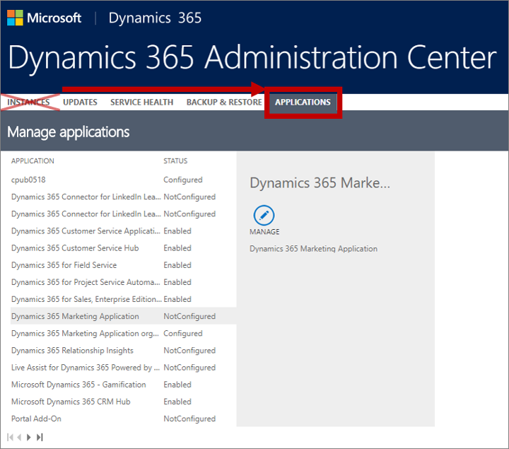
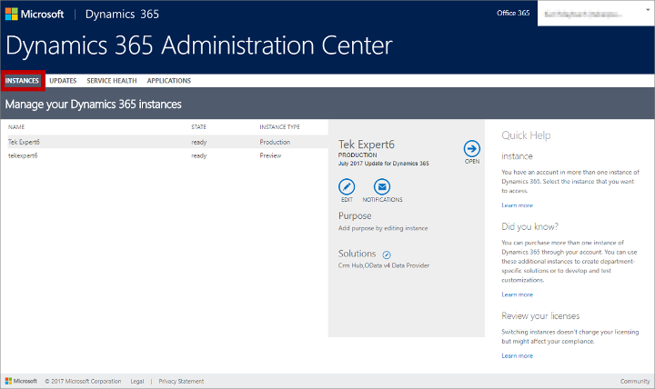
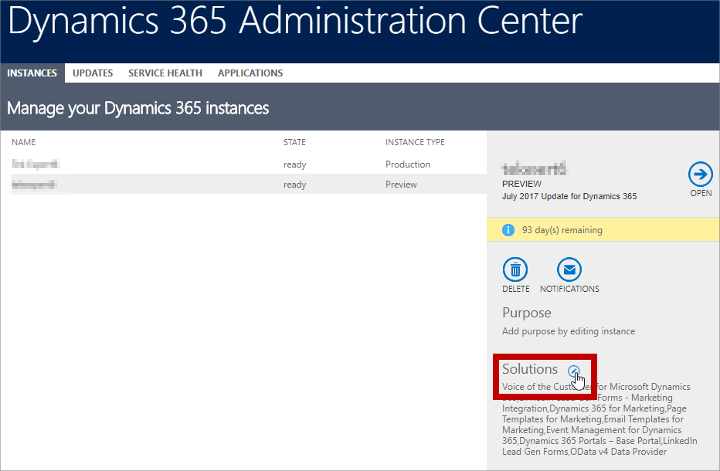
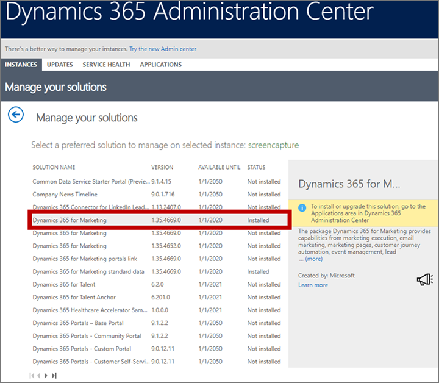
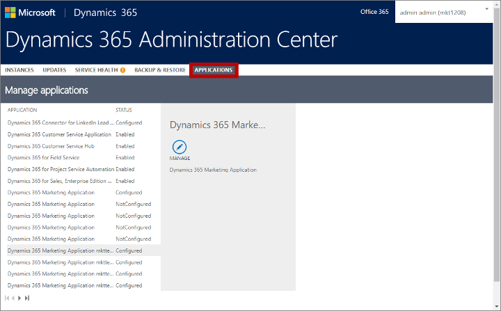
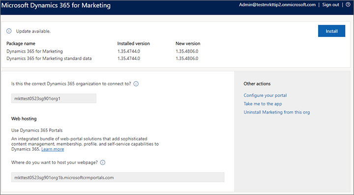
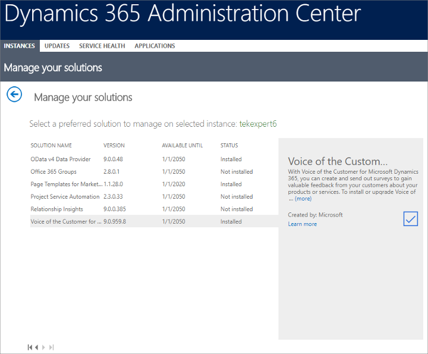

# Keep Marketing up to date

Microsoft is continuously developing and improving online services. Though we roll out updates as soon as they're ready, we don't apply them automatically to customers' systems because most customers prefer to manage this process themselves—for example, by applying and testing updates on a sandbox instance before applying them to a production system.

Read this topic to get an overview of how to update Dynamics 365 Marketing and its related solutions.

> [!WARNING]
> Always update the core solutions of Dynamics 365 Marketing by running its setup wizard from the **Applications** tab of the Administration Center, as described in [Find and apply updates for core Marketing solutions](#update-core). Do not try to update the individual Marketing solutions by working on the **Instances** tab of the Administration Center.
> 
> 
> 
> However, Marketing also includes two solutions ("Dynamics 365 Portals – Base Portal" and "Voice of the Customer for Dynamics 365") that *must* be updated separately using the **Instances** tab as described in [Find and apply updates for shared Marketing solutions](#update-shared). Be sure not to update any of the core Marketing solutions while you are updating these shared solutions, even if they show an update is available.

## Solutions included with Dynamics 365 Marketing

Dynamics 365 Marketing is implemented using several different *solutions*, where a *solution* is a type of software package that adds functionality to model-driven apps in Dynamics 365 (Dynamics 365 Sales, Dynamics 365 Customer Service, Dynamics 365 Field Service, Dynamics 365 Marketing, and Dynamics 365 Project Service Automation). Dynamics 365 Marketing includes several solutions that are unique to the Marketing app, plus a few more that are available as separate apps or in other app bundles.

When you install Dynamics 365 Marketing, all its solutions are installed by the setup wizard. However, when it comes to keeping your system up to date, you'll need to monitor and update each of the following types of solutions separately:

- **Core Marketing solutions**: These are the solutions that provide core features that are unique to Marketing (including the Dynamics 365 Connector for LinkedIn Lead Gen Forms). Though there are several of these, you'll be able to maintain and update them all at once using a setup wizard like the one you used to install Marketing for the first time.
- **Voice of the Customer**: This solution enables model-driven apps in Dynamics 365 to host surveys and collect responses. It's also available as an add-on or bundle for other apps. You must update this solution separately from the other solutions included with Marketing, using its own update program.
- **Dynamics 365 Portals**: This solution enables model-driven apps in Dynamics 365 to host interactive portals that display and collect Dynamics 365 data, including the events portal and marketing pages. Like Voice of the Customer, you must update this solution using its own update program.

## Find out when new updates are available

Microsoft releases updates to Dynamics 365 Marketing each month or so, with a major refresh every six months or so. We announce monthly updates (and other news) on the [Dynamics 365 blog](https://cloudblogs.microsoft.com/dynamics365/tag/dynamics-365-for-marketing-kb-articles/), where we identify each update by the month or season in which it became available. Future directions and major releases are furthermore described on the [Dynamics 365 and Power Platform Release Plans](https://docs.microsoft.com/business-applications-release-notes/index) website.

You can also find out when an update is available by checking the status of your apps and solutions in the Dynamics 365 admin center, as described in the following sections.

## Find out which version of Dynamics 365 Marketing you are running

Dynamics 365 Marketing includes several solutions and services, each of which has its own version number. You'll often see versions of Dynamics 365 referred to by the month or season and year they came out, but to find a unique identifier for the version installed on your tenant, check the version number of your **Dynamics 365 Marketing** solution as follows:

1. [Open the Dynamics 365 admin center](dynamics-365-admin-center.md) and go to the **Instances** tab.  
    

2. If you have more than one instance, then each of them is listed here. Select the instance where you want to look up your Dynamics 365 Marketing version number.

3. The column next to the instance list shows information about your selected instance, including a list of solutions installed there. Select the **Manage your solutions** button  next to the **Solutions** heading here.  
    

4. A list of solutions installed on your selected instance is shown. Look in the **Solution name** column for solutions called **Dynamics 365 Marketing** (the solutions are sorted alphabetically by this column; use the paging controls at the bottom of the list if you don't see it on the first page). If you have more than Marketing solution, then look for the one that shows a value of **Installed** in the **Status** column. Finally, check the **Version** column to find your Dynamics 365 Marketing version number.  
    

## Find and apply updates for core Marketing solutions

To find and apply available updates to all core Marketing solutions, including the LinkedIn Connector:

1. [Open the Dynamics 365 admin center](dynamics-365-admin-center.md).

2. Select the **Applications** tab to see a list of applications you have installed.  
    

    The list shows a row marked **Dynamics 365 Marketing Application** for each entitlement (license) you have for Dynamics 365 Marketing. Free entitlements (which can't be updated) show a **Status** of **Not configured**. Installed entitlements show a **Status** of **Configured** and include the name of the instance where they are installed as part of their application name.

3. Select the configured Marketing entitlement that you want to update and then select the **Manage** button  in the side panel. 

4. The Marketing setup wizard opens.  It shows the name of the Dynamics 365 Marketing instance you are about to update. Make sure you have chosen the right one. Look at the top of the page to see if any updates are available. If no message is shown, then no updates are available for the current organization and you can just quit the wizard.  
    

5. If an **Install** button is shown next to the **Update available** message, then select it to start the update. The update starts right away, and a page opens to track the progress of the update and will tell you when it's finished.

6. Repeat this procedure for each Marketing organization that you have.

## Find and apply updates for shared Marketing solutions

> [!WARNING]
> Always check for and apply core Marketing solution updates using the setup wizard (as described in the [previous section](#update-core)) *before* you look for shared solution updates. You will also see core Marketing solutions listed when you follow the instructions provided in this section, but you risk breaking your installation if you try to update core Marketing solutions from here, even if they show an update is available.

To update shared (non-core Marketing) solutions, including Voice of the Customer and Dynamics 365 Portals:

1. [Open the Dynamics 365 admin center](dynamics-365-admin-center.md) and go to the **Instances** tab.  
    

2. If you have more than one instance, then each of them is listed here. Select the instance where you have Marketing installed.

3. The column next to the instance list shows information about your selected instance, including a list of solutions installed there. Select the **Manage your solutions** button  next to the **Solutions** heading here.  
    

4. A list of solutions installed on your selected instance is shown. Look in the **Status** column for any solutions that show a value of "Upgrade available." The solutions that are relevant for Marketing are "Dynamics 365 Portals – Base Portal" and "Voice of the Customer for Dynamics 365". If you have many solutions installed, then use the paging controls at the bottom to check each page for available updates.  

   > [!WARNING]
   > As mentioned at the start of this procedure, you must not update core Marketing solutions from here. Always run the Marketing update wizard first, before you start looking for shared-solution updates. Be sure not to update any of the core Marketing solutions while you are updating the shared solutions, even if they show an update is available.

    

5. Select a solution marked as having an upgrade available and read the information shown in the side panel. Select the **upgrade** button  in the side panel and then follow the instructions on your screen to apply it.

6. Repeat this procedure for each solution that requires an update.

### See also

[Open the Dynamics 365 admin center](dynamics-365-admin-center.md)  
[Manage Marketing instances](manage-marketing-instances.md)  
[Uninstall Marketing](uninstall-marketing.md)
