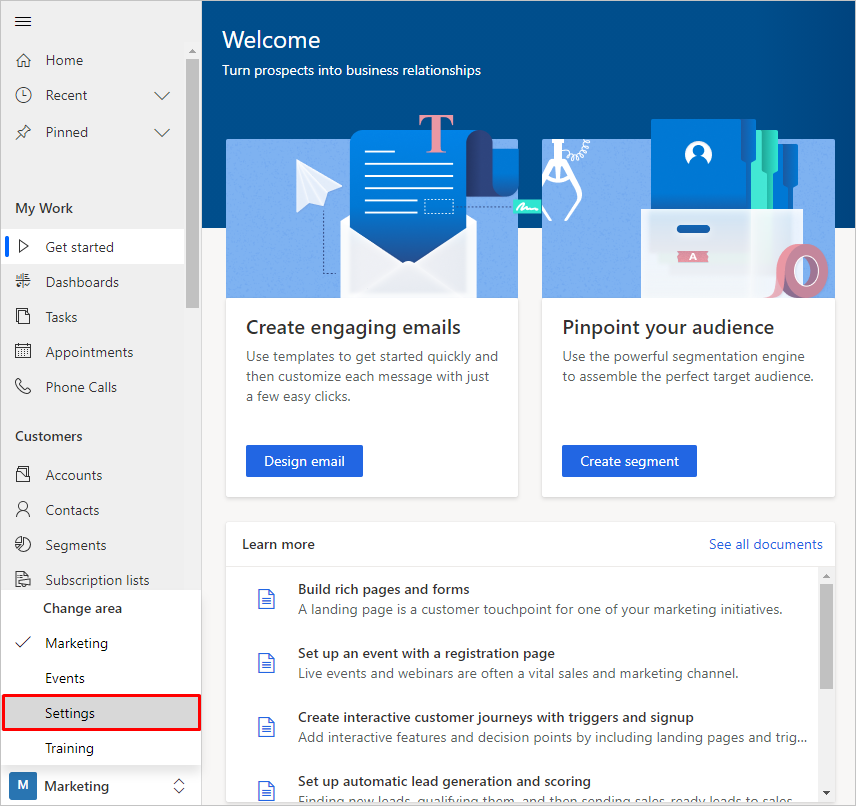
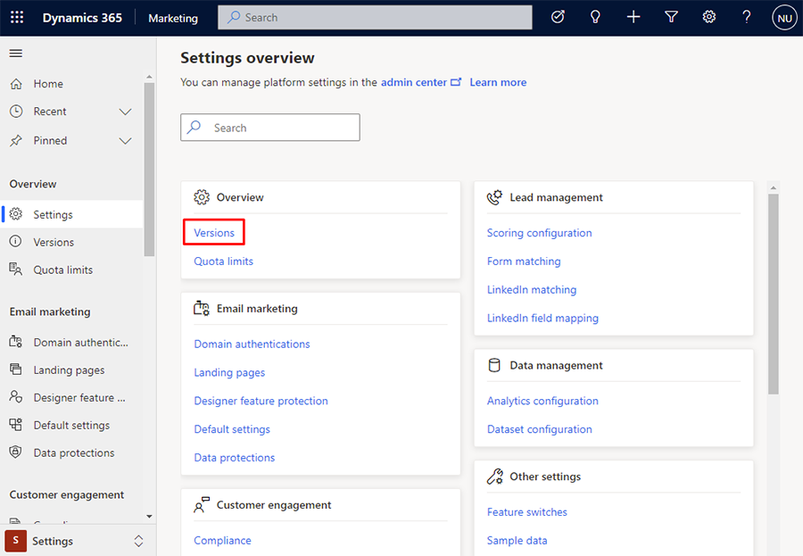
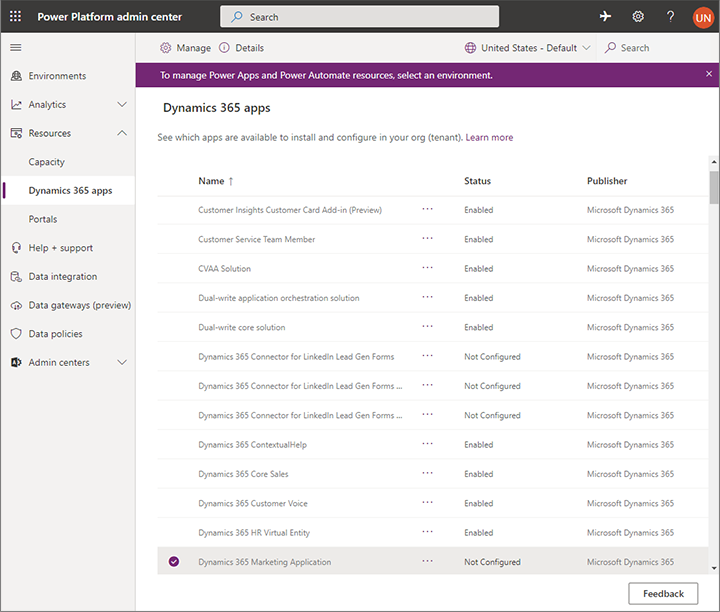
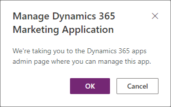
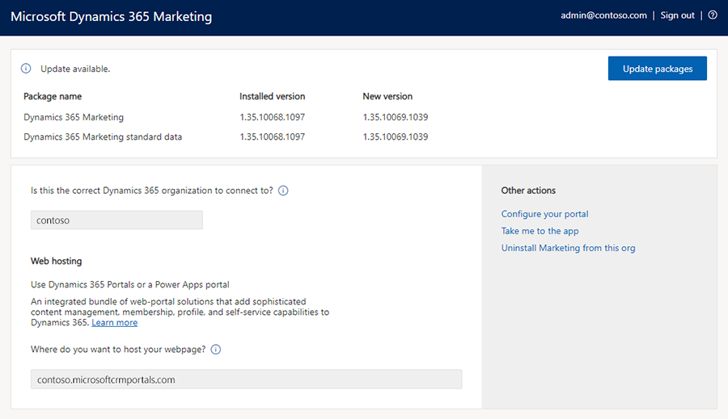
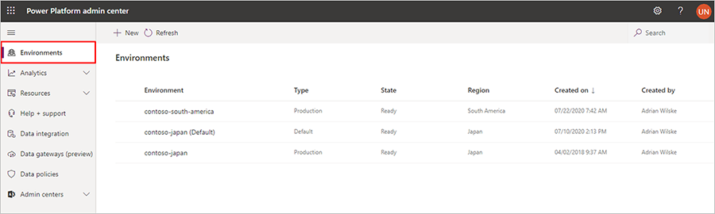
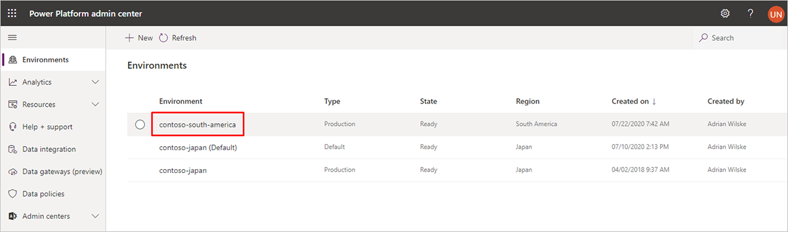
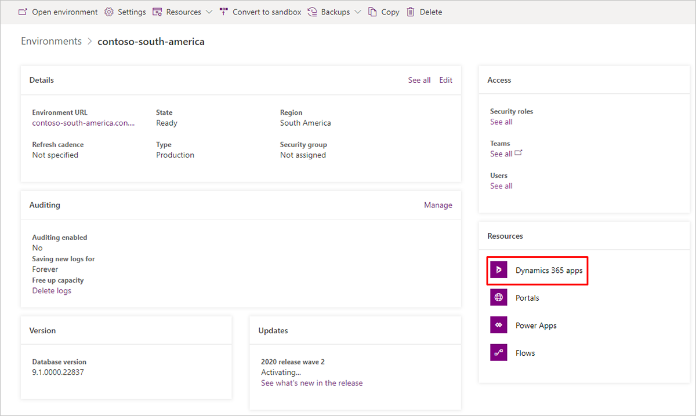
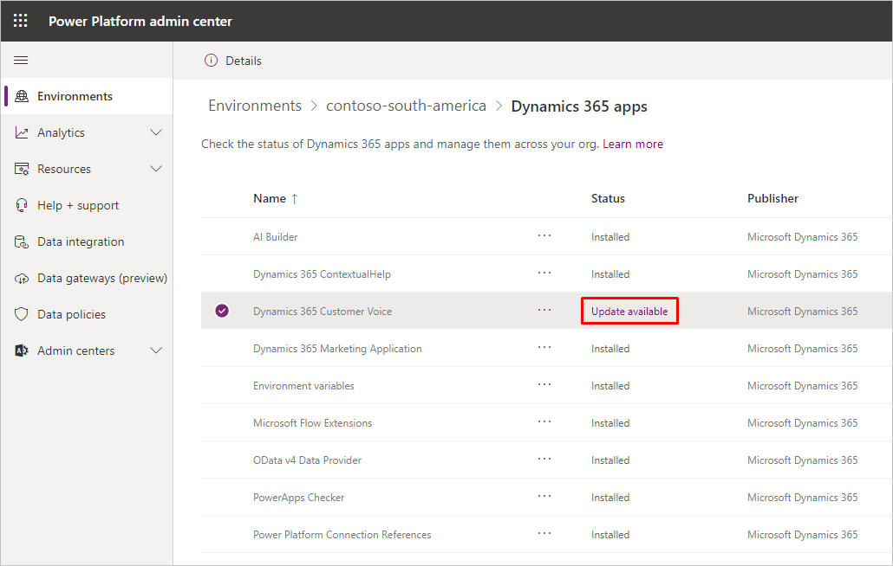

# Keep Marketing up to date

Microsoft is continuously developing and improving online services. Marketing updates are [pushed to all customers automatically](https://cloudblogs.microsoft.com/dynamics365/it/2020/04/27/automatic-update-policy-for-dynamics-365-marketing/). Marketing follows a phased deployment approach aligned with the platform deployment schedule. You can also update your solutions manually for early validations. Manual updates allow customers to apply and test updates on a sandbox instance before applying them to a production system.

This article gives an overview of how to update Dynamics 365 Marketing and its related solutions.

## Solutions included with Dynamics 365 Marketing

Dynamics 365 Marketing is implemented using several *solutions*. A *solution* is a type of software package that adds functionality to model-driven apps in Dynamics 365 (Dynamics 365 Sales, Dynamics 365 Customer Service, Dynamics 365 Field Service, Dynamics 365 Marketing, and Dynamics 365 Project Service Automation). Dynamics 365 Marketing includes several solutions that are unique to the Marketing app, plus a few more that are available as separate apps or in other app bundles.

When you install Dynamics 365 Marketing, all its solutions are installed by the setup wizard. However, when updating Marketing, you'll need to monitor and update each of the following types of solutions separately:

- **Core Marketing solutions**: These are the solutions that provide core features that are unique to Marketing (including the Dynamics 365 Connector for LinkedIn Lead Gen Forms). Though there are several of these, you'll be able to maintain and update them all at once using a setup wizard like the one you used to install Marketing for the first time.
- **Dynamics 365 Customer Voice**: This solution enables model-driven apps in Dynamics 365 to host surveys and collect responses. It's also available as an add-on or bundle for other apps. You must update this solution separately from the other solutions included with Marketing, using its own update program.
- **Power Apps portals**: This solution enables model-driven apps in Dynamics 365 to host interactive portals that display and collect Dynamics 365 data, including the events portal and marketing pages. Like Customer Voice, you must update this solution using its own update program.

## Find out when new updates are available

Microsoft releases updates to Dynamics 365 Marketing every month or so, with a major refresh every six months. We announce monthly updates (and other news) in the [What's new in Dynamics 365 Marketing](whats-new-marketing.md) page, where we also summarize all the new features and bug fixes included with each release. Future directions and major releases are described on the [Dynamics 365 and Power Platform Release Plans](/business-applications-release-notes/index) website.

You can also find out when an update is available by checking the status of your apps and solutions in the Marketing settings, as described in the following sections.

## Find out which version of Dynamics 365 Marketing you are running

Dynamics 365 Marketing includes several solutions and services, each of which has its own version number. You'll often see versions of Dynamics 365 referred to by the month or season and year they came out, but to find a unique identifier for the version installed on your tenant, check the version number of your **Dynamics 365 Marketing** solution as follows:

1. Select the area picker in the lower left, then select **Settings**.

    

1. The **Settings overview** page will open. Go to **Overview** > **Versions**.

    

1. The versions page will open. Verify the status of your application. If the application isn’t up to date, you can choose to update it from here.

## Find and apply updates for core Marketing solutions

To find and apply available updates to all core Marketing solutions, including the LinkedIn Connector:

1. Go to [admin.powerplatform.microsoft.com](https://admin.powerplatform.microsoft.com) and sign in to your Microsoft 365 tenant using an administrator account that has a Dynamics 365 Marketing license assigned.

1. Go to **Resources** > **Dynamics 365 apps** on the left navigation pane.  

    

    The list shows a row for each entitlement (license) you have for Dynamics 365 Marketing and other apps. Unused Marketing entitlements (which can't be updated) show a **Status** of **Not Configured**. Used Marketing entitlements show a **Status** of **Enabled**.

    You may have more than one type of application available, so be sure to pick the type that matches the instance you are updating. Both types of applications present the same setup wizard, as described in this procedure. They are identified as follows:

    - **Dynamics 365 Marketing Application**: This is a full Dynamics 365 Marketing application, including both solutions and services. It is intended for production use, but can also be used during development and testing.
    - **Dynamics 365 Marketing - Solution Only**: This application provides the Dynamics 365 Marketing solutions, including all database entities, but not the services, which means that marketing capabilities aren't available. It provides limited functionality but can be installed on as many test or development instances as needed for no additional charge. More information: [How Marketing is licensed](purchase-setup.md#how-licensed).

1. Select the configured Marketing entitlement that you want to update and then select the three dots between the Name and the Status columns for the Marketing application. To launch the Dynamics 365 Marketing setup wizard, choose **Manage** from the pop-up menu. A message will pop up informing you that you are going to the Dynamics 365 Marketing admin page. To go to the page, select **OK**.

    

1. The Marketing setup wizard opens. It shows the name of the Dynamics 365 Marketing instance you are about to update. Make sure you have chosen the right one. Look at the top of the page to see if any updates are available. If no message is shown, no updates are available for the current organization and you can quit the wizard.

    > [!div class="mx-imgBorder"]
    > 

1. If an **Install** button is shown next to the **Update available** message, select it to start the update. The update starts right away, and a page opens to track the progress of the update and will tell you when it's finished.

1. Repeat this procedure for each Marketing organization that you have.

## Find and apply updates for shared Marketing solutions

> [!WARNING]
> Always check for and apply core Marketing solution updates using the setup wizard (as described in the [previous section](#find-and-apply-updates-for-core-marketing-solutions) *before* you look for shared solution updates. You will also see core Marketing solutions listed when you follow the instructions provided in this section, but you risk breaking your installation if you try to update core Marketing solutions from here, even if they show an update is available.

To update shared (non-core Marketing) solutions, including Customer Voice and Power Apps portals:

1. Go to [admin.powerplatform.microsoft.com](https://admin.powerplatform.microsoft.com), then go to **Environments** on the left navigation pane.

    

1. If you have more than one environment, each will be listed here. To select the environment where you have Marketing installed, select the environment name.

    

1. You will now be on a page showing environment details include **Access** permissions, **Auditing** information, the database **Version**, **Updates**, and **Resources**. You also convert your environment to a sandbox or create a backup from this page. To view the solutions installed in this environment, go to **Resources** > **Dynamics 365 apps**.

    

1. A list of solutions installed on your selected environment is shown. Look in the **Status** column for any solutions that show a value of "Update available." The solutions that are relevant for Marketing are "Power Apps portals – Base Portal" and "Dynamics 365 Customer Voice."  

   > [!WARNING]
   > As mentioned at the start of this procedure, you must not update core Marketing solutions from here. Always run the Marketing update wizard first, before you start looking for shared-solution updates. Be sure not to update any of the core Marketing solutions while you are updating the shared solutions, even if they show an update is available.

    

1. Select a solution marked as having an update available and read the information shown in the side panel. Select the **update** button in the side panel and then follow the instructions on your screen to apply it.

1. Repeat this procedure for each solution that requires an update.

## Update event websites

If you have created a [Portal hosted event website](./developer/portal-hosted.md), you must [manually overwrite your sample website with the latest version](./developer/manually-overwriting-sample-website.md) to maintain functionality after applying any Dynamics 365 Marketing update.

If your event website is [self-hosted](./developer/self-hosted.md), you must [install the latest self-hosted sample website](./developer/event-management-web-application.md) to maintain functionality after applying any Marketing update.

### See also

[Open the Power Platform admin center](power-platform-admin-center.md)  
[Manage Marketing environments](manage-marketing-environments.md)  
[Uninstall Marketing](uninstall-marketing.md)

[!INCLUDE[footer-include](../includes/footer-banner.md)]