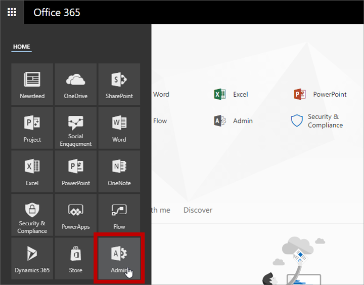
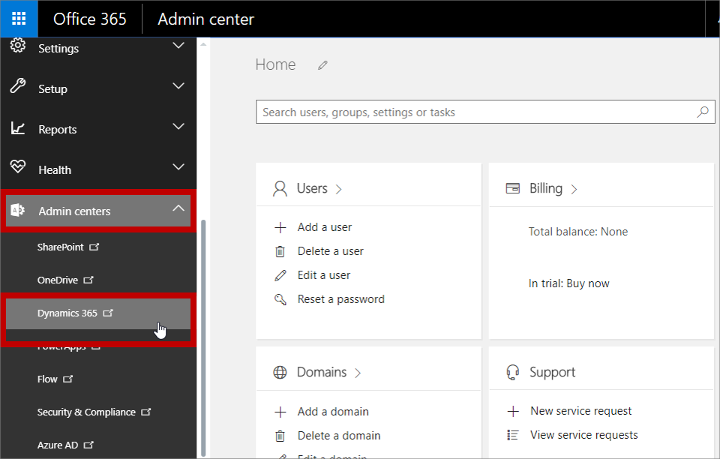
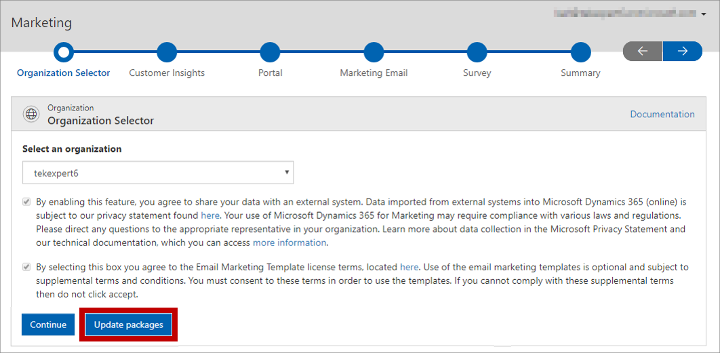

# Keep Marketing up to date

[!INCLUDE[cc_applies_to_update_9_0_0](../includes/cc_applies_to_update_9_0_0.md)]

[!INCLUDE[cc-beta-prerelease-disclaimer](../includes/cc-beta-prerelease-disclaimer.md)]

[!INCLUDE[cc-microsoft](../includes/cc-microsoft.md)] is continuously developing and improving our online services. Through we roll out updates as soon as they're ready, we don't apply them automatically to customers' system because most customers prefer to manage this process themselves (for example by applying and testing updates on a sandbox instance before applying them to a production system).

Read this topic to get an overview of how to update [!INCLUDE[pn-marketing-business-app-module-name](../includes/pn-marketing-business-app-module-name.md)] and its related solutions.

# Solutions included with [!INCLUDE[pn-marketing-business-app-module-name](../includes/pn-marketing-business-app-module-name.md)]

[!INCLUDE[pn-marketing-business-app-module-name](../includes/pn-marketing-business-app-module-name.md)] is implemented using several different [!INCLUDE[pn-microsoftcrm](../includes/pn-microsoftcrm.md)] _solutions_, where a _solution_ is a type software package that adds functionality to your [!INCLUDE[pn-microsoftcrm](../includes/pn-microsoftcrm.md)] platform. [!INCLUDE[pn-marketing-business-app-module-name](../includes/pn-marketing-business-app-module-name.md)] includes several solutions that are unique to the [!INCLUDE[pn-marketing-app-module](../includes/pn-marketing-app-module.md)] app, plus a few more that are also available as separate apps or in other [!INCLUDE[pn-microsoftcrm](../includes/pn-microsoftcrm.md)] app bundles.

When you install [!INCLUDE[pn-marketing-business-app-module-name](../includes/pn-marketing-business-app-module-name.md)], all its solutions are installed by the setup wizard. However, when it comes to keeping your system up to date, you'll need to monitor and update each of the following types of solutions separately:

- **Core [!INCLUDE[pn-marketing-app-module](../includes/pn-marketing-app-module.md)] solutions** : These are the solutions that provide core features that are unique to [!INCLUDE[pn-marketing-app-module](../includes/pn-marketing-app-module.md)] (including the [!INCLUDE[cc-linkedin-solution](../includes/cc-linkedin-solution.md)]). Though there are several of these, you'll be able to maintain and update them all at once using a setup wizard like the one you used when installing [!INCLUDE[pn-marketing-app-module](../includes/pn-marketing-app-module.md)] for the first time.
- **[!INCLUDE[pn-voice-of-the-customer-full](../includes/pn-voice-of-the-customer-full.md)]** : This solution enables [!INCLUDE[pn-microsoftcrm](../includes/pn-microsoftcrm.md)] to host surveys and collect responses. It's also available as an add-on or bundle for other [!INCLUDE[pn-microsoftcrm](../includes/pn-microsoftcrm.md)] apps. You must update this solution separately from the other solutions included with Marketing, using its own update wizard.
- **[!INCLUDE[pn-portals](../includes/pn-portals.md)] capabilities for [!INCLUDE[pn-microsoftcrm](../includes/pn-microsoftcrm.md)]** : This solution enables [!INCLUDE[pn-microsoftcrm](../includes/pn-microsoftcrm.md)] to host interactive portals that display and collect [!INCLUDE[pn-microsoftcrm](../includes/pn-microsoftcrm.md)] data (including the events portal and marketing pages). Like [!INCLUDE[pn-voice-of-the-customer](../includes/pn-voice-of-the-customer.md)], you must update this solution using its own update wizard.

# Find out when new updates are available

To find out when an update is available, regularly check the status of your apps and solutions in the Dynamics 365 Administration Center, as described in this topic. It's also a good idea to participate in forums and follow blogs related to [!INCLUDE[pn-marketing-business-app-module-name](../includes/pn-marketing-business-app-module-name.md)], where updates are likely to be announced and discussed.

# Open the Dynamics 365 admin center

Use the [!INCLUDE[pn-dyn-365-admin-center](../includes/pn-dyn-365-admin-center.md)] to review the status of your apps and solutions and to apply updates. To open the admin center:

1. Sign into your [!INCLUDE[pn-ms-office-365](../includes/pn-ms-office-365.md)] portal.

1. Open the app-selector menu and select the **Admin** app.  
    

1. The **Home** dashboard for [!INCLUDE[pn-ms-office-365](../includes/pn-ms-office-365.md)] opens.

1. In the navigation column on the left, expand the **Admin centers** entry and then select **[!INCLUDE[pn-microsoftcrm](../includes/pn-microsoftcrm.md)]**.  
    

1. The [!INCLUDE[pn-dyn-365-admin-center](../includes/pn-dyn-365-admin-center.md)] opens.
    

See the remaining sections of this topic for details about how to use this page to find and apply relevant updates.

# Find and apply updates for core [!INCLUDE[pn-marketing-app-module](../includes/pn-marketing-app-module.md)] solutions

To find and apply available updates to all core [!INCLUDE[pn-marketing-app-module](../includes/pn-marketing-app-module.md)] solutions (including the [!INCLUDE[pn-linkedin-solution-shortest](../includes/pn-linkedin-solution-shortest.md)]), do the following:

1. Open the [!INCLUDE[pn-dyn-365-admin-center](../includes/pn-dyn-365-admin-center.md)], as described previously.

1. Select the **Applications** tab to see a list of applications you have installed.  
    

1. Select the **[!INCLUDE[pn-microsoftcrm](../includes/pn-microsoftcrm.md)] [!INCLUDE[pn-marketing-business-app-module-name](../includes/pn-marketing-business-app-module-name.md)] Application** item and then select the **Manage** button  in the right column.

1. The [!INCLUDE[pn-marketing-app-module](../includes/pn-marketing-app-module.md)] setup wizard opens. Select an organization from the drop-down list provided and look for the **Update packages** button. If the update button isn't shown, then no updates are available for the current organization. Use the drop-down list to check each of your organizations and if none requires an update you can just quit the wizard.  
    

1. If the **Update packages** button is shown, then select it to start the update. The wizard skips ahead to the **Summary** page, which tracks the progress of the update and will tell you when it's finished.

1. Repeat this procedure for each [!INCLUDE[pn-marketing-app-module](../includes/pn-marketing-app-module.md)] organization that you have.

# Find and apply updates for shared [!INCLUDE[pn-marketing-app-module](../includes/pn-marketing-app-module.md)] solutions

> [!IMPORTANT]
> Always check for and apply core [!INCLUDE[pn-marketing-app-module](../includes/pn-marketing-app-module.md)] updates (as described in the previous section) _before_ you look for shared-solution updates. This is because you will also see core-[!INCLUDE[pn-marketing-app-module](../includes/pn-marketing-app-module.md)] solutions listed when you follow the instructions provided in this section, but it is faster, easier, and safer to update these using the update wizard.

To update shared (non-core [!INCLUDE[pn-marketing-app-module](../includes/pn-marketing-app-module.md)]) solutions, including [!INCLUDE[pn-voice-of-the-customer](../includes/pn-voice-of-the-customer.md)] and [!INCLUDE[pn-portals](../includes/pn-portals.md)], do the following:

1. Open the [!INCLUDE[pn-dyn-365-admin-center](../includes/pn-dyn-365-admin-center.md)], as described previously, and go to the **Instances** tab.  
    

1. If you have more than once [!INCLUDE[pn-microsoftcrm](../includes/pn-microsoftcrm.md)] instance, then each of them is listed here. Select the instance where you have [!INCLUDE[pn-marketing-app-module](../includes/pn-marketing-app-module.md)] installed.

1. The column next to the instance list shows information about your selected instance, including a list of solutions installed there. Select the **Manage your solutions** button  next to the **Solutions** heading here.  
    

1. A list of solutions installed on your selected instance is shown. Look in the **Status** column for any solutions that show a value of "Upgrade available". (The solutions that are relevant for Marketing are "[!INCLUDE[pn-microsoftcrm](../includes/pn-microsoftcrm.md)] [!INCLUDE[pn-portals](../includes/pn-portals.md)] – Base Portal" and "[!INCLUDE[pn-voice-of-the-customer-full](../includes/pn-voice-of-the-customer-full.md)]".) If you have a large number of solutions installed, then use the paging controls at the bottom to check each page for available updates.  
    

    > [!NOTE]
    >  As mentioned at the start of this procedure, you shouldn't update core [!INCLUDE[pn-marketing-app-module](../includes/pn-marketing-app-module.md)] solutions from here. Always run the [!INCLUDE[pn-marketing-app-module](../includes/pn-marketing-app-module.md)] update wizard first, before you start looking for shared-solution updates, to ensure that all your core [!INCLUDE[pn-marketing-app-module](../includes/pn-marketing-app-module.md)] solutions are already shown as up-to-date in this list.

1. Select a solution marked as having an upgrade available and read the information shown in the right column. Select the **upgrade** button  in the right column and then follow the instructions on your screen to apply it.

1. Repeat this procedure for each solution that requires an update.