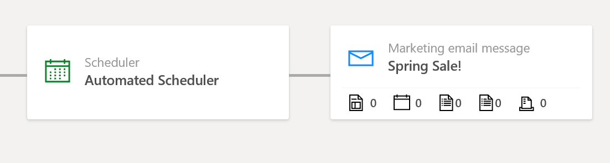
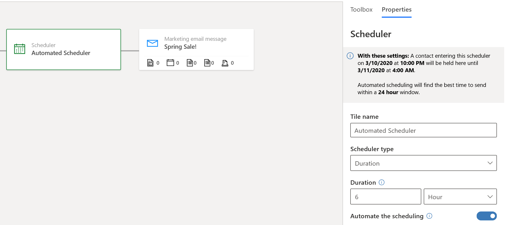

# Use automated scheduling to help improve email engagement

The automated scheduling feature applies artificial intelligence to identify the days and times when each contact is most likely to be actively reading their email. The feature has two main components:

- **Auto scheduler for customer journeys**: Enables customer journeys to schedule message deliveries to each individual contact automatically based on the _best time to email_ calculated by the AI for that contact.
- **Detailed email interaction results**: Provides informative heat-map graphs that summarize the email-interaction trends for each individual contact. The following insights are provided here:
  - **Email open times**: Shows how often the contact opened one of your emails for each hour of the day on each day of the week. This can indicate the days and times when the contact is usually using their email client.
  - **Email reaction times:** Shows how quickly the contact opened a message in relation to the hour of the day and day of the week it was delivered.
  - **Best time to email**: Displays a matrix that indicates which times on which days of the week are probably best for sending a message to the current contact. For each contact, the AI analyzes their reaction-time and open-time results and combines them with data collected for similar contacts to generate the overall recommendations.

> [!NOTE]
> Before you can use automated scheduling, your admin must enable and configure it. If you don't see the features described in this topic, then please ask your admin to enable automated scheduling for your site. More information: [Enable and configure artificial intelligence features](admin-machine-learning.md)

## Create a customer journey that automatically sends messages at the optimal time

When you use manual scheduling, the customer journey processes all the contacts in its target segment at once and delivers messages according to its run schedule without regard to each contact's interaction history. However, with automated scheduling, you can use AI to apply delivery times optimized for each individual recipient. This can often help improve your open rates.

To create a journey that uses optimized delivery times:

1. Go to **Marketing** > **Marketing execution** > **Customer journeys**, and then either create or open a journey.

1. Design your journey as usual but add a scheduler tile in front of each email tile where you want to use automated scheduling.

    

1. Select a scheduler tile and open the **Properties** tab.

    

    Make the following settings:

    - Set the **Automate the scheduling** slider to "on" to enable the automated scheduler.
    - To use a date-and-time schedule (in which all contacts will be forwarded by the scheduler on the same day(s), regardless of when they arrive (such as on October 12, 2019, &plusmn;3 days)) do the following:
        - Set the **Scheduler type** to **Date and time**.
        - Set the **Date and time** to the approximate date and time you'd like to send messages to these contacts.
        - The AI will check the email interaction record for each individual contact and use that information to choose the best date and time within this defined time window.
    - To use a duration schedule (in which each contact waits here for an amount of time related to the day they entered the tile (such as 7 &plusmn;3 days)) do the following:
        - Set the **Scheduler type** to **Duration**.
        - Set the **Duration** to the approximate time that contacts should wait here. Specify both an integer and a unit (hours, days, weeks, or months).
        - The AI will check the email interaction record for each individual contact and use that information to choose the best date and time within this defined time window.
        
1. Repeat the previous step for each scheduler in your journey.

> [!NOTE]
> When selecting more than 24 hours (or 1 day), the model will default to -12h/+12h optimization window rather than 0-12 hours. Similarly when selecting days that are greater than 1 week (7 days or more), the model will default to the -1d/+1d optimzation window rather than the -12/+12h window associated with days.

## View email interaction details and delivery recommendations for a contact

To see information about when a specific contact tends to open your messages, how long it takes them to open them, and advice for the best time to send to them:

1. Go to **Marketing** > **Customers** > **Contacts** to open your list of contacts.
1. Find and select the contact you want to analyze.

1. Open the **Insights** tab and then select **Email open times** from the tab navigator. This page includes three graphs that summarize how and when this contact interacts with your emails, plus a graph that shows the best time to email to this contact based on those results.

    

1. Read the **Email open times** graph as follows:

    - The x-axis indicates the hours of day.
    - The y-axis indicates the days of the week.
    - Colored squares at each day/time intersection indicate how often the contact opened a message at that day and time. The darker the square, the more often the contact opened a message at that time.

1. Read the **Email reaction time** graph as follows:

    - The x-axis indicates the hours of day.
    - The y-axis indicates the days of the week.
    - Colored squares at each day/time intersection indicate how long the contact typically takes to open a message delivered at that day and time. The darker the square, the faster the contact tends to open messages delivered at that day and time.

1. Read the **Best time to email** matrix as follows:

      - The x-axis indicates the hours of day.
      - The y-axis indicates the days of the week.
      - Colored squares at each day/time intersection indicate the days and times that the AI thinks are best for delivering to this contact. The darkest squares indicate the days and times that the AI thinks are best for delivering to this contact, and the lightest squares are worst. Most day/time combinations are in between, but the darker the better.

When you choose to auto-schedule email delivery, the system will use these results to decide when to deliver to each contact.
