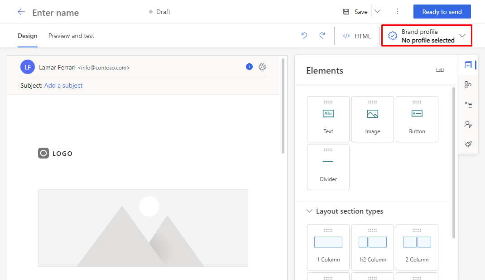
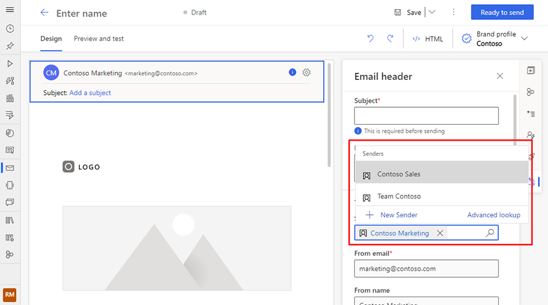
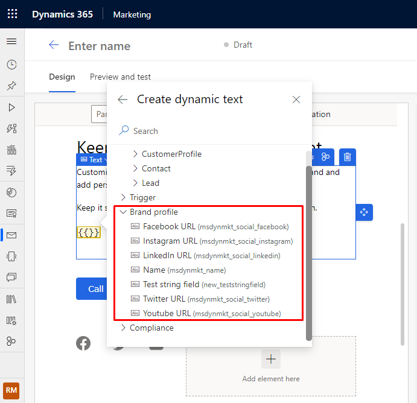

# Use brand profiles in real-time marketing email

Brand profiles allow you to create consistently branded content efficiently, even if your organization has multiple brands. You can create multiple brand profiles for your organization or profiles for each of your business units. To learn about creating brand profiles, see [Create consistent branding with brand profiles](brand-profiles.md).

This article describes how to use brand profiles in the real-time marketing email designer.

## How to use brand profiles

To use brand profiles in the real-time marketing email designer, select the desired profile from the **Brand profile** dropdown in the top right.

> [!div class="mx-imgBorder"]
> 

After you select a brand profile, the default sender for the profile will be automatically populated into the email sending settings. If you've more than one sender, you can remove the default sender, and then choose from any of the other senders in the profile by selecting the lookup icon in the **Sender** box under **Send settings**.

> [!div class="mx-imgBorder"]
> 

> [!NOTE]
> If you want to use a one-time sender for your email (and don’t want to add it to the brand profile), you can leave the sender field empty and manually insert custom sender settings.

## Use dynamic values

You can use the dynamic values from a brand profile to set social links for your social media images in the email. You can access the values by opening the brand profile category in the personalization window. This will ensure that the URLs are accurate no matter which brand profile you've selected.

Learn more about dynamic values: [Personalize content](real-time-marketing-personalization.md).

> [!div class="mx-imgBorder"]
> 

[!INCLUDE[footer-include](../includes/footer-banner.md)]