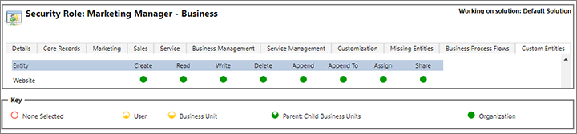
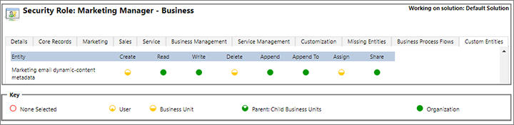

# Use business units to control access to Marketing records

Business units are a standard feature of Dynamics 365 apps for the Common Data Service platform. Admins can use business units to control access to records based on who is using the app and who owns each record. Business units are mapped to an organization's departments or divisions, so if your organization is structured around departments or divisions that have separate products, customers, and segments, you might want to create business units.

## How business units affect Dynamics 365 for Marketing

### General effects of business units

For complete details about how business units work in the platform, see [Create or edit business units to improve security and control](../admin/create-edit-business-units.md). Here is a quick summary of concepts that are relevant to the features discussed in this topic:

- Every user belongs to exactly one business unit.
- Each record belongs to the same business unit as the record owner. The record owner can be a user or team. By default, the record owner is the user that created it, but records can be reassigned by users with sufficient permissions.
- Business units can be hierarchical. The top business unit is called the _organization_ business unit; it is created by default and can't be removed. In a simple setup, this might be the only business unit present. A slightly more complex setup may have a single tier of business units below this one (these are also called). A complex setup might have a full tree with several branches of hierarchical business units.
- Restricted users have security roles that grant them _user-level access_ to the relevant entities. This limit their access to include only those records that they themselves own.
- Standard users have security roles that grant them _business-unit level access_ to the relevant entities. This allows them to access records belonging to other users from their own business unit (business-unit access).
- Advanced users, such as managers, have security roles that grant them _parent-level access_ to the relevant entities. This allows them to access records belonging to users in their own business unit plus all child (lower-tier) business units.
- Privileged users, such as admins, have security roles that grant them _organization-level access_ to the relevant entities. This allows them to access records belonging to all business units.
- Teams can also combine with business units to affect record access. A record can be owned by a team rather than a user, in which case the record becomes part of the team's business unit. Teams can likewise combine users from different business units, in which case members of that team will see other team members' records as though they were all in the same business unit. More information: [Manage teams](../admin/manage-teams.md)

### Segment scopes, membership, and member lists

In addition to the standard effects described previously, business units affect segments as follows:

- Users with business-unit level access will only be able to see those contacts that belong to their own business unit--even if the segment also includes contacts belonging to other business units. Advanced and privileged users may also be able see members from child business units, or even all business units (depending on their security roles). The member count shown for the segment likewise matches the number of members the individual user can see.
- When [scoping is enabled](#enable-bu-scopes) for your instance, each segment has a **Business unit scope** setting, which can be set to &quot;organization&quot; or &quot;business unit&quot;. In addition:
  - Business-unit scoped segments will only contain contacts that belong to the same business unit as the segment owner--even if the selection criteria would otherwise find contacts belonging to all business units.
  - Organization-scoped segments can contain members belonging to all business units.
  - Standard and advanced users are limited to creating segments scoped at the business-unit level.
  - Only users with organization-level create/update permissions will be able to choose the organization scope setting.
- When [scoping is disabled](#enable-bu-scopes) for your instance, all segments are scoped at the organization level, regardless of who created or owns them, which means that they can include contacts belonging to all business units.

### Customer journey scopes, design, processing, and content settings

In addition to the standard effects described previously, business units affect customer journeys as follows:

- When [scoping is enabled](#enable-bu-scopes) for your instance, each customer journey has a **Business unit scope** setting, which can be set to &quot;organization&quot; or &quot;business unit&quot;. In addition:
  - Business-unit scoped journeys will only process contacts that belong to the same business unit as the journey owner-- even if the journey targets segments, lists, and/or pages that include contacts belonging to other business units.
  - Organization-scoped journeys will process contacts belonging to all business units.
  - Standard and advanced users are limited to creating journeys scoped at the business-unit level.
  - Only users with organization-level create/update permissions will be able to choose the organization scope setting.
- When [scoping is disabled](#enable-bu-scopes) for your instance, all journeys are scoped at the organization level, which means that they will process all contacts in the targeted segments, lists, and/or pages, regardless of which business unit each contact belongs to.

### Lead and contact creation, matching, and scoring

In addition to the standard effects described previously, business units affect contacts and leads as follows:

- Contact and lead records created by a marketing form submission are initially owned by the owner of the form.
- Leads generated by a create-lead tile in a customer journey are initially owned by the journey owner.
- When [scoping is enabled](#enable-bu-scopes) for your instance, duplicate detection and matching for incoming contacts and leads considers the owning business unit. This means that you could have two or more identical contacts in the database, with each belonging to a different business unit without being considered a duplicate or match for the others.
- When [scoping is disabled](#enable-bu-scopes) for your instance, duplicate detection and matching doesn't consider the owning business unit.
- Individual lead scores belong to the same user that owns the lead-scoring model that generated them. As with all other types of records, this can affect lead-score visibility based on the viewing user's security-role and business-unit memberships.

### Event registration and attendance

Event registration and attendance records belong to the owner of the event that created them. As with all other types of records, this can affect registration and attendance visibility based on the viewing user's security-role and business-unit memberships.

### Marketing results (insights)

Each insight record is owned by the record (such as email, marketing page, or journey) that generated it. This means that the values shown can be affected by the viewing user's security-role and business-unit memberships.

- Aggregated insights (such as the total number an email was opened) will always display their full value, but the related details may be more restricted.
- Specific insights (such as the list of contacts who opened an email) will only show the names of contacts that the viewing user has the right to see. Other contacts will be anonymized in the list.

For example, a user with business-level access to email messages could see that a message was opened by five contacts, but on viewing the contact list, only see the names of the thee contacts that belong to that user's business unit, plus two anonymized contacts.

### LinkedIn Lead Gen Forms

Form submissions, leads, and contacts generated from LinkedIn Lead Gen Forms have the same owner as the LinkedIn user profile record for the account that generated them. However, you can modify this behavior by customizing a workflow that is included with the LinkedIn Lead Gen Forms feature.

## Enable or disable business-unit scopes

## Important notes and known issues

Business units have wide-ranging consequences for your site when they are enabled. In most cases, they work in a consistent and predictable manner, as explained previously in this topic. However, there are a few unexpected effects that you should be aware of before you decide to turn on this feature.

### Static segments aren't available when business-unit scopes are enabled

When you enable business-unit scopes, no users will be able to create, view, edit, or use static segments, nor can static segments be used to target customer journeys. Instead, you can use static marketing lists and embed them into a dynamic segment.

### Elevated privileges for the website entity are required to go live with marketing pages

The error checker for marketing pages requires full organization-level access to the **Website** entity, which enables the feature to confirm that the page is configured correctly to be published on your Dynamics 365 Portal. Therefore, all users that need to check and/or go-live with a marketing page published on a portal must have a security role with the privileges shown in the following illustration. This doesn't affect captured forms or forms embedded on an external site or CMS system.

For more information about how to work with these settings, see [Security roles and privileges](../admin/security-roles-privileges.md).

### Elevated privileges for marketing email dynamic-content metadata are required to go access assist edit

The assist-edit feature enables users to generate dynamic expressions for use in email messages and content settings. The feature requires that the user has elevated access to application metadata, which enables assist-edit to present details about database entities and records. Therefore, all users that need to use assist edit must have a security role with elevated access to the **Marketing email dynamic-content metadata** entity, as shown in the following illustration. This doesn't affect captured forms or forms embedded on an external site or CMS system.

For more information about how to work with these settings, see [Security roles and privileges](../admin/security-roles-privileges.md).

### See also

