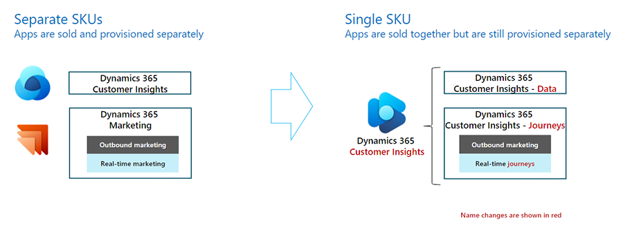

# Dynamics 365 Customer Insights FAQs

This FAQ answers questions about the new Dynamics 365 Customer Insights combined product offering.

## General

1. **What is the new Dynamics 365 Customer Insights?**

    The new Dynamics 365 Customer Insights offering combines the standalone Dynamics 365 Customer Insights and Dynamics 365 Marketing apps into a single offering. While the name is unchanged, this new Customer Insights offering is expanded to include both the Dynamics 365 Customer Insights – Journeys (formerly Dynamics 365 Marketing) and Dynamics 365 Customer Insights – Data (formerly the standalone Dynamics 365 Customer Insights) applications.

    > [!div class="mx-imgBorder"]
    > 

1. **Why are are the Dynamics 365 Marketing and current Dynamics 365 Customer Insights apps being combined into one offering?**

    To provide the most value to users and empower them with the most personalized experiences, we're combining the power of a unified customer profile with the ability to orchestrate customer journeys in real-time, at every customer touchpoint, into one, simple, low-priced offering.  The new, combined offering simplifies licensing to make it easier for customers to buy and use the applications as their business grows.

1. **When is the new Customer Insights offering generally available (GA)?**

    The new Customer Insights combined offering will be generally available on September 1, 2023. At that time, new customers will only be able to purchase the combined offering.

1. **What current certifications are in place for the new Customer Insights offering?**

    The current *Exam MB-260: Microsoft Customer Data Platform Specialist* and *Exam MB-230: Microsoft Dynamics 365 Marketing Functional Consultant* won't be combined at this time, but they'll be renamed to reflect the product changes.

## Availability

1. **When and how will Dynamics 365 Customer Insights be available to purchase?**

    Dynamics 365 Customer Insights will be available to purchase starting September 1, 2023 through the Enterprise Agreement, CSP, and Web Direct channels.

1. **Is the updated offer available worldwide?**

    - The updated product offering is available in the following geographies: United States, United Kingdom, United Arab Emirates, Asia Pacific, Australia, Brazil, Canada, Europe, France, Switzerland, Japan, and India.
    - Germany, Korea, and South Africa, which currently only offer the standalone Customer Insights SKU, will continue to have access to the standalone (that is, separately licensed Dynamics 365 Marketing and Dynamics 365 Customer Insights) licensing model for the next contract renewal cycle.

1. **Is this offer available for US GCC or other sovereign Clouds?**

    This product offering won't be available for US GCC, DoD, GCC High or other sovereign clouds.

## Functionality 

1. **Are there any changes to product functionality due to the consolidation of the offer?**

    There will be no changes to product functionality due to the consolidation of the product offering.
      - We'll continue to invest in new capabilities that will enable stronger, insights-based marketing, making it easier for marketers to glean insights from data with one of the most tightly integrated Customer Data Platform and Marketing Automation Platform products on the market.
      - New customers will be able to take advantage of real-time marketing capabilities. Refer to the next question for more details. 

1. **Can customers have access to both outbound and real-time marketing with the new Customer Insights offer?**

    New customers will only be able to access the real-time marketing module. Current outbound customers provisioning new environments will also get the real-time module only by default, but can add outbound using a self-serve UX.  Learn more about the real-time marketing only module: [Real-time marketing transition FAQ](real-time-marketing-transition.md)

1. **Why is there a shift from outbound marketing to a real-time marketing-only experience?**
 
    Given the strong adoption across customers and the effective results driven by real-time marketing, we'll be investing more deeply in real-time marketing capabilities as the future of marketing.
      - Real-time marketing enables highly personalized, real-time customer journey orchestration across all customer touchpoints in addition to more effective segment-based marketing.
      - While it offers multiple distinct capabilities, real-time marketing also offers enhanced capabilities available in outbound marketing such as lead scoring and forms. Real-time marketing improves productivity by optimizing marketers’ workflows.

## Pricing and licensing

1. **How is the new Dynamics 365 Customer Insights licensed?**

    Like the standalone Dynamics 365 Marketing and Dynamics 365 Customers Insights solutions, the new Dynamics 365 Customer Insights combined offering is sold on a prepaid capacity model, where capacity is pooled at the tenant level.  

    The previous model had four capacity units, while the new model has only the following two capacity units:

      1. **People Interacted** (equivalent to the previous "marketable contact" unit in Dynamics 365 Marketing) that powers the use of **Dynamics 365 Customer Insights – Journeys**. Refer to question five below for the definition of People Interacted.  
      1. **People Unified** (equivalent to the previous "profile" meter in Dynamics 365 Customers Insights) which powers **Dynamics 365 Customer Insights – Data**.  Refer to question four for the definition of People Unified.

    All customers must start with the base SKU, or a minimum, required quantity of 10,000 People Interacted and 100,000 People Unified. This base SKU is priced at $1,700 per tenant per month (ptpm) for new Dynamics 365 customers, or at a discounted price of $1,000 ptpm for existing, qualifying Dynamics 365 customers.  After purchasing the base SKU, customers can then purchase additional capacity SKUs of either capacity unit as needed.

1. **How do customers purchase additional capacity?**

    The additional capacity SKUs of People Interacted and People Unified are sold standalone and separately from one another. Customers have the flexibility to choose how much Dynamics 365 Customer Insights – Journeys and Dynamics 365 Customer Insights – Data they would like to use.

    If a customer chooses to only use Dynamics 365 Customer Insights – Data and not uses Dynamics 365 Customer Insights – Journeys, then that customer would only need to pay for additional People Unified capacity and no People Interacted.  

1. **What license do customers need to use Dynamics 365 Customer Insights?**

    There are no prerequisites for purchasing the updated Dynamics 365 Customers Insights. Customers need a license for the new Dynamics 365 Customer Insights and licenses for any additional capacity.

1. **How do you define People Unified?**

    People Unified is a rebranding of the existing Dynamics 365 Customer Insights app's "profile" meter. A profile represents a uniquely recognized individual that is created through a collection of defined data source sets from several systems.

    The base license includes a default capacity entitlement of 100,000 People Unified.

1. **How do you define People Interacted?**

    People Interacted is a rebranding of the "marketable contact" meter in the existing Dynamics 365 Marketing app. An interacted person is any Dataverse entity (such as a contact, lead, account, or an Insights profile) which is interacted with.
      - A person is considered "interacted" when they're interacted with through an outbound interaction or an inbound interaction, such as filling in a form through a marketing website.
      - The interaction can be sent through out-of-box channels available in Customer Insights - Journeys (for example, emails, SMS, or push notifications), other Microsoft channels (for example, ACS), or third-party systems integrated with Customer Insights - Journeys (for example, other SMS providers).

    **How can I increase or reduce my capacity of People Unified or People Interacted?**

    Customers can increase their capacity for People Unified or People Interacted at any time during their subscription; however, reductions can only be made on the date of their agreement anniversary. Customers must follow the standard rules for their selected licensing program (for example, EA, SCE, CSP).

    Refer to [Commercial Licensing](https://www.microsoft.com/licensing/default) for more information.

1. **Can you buy just the standalone Dynamics 365 Marketing product or Dynamics 365 Customer Insights product and not the other?**

    On September 1, 2023, only the new Customer Insights combined offering will be available for new customers.

    Existing, standalone Dynamics 365 Marketing and/or Customers Insights customers will have an opportunity to renew their existing licensing for one contractual cycle before transitioning to the new Customer Insights combined licensing.  This renewal, however, must be contracted before September 1, 2024.

1. **What happens to customers who only have a Dynamics 365 Marketing or Dynamics 365 Customer Insights license or have licensed both applications?**  

    After GA on September 1, 2023, existing customers can choose to remain and renew on the standalone licensing model for another contractual cycle. This renewal must be made during the transitional offer window that will run through September 1, 2024, with a final contract maturity date that can't extend beyond September 1, 2027.  At the end of the renewed contractual period, customers will then need to transition to the new Customer Insights licensing.