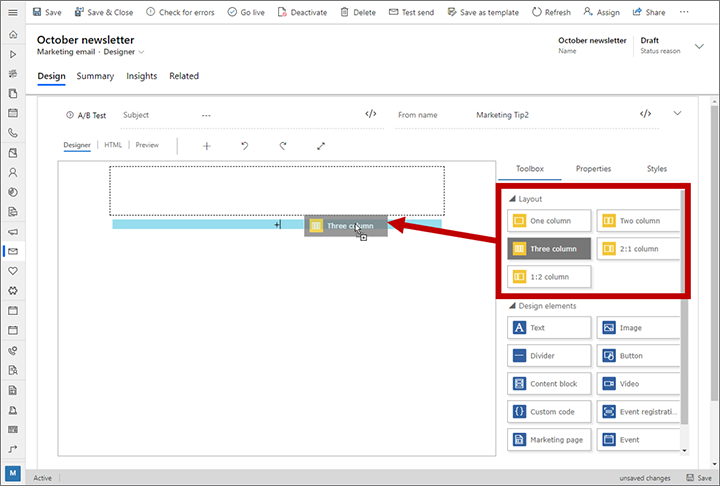
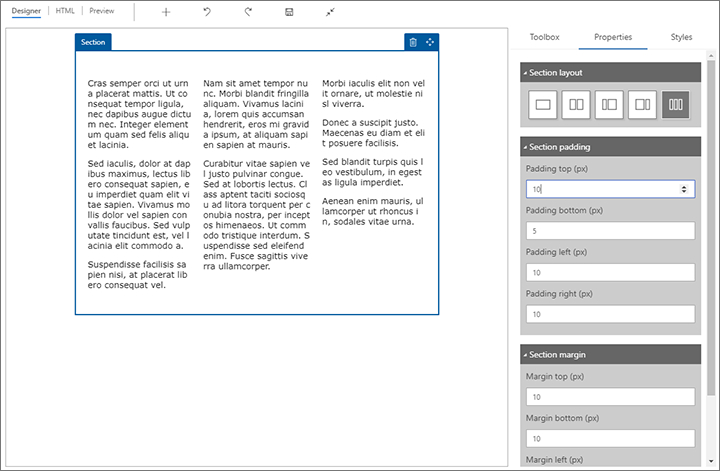
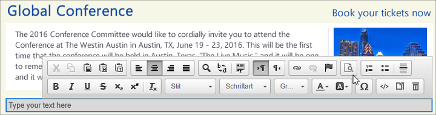
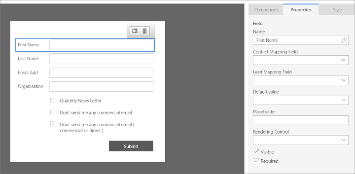
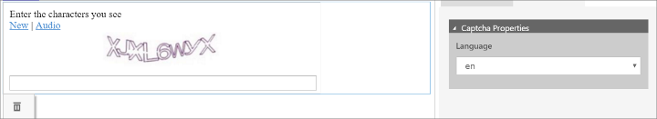

# Design elements reference

Read this topic to learn how to use each of the design elements that are available for use with the various content designers. Some elements are available for all designers and some are specific to email, marketing pages, or forms.

More information: [Design your digital content](design-digital-content.md)

## Section (layout) elements

Use section elements to establish the basic layout of your emails, marketing pages, and marketing forms. In most cases, all design elements (other than section elements) must be placed into a _section element_. Section elements are provided in the **Toolbox** panel under the **Layout** heading.

To add a section element, open the **Toolbox** panel, choose the section element that provides the column layout you'd like to start with and drag it into position above or below any existing section element in your design.

> [!NOTE]
> If you start your design by choosing a template that implement layouts using custom HTML instead of section elements, then section elements aren't available. Instead, you'll be able to drag design elements into any container defined by the template. This may also apply to other custom templates that use custom HTML to create layouts.

When you first add a section element, it will have the number of columns that matches the choice you made when you added it. You can change this and other properties afterwards by selecting the section from the canvas and opening the **Properties** tab, where you can set the following options:

- **Section layout**: Select a button here to change the column layout to the one indicated by the graphic on each button. If you remove a column, all of its content will be moved into one of the remaining columns. If you add a column, the new column will initially be empty.
- **Section styles**: Choose a **Background color** and/or image (**Background src**) for the section. This color or image appears inside the border (including the padding area, but not the margin area). If you  use a **Background src**, note the following:
    - Select the **Image gallery** button  to select an image from the Dynamics 365 Marketing file library (you can also upload new images here).
    - You can instead enter a custom image URL as text. For email messages, your URL can include dynamic expressions to show different images to different recipients. Select the **[Assist edit](dynamic-email-content.md#assist-edit)** button  to get help constructing a dynamic expression.
    - If you've specified an image, the **Background size** setting is also shown. Select **Initial** to use the original image size. Select  **Fill (cover)** to fit the image to the section (the image will zoom to fill the entire area, as needed, but the original aspect ratio will be maintained, so clipping may occur but warping won't).
    - When your image is set with a **Background size** of **Initial**, you'll also be able to choose the horizontal and vertical alignments, which affect the image position. You can chose center, left, or right alignment for each axis.
    - If your image doesn't cover the full section area, then the **Background color** will be shown in areas not covered by the image.
- **Section border styles**: Use these settings to set the style (none, solid, dotted, dashed, or double), line width, line color, and corner radius for the border that goes around the entire section (but not between columns).
- **Section padding**: Specify how much padding (in pixels) you'd like to place between the columns and the colored border. You can enter separate values for top, bottom, left, and right.
- **Section margin**: Specify how much margin (in pixels) you'd like to place between the colored border and the outside edge of the section element. You can enter separate values for top, bottom, left, and right.

> [!NOTE]
> Microsoft Windows Outlook clients don't support all border-style and border-radius settings.

## Common design elements

This section provides full details for the design elements that are provided in all (or nearly all) of the contexts where the designer appears (email, marketing pages, and marketing forms).

### Text elements

Text elements create a block of text within a column.

You can edit the text of any new or existing text element by working directly in the element on the canvas. Use the inline toolbar at the top of the selected text element to do inline styling like font face, font color, bold, italic, paragraph justification, and more. You can also delete, clone, or move a selected text element by using the toolbar.

Select a text element and use the settings provided on the **Properties** tabs to stylize the element itself by using colors, fonts, margins, borders, and backgrounds. Many of the settings on the **Style** tab (which apply to the overall page, form, or message design) also affect the styling of text-element content unless overruled locally.

For email messages, the text toolbar includes an **[Assist edit](dynamic-email-content.md#assist-edit)** button . Use this to place dynamic text, including field values such as the recipient's name. More information: [Add dynamic content to email messages](dynamic-email-content.md)

### Image elements

Image elements add an image to a column, outside a text element. Image elements interact with the Dynamics 365 Marketing image gallery, which helps you store, categorize, find, and share your image files.

When you first add an image element, an image placeholder appears at the location where you dropped the element. Select the image placeholder and open the **Properties** tab, where you can set the following options.

- **Source**: Specify the image you want to display using a combination of the following:
  - Enter a URL directly in the field.
  - Select the **Image Gallery** button  next to this field to select an existing image from the gallery, or to upload a new one. When an image is selected, its URL is shown here.
  - If you are using the image in an email message, then you can use the **[Assist edit](dynamic-email-content.md#assist-edit)** button  to place dynamic text as part of the URL. For example, you could include the recipient's contact ID or company name to select an image that is relevant for each individual recipient. More information: [Use dynamic values to choose an image source or link](dynamic-email-content.md#image-source)
- **Alt text**: Enter a short description of the image. This text will be read aloud to contacts that are using a screen reader, and will also be shown to contacts that have images disabled in their browser or email client. 
- **Link**: Enter a URL here if you'd like the image to function as a link.
- **Alignment**: Choose how the image should be aligned relative to its column (left, right, or center).

When you select an image element, you can use an inline toolbar to delete, clone, or move the element.

### Video elements

Video elements position videos from your video library in your design. Each video record in your library stores a name, video URL, embed code, and thumbnail URL. The library doesn't contain the videos themselves, just these references to them, so you must host your videos somewhere else, such as on one of the major video platforms like YouTube or Vimeo.

When you first add a video element, an placeholder icon is shown at the location where you dropped it. To choose the video to show at that location, select the new video element, open the **Properties** panel, and use the **Source** lookup field to find and select the block that contains the content you want to include here. If you are creating an email, then the video element places a thumbnail image with a link to the video; if you are creating a marketing page, then it places an embed code instead.

For more information about how to set up your video library and use videos in your content, see [Create a video library and add videos to your designs](video-content.md).

### Content-block elements

Content blocks let you establish a block of common content that you can reuse in multiple emails, forms, and/or pages. Use them to establish common headers, footers and other blocks of content that you would like to standardize across your communications.

Content blocks work like templates. They include a fixed collection of content that you add all at once to a design. Once added, the content is copied into your design and doesn't maintain any connection to the original block content, which means that if you edit a content block itself, or its content in a particular design, other designs that already use that block won't be affected.

Use the content-block element to add a content block to your design. When you first add the element, a placeholder icon appears at the location where you dropped the element. Select the new content-block element, open the **Properties** panel, and use the **Content block** lookup field to find and select the block that contains the content you want to include here.

More information: [Create content blocks that you can reuse in multiple designs](content-blocks.md)

### Divider elements

Divider elements insert a horizontal line (&lt;hr&gt;) in a column, outside a text element.

Use the **Properties** and **Style** tabs to establish the appearance of your new or selected divider.

When you select a divider element, you can use an inline toolbar to delete, clone, or move the element.

### Button elements

Button elements create a colorful call-to-action button in a column, outside a text element. Each button is created by using pure HTML text and styling only (no image files), and acts as a link to the URL you define for it.

Use the **Properties** tab to establish the appearance of your new or selected button.

When you select a button element, you can use an inline toolbar to style the button text and to delete, clone, or move the element.

## Email-only design elements

This section describes design elements that are only available when you are designing a marketing email message.

### Custom-code elements

Use custom-code elements to place code snippets in between the various other design elements on the page. You can place any type of code that you like using these elements, but usually you'll use them to hold advanced dynamic content like if-then statements and for-each loops. More information: [Add dynamic content to email messages](dynamic-email-content.md)

Use the **Properties** tab to view, enter, and edit the code to be placed by a custom-code element.

### Event registration QR code elements

Each time a contact [registers for an event](invite-register-house-event-attendees.md), the system creates a new event-registration record, which identifies the contact, the event, and other details. It event-registration record also includes a registration ID stored both as an alphanumeric code and as a machine-readable QR code.

Use QR code elements to place an event-registration QR code in an email message. The code placed in each message provides the registration ID associated with both the recipient of the message and a specific event. Use the **Properties** tab to identify the event for which the QR code applies. No other settings are required.

The QR code is a direct encoding of the registration ID itself. On the day of the event, event workers can quickly and easily scan the code using a QR code scanner or smartphone app. The scanning app could then query the registration database in Dynamics 365 Marketing to confirm validity and/or to register attendance. Please note, however, that custom development is needed to create the scanning app and implement the integration with your Dynamics 365 Marketing system.

### Marketing-page, event, and survey elements

Each of these types of elements creates a colorful button in a new row (outside a text element) that links to a page, event, or survey (depending on the element type). The button is created using pure HTML text and styling only (no image files), and acts as a link to the page, event, or survey you define for it.

Use the **Properties** tab to establish the appearance of your new or selected button, and to choose the page, event, or survey it links to.

> [!NOTE]
> Surveys are optional. If your system admin decided not to include Customer Voice as part of your Dynamics 365 Marketing installation, then the survey element will be shown as unavailable (greyed out) in your **Toolbox**. Contact your system admin if you want to enable it.

[!INCLUDE [cc-marketing-surveys-disclaimer](../includes/cc-marketing-surveys-disclaimer.md)]

## The form element for marketing pages

This section describes the form element, which is only available when you are designing a marketing page. This is currently the only element that is unique for marketing pages.

A form enables visitors to register for something, manage their mailing-list subscriptions, forward a marketing message, or otherwise submit information to interact with your marketing initiatives.

After it is configured, each form element places a *marketing form*, which defines the actual fields and field layout that the form will contain. You'll define your marketing forms separately, and build a library of reusable forms that you can place on various marketing pages as needed. When you add a form element, you'll be able to choose from this library to decide which form to use on the current page. The form element also provides settings on its **Properties** tab that control how the form will behave and appear on the current page. More information: [Create, view, and manage marketing forms](marketing-forms.md)

To configure a form element, select it in your layout, open the **Properties** tab, and make the following settings:

- **Marketing form**: Choose the marketing form to be placed by the form element. Usually, you'll just use an existing form, but you can also create a new one from here if needed. You can only select or create a marketing form that matches the current page type.
- **Update contacts/leads:** This is a read-only field that shows whether the selected marketing form is set to update contacts and/or leads in response to form submissions.
- **Success notification**: Enter a message to show to visitors right after they submit the form. Use this to thank the submitter and confirm their submission.
- **Success image URL**: The success-notification message is rendered as an overlay dialog that includes a small graphic. By default, it shows a green circle with a check mark. If you prefer a custom graphic (such as your organization's logo), then upload the graphic somewhere and enter the full URL here.
- **Error notification**: Enter a short message that tells the user that a temporary error has prevented the system from accepting the form submission. For example, "We can't accept your form submission right now. Please try again later."
- **Error image URL**: The error-notification message includes a small graphic. By default, it shows a red circle with an X mark. If you prefer a custom graphic, then upload the graphic somewhere and enter the full URL here.
- **Limit exceeded notification**: Enter a short message announcing that the system has stopped processing new submissions temporarily, and inviting the user to try again later. This situation can occur if the server detects a submission pattern consistent with abuse of the system and has therefore entered a defensive stance.
- **Redirect URL**: Enter a URL to send the submitter to immediately after they submit the form. This typically would be a page on your own website that thanks the submitter and confirms their submission, or some other message related to the purpose of your marketing page.

## Design elements for forms

The designer provides many elements that are unique to marketing forms. They are all related to positioning and configuring various types of input fields and form controls.

### Field elements

Each field element creates a single form control (such as an input field, check box, or radio button set) that is mapped to the contact and/or lead entity in Dynamics 365. For each marketing-form field that you've set up, you'll find a unique design element named after the field under the **Fields** heading of the designer's **Toolbox** tab. So, for example, if you've mapped the **First Name** field of the contact entity to a marketing-form field called "First Name", you'll also have field element called **First Name** under the **Fields** heading of the form designer. More information: [Create, view, and manage marketing forms](marketing-forms.md)

When you add or select a field in your form, you can read and set the following properties on the **Properties** tab:

- **Label**: Enter text that describes the value expected by the field (such as "first name"). This text will be displayed close to the field in the form.
- *Field information*: Below the Label is a box with information about the field mapping. Most of this is read-only and comes from the [field setup](marketing-fields.md). You can choose a different field mapping here if you want, but usually you select that when dragging a field element to your form.
- **Placeholder**: Enter "ghost text" to be displayed in the field until a value is entered. This text is typically shown in a gray color. You can use this as an alternative to, or in addition to, the field label. This isn't a default value because if the user doesn't enter a value, the field is submitted as blank.
- **Default value**: Enter a default value for the field. Unlike the **Placeholder**, if a user submits the form without editing the default value, then the default value is saved with the submission.
- **Required**: Select this check box to set the field as mandatory. Mandatory fields display an asterisk in the form. All fields marked as required must be filled in when the user submits the form, otherwise the submission will be rejected and the **Required error message** will be shown.
- **Required error message**: Enter a message to show to users if they try to submit the form without including a value for this field (only available when **Required** is selected).
- **Label Position**: Choose the position of the field label relative to the field (top, left, or right).
- **Hide field**: Select this checkbox to hide the field from form users. Users won't be able to see the field, but its value will be saved with the submission. You'll usually set the value either by entering a **Default value** or by using JavaScript to supply a value at runtime.
- **Prefill**: Select this box to enable prefilling for this field. When enabled, the form will try to display a prefilled value for this field when it recognizes the visitor (because the visitor previously submitted a form with the remember-me box checked). More information: [Enable prefilling for forms](form-prefill.md)

> [!IMPORTANT]
> Forms are nearly always intended to create or update one or more database records&mdash;especially contact or lead records. However, record creation will fail if any fields required by the database are missing when the form is submitted. When you're designing a form, always be sure to identify all of the fields required by your database, and add a form element with its **Required** check box selected for each of them. That will ensure that contacts who submit the form will get an error message if any required values are missing. If you don't do this, then form submissions may simply be ignored without informing contacts of the problem. Your database could be customized to require fields that you don't expect, so be sure to talk to your system customizer or administrator if you're not sure which fields are required. The **Check for errors** function for forms doesn't identify all of the fields required by your database, especially custom fields, so you can't depend on it to inform you of this issue. Always be sure to test your form to confirm that it creates the types of records you expect it to.

### Subscription-list elements

Each subscription-list element creates a check box that a visitor can select to subscribe to, or unsubscribe from, one of your mailing lists. For each static marketing list that you've configured as a subscription list, you'll find a unique element named after that list under the **Subscription Lists** heading of the designer's **Toolbox** tab. More information: [Set up subscription lists and subscription centers](set-up-subscription-center.md)

Subscription list elements are only available when you are working with a subscription center or landing page form, and their behavior is slightly different in each case:

- **Landing pages**: When the form is submitted, the contact is added to all lists that are checked, but is not removed from lists that are unchecked. You can choose the default value (checked or unchecked) for each list as needed. Subscription lists on landing pages aren't prefilled to indicate the visitor's current subscriptions.
- **Subscription centers**: When the form is opened, each check box is always prefilled to indicate the current visitor's subscriptions. When the form is submitted, the contact is added to all lists that are checked, *and removed* from lists that are unchecked.

When you add or select a subscription-list element for a form, you can read and set the following in properties on the **Properties** tab:

- **Subscription List**: Shows the name of the subscription list the element represents (read-only). You can click here to open the list itself.
- **Default Value**: This is only available if you are working with a landing-page form. Use it to set the default state of the check box (checked or unchecked).
- **Label Position**: Position of the label (list name) relative to the check box.
- **Label**: The name of the subscription list, as shown on the form.

### Forward-to-a-friend elements

Forward-to-a-friend elements create a collection of input fields that recipients of your marketing email messages can use to forward a copy of that message to each email address that they specify.

All forward-to-a-friend forms must include exactly one forward-to-a-friend element. This element is not available for other types of forms.

When you add or select a forward-to-a-friend element in your form, you can read and set the following in properties on the **Properties** tab:

- **Ask for friend's name**: Controls whether to include a field for entering names in addition to email addresses. The form always requests email addresses.
- **Number of recipients**: Sets the number of name/email input pair fields created by the element.

### Do-not-bulk-email elements

Do-not-bulk-email elements add a check box to a subscription center form that enables visitors to opt out of all marketing email messages. This feature is required by law in many jurisdictions, and helps maintain your organization's email reputation throughout the internet, thus helping to keep your marketing messages from getting filtered away or stuck in spam traps.

All subscription center forms must include exactly one do-not-bulk-email element. You can also include this element in landing-page forms, but it's not required.

The do-not-bulk-email element is a standard form-field element that is permanently configured to map to the "Do not bulk email" field of the contact entity. Other than this, all its properties are the same as those for standard field elements, as described in [Field elements](#field-elements).

### Remember-me elements

Remember-me elements add a remember-me feature to your form. If a visitor submits a form with the remember-me box selected, the form will be prefilled with known values the next time they open one of your Dynamics 365 Marketing forms (while using that same computer and browser). Only the fields specifically configured to allow prefilling will be filled the next time. You should always include a design element of this type on marketing pages that are enabled for prefilling. More information: [Field elements](#field-elements)

The remember-me element is a standard form-field element that is permanently configured to map to the "Allow form prefill" field of the contact entity. Other than this, all its properties are the same as those for standard form fields, as described in [Field elements](#field-elements).

### Submit-button elements

Submit-button elements create a submit button for the form. All forms must include exactly one of these. Its only property is the button text, which establishes the text shown on the button.

Dynamics 365 Marketing automatically adds a submit-button element to each new form you create. This type of element is not otherwise available in the **Toolbox**, so you should take care not to delete it from your forms because there is no way to add it again (other than immediate undo).

### Reset-button elements

Reset-button elements create a reset button for the form, which when selected removes all values for all fields in that form. All forms must include exactly one of these. Its only property is the button text, which establishes the text shown on the button.

Reset-button elements are only available when you are working with a forward-to-a-friend or landing-page form.

### Captcha elements

Captcha elements add a captcha to your form, which helps make sure that only humans can submit the form, thus preventing bots from filling your database full of spam or noise.

You've probably seen captchas before. They require you to recognize and repeat a set of characters designed to be difficult for a computer to recognize.

The only property for captcha elements is the **Language**, which sets the language used in the instructions displayed for the captcha.

Captcha elements are only available when you are working with a landing-page form. Forwarding pages and subscription centers don't need a captcha because they are only available to registered contacts.

### See also

[Design your digital content](design-digital-content.md)  
[Accessibility and keyboard shortcuts](designer-shortcuts.md)  
[Create a new email and design its content](email-design.md)    
[Work with email, page, and form templates](email-templates.md)  
[Create and deploy marketing pages](create-deploy-marketing-pages.md)  
[Create, view, and manage marketing forms](marketing-forms.md)  
[Create and manage input fields for use in forms](marketing-fields.md)

[!INCLUDE[footer-include](../includes/footer-banner.md)]