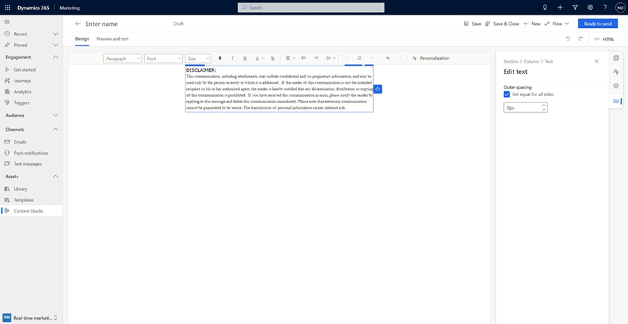
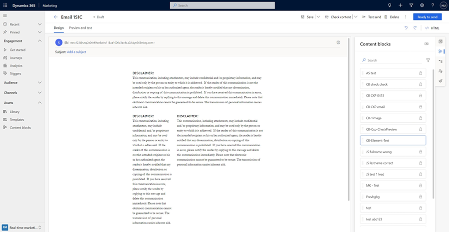
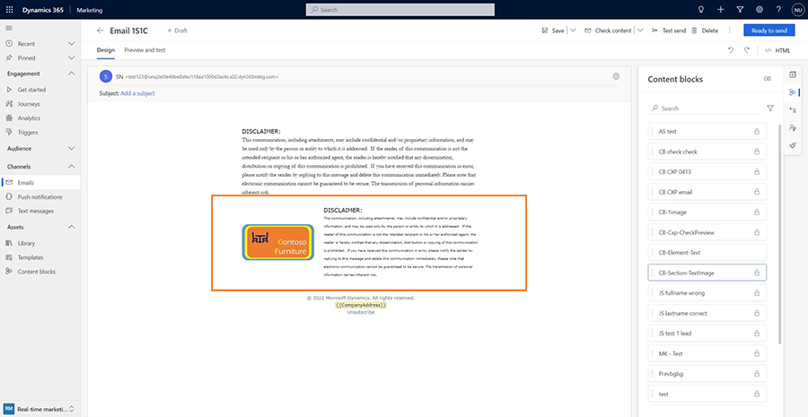

# Create content blocks that you can reuse in multiple designs

Content blocks are pre-made pieces of content that you can insert into emails. They can contain text, images, links, buttons, and more – anything that can be used as content in an email. They also can include formatting and layout. When inserted, all of the content (including the layout, if present) contained within the content block becomes part of the email.

## Types of content blocks

There are two types of content blocks:

- **Element content blocks:** These content blocks include one or more elements (text, image, button, link, etc.) only, but no layout. Below is an example of an element content block that contains some text:

    > [!div class="mx-imgBorder"]
    > 

    Because this type of content blocks only contain element(s), it doesn’t have its own layout and will take the shape of section or column that it's placed in. In the screenshot below, the same text content block from above has been inserted into three differently sized columns:

    > [!div class="mx-imgBorder"]
    > 

- **Section content blocks:** These content blocks include one or more sections and therefore retain their layout. Sections can include any combination of elements such as text, image, button, link, etc. Here's an example:

    > [!div class="mx-imgBorder"]
    > 

    Such a section will retain its layout when inserted into an email:

    > [!div class="mx-imgBorder"]
    > 

## When should you use content blocks?

There are many benefits to using content blocks. Content blocks are versatile and can be used in many scenarios to drive efficiency, ease of use, and consistency while reducing common mistakes during content creation. Here are a few suggestions:

1. Commonly used content such as boiler plate text (legal text, terms and conditions, intro, or closing text) can be saved as an element content block and then quickly inserted into emails. This will save time and ensures that the correct content is used each time.
1. Use section content blocks for creating easy to use components such headers and footers that can then be used any number of times to not only save time, but also to have a consistent look for your emails.
1. Content blocks can also include dynamic text. This opens up more possibilities to create advanced reusable content. For example, you can create an “Order” content block that lists all of the items ordered by a customer in a nice tabular format (assuming your CRM is set up so that the Contact table is related to the Order table). Once created, this “Order” content block can then be used by everyone on your team including those who may not be familiar with using dynamic text or know the data model of your CRM.

## Creating a content block

There are two ways to create content blocks: from the content block editor or from the email designer.

- **From the content block editor:** Navigate to the **Content blocks** menu item in the left navigation menu to see a list of available content blocks. You can select any of the blocks to edit or select **+New** in the command bar at the top to create a new content block from scratch. To create an element content block, drag and drop elements onto the canvas and enter the content. To create a section content block, drag and drop layouts and then insert elements and content within those layouts.
- **From the email designer:** You can select and save any content from your emails as content blocks. Select an element (for example, text or an image) or a section and then select the **Content block** context menu item. You'll see a **Save as content block** dialog that allows you to replace an existing content block or create a new one.

### Notes

1. You can add tags to content blocks that will make them easier to find later.
1. Content blocks have two states or modes. In the *Draft* state/mode, the content block can be edited and isn't available for inserting into emails. In *Live* (outbound marketing) or *Ready to send* (real-time marketing) state/mode, the content block can't be edited.
1. Saving a content block from the email editor saves it in *Draft* state/mode. You'll have to open the saved content block later in the content block editor to change its state/mode.

## Using a content block

Using a content block is as simple as finding it in the list of available blocks and inserting it into the desired place in an email. First, open an email in the email designer, then select the content block tab in the canvas toolbar to see the list of available content blocks. You can also search content blocks by name or by tags. In the list, the lock icon shows you which content blocks are protected from editing.

- **Search:** Find all content blocks that have "text" in their name:

    > [!div class="mx-imgBorder"]
    > 

- **Search:** Find all content blocks that have the tag "Contoso":

    > [!div class="mx-imgBorder"]
    > 

## Updating a content block

A content block can be edited while it is in a *Draft* state. If it is in a *Live* (outbound marketing) or *Ready to send* (real-time marketing) state, select **Edit** to place it in a *Draft* state so it can be edited.

> [!IMPORTANT]
> Updating a content block does not update any emails that are using that content block. Each time a content block is inserted into an email, that email gets a copy of the content block that is no longer connected or associated with the original content block.

## Protecting content from changes

A content block can be “protected.” When such a content block is inserted into an email, its content (and layout, if present) can't be changed.

To make a content block protected or unprotected, set the **Protected** attribute in its settings. New content blocks are set as protected by default. 

[!INCLUDE[footer-include](../includes/footer-banner.md)]
