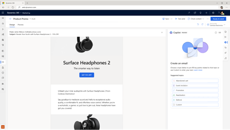
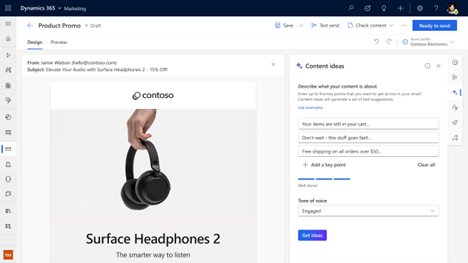

# Preview: Use AI to kickstart email creation with content ideas Copilot

> [!IMPORTANT]
> A preview feature is a feature that is not complete, but is made available before it’s officially in a release so customers can get early access and provide feedback. Preview features aren’t meant for production use and may have limited or restricted functionality.
> 
> Microsoft doesn't provide support for this preview feature. Microsoft Dynamics 365 Technical Support won’t be able to help you with issues or questions. Preview features aren’t meant for production use, especially to process personal data or other data that are subject to legal or regulatory compliance requirements.

> [!NOTE]
> The content ideas preview is currently only available in North America.

> [!Tip]
> Learn about using content ideas to create inspiring emails in our latest blog: [Make email creation fun and more efficient with AI-powered content ideas in Dynamics 365 Marketing](https://cloudblogs.microsoft.com/dynamics365/it/2022/11/30/engage-your-customers-faster-with-ai-powered-marketing-email-content/).

Content ideas help you discover new ways to express your thoughts, helping you move from email concept to completion faster. This article explains how content ideas works and how you can start using it to kickstart your emails.

> [!VIDEO https://www.microsoft.com/videoplayer/embed/RWZDEE]

## What is content ideas Copilot?

The content ideas Copilot feature is like a brainstorming partner that can help inspire you while you’re writing an email. You provide a short list of initial thoughts (key points) and select a tone of voice, and Copilot generates a range of longer content suggestions that you can build on. You can add these suggestions to your draft, use them as inspiration to write a new draft, or go in a different direction altogether.

> [!div class="mx-imgBorder"]
> 

## Enable Copilot

> [!NOTE]
> The content ideas feature is enabled by default and is visible in the email editor toolbox (in English environments only).

### Turn on or off the content ideas feature switch

1. Go to **Settings** > **Overview** > **Feature switches**.
1. Enable/disable the **Copilot (preview)** feature switch toggle.

## How to use Copilot

1. Select the **Copilot** button in the email editor toolbox or the Copilot button above editing text on canvas to open the Copilot pane.
1. Choose the **Topic of your email** from the list of suggested ones or choose **Custom**.
 
1. A) If you selected one of suggested topics – Copilot will automatically fill in sample key points for you, which you can modify according to your needs.
1. B) If you selected custom topic – add up to five key points that you want to get across in your email (a minimum of three words per key point is recommended). You can also use pre-made examples (select the **See examples** link and then **Use this example** for a selected set of key points).
1. Select **Tone of voice**.
1. Select **Get ideas**.
1. Copilot generates a set of text suggestions. It might take a short while to generate content (up to 15 seconds, depending on the usage).
1. Browse the generated ideas using the scrollbar in the content ideas pane.
1. Select **Get more ideas** to generate more ideas for the same key points.

    > [!NOTE]
    > Content ideas are just suggestions. It is your responsibility to edit generated suggestions so that your final copy is accurate and appropriate.

> [!div class="mx-imgBorder"]
> 

## Generate ideas using your organization's emails

You can provide personalized context to the content ideas feature. Content ideas analyze your organization’s ready-to-send/live marketing existing emails (minimum 20) in addition to a wide range of internet sources to increase the relevancy of generated ideas. The analysis is a one-time process that can take up to a few hours.

To begin the content ideas analysis:

1. Select the **Copilot** button in the email editor toolbox to display the content ideas pane.
1. If there are enough ready-to-send/live marketing emails in your organization to start the analysis process (minimum 20) and you have read permission to access all the emails, select the **Enable** button.
1. You see a popup window stating that it's ready to analyze your emails. This is a one-time process that can take up to a few hours. Select **Enable** to proceed.
    > [!NOTE]
    > You will only be able to start the analysis process if you have read permission access to all the emails in your organization.
1. After the analysis of existing emails is complete, you'll be able to generate ideas using your organization’s emails.

    To generate ideas, add up to five key points that you want to get across in your email in the content ideas pane. Select the **Generate ideas using your organization’s emails** checkbox, then select the **Get ideas** button.

## How does the Copilot technology work?

Content ideas Copilot is built on a machine learning model called GPT-3.5. Trained on a vast number of text samples from the internet, GPT-3.5 generates new text in English that looks and sounds similar to text that was written by a human. Copilot uses GPT-3.5 as a foundation, then considers your organization’s recent (English) ready-to-send emails and the key messaging points that you share for each new email draft. Copilot masks any personal data in generated ideas and shows only the results that are long enough and unique enough to be useful.

## What data does Copilot collect?

If you grant permission, Copilot will automatically review your organization’s recent (English) ready-to-send emails without any human review. The only time a human review the content of generated ideas is if you report it to Microsoft (using a quick feedback survey built into the content ideas feature).

## What if I'm not satisfied with the generated content?

Copilot uses the key points you add to generate suggestions for your email. Make sure to provide good key points that touch on the top themes you want to get across to your audience. Include two to five key points. Use a group of words or a full sentence for each key point.
 
If you aren't satisfied with the generated ideas, try one or more of the following:

1. Continue browsing through generated ideas to make sure you’ve reviewed all of them.
1. Get more ideas based on the already provided key points.
1. Rephrase or add more key points to get new ideas.

Copilot generates original content, but it isn’t always factual. In addition, because the underlying technology behind content ideas uses AI that has been trained on a wide range of internet sources, some text suggestions may include questionable or inappropriate content. It's your responsibility to edit generated suggestions so that your final copy is accurate and appropriate.

> [!IMPORTANT]
> If you encounter inappropriate content being generated, report it to Microsoft using this feedback form: [Report abuse](https://msrc.microsoft.com/report/abuse?ThreatType=URL&IncidentType=Responsible%20AI&SourceUrl=https://dynamics.microsoft.com/marketing/overview/). It will help improve the functionality moving forward.
>
> Microsoft may disable the content ideas feature for selected customers if abuse of the functionality is detected.

[!INCLUDE[footer-include](../includes/footer-banner.md)]