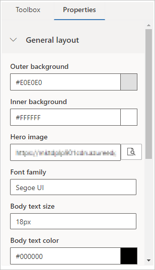

# Create and deploy marketing pages

A marketing page is a webpage that includes a form where people can register for an offer, update their contact information, manage mailing list subscriptions, and more. All the information submitted through a marketing page is automatically captured by Dynamics 365 Marketing and applied immediately to your customer database.

Marketing pages integrate with&mdash;and provide expanded functionality for&mdash;many other Dynamics 365 Marketing features, including email marketing, customer journeys, behavior analysis, lead scoring, and result analytics.

> [!IMPORTANT]
> The marketing-page feature described in this topic requires that you have a Power Apps portal associated with your Dynamics 365 Marketing instance. If your admin chose to install Marketing without a portal, then the features described in this topic won't be available to you. If you attempt to go live with a marketing page without having a portal available, you'll be alerted to the issue and offered a chance to install a portal if you like (admin privileges required). For details about how to create landing pages without using a portal (or in addition to the portal), see [Integrate with landing pages on external websites](embed-forms.md).
> 
> Note, however, that a simple default subscription center *is* available even if you don't have a portal. This page is hosted by your Dynamics 365 Marketing server and can be customized using the features described in this topic. More information: [The default subscription center](set-up-subscription-center.md#default-center).

## Overview: How to create a new marketing page and go live

The overall process of creating a new marketing page and making it available on the web goes through the following stages:

1. Go to **Marketing** > **Internet Marketing** > **Marketing Pages**, and select **New** in the command bar to start creating a new page.

2. Choose a page template, which creates your initial design by establishing the page type, column layout, and sample content.

3. Add and edit your page content. Use the graphical editor to drag new page elements to your design (including forms, text, images, and more), and use the HTML editor to add extra features, custom styles, and scripts. Along the way, you might need to create new forms, but usually you'll be able to use existing ones.

4. When you are satisfied with the design, check it for required content and technical errors by selecting **Check for Errors** in the command bar. If a problem is found, read the description, address the issue, and try again until the page passes the error check.

5. Select **Save** in the command bar. Your page is now verified and saved in your system, but is still not available on the web. Select **Go Live** to publish it to your Power Apps portal, where it will be made available at a public URL. You are now ready to start promoting it by including links to it in your marketing email messages, banners, social-media posts, and other marketing initiatives.

More information: [Design your digital content](design-digital-content.md)

The remainder of this topic provides more information about these steps, including how to work with forms and form fields, how to integrate marketing pages into emails and customer journeys, and how to read and interpret results.

## Types of marketing pages

There are three basic types of marketing pages:

- **Landing pages**  
    Landing pages provide a webpage with an input form that visitors can use to sign up for a download, discount, mailing list, or other perk by entering their contact details. When a visitor submits a form, Dynamics 365 Marketing automatically stores the submitted values in your database, creating new records or updating existing ones as needed.
- **Subscription centers**  
    All marketing email messages must include a link to a subscription center, where mail recipients can go to unsubscribe, choose other lists to subscribe to, or update their contact information. You can choose which mailing lists to include in each subscription center, but all subscription centers will also include a check box the visitor can use to opt out of all marketing emails.
- **Forward to a friend**  
    If you'd like to enable recipients of your marketing email messages to forward those messages to friends who might also be interested in your offers, create a forward-to-a-friend marketing page and include links to it in your marketing email messages. Dynamics 365 Marketing tracks when messages are forwarded by contacts who use the forward-to-a-friend form, but not when contacts simply forward a message by using their standard email client. Messages forwarded using an email client will still contain the web beacon and personalized links of the original recipient, so your email results will show all interactions with these forwarded messages as being done by the original recipient too&mdash;but when a contact uses the forward-to-a-friend form, Dynamics 365 Marketing generates a new web beacon and personalized redirect links for each forwarded message. Forward-to-a-friend recipients also won't see any personalized information that was intended for the original recipient. For reasons of data privacy, all data entered into a forward-to-a-friend form is deleted after 30 days, so no new contact or lead records are created unless a recipient of the forward chooses to register with your organization using a landing page.

Dynamics 365 Marketing also includes both Customer Voice (for running online surveys) and Event Management (which includes a full-featured event website that provides event information and registration). Like marketing pages, these provide interactive webpages that run as Power Apps portals, and work similarly to marketing pages under the hood, but they are more specialized so you'll work with them differently. More information: [Set up the event website](set-up-event-portal.md), and [Create and run online surveys](surveys.md)

## Create, view, and manage marketing pages

### Create a new marketing page

To create a new marketing page, do one of the following:

- Go to **Marketing** > **Internet Marketing** > **Marketing Pages** to go to the full list of all pages currently available on your instance, and then select **+New** in the command bar. You'll first be asked to choose a template, which establishes the page type and column layout and might also provide sample content. Then you'll be in the content designer, where you can start designing your page.

- While working in a marketing email message or customer journey, add a marketing page tile or design element to your journey or message, and then select **+New** on the **Properties** tab instead of choosing an existing page. A quick-create flyout slides in from the side of the screen, where you must enter values for all required fields and then select **OK**. A new marketing page is created with your selected settings and is applied to your new customer-journey tile. However, you'll still need to finish the page later by choosing a template and customizing it as needed. You can do that now by selecting **Edit** on the **Properties** tab while the page is selected, or you can do it later either from here, or from the full list at **Marketing** > **Internet Marketing** > **Marketing Pages**.

### Set the required field values

Every time you create a new marketing page, you must fill out the required fields shown in the header of the page. Select the **More header fields** button at the side of the header to open a drop-down dialog and make the following settings:

- **Name**: Enter a name for the page that you can easily recognize later. This name is internal-only.
- **Type**: Choose the [type of page](#page-types) you are making. Each type has different requirements and options.
- **Partial URL**: When you publish the page, this value becomes part of its URL. The page will be published on your Power Apps portal, so the final URL for the page will have the form: **https://*&lt;YourOrg&gt;*.microsoftcrmportals.com/*&lt;PartialURL&gt;***. Enter a suitable partial URL (note that contacts might notice this text when they load your page).

(These settings are also available on the **Summary** tab.)

Select **Save** on the command bar after you've finished making these settings.

### Design your content

After choosing a template, you'll be in the page content designer, which resembles the other digital content designers provided in Dynamics 365 Marketing. Work with it as follows:

- The **Content** > **Designer** tab provides a graphical tool that you use to design your content by using drag-and-drop, point-and-click operations. Add new elements to your design by dragging elements from the **Content** > **Designer** > **Toolbox** tab to the content canvas. Choose a design element that already exists in your design, and then use the **Content** > **Designer** > **Properties** tab to configure and style it.

- When you select a design element on the canvas, you'll usually see a pop-up toolbar just above the element. The tools it offers vary depending on which type of design element you've selected. The toolbar typically provides commands to move, copy, or delete the selected element. For text elements, the toolbar offers commands for applying basic text formatting as you would in Microsoft Word.

- To style the overall page with basic fonts, colors, and background, select anywhere in the background of your marketing page in the designer. After you select the background, the **Properties** tab will display **General layout** options.

    

- Use the **Designer** > **HTML** tab to edit the raw HTML directly. You might use this to paste in an existing HTML design, or to fine-tune the code in ways the graphical editor doesn't support (such as custom attributes or logic).

> [!IMPORTANT]
> HTML code for marketing pages published to the portal must be less than the maximum size of the **adx_copy** attribute of the **adx_webpage** portal entity, not including images or imported scripts. If you attempt to publish designs larger than the maximum size of the **adx_copy** attribute, you will receive an error message.

More information: [Design your digital content](design-digital-content.md)

### Establish marketing page templates

Dynamics 365 Marketing comes with a collection of sample templates to help get you started quickly. You can also save your own templates, which you might do to establish your own visual identity and quickly create new pages that conform to it.

You can view, edit, and create all marketing page templates by going to **Marketing** > **Marketing templates** > **Page templates**. The process for creating a new template is similar to creating a new page, but you'll start from a blank slate rather than choose a template at the beginning.

More information: [Work with email, page, and form templates](email-templates.md)

## Deploy your marketing pages

While you are building a marketing page it remains in draft status, and is therefore editable in Dynamics 365 Marketing but is unavailable to customers on the internet. When your page is ready for use, you must publish it by selecting **Go Live**. Your design will be checked for errors and then, provided it passes, be published to your portal. If a problem is found, read the error message, address the issue, and try again.

You can edit a live page by selecting **Edit** in the command bar. While you are editing it, it remains available on the internet. After editing, select **Save** to go live with your changes. Your design will be checked for errors and then, provided it passes, your updates will be published.

> [!NOTE]
> Most marketing pages include an embedded form, which you must design and publish separately from the page. The imported form is validated together with the page when you publish it, so if an embedded form has been removed or changed so it is no longer valid, then you'll see a validation error when publishing or saving an edited page.

You can remove a live page from the internet by selecting **Stop** in the command bar.

More information: [Go live with publishable entities and track their status](go-live.md)

## Integrate landing pages with other marketing initiatives

To include a link to a landing page in a marketing email, you can either create a dynamic text link (in a text element) that references the page by using the [assist edit](dynamic-email-content.md#assist-edit) feature, or add a dedicated marketing-page element, which creates a colorful call-to-action button that links to the page. More information: [Add dynamic content to email messages](dynamic-email-content.md) and [The form element for marketing pages](content-blocks-reference.md#the-form-element-for-marketing-pages)

You can create customer journeys that include triggers that react to marketing page submissions, so that contacts who submit the page are treated differently from those who don't. To do this, include a marketing page tile in your journey design and then place a trigger that references that tile and specifies logic for how to react to it. To trigger on a marketing page linked to in a marketing-email message, add an email tile for the message and then add a marketing page tile as a child tile of that message. More information: [Use customer journeys to create automated campaigns](customer-journeys-create-automated-campaigns.md)

## View submitted data and analyze page performance

To view form submissions and analytics about page usage and performance:

1. Go to **Marketing** > **Internet Marketing** > **Marketing Pages** and use the search, sort, and filtering controls to find the page you want to inspect.

1. Go to the **Insights** tab.

1. Explore the various tabs and displays here to view submissions and gain insights.

More information: [Analyze results to gain insights from your marketing activities](insights.md)

## Configure marketing page defaults and matching strategies

Administrators can choose settings that control several aspects of the way all marketing pages function on your instance and the way they match incoming page submissions to existing contacts and leads. More information: [Configure landing pages](mkt-settings-landing-pages.md)

## Privacy notice

[!INCLUDE[cc-marketing-cookies](../includes/cc-marketing-cookies.md)]

### See also

[Create a landing page](create-landing-page.md)  
[Design your digital content](design-digital-content.md)  
[Accessibility and keyboard shortcuts](designer-shortcuts.md)  
[Design elements reference](content-blocks-reference.md)  
[Upload and use images and files](upload-images-files.md)  
[How Dynamics 365 Marketing uses cookies](cookies.md)  
[Go live with publishable entities and track their status](go-live.md)
