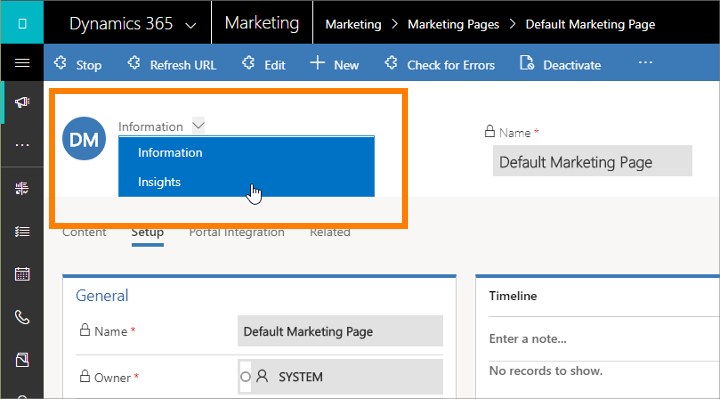

# Create and deploy marketing pages

[!INCLUDE[cc_applies_to_update_9_0_0](../includes/cc_applies_to_update_9_0_0.md)]

[!INCLUDE[cc-beta-prerelease-disclaimer](../includes/cc-beta-prerelease-disclaimer.md)]

A marketing page is a webpage that is hosted by [!INCLUDE[pn-microsoftcrm](../includes/pn-dynamics-365.md)] and usually includes a form where people can register for an offer, update their contact information, manage mailing list subscriptions, and more. All the information submitted through a marketing page is automatically captured by [!INCLUDE[pn-microsoftcrm](../includes/pn-dynamics-365.md)] and applied immediately to your customer database.

Marketing pages integrate with&mdash;and provide expanded functionality for&mdash;many other [!INCLUDE[pn-microsoftcrm](../includes/pn-dynamics-365.md)] features, including email marketing, customer journeys, behavior analysis, lead scoring, and result analytics.

[!INCLUDE[cc-marketing-cookies](../includes/cc-marketing-cookies.md)]

## Overview: How to create a new marketing page and go live

The overall process of creating a new marketing page and making it available on the web goes through the following stages:

1. Go to **Lead Management** &gt; **Marketing Pages**, and select **New** in the command bar to start creating a new page.

1. Choose a page template, which creates your initial design by establishing the page type, column layout, and sample content.

1. Add and edit your page content. Use the graphical editor to drag new page elements to your design (including forms, text, images, and more), and use the HTML editor to add extra features, custom styles, and scripts. Along the way, you might need to create new forms, but usually you'll be able to use existing ones.

1. When you are satisfied with the design, check it for required content and technical errors by selecting **Check for Errors** in the command bar. If a problem is found, read the description, address the issue, and try again until the page passes the error check.

1. Select **Save** in the command bar. Your page is now verified and saved in your system, but is still not available on the web. Select **Go Live** to publish it by using the portal capabilities for [!INCLUDE[pn-microsoftcrm](../includes/pn-dynamics-365.md)], where it will be made available at a public URL. You are now ready to start promoting it by including links to it in your marketing email messages, banners, social-media posts, and other marketing initiatives.

The remainder of this topic provides more information about these steps, including how to work with forms and form fields, how to integrate marketing pages into emails and customer journeys, and how to read and interpret results.

## Types of marketing pages

There are three basic types of marketing pages:

- **Landing pages**  
    Landing pages provide a webpage with an input form that visitors can use to sign up for a download, discount, mailing list, or other perk by entering their contact details. When a visitor submits a form, [!INCLUDE[pn-microsoftcrm](../includes/pn-dynamics-365.md)] automatically stores the submitted values in your database, creating new records or updating existing ones as needed.
- **Subscription centers**  
    All marketing email messages must include a link to a subscription center, where mail recipients can go to unsubscribe, choose other lists to subscribe to, or update their contact information. You can choose which mailing lists to include in each subscription center, but all subscription centers will also include a check box the visitor can use to opt out of all marketing emails.
- **Forward to a friend**  
    If you'd like to enable recipients of your marketing email messages to forward those messages to friends who might also be interested in your offers, create a forward-to-a-friend marketing page and include links to it in your marketing email messages. By encouraging contacts to use the forwarding form rather than forward a message by using their email client, you'll collect more email addresses of people who might be interested in your products and improve the accuracy of your email analytics. Forward-to-a-friend recipients won't see any personalized information that was intended for the original recipient.

[!INCLUDE[pn-marketing-business-app-module-name](../includes/pn-marketing-business-app-module-name.md)] also includes both Voice of the Customer (for running online surveys) and Event Management (which includes a full-featured event portal that provides event information and registration). Like marketing pages, these provide interactive webpages that run as [!INCLUDE[pn-microsoftcrm](../includes/pn-dynamics-365.md)] portals, and work similarly to marketing pages under the hood, but they are more specialized so you'll work with them differently in [!INCLUDE[pn-microsoftcrm](../includes/pn-dynamics-365.md)]. [!INCLUDE[proc-more-information](../includes/proc-more-information.md)] [Set up the event portal](set-up-event-portal.md), and [Create and run online surveys](surveys.md)

## Create, view, and manage marketing pages

### Create a new marketing page

To create a new marketing page, do one of the following:

- Go to **Marketing** &gt; **Lead Management** &gt; **Marketing Pages** to go to the full list of all pages currently available on your site, and then select **+New** in the command bar. You'll first be asked to choose a template, which establishes the page type and column layout and might also provide sample content. Then you'll be in the content designer, where you can start designing your page.

- While working in a marketing email message or customer journey, add a page block to your message or journey, and then select **+New** on the **Properties** tab instead of choosing an existing page. A quick-create flyout slides in from the side of the screen, where you must enter values for all required fields and then select **OK**. A new marketing page is created with your selected settings and is applied to your new customer-journey tile. However, you'll still need to finish the page later by choosing a template and customizing it as needed. You can do that now by selecting **Edit** on the **Properties** tab while the page is selected, or you can do it later either from here, or from the full list at **Marketing** &gt; **Lead Management** &gt; **Marketing Pages**.

### Design your content

After choosing a template, you'll be in the page content designer, which resembles the other digital content designers provided in [!INCLUDE[pn-microsoftcrm](../includes/pn-dynamics-365.md)]. Work with it as follows:

- The **Content** &gt; **Designer** tab provides a graphical tool that you use to design your content by using drag-and-drop, point-and-click operations. Add new elements to your design by dragging blocks from the **Content** &gt; **Designer** &gt; **Toolbox** tab to the content canvas. Choose a block that already exists in your design, and then use the **Content** &gt; **Designer** &gt; **Properties** tab to configure and style it.

- When you select a content block on the canvas, you'll usually see a pop-up toolbar just above the block. The tools it offers vary depending on which type of block you've selected. The toolbar typically provides commands to move, copy, or delete the selected block. For text blocks, the toolbar offers commands for applying basic text formatting as you would in [!INCLUDE[cc-microsoft](../includes/cc-microsoft.md)] [!INCLUDE[pn-ms-word-short](../includes/pn-ms-word-short.md)].

- To style the overall page with basic fonts, colors, and background, open the **Content** &gt; **Designer** &gt; **Styles** tab.

- Use the **Designer** &gt; **HTML** tab to edit the raw HTML directly. You might use this to paste in an existing HTML design, or to fine-tune the code in ways the graphical editor doesn't support (such as custom attributes or logic).

[!INCLUDE[proc-more-information](../includes/proc-more-information.md)] [Design your digital content](design-digital-content.md)

### Establish marketing page templates

[!INCLUDE[pn-microsoftcrm](../includes/pn-dynamics-365.md)] comes with a collection of sample templates to help get you started quickly. You can also save your own templates, which you might do to establish your own visual identity and quickly create new pages that conform to it.

You can view, edit, and create all marketing page templates by going to **Marketing** &gt; **Lead Management** &gt; **Marketing Page Templates**. The process for creating a new template is similar to creating a new page, but you'll start from a blank slate rather than choose a template at the beginning.

## Integrate landing pages with other marketing initiatives

To include a link to a landing page in a marketing email, you can either create a dynamic text link (in a text block) that references the page by using the assist-edit feature, or add a dedicated marketing-page block, which creates a colorful call-to-action button that links to the page. [!INCLUDE[proc-more-information](../includes/proc-more-information.md)] [Use assist-edit to place standard dynamic content](prepare-marketing-emails.md#use-assist-edit-to-place-standard-dynamic-content) and [The form block for marketing pages](content-blocks-reference.md#the-form-block-for-marketing-pages)

You can create customer journeys that include triggers that react to marketing page submissions, so that contacts who submit the page are treated differently from those who don't. To do this, include a marketing page tile in your journey design and then place a trigger that references that tile and specifies logic for how to react to it. To trigger on a marketing page linked to in a marketing-email message, add an email tile for the message and then add a marketing page tile as a child tile of that message. [!INCLUDE[proc-more-information](../includes/proc-more-information.md)] [Use customer journeys to create automated campaigns](customer-journeys-create-automated-campaigns.md)

## View submitted data and analyze page performance

To view form submissions and analytics about page usage and performance:

1. Go to **Lead Management** &gt; **Marketing Pages** and use the search, sort, and filtering controls to find the page you want to inspect.

1. Use the drop-down list above the marketing-page name to switch to the **Insights** entity form.

    

1. Explore the various tabs and displays here to view submissions and gain insights.

## Create, view, and manage marketing forms

A marketing form defines a set of input fields arranged into a form layout. You'll probably build a small library of reusable forms that you can place on all your various marketing pages as needed. To add a marketing form to a specific marketing page, use a form block to position the form and choose local settings for it, which apply to that page only.

Each marketing form is made from a collection of marketing form fields, plus form buttons, graphical elements, and a few configuration settings. Each field included in your form must be set up in [!INCLUDE[pn-microsoftcrm](../includes/pn-dynamics-365.md)] as a marketing form field, which establishes options for how that field is presented in forms where it appears, and which lead or contact fields it maps to. Some features of a marketing form depend on which type of form it is—for example, a subscription center form can include subscription lists.

### Marketing form types

As with marketing pages, each marketing form has a type, which maps directly to the page type where you can use that form. Though you can include more than one form on a marketing page, all forms on the page must be of the same type, and that type must match the type of the page itself. The available types are:

- **Landing page form**: This is a general-purpose form for collecting contact information on marketing pages that are neither subscription centers nor forwarding forms. Landing page forms can also offer mailing-list subscriptions for opt-in, but they can't show the visitor their current subscriptions or allow them to opt out of any lists (for this, they must use a subscription form). When the form is submitted, [!INCLUDE[pn-microsoftcrm](../includes/pn-dynamics-365.md)] tries to match the incoming data to an existing contact; if a match is found, the matching record is updated, otherwise a new record is created. The new or updated contact will also be subscribed to each mailing list where the check box is selected, but will not change their subscription status for any mailing list where the check box is cleared.

- **Subscription form**: Provides fields where contacts can view and edit their contact details, and shows a collection of mailing lists (with check boxes) where the contact can add or remove subscriptions. When the form is submitted, all contact fields are updated to match the submission, and the contact is removed from all lists where the check box is cleared and added to all lists where the check box is selected. A subscription form only modifies existing contacts, and never creates new ones.

- **Forward to a friend**: Provides a short collection of fields, each of which will accept an email address entered by a contact when forwarding a marketing message to other colleagues.

### Create and edit marketing forms

To create a new marketing form, do one of the following:

- Go to **Lead Management** &gt; **Marketing Forms** to go to the list of all forms currently available on your site, and then select **+New** in the command bar. You'll first be asked to choose a template, which establishes the form type, column layout, and sample content. Then you'll be in the form designer.

- While working on an existing marketing page design, add a form block to your design, and then select **+New** on the **Properties** tab instead of choosing an existing form. A quick-create flyout slides in from the side of the page, where you must enter values for all required fields, and then select **OK**. A new form is created with your selected settings, and applied to your new form block. However, you'll still need to finish the form later by adding content to it as needed. You can do that now by opening it from the **Properties** tab of the page designer while the form block is selected, or you can do it later either from here or from the forms list at **Lead Management** &gt; **Marketing Forms**.

Either way, after you've selected a template, you'll go to the form designer, which is similar to other types of digital content designers in [!INCLUDE[pn-microsoftcrm](../includes/pn-dynamics-365.md)], but only provides blocks and settings that are appropriate for marketing forms.

To edit an existing form, do one of the following:

- Go to **Lead Management** &gt; **Marketing Forms** to go to the form list page. Use the search, sort, and filter controls to find the form you want to edit, and then select its name in the list to go to the form designer.

- Open a marketing page where you use the form, select the form block in the canvas, and then go to the **Properties** tab of the page designer and open it from there.

### Design and validate your form content

When creating or editing a form, you'll be in the form designer, which is an example of the [!INCLUDE[pn-microsoftcrm](../includes/pn-dynamics-365.md)] digital-content designer that offers content blocks for working with forms.

Use the designer to add, configure, and arrange the various fields, buttons, and graphical elements that your form requires by working as follows:

- Assemble your form by dragging fields and content blocks from the **Toolbox** tab to the canvas.

- Configure each block by selecting it and going to the **Properties** tab.

The designer also provides the usual tools for editing the HTML code and viewing previews in various screen sizes and orientations. [!INCLUDE[proc-more-information](../includes/proc-more-information.md)] [Design your digital content](design-digital-content.md)

Content block availability and requirements vary by form type, as outlined in the following table. Be sure to include all the blocks that are required for the type of form you are designing.

| **Block type** |**Landing page** | **Subscription center** |**Forward to a friend** |
|----------|----------|----------|--------------------------|
| **Text**, **Image**, **Divider**, and **Button** | Yes               | Yes                     | Yes                      |
| **Field**                           | Yes               | Yes                     | No                       |
| **Subscription List**               | Yes               | Yes                     | No                       |
| **Forward to a friend**             | No                | No                      | **Required**             |
| **Do not bulk email**              | Yes               | **Required**            | No                       |
| **Remember me**                    | Yes               | Yes                     | No                       |
| **Submit button**                  | **Required**      | **Required**            | **Required**             |
| **Reset button**                    | Yes               | No                      | Yes                      |
| **Captcha**                          | Yes               | No                      | No                       |

You can also view and edit the raw HTML code for the form by going to the **Designer** &gt; **HTML** tab. There, you can paste code you've copied from other applications and add features that aren't available in the graphical designer (such as custom scripts for validating form input).

When you're done designing your form, select **Check for errors** and to make sure you've included all the required content and settings. [!INCLUDE[pn-microsoftcrm](../includes/pn-dynamics-365.md)] checks your form and displays the results. If it reports any errors, read the error text, try to correct the issue, and then check for errors again until the form passes validation.

### Establish marketing-form templates

As with marketing pages themselves, marketing forms are also based on templates, so when you need to create a new form, you are provided with a collection of form templates to help get you started more quickly.

[!INCLUDE[pn-microsoftcrm](../includes/pn-dynamics-365.md)] comes with a collection of sample form templates, and you can also save your own templates, which you might do to establish your own visual identity and quickly create new forms that conform to it.

You can view, edit, and create form templates by going to **Templates** &gt; **Marketing Form Templates**. The process for creating a new template is nearly the same as creating a new form.

### Add a form to a marketing page

Use a form block to add a form to a landing page. After adding the block, you'll choose (or create) the actual form that the block will show and can also choose other configuration settings that affect how it will work on that page.

When you're choosing which form the block will show, you can only choose forms whose type matches the type of marketing page you are working on (landing page, subscription center, or forward to a friend).

[!INCLUDE[proc-more-information](../includes/proc-more-information.md)] [The form block for marketing pages](content-blocks-reference.md#the-form-block-for-marketing-pages)

## Create and manage input fields for use in forms

Each field that appears in a marketing form must map unambiguously to a contact or lead field in your [!INCLUDE[pn-microsoftcrm](../includes/pn-dynamics-365.md)] database, where values submitted for that field will be stored. When you're designing a form, you'll see a block for each field that is already set up, so all you need to do to add that field is drag the matching field block to your form. The most commonly used fields (such as name, address, and email) are set up by default; if you want to use additional fields, you must set them up first.

### Create or edit a marketing-form field

To create a new marketing-form field, do one of the following:

- Go to **Templates** &gt; **Marketing Form Fields** to see the full list of all fields currently available to your organization, and then select **+New** in the command bar. This creates a new, blank field mapping and opens it for editing.

- While working on an existing marketing form, look at the **Toolbox** tab to the right side of the canvas. Under the **Fields** heading here, you'll see a block for each field that is already set up on your site. If you don't see the one you want, select **+New** next to the **Fields** heading. A quick-create flyout slides in from the side of the screen, where you can make all the most important settings, and then select **Save**. The new **Field** block is then added to the **Toolbox** tab.

To edit an existing field, go to **Templates** &gt; **Marketing Form Fields** to see the full list of all fields currently available on your site. Browse, search, sort, and filter the list to find the field you want to edit, and then select it to open it.

### Marketing-form field configuration

The following table describes all configuration settings that are available for marketing-form fields. All settings are available when working with the field record itself; the quick-create form provided when creating a field from the form designer includes the most important of these settings, but not all of them.

| **Setting**  | **Description** |
|---------------------------|-----------------|
| **Name** | Name of the form field record. This becomes the name of the block provided in the designer for placing the field. It should almost always match the field name. |
| **Type**  | The type of data&mdash;such as text, number, or date&mdash;accepted by the field. [!INCLUDE[proc-more-information](../includes/proc-more-information.md)] [Field type and format options](#field-type-and-format-options) |
| **Format** | The format of data accepted by the field. This establishes the validation criteria applied for the field. For example, if you set the format to email, the form will make sure that text entered in that field looks like an email address (includes an at sign (@), and so on). The options available here depend on which **Type** is selected. [!INCLUDE[proc-more-information](../includes/proc-more-information.md)] [Field type and format options](#field-type-and-format-options)|
| **Rendering control** | The rendering control presented by the field, such as text box, text area, radio buttons, check box, date picker, and more. The options available here depend on which **Format** is selected.|
| **Default label**| The default label shown for the field when you add it to a form. You can override this default for any specific form by configuring the field block that creates the input field for that form; you might do this to translate the form to a different language. [!INCLUDE[proc-more-information](../includes/proc-more-information.md)] [The form block for marketing pages](content-blocks-reference.md#the-form-block-for-marketing-pages)|
| **Default placeholder**   | Defines the "ghost text" shown in the field until a value is entered, typically displayed in a gray color. Use this to indicate what kind of value should be entered. If the user doesn't replace the ghost text by entering a value, the field is submitted as blank.|
| **Contact field mapping** | Choose the contact field to map to this marketing-form field. Leave this blank to disable contact mapping for this field.|
| **Lead field mapping** | Choose the lead field to map to this marketing-form field. Leave this blank to disable lead mapping for this field.|

### Field type and format options

| **Type**  | **Format** | **Rendering control** | **Description**|
|-----------|------------|-----------------------|----------------|
| Single line of text    | Email         | Email&nbsp;Input Text Box               | Creates a simple input field that accepts values that resemble an email address.                                                                                                           |
| Single line of text    | Text          | Text Box              | Creates a simple input field that accepts all types of text values.                                                                                                                         |
| Single line of text    | Text Area     | Text Area             | Creates a text area input field that accepts all types of text values.                                                                                                                     |
| Single line of text    | URL           | URL&nbsp;Input             | Creates a simple input field that accepts values that resemble a URL.                                                                                                                      |
| Single line of text    | Phone         | Phone&nbsp;Input           | Creates a simple input field that accepts values that resemble a phone number.                                                                                                             |
| Single line of text    | n/a           | Text Area             | Creates a text area, several lines high, for entering a large amount of text.                                                                                                              |
| Option set             | n/a           | Radio Buttons         | Maps to a field with a limited number of predefined values (as defined in the database). Creates a set of radio buttons, with one button for each value.                                  |
| Option set             | n/a           | Drop-down              | Maps to a field with a limited number of predefined values (as defined in the database). Creates a drop-down list for selecting a value.                                                  |
| Two options            | n/a           | Check box              | Maps to a Boolean field, which accepts a value of either true or false. Creates a check box, which is selected when true and clear when false.                                              |
| Two options            | n/a           | Drop-down              | Maps to a field that accepts one of just two possible values (typically true or false). Creates a drop-down list with two entries, with the display text for each defined in the database. |
| Two options            | n/a           | Radio&nbsp;Buttons         | Maps to a field that accepts one of just two possible values (typically true or false). Creates a pair of radio buttons, with the display text for each defined in the database.           |
| Whole number           | n/a           | Number&nbsp;Input          | Creates a simple input field that accepts a whole number (no decimals).                                                                                                                    |
| Floating point number  | n/a           | Number&nbsp;Input          | Creates a simple input field that accepts a floating-point (decimal) number. Supports a level of precision up to 5 decimal places and can range from -100,000,000,000 to 100,000,000,000.  |
| Decimal number         | n/a           | Number Input          | Creates a simple input field that accepts a floating-point (decimal) number. Supports a level of precision up to 10 decimal places and can range from -100,000,000,000 to 100,000,000,000. |
| Date and time          | Date Only     | Date Picker           | Creates a date picker, which lets visitors choose a date from a pop-up calendar display. Does not accept a time.                                                                           |
| Date and time          | Date and Time | Date-Time Picker      | Creates a date and time picker, which lets visitors choose a date from a pop-up calendar and a time from a drop-down list.                                                                   |

## Deploy your marketing pages

While you are building a marketing page it remains in draft status, and is therefore editable in [!INCLUDE[pn-microsoftcrm](../includes/pn-dynamics-365.md)] but is unavailable to customers on the internet. When your page is ready for use, you must publish it by selecting **Go Live**.

While the page is live, you can't edit it in [!INCLUDE[pn-microsoftcrm](../includes/pn-dynamics-365.md)], but you can stop (unpublish) a live page at any time by opening its record and selecting **Stop** in the command bar. Then you can edit it and republish as needed.

When you publish a marketing page, [!INCLUDE[pn-microsoftcrm](../includes/pn-dynamics-365.md)] hosts it by using its portals* feature at a public URL that you can share with prospects. When you first create the page, [!INCLUDE[pn-microsoftcrm](../includes/pn-dynamics-365.md)] automatically creates a new website record for it, where you can go to analyze its traffic and performance. [!INCLUDE[proc-more-information](../includes/proc-more-information.md)] [Register contacts' engagement with your Internet marketing initiatives](register-engagement.md)

## Configure marketing page defaults and matching strategies

Administrators can choose settings that control several aspects of the way all marketing pages function on your site and the way they match incoming page submissions to existing contacts and leads. [!INCLUDE[proc-more-information](../includes/proc-more-information.md)] [Configure marketing pages](marketing-settings.md#configure-marketing-pages)

### See also

[Create a landing page](create-landing-page.md)  
[Design your digital content](design-digital-content.md)  
[Designer keyboard shortcuts](designer-shortcuts.md)  
[Content blocks reference](content-blocks-reference.md)  
[Upload and use images and files](upload-images-files.md)  
[How Dynamics 365 for Marketing uses cookies](cookies.md)
